# Java并发编程

## 线程安全性

### 1.线程安全性-原子性

* 线程安全性的定义

  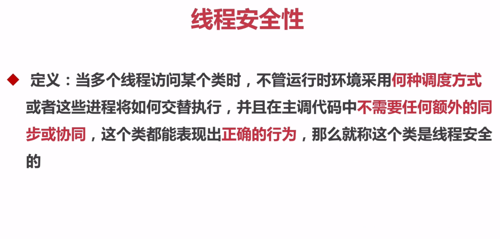

* 线程安全性的组成

  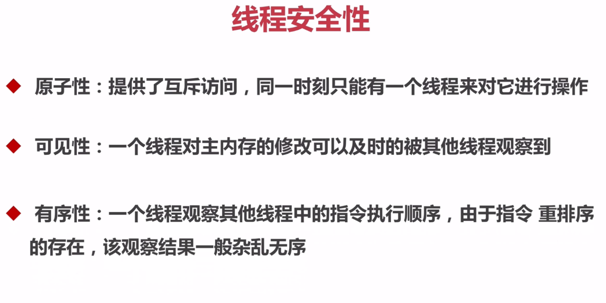

* AtomicXXX：CAS、Unsafe.compareAndSwapInt（atomic包下的方法具有原子性）

  参见com.bravedawn.concurrency.example.count.CountExample2

  * CAS取的其实就是compareAndSwapInt的三个首字母，调用该方法的源码如下：

    ```
    // public static AtomicInteger count = new AtomicInteger(0);
    count.incrementAndGet();
    ```

    ```
    // java.util.concurrent.atomic.AtomicInteger
    public final int incrementAndGet() {
    	return unsafe.getAndAddInt(this, valueOffset, 1) + 1;
    }
    ```

    ```
    // sun.misc.Unsafe
    public final int getAndAddInt(Object var1, long var2, int var4) {
        int var5;
        do {
        	var5 = this.getIntVolatile(var1, var2);
        } while(!this.compareAndSwapInt(var1, var2, var5, var5 + var4));
    
        return var5;
    }
    ```

    上面三段代码是我们调用Java底层实现的compareAndSwapInt方法的步骤，在第三段代码段中，var1也就是count，var2是当前对象的值，var4是要增加的值，var5是底层的值。compareAndSwapInt方法在当前的值var2与底层的值var5相等时，才会执行var5 + var4。

   * 为什么对象count的值var会与底层的值var5不相同呢？

     对象count的值var2是工作内存的值，而var5是主内存中的值。他们的值不一定是相等的。需要我们做同步操作使得他们在某一时刻是相等的。

 * AtomicLong、LongAdder

   参见：com.bravedawn.concurrency.example.atomic.AtomicExample2；com.bravedawn.concurrency.example.atomic.AtomicExample3

   * AtomicLong是作用是对长整形进行原子操作，显而易见，在java1.8中新加入了一个新的原子类LongAdder，该类也可以保证Long类型操作的原子性，相对于AtomicLong，LongAdder有着更高的性能和更好的表现，可以完全替代AtomicLong的来进行原子操作。
   * 在32位操作系统中，64位的long 和 double 变量由于会被JVM当作两个分离的32位来进行操作，所以不具有原子性。而使用AtomicLong能让long的操作保持原子型。
   * 【LongAdder优点】LongAdder在AtomicLong的基础上将单点的更新压力分散到各个节点，在低并发的时候通过对base的直接更新可以很好的保障和AtomicLong的性能基本保持一致，而在高并发的时候通过分散提高了性能。 
   * 【LongAdder缺点】缺点是LongAdder在统计的时候如果有并发更新，可能导致统计的数据有误差。
   * 【博客】[AtomicLong和LongAdder的区别]()https://blog.csdn.net/yao123long/article/details/63683991

 * AtomicBoolean#compareAndSet

   参见：com.bravedawn.concurrency.example.atomic.AtomicExample6

    * 在实际项目中，我只希望一件事情只执行一次，在执行之前该事件的标记可能为false，一旦执行之后标记就会变成true。此时我们调用AtomicBoolean#compareAndSet(false, ture)方法，就可保证对于我们需要执行的那一段代码以原子方式只执行一次。可以理解为同一时间只有一个线程会执行这段代码。

* AtomicReference

  参见：com.bravedawn.concurrency.example.atomic.AtomicExample4

  * AtomicReference原子更新引用类型。

  * AtomicReference.compareAndSet的示例代码中我们调用了unsafe.compareAndSwapObject方法，与先前介绍的CAS方法原理一致

* AtomicReferenceFieldUpdater

  参见：com.bravedawn.concurrency.example.atomic.AtomicExample5

  * AtomicReferenceFieldUpdater是基于反射的原子更新字段的值，是用来更新某一个类指定的字段的值
  * 要求该字段：
    * 字段必须是volatile类型的
    * 只能是实例变量，不能是类变量，也就是说不能加static关键字

* AtomicStampReference：CAS的ABA问题
  * ABA问题

    1、可以发现，CAS实现的过程是先取出内存中某时刻的数据，在下一时刻比较并替换，那么在这个时间差会导致数据的变化，此时就会导致出现“ABA”问题。 

    2、什么是”ABA”问题？ 
    比如说一个线程one从内存位置V中取出A，这时候另一个线程two也从内存中取出A，并且two进行了一些操作变成了B，然后two又将V位置的数据变成A，这时候线程one进行CAS操作发现内存中仍然是A，然后one操作成功。

   * AtomicStampReference中的核心方法compareAndSet。除了对象值，AtomicStampedReference内部还维护了一个“状态戳” stamp。状态戳可类比为时间戳，是一个整数值，每一次修改对象值的同时，也要修改状态戳，从而区分相同对象值的不同状态。当AtomicStampedReference设置对象值时，对象值以及状态戳都必须满足期望值，写入才会成功

 * AtomicLongArray：根据索引原子更新长整型数组里的元素

### 2.原子性——锁（JDK中提供原子性的除了atomic之外还有锁——下面的两个锁）

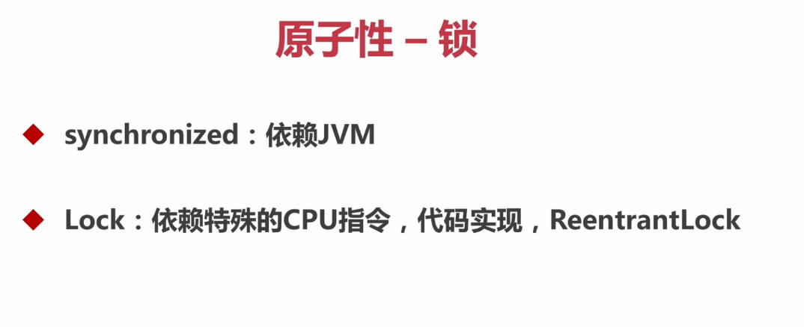

* **synchronized**它是一种同步锁

  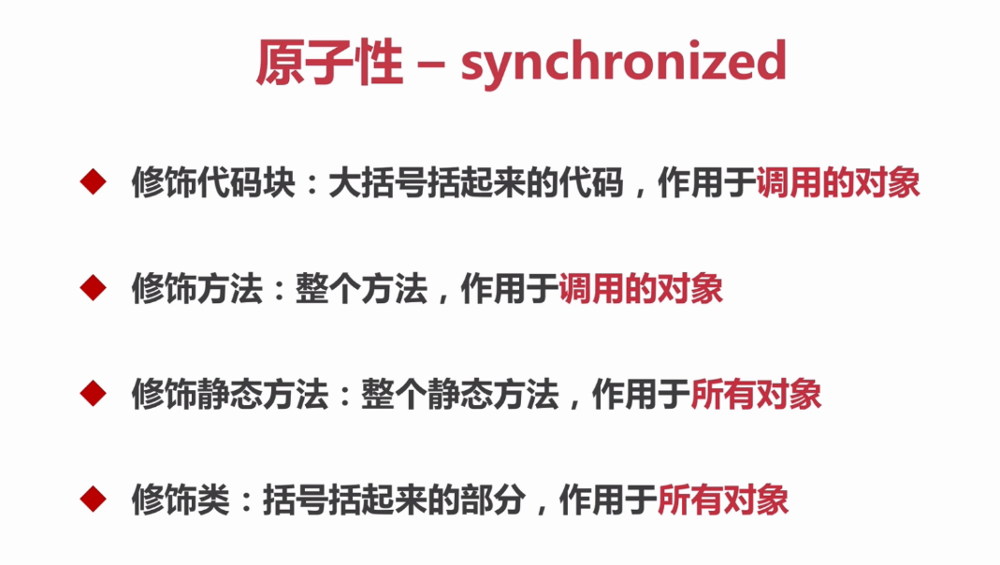

  

  * 为什么要是用线程池？

    使用线程池的目的是为了查看同一对象的两个进程同时调用函数时的情况。

  * synchronized关键字不能继承

    * 子类继承父类时，如果没有重写父类中的同步方法，子类同一对象，在不同线程并发调用该方法时，具有同步效果。
    * 子类继承父类，并且重写父类中的同步方法，但没有添加关键字synchronized，子类同一对象，在不同线程并发调用该方法时，不再具有同步效果，这种情形即是"关键字synchronized不能被继承"的转述。

   * synchronized修饰代码块

     参见：com.bravedawn.concurrency.example.sync.SynchronizedExample1；com.bravedawn.concurrency.example.sync.SynchronizedExample2

     ```java
     // 修饰一个代码块：同步语句块
     public void test1(){
         synchronized (this){
         for (int i = 0; i < 10; i++){
             	log.info("test1 - {}", i);
             }
         }
     }
     ```

  * synchronized修饰方法

    参见：com.bravedawn.concurrency.example.sync.SynchronizedExample1；com.bravedawn.concurrency.example.sync.SynchronizedExample2

    ```java
    // 修饰一个方法：同步方法
    public synchronized void test2(){
        for (int i = 0; i < 10; i++){
        	log.info("test2 - {}", i);
        }
    }
    ```

  * synchronized修饰静态方法

    参见：com.bravedawn.concurrency.example.sync.SynchronizedExample3

    ```java
    public synchronized static void test2(int j){
        for (int i = 0; i < 10; i++){
        	log.info("test2 {} - {}", j, i);
        }
    }
    ```

  * synchronized修饰类

    参见：com.bravedawn.concurrency.example.sync.SynchronizedExample3

    ```java
    public void test1(int j){
        synchronized (SynchronizedExample3.class){
            // 以下就是括号括起来的问题
            for (int i = 0; i < 10; i++){
            	log.info("test1 {} - {}", j, i);
            }
        }
    }
    ```

  * 在上面的四个synchronized修饰的代码片中，如果**synchronized修饰代码块**和**synchronized修饰方法**的作用域代码相同时，他们两的功能就是相同的，可以相互替换。如果**synchronized修饰静态方法**和**synchronized修饰类**的作用域代码相同时，他们两的功能就是相同的，可以相互替换。

* 原子性对比

  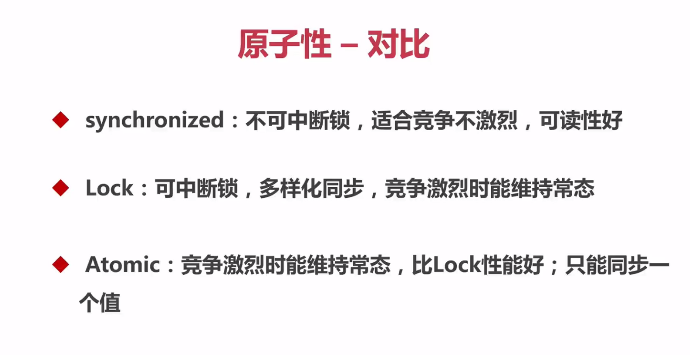

### 3.可见性

**可见性**则更为微妙，它必须确保释放锁之前对共享数据做出的更改对于随后获得该锁的另一个线程是可见的。 —— 如果没有同步机制提供的这种可见性保证，线程看到的共享变量可能是修改前的值或不一致的值，这将引发许多严重问题。

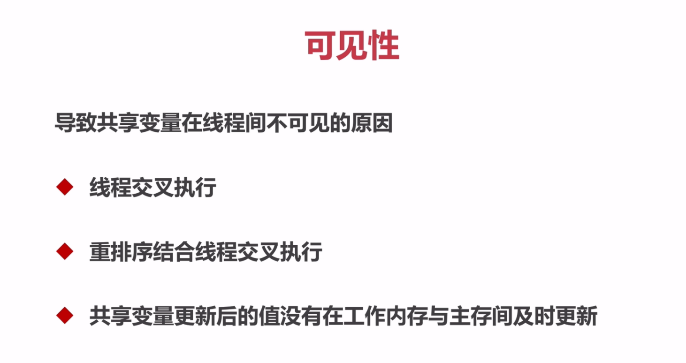

* 可见性——synchronized

  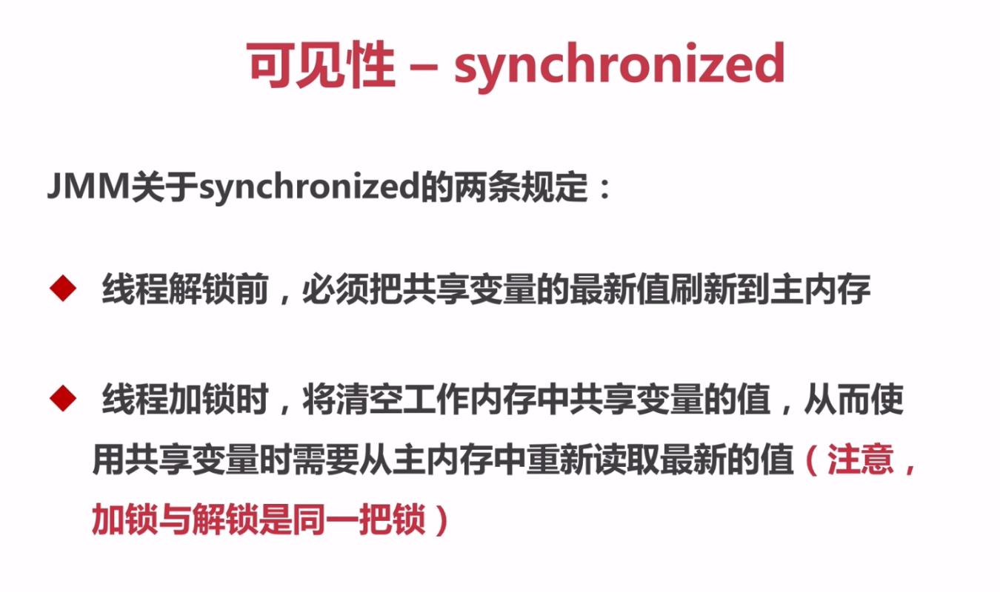

* 可见性——volatile

  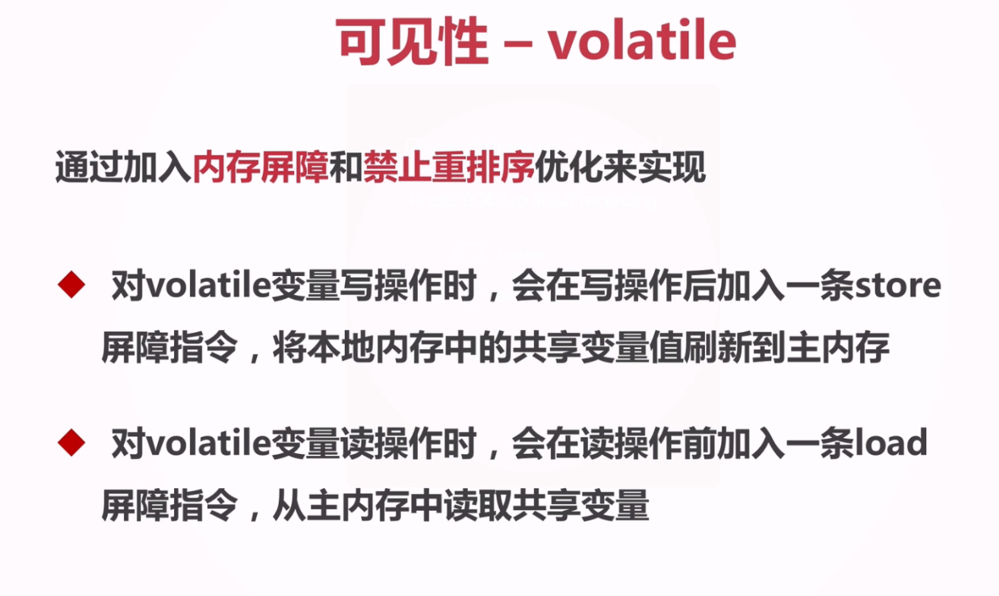

* volatile读写操作加入内存屏障和禁止重排序的CPU指令示意图
    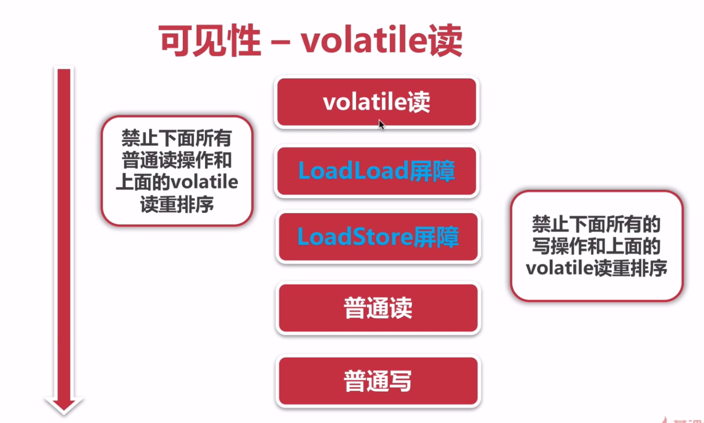

    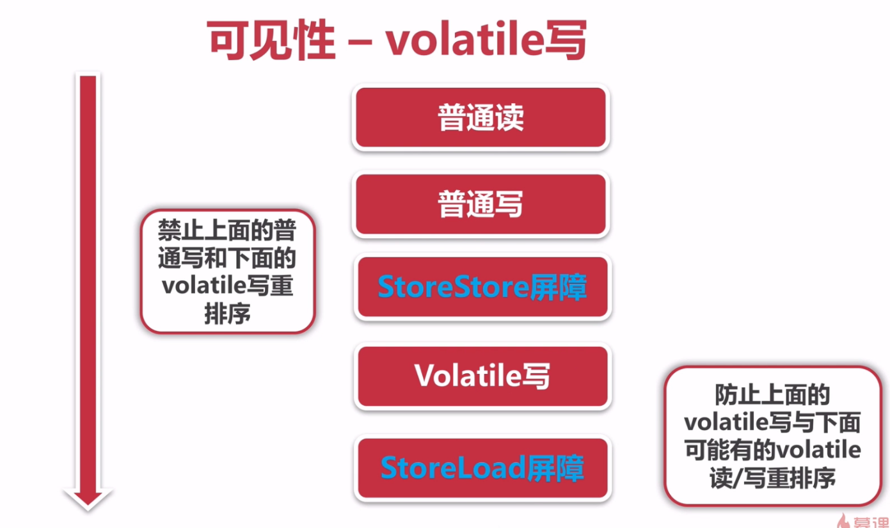

  参见：com.bravedawn.concurrency.example.count.CountExample4，在这个计数的程序中：

  ```java
  public static volatile int count = 0;
  
  private static void add(){
      count++;
  }
  ```

  我们将count变量加了**volatile**关键字，但时还是**不能保证线程的原子性**。再看下面的add方法，这次这里的执行顺序主要有三步，若此时同时有两个进程：

  * 首先他们会从主内存中将count变量的值取出来
  * 然后再同时加1
  * 最后他们再同时将工作内存的值写回主内存

  完成上面的三步后，其实真正计数的值只增加了一次。**所以直接使用volatile执行加操作不是线程安全的**。

* volatile的使用条件

  * 对变量的写操作不依赖于当前值。
  * 该变量没有包含在具有其他变量的不变式中。

  所以volatile特别适合作为状态标识量。

* 使用场景一：volatile作为状态标识量的使用方法

  ```java
  volatile boolean inited = false;
  
  // 线程1
  context = loadContext();
  inited = true;
  
  // 线程2
  while(!inited){
      sleep();
  }
  doSomethingWitConfig(context);
  ```

  上述代码必须先执行完loadContext()，才能执行doSomethingWitConfig(context)。

* 使用场景二：Double-Check

### 4.有序性

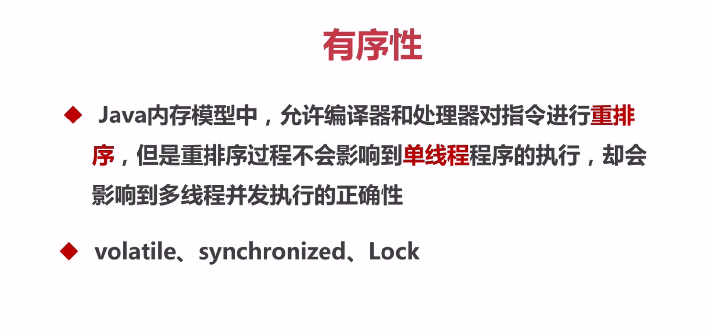

* 可以通过volatile、synchronized、Lock保证程序的有序性

* 其中synchronized、Lock保证同一时刻只有一个线程执行同步代码，相当于让线程顺序徐执行同步代码，自然就保证了有序性。

* 在java内存模型中说过，为了性能优化，编译器和处理器会进行指令重排序；也就是说java程序天然的有序性可以总结为：**如果在本线程内观察，所有的操作都是有序的；如果在一个线程观察另一个线程，所有的操作都是无序的**。

* [happens-before原则](https://www.cnblogs.com/chenssy/p/6393321.html)

  * **在JMM中，如果一个操作执行的结果需要对另一个操作可见，那么这两个操作之间必须存在happens-before关系。**

  * **如果两个操作不存在下述（下面8条 ）任一一个happens-before规则，那么这两个操作就没有顺序的保障，JVM可以对这两个操作进行重排序。如果操作A happens-before操作B，那么操作A在内存上所做的操作对操作B都是可见的。**

  * 下面是happens-before原则规则：

    * **1、**程序次序规则：一个线程内，按照代码顺序，书写在前面的操作先行发生于书写在后面的操作

      一段代码在**单线程中执行的结果是有序的**。注意是执行结果，因为虚拟机、处理器会对指令进行重排序。虽然重排序了，但是并不会影响程序的执行结果，所以程序最终执行的结果与顺序执行的结果是一致的。**故而这个规则只对单线程有效，在多线程环境下无法保证正确性**。

    * **2、**锁定规则：一个unLock操作先行发生于后面对同一个锁额lock操作

      这个规则比较好理解，无论是在单线程环境还是多线程环境，一个锁处于被锁定状态，那么必须先执行unlock操作后面才能进行lock操作。

    * **3、**volatile变量规则：对一个变量的写操作先行发生于后面对这个变量的读操作

      这是一条比较重要的规则，它标志着volatile保证了线程可见性。通俗点讲就是如果一个线程先去写一个volatile变量，然后一个线程去读这个变量，那么这个写操作一定是happens-before读操作的。

    * **4、**传递规则：如果操作A先行发生于操作B，而操作B又先行发生于操作C，则可以得出操作A先行发生于操作C

      提现了happens-before原则具有传递性，即A happens-before B , B happens-before C，那么A happens-before C

    * 5、线程启动规则：Thread对象的start()方法先行发生于此线程的每个一个动作

    * 6、线程中断规则：对线程interrupt()方法的调用先行发生于被中断线程的代码检测到中断事件的发生

    * 7、线程终结规则：线程中所有的操作都先行发生于线程的终止检测，我们可以通过Thread.join()方法结束、Thread.isAlive()的返回值手段检测到线程已经终止执行

    * 8、对象终结规则：一个对象的初始化完成先行发生于他的finalize()方法的开始

## 安全发布对象

### 1.发布与逸出

> com.bravedawn.concurrency.example.publish

* 发布对象：是一个对象能够被当前范围之外的代码所使用

  ```java
  @Slf4j
  @NotThreadSafe
  public class UnSafePublish {
  
      private String[] state = {"a", "b", "c"};
  
      public String[] getState(){
          return state;
      }
  
      public static void main(String[] args) {
          UnSafePublish unSafePublish = new UnSafePublish();
          log.info(Arrays.toString(unSafePublish.getState()));
  
          // 当前对象的私有属性可以被其它线程任意修改
          unSafePublish.getState()[0] = "d";
          log.info(Arrays.toString(unSafePublish.getState()));
      }
  }
  ```

* 对象逸出：一种错误的发布。当一个对象还没有构造完成时，就使它被其它线程所见

  ``` java
  @Slf4j
  @NotThreadSafe
  @NotRecommend
  public class Escape {
  
      private int thisCanBeEscape = 0;
  
  
      public Escape(){
          new InnerClass();
      }
  
      private class InnerClass{
  
          public InnerClass(){
              log.info("{}", Escape.this.thisCanBeEscape);
          }
      }
  
      public static void main(String[] args) {
          new Escape();
      }
  }
  ```

### 2.安全发布对象的四种方法

> com.bravedawn.concurrency.example.singleton

* 在静态初始化函数中初始化一个对象引用

* 将对象的引用保存到volatile类型或者AtomicReference对象中

* 将对象的引用保存到某个正确构造对象的final类型域中

* 将对象的引用保存到一个有锁保护的域中

--------

* 下面介绍一下singleton单例包下的代码：

  * singleton.SingletonExample1

    **线程不安全：**懒汉模式，单例实例在第一次使用时进行创建。

  * singleton.SingletonExample2

    **线程安全：**饿汉模式，单例实例在类装载时进行创建。饿汉模式如果构造函数内的进行过多的操作，在类加载时就会很慢从而造成性能问题；如果使用饿汉模式只进行类的加载而不使用会造成资源浪费。

  * singleton.SingletonExample3

    **线程安全：**懒汉模式，单例实例在第一次使用时进行创建。在静态的工厂方法上加了synchronized关键字后，虽然保证了线程安全性，但是却带了性能上面的开销。

  * singleton.SingletonExample4

    **线程不安全：**懒汉模式 --> 双重同步锁单例模式，单例实例在第一次使用时进行创建。

    ```java
    // 静态的工厂方法
    public static SingletonExample4 getInstance(){
        if (instance == null){ // 双重检测机制
            synchronized (SingletonExample4.class){ // 同步锁
                if (instance == null){
                	instance = new SingletonExample4();
                }
            }
        }
        return instance;
    }
    
    ```

    执行instance = new SingletonExample4();

    * 1.memory = allocate() 分配对象的内存空间
    * 2.ctorInstance() 初始化对象
    * 3.instance = memory 设置instance指向刚分配的内存空间

    由于JVM和cpu优化，发生了指令重排，导致上述三步执行发生变化：

    * 1.memory = allocate() 分配对象的内存空间
    * 2.instance = memory 设置instance指向刚分配的
    * 3.ctorInstance() 初始化对象

    --------

    线程不安全的情况
    假设现在有两个线程A，B
    线程A在执行`instance = new SingletonExample4();`时，发生指令重排，执行到`2.instance = memory 设置instance指向刚分配的`，线程B此时执行到第一个`if (instance == null){`时，认为instance已经有值了，所以直接执行了`return instance;`
    但是A进程还没有执行`3.ctorInstance() 初始化对象`。
    线程B一旦拿到还没有初始化的instance对象就会出错，所以不是线程安全的

  * singleton.SingletonExample5

    **线程安全：**懒汉模式 --> 双重同步锁单例模式，单例实例在第一次使用时进行创建。

    ```java
    // 单例对象
    // volatile + 双重检测机制 --> 禁止指令重排
    // 在实例对象前面加上volatile关键字就可以避免SingletonExample4中出现的问题了
    private volatile static SingletonExample5 instance = null;
    ```

  * singleton.SingletonExample6

    **线程安全：**饿汉模式的第二种写法

    ```java
    @ThreadSafe
    public class SingletonExample6 {
        // 构造函数
        private SingletonExample6(){
    
        }
    
        // 这里需要注意的就是一定要把静态域放在静态代码块前面，先执行静态域在执行静态代码块
    
        // 单例对象
        // 静态域
        private static SingletonExample6 instance = null;
    
        // 静态代码块
        static {
            instance = new SingletonExample6();
        }
    
        // 静态的工厂方法
        public static SingletonExample6 getInstance(){
            return instance;
        }
    
        public static void main(String[] args) {
            System.out.println(getInstance().hashCode());
            System.out.println(getInstance().hashCode());
        }
    }
    ```

  * singleton.SingletonExample7

    **线程安全、推荐：**枚举模式：最安全

    这个代码长见识niuniuniu！

    ```java
    @ThreadSafe
    @Recommend
    public class SingletonExample7 {
    
        private SingletonExample7(){
    
        }
    
        public static SingletonExample7 getInstance(){
            return Singleton.INSTANCE.getSingleton();
        }
    
        private enum Singleton{
            INSTANCE;
            private SingletonExample7 singleton;
    
            // JVM保证这个方法绝对只调用一次
            Singleton(){
                singleton = new SingletonExample7();
            }
    
            public SingletonExample7 getSingleton(){
                return singleton;
            }
        }
    }
    ```


## 线程安全策略

### 1.不可变对象

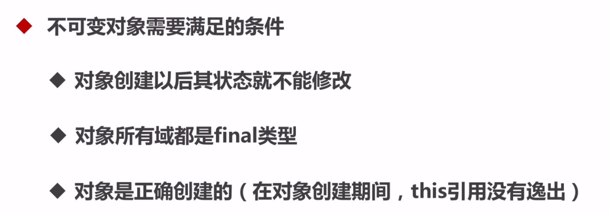

* 创建补课变对象

  这里可以采用的方式有：

  * 将类声明为final，不允许继承
  * 将类所有的成员变量声明为私有的，这样就不能直接访问类成员
  * 对变量不提供set方法，将所有可变的成员声明为final，这样只能对他们赋值一次
  * 在构造方法中所有变量进行复制，进行深度拷贝
  * 在get方法中不直接返回变量本身而是克隆对象，并返回对象的拷贝。

  对于要创建不可变对象，我们应多参考String和final类

* final关键字

  **1. 数据**

  声明数据为常量，可以是编译时常量，也可以是在运行时被初始化后不能被改变的常量。

  - 对于基本类型，final 使数值不变；
  - 对于引用类型，final 使引用不变，也就不能引用其它对象，但是被引用的对象本身是可以修改的。

  ```
  final int x = 1;
  // x = 2;  // cannot assign value to final variable 'x'
  final A y = new A();
  y.a = 1;
  ```

  **2. 方法** 

  声明方法不能被子类覆盖。

  private 方法隐式地被指定为 final，如果在子类中定义的方法和基类中的一个 private 方法签名相同，此时子类的方法不是覆盖基类方法，而是在子类中定义了一个新的方法。

  **3. 类**

  声明类不允许被继承。

* 将对象修改为不可变对象

  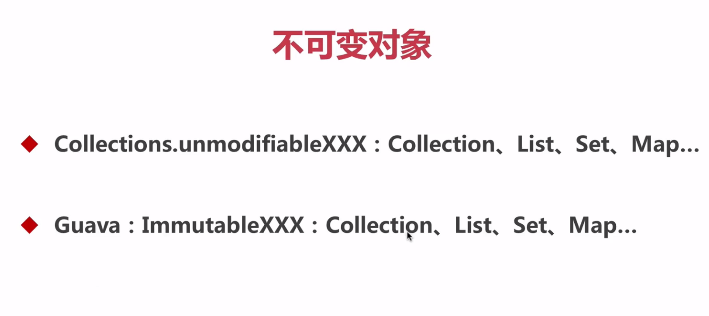

  * Java提供的Collections类，值得注意的是Collections修改的对象不能是final的。使用参见com.bravedawn.concurrency.example.immutable.ImmutableExample2
  * Guava提供的ImmutableXXX，值得注意的是Collections修改的对象可以是final的。使用参见com.bravedawn.concurrency.example.immutable.ImmutableExample3

### 2.线程封闭


* 堆栈封闭解释：

  多个线程访问一个方法的时候，方法的局部变量都会拷贝一份到线程的栈中。所以局部变量不会被多个线程所共享的。因此就不会出现并发问题，所以能局部变量的时候就不用全局变量，全局变量会引发并发问题。

* ThreadLocal（详情参见：com.bravedawn.concurrency.example.threadlocal）

  * 使用TreadLocal的相关场景：

    在我们进行web开发的时候，用户的每一个请求就是一个线程。一般的话我们获取用户的信息，需要在controller层通过request进行获取，然后传到service层或者是util里，这样传递数据是很费劲麻烦的。而我们使用TreadLocal之后，我们在请求已经到了后端服务器，在进行处理之前调用RequestHolder.add()将相关信息保存到ThreadLocal中，之后我们随用随取，当请求结束后，我们在调用RequestHolder.remove()。

  * 具体实现

    * ThreadLocal处理类：com.bravedawn.concurrency.example.threadlocal.RequestHolder
    * Filter类：com.bravedawn.concurrency.HttpFilter
    * Interceptor类：com.bravedawn.concurrency.HttpInterceptor
    * Controller类：com.bravedawn.concurrency.example.threadlocal.ThreadlocalController
    * 配置类，用于配置Filter和Interceptor：com.bravedawn.concurrency.ConcurrencyApplication

### 3.线程不安全的类与写法

* 什么是线程不安全的类

  如果一个类的对象同时被多个线程访问，如果不做特殊的同步或并发处理，很容易表现出线程不安全的现象，比如抛出异常、逻辑处理错误等，这种类我们就称为线程不安全的类。

* StringBuilder和StringBuffer

  * StringBuilder，线程不安全的类

    参见：com.bravedawn.concurrency.example.commonUnsafe.StringExample1

  * StringBuffer，线程安全的类

  * 参见：com.bravedawn.concurrency.example.commonUnsafe.StringExample2

  * 为什么要提供线程不安全的类StringBuilder?

    StringBuffer是线程安全的类。其中他的方法中添加了synchroinzed关键字，保证同一时间只有一个线程才能访问，是由性能损耗的。所以我们可以在方法中使用StringBuilder，因为方法中的局部变量是堆栈封闭的。

* SimpleDataFormat和JodaTime

  * SimpleDataFormat线程不安全的写法，参见：com.bravedawn.concurrency.example.commonUnsafe.DataFormatExample1
  * SimpleDataFormat线程安全的写法，在方法中每次声明一个SimpleDataFormat对象，防止线程不安全。参见：com.bravedawn.concurrency.example.commonUnsafe.DataFormatExample2
  * JodaTime线程安全的写法，参见：com.bravedawn.concurrency.example.commonUnsafe.DateFormatExample3

* ArrayList，HashSet，HashMap等Collections

  * ArrayList是线程不安全的，具体写法参见：com.bravedawn.concurrency.example.commonUnsafe.ArrayListExample
  * HashSet在多线程并发条件下是线程不安全的，具体写法参加：com.bravedawn.concurrency.example.commonUnsafe.HashSetExample
  * HashMap是线程不安全的，参见：com.bravedawn.concurrency.example.commonUnsafe.HashMapExample

  后面会有专门的章节来讲解他们对应线程安全的类。

* 先检查在执行是线程不安全的：if(condition(a)){handle(a);}

   `if（condition（a））{handle（a）；} `就算a是一个线程安全的类所对应的对象，对a的处理handle（a）也是原子性的，但由于这两步之间的不是原子性的也会引发线程安全问题，如A、B两个线程都通过了a的判断条件，A线程执行handle（a）之后，a已经不符合condition（a）的判断条件了，可是此时B线程仍然要执行handle（a），这就引发了线程安全问题。

### 4.同步容器

* ArrayList --> Vector，Stack

  * Vector 是线程安全的，具体参见：com.bravedawn.concurrency.example.syncContainer.VectorExample
  * Vector也有线程不安全的时候，具体参见：com.bravedawn.concurrency.example.syncContainer.VectorExample2。在这个方法中，我们启用了两个线程，一个线程做remove操作，一个线程做get操作。当我们运行代码的时候，就会发现get操作老是报错。假设这样的场景，一个线程比如在执行remove(9)这个操作，而第二个线程之后刚好执行get(9)的操作，从而导致线程不安全，引发异常。

* HashMap --> HashTable(key, value不能为null)

  HashTable是线程安全的，具体参见：com.bravedawn.concurrency.example.syncContainer.HashTableExample

* Collections.synchronizedXXX(List, Set, Map)

  * Collections.synchronizedList()是线程安全的，参见：com.bravedawn.concurrency.example.syncContainer.CollectionsExample
  * Collections.synchronizedSet()是线程安全的，参见：com.bravedawn.concurrency.example.syncContainer.CollectionsExample2
  * Collections.synchronizedMap()是线程安全的，参见：com.bravedawn.concurrency.example.syncContainer.CollectionsExample3

* vector类在单线程遍历情况下进行增删操作会造成线程不安全的情况，多线程并发情况下更是如此。详情参见：com.bravedawn.concurrency.example.syncContainer.VectorExample3


