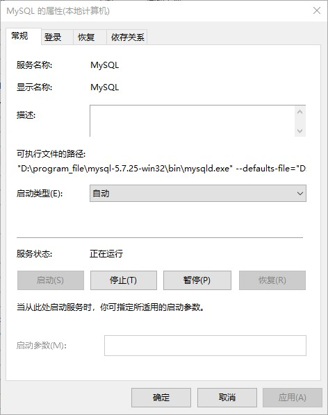
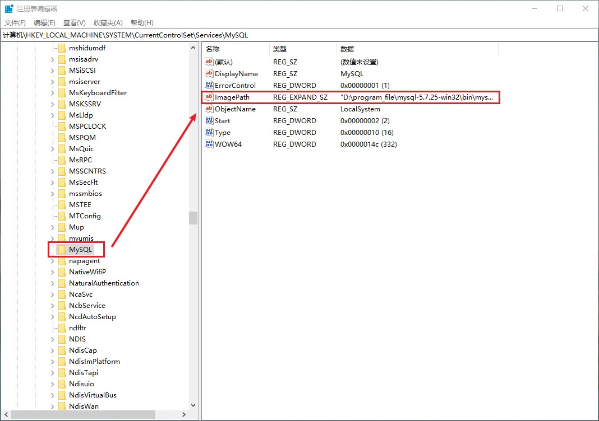

# windows下MySQL配置my.ini

> 2022.07.20 中国陕西西安

在windows下解压安装mysql之后实际上是没有my.ini文件的，下面我们主要讨论如何在mysql启动的时候加载my.ini文件。

## 一、查看当前可执行文件的路径

使用win+r输入service.msc，找到mysql服务，查看属性，如下图所示：

从上图中可以看到，我配置的可执行文件的路径是：`"D:\program_file\mysql-5.7.25-win32\bin\mysqld.exe" --defaults-file="D:\program_file\mysql-5.7.25-win32\my.ini" MySQL`。但是这里的这个路径时无法直接进行修改的。

## 二、修改可执行文件路径

使用win+r输入regedit，回车打开注册表编辑器，查找路径**HKEY_LOCAL_MACHINE -> SYSTEME -> CurrentControlSet -> services**，输入首字母m可以快速定位mysql的注册表，选中ImagePath修改自己想要配置的正确路径。

修改完ImagePath值之后，我们发现在mysql服务的属性中，可执行文件的路径并没有被更新。这里需要我们进入mysql安装的bin目录双击mysqld.exe，此时服务属性中的"**可执行文件的路径**"配置才会被更新成注册表中的。