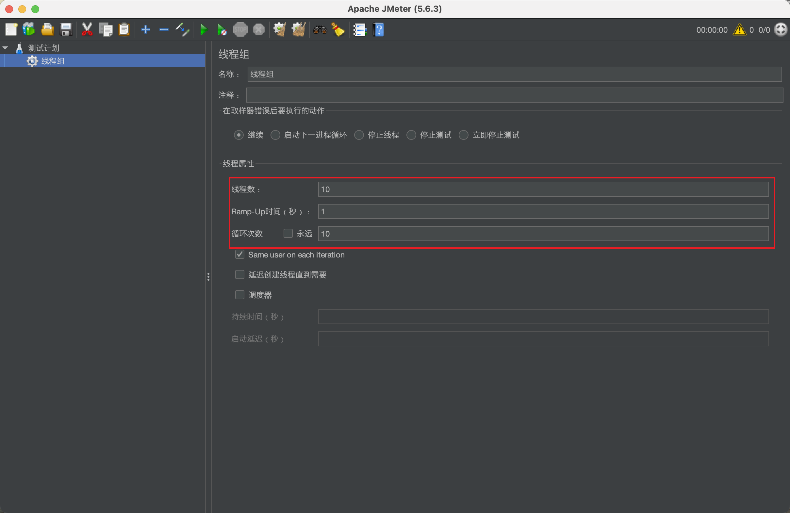

# JMeter笔记

## 一、JMeter的简单使用

### 1. 线程组

* **线程数**：启动多少个线程去发起请求。
* **Ramp-Up时间**：在这个时间段内启动这些线程。
* **循环次数**：如果设置为10，线程数配置成10，意思就是说10个线程，每个线程调用请求10次，整体来说就是100次。

### 2. Http请求

在【线程组】-【添加】-【取样器】-【HTTP请求】新增一个Http请求的配置。这里要勾选【使用KeepAlive】从而**减少创建/关闭多个 TCP 连接的开销**，我们能够更好的测试我们接口本身的性能。

此外，还需要在这样页面的【高级】选项中，选择客户端的实现是【Java】，外面的Keepalive配置才能生效。

### 3. 查看结果树

用来查看每次请求的结果。

### 4. 聚合报告

用来查看请求的耗时的统计信息。其中【吞吐量】就是我们常说的TPS。