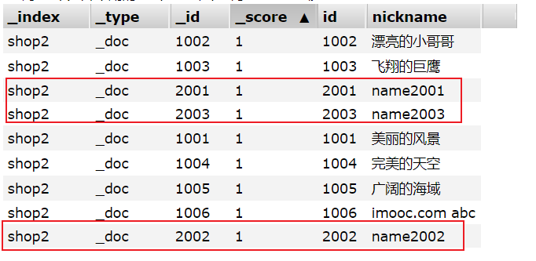
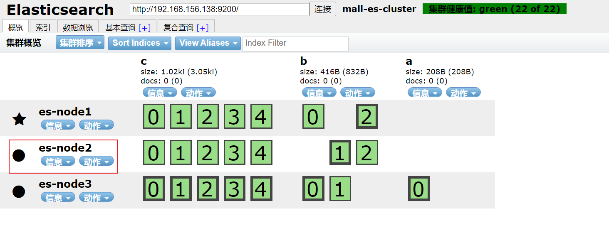

# 2.分布式搜索引擎-Elasticsearch

## 第1章

### 1-1 本章概述

1. 本章概述
   * 分布式搜索引擎
   * 搜索引擎技术选型
   * 什么是Elasticsearch？应用场景
   * ES可视化插件、IK分词器、词库
   * ES快速入门、核心术语、文档结构
   * 安装ES，基本操作
   * DSL搜索
   * ES的集群原理
   * ES与数据库数据同步
   * ES与Spring Boot整合实现搜索
   * ES的geo坐标搜索
2. 目前搜索的弊端
   * 空格支持
   * 拆词查询
   * 搜素内容不能高亮
   * 海量数据查库

### 1-2 分布式搜索引擎：lucene vs  solr  vs elasticsearch

1. 什么是分布式搜索引擎
   * 搜索引擎
   * 分布式存储和搜索
2. lucene vs  solr  vs elasticsearch
   * 倒排序索引
   * Lucene是类库
   * Solr基于lucene
   * ES基于lucene
3. ES官网：https://www.elastic.co/cn/

### 1-3 elasticsearch 核心术语

* 索引 index，对应于关系型数据库的**表**
* 类型 type，对应于关系型数据库的**表逻辑类型**（在新版本中已被去掉）
* 文档 document，对应于关系型数据库的**行**（以Json的形式存在）
* 字段 fields，对应于关系型数据库的**列**
* 映射 mapping，对应于关系型数据库的**表结构定义**
* 近实时 NRT，Near real time，新索引和文档的建立和用户的搜索存在一定的延时
* 节点 node，每一个服务器
* shard和replica，数据分片与备份

### 1-5 elasticsearch 集群架构原理


shard是为了将数据分片，提高吞吐量的，保障高性能的；

replica是为了保障在shard宕机情况下，实现高可用的；

### 1-6 什么是倒排索引


### 1-7 安装 elasticsearch

1. 下载es进行解压安装

2. 对elasticsearch.yml进行配置

   * 配置集群名称：

     ```
     cluster.name: mall-elasticSearch
     ```

   * 配置节点名称：

     ```
     node.name: es-node-1
     ```

   * 配置数据存储路径

     ```
     path.data: D:\program_file\elasticsearch-7.8.1\data
     ```

   * 配置日志储存路径

     ```
     path.logs: D:\program_file\elasticsearch-7.8.1\logs
     ```

   * 设置绑定的ip地址，`0.0.0.0`代表可以远程连接，不受ip限制

     ```
     network.host: 0.0.0.0
     ```

   * 配置初始节点

     ```
     cluster.initial_master_nodes: ["es-node-1"]
     ```

3. 对jvm.options进行配置：

   修改总堆空间的初始大小和总堆空间的最大大小：

   ```
   -Xms128m
   -Xmx128m
   ```

4. 使用命令`whoami`查看当前用户，如果是root用户是不允许启动es的，必须新建一个用户去启动。具体命令如下：

   ```shell
   # 创建用户
   useradd esuser
   # 设置密码
   passwd esuser
   
   # 授权,
   # -R : 处理指定目录以及其子目录下的所有文件
   # user : 新的文件拥有者的使用者 ID
   # group : 新的文件拥有者的使用者组(group)
   # chown -R user:group /user/...
   chown -R esuser:esuser /usr/local/myapp/elasticsearch-7.8.1
   ```

5. 启动es

   * 前台启动

     ```
     su esuser
     ./elasticsearch
     ```
  ```
   
* 后台启动，启动之后访问http://localhost:9200/就可以看到es的相关信息
   
  ```
     ./elasticsearch -d
  ```
   
* 后台关闭：
   
  ```
     jps elasticsearch
     
     kill <进程id>
     ```

6. 安装过程中的问题

   

### 1-9 安装es-header插件

* es haeder的github地址：https://github.com/mobz/elasticsearch-head
* 可以在github上下载elasticsearch-Head插件：https://github.com/mobz/elasticsearch-head/blob/master/crx/es-head.crx下载到本地。
* 如果直接拖拽到Chrome会不能使用，告诉你非Chrome来源的。这个时候将文件后缀名".crx"改为“.rar”，然后解压到文件夹里，再通过Chrome“加载已解压的扩展程序”按钮加入文件夹就可以使用了。

## 第2章

### 2-1 head与postman基于索引的基本操作

1. 使用es-head进行相关接口的调用

   

2. 使用postman进行相关接口的调用

   

3. 索引相关操作

   1. 创建索引

      

   2. 刚才我们创建的索引有5个分片，点击概览进行查看

      

   3. 创建有备份的索引

      

   4. 查看创建的备份索引，其中只要有5个replica是没有被分配的，导致集群的健康值变为了黄色。

      
      
   5. 通过Rest请求创建索引，相关的接口可以参照https://www.elastic.co/guide/cn/elasticsearch/guide/current/_creating_an_index.html
   
      * 方法：PUT http://localhost:9200/index_basic
   
      * 请求参数
   
        ```
        {
            "settings": {
                "index": {
                    "number_of_shards": "3",
                    "number_of_replicas": "0"
                }
            }
        }
        ```
   
      * 响应参数，说明创建成功：
   
        ```
        {
            "acknowledged": true,
            "shards_acknowledged": true,
            "index": "index_basic"
        }
        ```
   
   6. 查询一个索引：GET http://localhost:9200/my_index
   
   7. 查询所有索引：GET http://localhost:9200/_cat/indices

### 2-3 mappings自定义创建映射

1. es关于映射的定义：https://www.elastic.co/guide/en/elasticsearch/reference/current/mapping.html

2. 观察如下自定义创建隐射：

   * 方法：PUT http://localhost:9200/index_mapping

   * 请求参数

     ```
     {
         "mappings": {
             "properties": {
                 "realname": {
                     "type": "text",
                     "index": true
                 },
                 "username": {
                     "type": "keyword",
                     "index": false
                 }
             }
         }
     }
     ```

   其中：

   * type：https://www.elastic.co/guide/en/elasticsearch/reference/current/mapping-types.html

     这两个类型都是字符串类型

     * text：https://www.elastic.co/guide/en/elasticsearch/reference/current/text.html
     * keyword：https://www.elastic.co/guide/en/elasticsearch/reference/current/keyword.html

   * index：https://www.elastic.co/guide/en/elasticsearch/reference/current/mapping-index.html

   使用chrome插件查看索引信息：

   

### 2-5 mappings新增数据类型与analyze

* Text analysis：文本分析是将非结构化文本（例如电子邮件的正文或产品说明）转换为针对搜索优化的结构化格式的过程。(https://www.elastic.co/guide/en/elasticsearch/reference/current/analysis.html)

* 一个简单的文本分析案例：

  * 方法：GET http://localhost:9200/index_mapping/_analyze

  * 参数：

    ```
    {
        "field": "realname",
        "text": "The quick brown fox."
    }
    ```

  * 响应：

    ```
    {
        "tokens": [
            {
                "token": "the",
                "start_offset": 0,
                "end_offset": 3,
                "type": "<ALPHANUM>",
                "position": 0
            },
            {
                "token": "quick",
                "start_offset": 4,
                "end_offset": 9,
                "type": "<ALPHANUM>",
                "position": 1
            },
            {
                "token": "brown",
                "start_offset": 10,
                "end_offset": 15,
                "type": "<ALPHANUM>",
                "position": 2
            },
            {
                "token": "fox",
                "start_offset": 16,
                "end_offset": 19,
                "type": "<ALPHANUM>",
                "position": 3
            }
        ]
    }
    ```

* mappings新增数据类型

  * mappings字段不能修改和删除，只能添加

  * 文档地址：https://www.elastic.co/guide/en/elasticsearch/reference/current/indices-put-mapping.html

  * 方法：PUT/POST http://localhost:9200/index_mapping/_mapping

  * 请求参数：

    ```
    {
        "properties": {
            "id": {
                "type": "long"
            },
            "age": {
                "type": "integer"
            },
            "money": {
              	"type": "float"
            },
            "tax": {
                "type": "double" 
            },
            "email": {
            	"type": "keyword"
            },
            "sex": {
              "type": "byte"
            },
            "score": {
                "type": "short"
            },
            "is_teegner": {
              	"type": "boolean"
            },
            "brithday": {
                "type": "date"
            },
            "relationShip": {
              	"type": "object"
            }
        }
    }
    ```

  * 响应参数：

    ```
    {
        "acknowledged": true
    }
    ```

  * 新增数据类型的mappings

    

### 2-6 文档的基本操作 - 添加文档与自动映射

#### 1.添加文档

1. 创建一个分片为1，副本为0的索引

2. 使用postman创建文档：

   * 请求url（`http://localhost:9200/my_doc/_doc/1`）中的最后一个数字是**文档Id**；
   * 请求报文是文档的相关内容；
   * 响应报文`result`为`created`表示创建成功；

   

3. 插入后的结果：

   

#### 2.自动映射

Elasticsearch的最重要功能之一是它试图摆脱束缚，让您尽快开始探索数据。 要为文档建立索引，您不必先创建索引，定义映射类型并定义字段-您只需为文档建立索引，索引，类型和字段就会自动生效。如下图所示：


### 2-8 文档的基本操作 - 删除与修改

按照上一节的内容我们往索引中添加几个文档。


#### 1.删除文档

1. 删除id为4的文档；

2. 使用postman删除文档：

   * 请求url（`http://localhost:9200/my_doc/_doc/1`）中的最后一个数字是**文档Id**，是**DELETE**请求；
   * 响应result为deleted为删除成功，_version为2表示这是修改的第二个版本，es不会直接删除这个文档，而是在合适的时候才会去删除。

   

#### 2.修改文档

1. 修改id为2的文档的name字段，对文档的局部属性进行修改

2. 使用postman修改文档：

   * 请求url（`http://localhost:9200/my_doc/_doc/2/_update`）中的最后一个数字是**文档Id**，是POST请求；
   * 响应result为updated为修改成功。

   

3. 全量字段修改

   * 请求地址`http://localhost:9200/my_doc/_doc/3`，请求方式为PUT
   * 请求报文中需要写全量字段

   

### 2-10 文档的基本操作 - 查询

#### 1.文档全文的查询

* 请求地址：GET http://localhost:9200/my_doc/_doc/2

* 响应参数：其中_source是文档的全文

  

#### 2.查询所有文档数据

* 请求地址：GET http://localhost:9200/my_doc/_doc/_search

* 响应参数：其中hits数组是所有的文档

  

#### 3.元数据字段

参考文档：https://www.elastic.co/guide/en/elasticsearch/reference/current/mapping-fields.html#mapping-fields

* _index：文档数据所属那个索引，理解为数据库的某张表即可。
* \_type：文档数据属于哪个类型，新版本使用_doc 。_
* _id：文档数据的唯一标识，类似数据库中某张表的主键。可以自动生成或者手动指定。
* _score：查询相关度，是否契合用户匹配，分数越高用户的搜索体验越高。
* _version：版本号。
* _source：文档数据，json格式。


#### 4.定制化数据查询

* 请求地址：GET http://localhost:9200/my_doc/_doc/2?_source=id，只要原始json的id字段
* 响应参数：其中_source是查询的结果

#### 5.定制化数据查询所有数据

* 请求地址：GET http://localhost:9200/my_doc/_doc/_search?_source=id,name，只要原始json的id字段

* 响应参数：其中_source是查询的结果

  

#### 6.判断某个文档在不在-head请求

  按照之前的描述，如果我们想判断某一个文档在不在，是否需要按照之前第1小节所讲的那样发起一个GET请求。

* 使用Get请求，如下图所示响应体的大小是317个字节

  

* 使用Head请求，如下图所示响应体的大小是87个字节，所以如果要判断一个文档是否存在，推荐使用HEAD请求。

    
    
### 2-12 文档乐观锁控制 if_seq_no与if_primary_term

根据上一节的讲解，每一个文档中都有一些元数据，元数据中包含的`_version：版本号`，他其实就是用来实现乐观锁的。

#### 1.创建、查询、修改文档

1. 创建文档

   

2. 查询文档

   

3. 局部修改文档

   

#### 2.乐观锁控制

参考文档：https://www.elastic.co/guide/en/elasticsearch/reference/7.9/optimistic-concurrency-control.html#optimistic-concurrency-control

为确保文档的较旧版本不会覆盖较新的版本，对文档执行的每项操作均由主分片分配一个序号，以协调更改。 每次操作都会增加**序列号**，因此可以确保较新的操作具有比较旧的操作更高的序列号。 然后，Elasticsearch可以使用操作的序列号来确保分配给它的序列号较小的更改不会覆盖较新的文档版本。

通过查询接口，我们可以看到响应的_seq_no和_primary_term字段中看到分配的序列号和主要术语：


序列号和主要术语唯一地标识更改。 通过记下返回的序列号和主要术语，可以确保仅在检索以来**未对其进行任何其他更改的情况下**，才能更改该文档。 这可以通过设置索引API，更新API或删除API的if_seq_no和if_primary_term参数来完成。

**情况一：乐观锁控制更新失败**

请求地址http://localhost:9200/my_doc/_doc/2001?if_seq_no=7&if_primary_term=4，因为当前的seq_no变为了8，primary term变为了4。版本号高于当前的修改版本，所以版本冲突，更新失败。


**情况二：乐观锁控制更新成功**

请求地址http://localhost:9200/my_doc/_doc/2001?if_seq_no=8&if_primary_term=4，因为当前的seq_no和primary term与更新版本号相同，所以更新成功。

### 2-14 分词与内置分词器

#### 1.分词

参考文档：https://www.elastic.co/guide/en/elasticsearch/reference/7.9/analysis-analyzers.html

如下图所示：

* 请求地址：http://localhost:9200/_analyze
* 请求参数：
  * analyzer 分词器：
    * standard 标准分析器：按照Unicode文本分段算法的定义，将文本划分为单词边界上的各个术语
    * sample 简单分析器：遇到非字母字符时会将文本分为多个词项
    * whitespace 空格分析器：按照空格进行分词
    * stop 结束分析器：去除无意义的单词
    * keyword 关键字分析器：一个“空”分析器，它接受给出的任何文本，并输出与单个术语完全相同的文本
* 响应参数：tokens中的每一个对象包含着响应的分词结果


#### 2.对特定的索引进行分词

如下图请求地址所示，在某一索引下对一段文字进行分词。

关于这部分内容可以参考：https://www.elastic.co/guide/en/elasticsearch/reference/7.9/indices-analyze.html#analyze-api-field-ex


### 2-16 建立ik中文分词器

#### 1.安装ik分词器

ik中文分词器github地址：https://github.com/medcl/elasticsearch-analysis-ik

#### 2.测试ik分词器

中文分词测试，其中将分词器设置为`ik_max_word`。

ik分词器提供了两个分词器选择：`ik_max_word`和`ik_smart`


### 2-18 自定义中文词库

我们利用上一节的中文分词器，分析这么一句话“骚年在慕课网学习”。如下图所示，但是“骚年”这个词并没有被合在一起，“慕课网”这个词也没有被合在一起，遇到这种问题该怎么办。


#### 1. 自定义中文词汇

1. 官方文档https://github.com/medcl/elasticsearch-analysis-ik中的文档如下：

   ```xml
   <!--用户可以在这里配置自己的扩展字典 -->
   <entry key="ext_dict">custom/mydict.dic;custom/single_word_low_freq.dic</entry>
   ```

2. 编辑本地文件**plugins\ik\config\IKAnalyzer.cfg.xml**

   ```xml
   <!--用户可以在这里配置自己的扩展字典 -->
   <entry key="ext_dict">custom.dic</entry>
   ```

3. 编辑**custom.dic**

   ```
   慕课网
   骚年
   ```

4. 接着我们继续做一下本节开始的请求

   

## 第3章 dsl搜索

### 3-1 dsl搜索 - 数据准备

1. 编辑自己扩展的字典，编辑plugins\ik\config\custom.dic

   ```
   慕课网
   骚年
   慕课
   课网
   慕
   课
   网
   ```

2. 创建一个索引**shop**

   

3. 创建映射

   

4. 添加文档，一共录入了12条文档数据

   

### 3-3 dsl搜索 - 入门语法

####1. Query String

##### 1.单条件查询

http://localhost:9200/shop/_search?q=desc:慕课网

##### 2.多条件查询

http://localhost:9200/shop/_search?q=desc:慕课网&q=age:18

##### 3.类型text与Keyword之间的区别

1. 搜索nickname为`super`的查询，我们定义的nickname字段类型为`text`并设置了分词器，所以我们只搜索`super`是可以搜索出结果的。

   
   
2. 搜索username为`super`的查询，我们定义的username的字段类型为`keyword`

   如下图所示，可以看到我们并不能搜索到结果，因为username的字段类型是keyword。

  

  如果我们搜索username为`super hero`，如下图所示就可以搜索到结果。

  

#### 2. 简单的DSL查询

参考文档：https://www.elastic.co/guide/en/elasticsearch/reference/7.9/query-dsl.html

Elasticsearch提供了一个完整的基于JSON的查询DSL(领域特定语言)来定义查询。可以将查询DSL看作查询的AST(抽象语法树)。

DSL (Domain Specific Language) ，特定领域语言，基于JSON格式的数据查询查询更灵活，有利于复杂查询。

##### 1. match查询

返回与所提供的文本、数字、日期或布尔值匹配的文档。在匹配之前对所提供的文本进行分析。

匹配查询是执行全文搜索的标准查询，包括用于模糊匹配的选项。

参考文档：https://www.elastic.co/guide/en/elasticsearch/reference/7.9/query-dsl-match-query.html

如下所示，我们演示了一个简单的dsl查询：


##### 2. exists查询

返回包含字段索引值的文档。

参考文档：https://www.elastic.co/guide/en/elasticsearch/reference/7.9/query-dsl-exists-query.html

如下所示，我们演示了一个简单的dsl查询：


### 3-5 dsl搜索 - 查询所有与分页

#### 1. 查询所有

1. 采用Query String 的方式

   请求http://localhost:9200/shop/_doc/_search

2. 采用DSL的方式

   下面演示的查询类似于SQL语句：`select * from shop`

   参考文档：https://www.elastic.co/guide/en/elasticsearch/reference/7.9/query-dsl-match-all-query.html

   

3. 采用DSL的方式查询特定字段

   下面演示的查询类似于SQL语句：`select id, age, username from shop`

   

#### 2.es-header基本查询的使用


#### 3.分页查询

参数`from`起始查询下标，默认为0；`size`为每页查询的数量。具体操作参见下图：


### 3-7 dsl搜索 - term与match

#### 1. term

term是代表完全匹配，也就是精确查询，**搜索前不会再对搜索词进行分词拆解**。

term属于精确匹配，只能查单个词。

参考文档：https://www.elastic.co/guide/en/elasticsearch/reference/current/query-dsl-term-query.html


#### 2. match

match进行搜索的时候，会**先进行分词拆分**（分词），拆完后，再来匹配。


#### 3. terms

terms里的`[ ]` 多个是或者的关系，只要满足其中一个词就可以，**搜索前不会再对搜索词进行分词拆解**。

参考文档：https://www.elastic.co/guide/en/elasticsearch/reference/current/query-dsl-terms-query.html


### 3-9 dsl搜索 - match_phrase

* 参考文档：https://www.elastic.co/guide/en/elasticsearch/reference/7.9/query-dsl-match-query-phrase.html

* 特点：

  * match：分词后只要有匹配就返回；
  * match_phrase：分词结果必须在text字段分词中**都包含**，而且**顺序必须相同**，而且必须都是**连续**的。（搜索比较严格）

* 测试结果

  

* **slop**：slop参数告诉match_phrase查询词条能够相隔多远时仍然将文档视为匹配。相隔多远的意思是，你需要移动一个词条多少次来让查询和文档匹配。

  如下图所示，我们查询的“大学 研究生”但是他们之间并不连贯，他们之间还隔了“毕业”，“后”，“考”三个词条，故设置slop为3进行匹配查询。这里**大于等于3**都是可以匹配到的。

  

### 3-11 dsl搜索 - match(operator)与ids

#### 1.operator

用于解释查询值中的文本的布尔逻辑。

参考文档：https://www.elastic.co/guide/en/elasticsearch/reference/current/query-dsl-match-query.html

* or**(Default)**：例如，查询值capital of Hungary被解释为capital**或**of**或**Hungary。

  

* and：例如，查询值capital of Hungary被解释为capital AND of AND Hungary。

  

#### 2. minimum_should_match

返回文档时必须匹配的子句的最小数目。

参考文档：https://www.elastic.co/guide/en/elasticsearch/reference/current/query-dsl-minimum-should-match.html#query-dsl-minimum-should-match


#### 3.ids

根据文档的id返回文档。该查询使用存储在id字段中的文档id。

参考文档：https://www.elastic.co/guide/en/elasticsearch/reference/current/query-dsl-ids-query.html


### 3-13 dsl搜索 - multi_match与boost

#### 1. multi_match

多匹配查询构建在匹配查询之上，以允许多字段查询。

参考文档：https://www.elastic.co/guide/en/elasticsearch/reference/current/query-dsl-multi-match-query.html


#### 2. 增加搜索字段权重

单个字段可以使用插入符号(^)增强。


### 3-15 dsl搜索 - 布尔查询

布尔查询的文档可以参考：https://www.elastic.co/guide/en/elasticsearch/reference/current/query-dsl-bool-query.html

#### 1. must

子句(query)必须出现在匹配的文档中，并将对分数产生影响。相当于**and**


#### 2. should

子句(query)应该出现在匹配的文档中。相当于**or**


#### 3. must_not

子句(查询)不能出现在匹配的文档中。**查询条件都不满足**。


#### 4. 组合查询

将must，should，must_not进行组合查询。


#### 5. boost

在优先排序子句中，我们解释了如何在搜索时使用boost参数使一个查询子句比另一个查询子句更重要。

参考文档：https://www.elastic.co/guide/en/elasticsearch/guide/2.x/query-time-boosting.html


### 3-17 dsl搜索 - 过滤器

对搜索出来的结果进行数据过滤。不会到es库里去搜，不会去计算文档的相关度分数，所以过滤的性能会比较高，过滤器可以和全文搜索结合在一起使用。
**post_filter**元素是一个顶层元素，只会对搜索结果进行过滤。不会计算数据的匹配度相关性分数，不会根据分数去排序，query则相反，会计算分数，也会按照分使用场景：

* query：根据用户搜索条件检索匹配记录
* post_filter：用于查询后，对结果数据的筛选

实操：查询账户金额大于80元，小于160元的用户。并且生日在1998-07-14的用户。（除此以外还能做其他的match等操作也行）

* gte：大于等于
* lte：小于等于
* gt：大于
* lt：小于

过滤money大于70小于100的数据，查询结果如下：


过滤birthday为1985-06-01的数据，查询结果如下：


### 3-19 dsl搜索 - 排序

#### 1. 简单排序

根据age字段倒序排序。


#### 2. 组合排序

根据age倒序和money正序组合排序。


#### 3. text类型排序

观察下面的两幅图片，我们对nickname进行排序报错了，由于文本会被分词，所以往往要去做排序会报错。而第二幅图username进行排序却没有报错，是因为username是keyword类型的。


相对text进行分词我们应该怎么做呢？

通常我们可以为这个字段增加额外的一个附属属性，类型为keyword，用于做排序。

* 创建索引

  

* 添加文档

  

* 查询测试

  

### 3-21 dsl搜索 - 高亮highlight

#### 1. 普通高亮

普通高亮的话，高亮短语会被`<em>、</em>`包裹。


#### 2. 定制标签的高亮

如下图参数所示，可以定制高亮短语的标签。


### 3-23 附：课外拓展 - prefix-fuzzy-wildcard

#### 1. 根据前缀查询

根据前缀去查询


#### 2. 模糊搜索

模糊搜索，并不是指的sql的模糊搜索，而是用户在进行搜索的时候的打字错误现象，搜索引擎会自动纠正，然后尝试匹配索引库中的数据。


参考文档：https://www.elastic.co/guide/cn/elasticsearch/guide/current/fuzzy-match-query.html

#### 3. 占位符查询

占位符查询。

* ？：1个字符
* *：1个或多个字符


参考文档：https://www.elastic.co/guide/en/elasticsearch/reference/7.9/query-dsl-wildcard-query.html

## 第四章 搜索进阶

### 4-1 深度分页

* 概述：深度分页也就是用户的分页操作进行的比较深了，例如他要查第1页、2页，这是浅分页，而10000页、20000页就是深度分页了。

* max_window_size限制

  es 目前支持最大的 skip 值是 max_result_window ，默认为 10000 。也就是当 from + size > max_result_window 时，es 将返回错误。

  

* 深度分页方式 from+size

  es 默认采用的分页方式是 from+ size 的形式，在深度分页的情况下，这种使用方式效率是非常低的，比如

  from = 9999, size=10， es 需要在各个分片上匹配排序并得到10009条有效数据，然后在结果集10009*3中取最后10条。

  

* 淘宝的做法

  譬如淘宝搜索限制分页最多80页，如下：

  

### 4-3 深度分页 - 提升搜索量

#### 1. 查询搜索量

默认如果没有设置过该值的话，这个请求响应是没有max_result_window。


#### 2. 设置搜索量


### 4-5 scroll 滚动搜索

参考文档：https://www.elastic.co/guide/cn/elasticsearch/guide/current/scroll.html

注意看请求地址http://localhost:9200/shop/_search?scroll=1m，url后缀的**scroll**=1m

启用游标查询可以通过在查询的时候设置参数 scroll 的值为我们期望的游标查询的过期时间。 游标查询的过期时间会在每次做查询的时候刷新，所以这个时间只需要足够处理当前批的结果就可以了，而不是处理查询结果的所有文档的所需时间。 这个过期时间的参数很重要，因为保持这个游标查询窗口需要消耗资源，所以我们期望如果不再需要维护这种资源就该早点儿释放掉。 设置这个超时能够让 Elasticsearch 在稍后空闲的时候自动释放这部分资源。

* 第一次scroll 滚动搜索（查询初始化）

  游标查询用字段 `_doc` 来排序，每次请求5条数据。

  

* 第二次scroll 滚动搜索

  第二次查询的时候url和body里面的内容都变了，需要携带scroll_id

  

### 4-7 批量查询 _mget

#### 1. 普通批量查询

* 优点：有额外的数据可以查到took、hits这些。

* 缺点：不能够判断一个文档是否存在，例如下图中10015并不存在，他不做任何处理，只是不显示。


#### 2. _mget批量查询

优点：能够判断一个文档是否存在。

缺点：只能查到一个文档的数据，并没有额外的信息。


### 4-8 批量操作 bulk 之 create

#### 1.基本语法
bulk操作和以往的普通请求格式有区别。不要格式化json，不然就不在同一行了，这个需要注意。

```json
{ action: { metadata }}\n
{ request body }\n
{ action: { metadata }}\n
{ request body }\n
...
```

`{ action: { metadata }} `代表批量操作的类型，可以是新增、删除或修改

`\n `是每行结尾必须填写的一个规范，每一行包括最后一行都要写，用于es的解析

`{ request body } 是请求body`，增加和修改操作需要，删除操作则不需要

#### 2. 批量操作的类型

action 必须是以下选项之一:

* create：如果文档不存在，那么就创建它。存在会报错。发生异常报错不会影响其他操作。

* index：创建一个新文档或者替换一个现有的文档。

* update：部分更新一个文档。

* delete：删除一个文档。

  metadata 中需要指定要操作的文档的_index 、 _type 和 _id ， _index 、 _type 也可以在url中指定

#### 3. 新增实践

1. 批量新增文档

   请求参数格式：

      ```
   {"create": {"_index": "shop2", "_type": "_doc", "_id": "2001"}}
   {"id": "2001", "nickname": "name2001"}
   {"create": {"_index": "shop2", "_type": "_doc", "_id": "2002"}}
   {"id": "2002", "nickname": "name2002"}
   {"create": {"_index": "shop2", "_type": "_doc", "_id": "2003"}}
   {"id": "2003", "nickname": "name2003"}
        
      ```

   请求如下：

   

   查看shop2的数据：

   

2. 批量新增文档报错

   我们故意重复插入2003，此时会报错，但是不会影响其他文档的插入操作。

   
   
3. 减少报文中的索引信息

   如下图所示，与上面演示的案例不同，这里我们将body中的重复信息`"_index": "shop2", "_type": "_doc",`取出，在url上设置了索引和类型`shop2/_doc/`。

   

### 4-9 批量操作 bulk 之 index

index：创建一个新文档或者替换一个现有的文档。类似于数据库的`ON DUPLICATE KEY UPDATE`操作。

如下图所示，3001文档已经存在则会更新他的数据，3006和3007文档不存在则更新。


### 4-10 批量操作 bulk 之 update与delete

#### 1.批量更新update

通过该请求我们可以批量修改多个文档的部分字段，如下图所示：


#### 2. 批量删除delete

这个比较简单，传入文档id就可以了，具体操作如下图：


#### 3. bulk复合操作

批量操作的5中类型都是可以在一个操作中进行复合。


#### 4. 批量请求多大合适

参见：https://www.elastic.co/guide/cn/elasticsearch/guide/current/bulk.html#_How_Big_Is_Too_Big

## 第五章 ES集群

### 5-1 elasticsearch集群的概念

* 引子

  单机es可以用，没毛病，但是有一点我们需要去注意，就是高可用是需要关注的，一般我们可以把es搭建成集群，2台以上就能成为es集群了。集群不仅可以实现高可用，还能实现海量数据存储的横向扩展。
  
* 分片机制
  
  每个索引可以被分片，就相当于吃披萨的时候被切了好几块，然后分给不同的人吃
  
  * 每个主分片都包含索引的数据，由于目前是单机，所以副本分片是没有的，这个时候集群健康值显示为黄色。
  * 副本分片是主分片的备份，主挂了，备份还是可以访问，这就需要用到集群了。
  * 同一个分片的主与副本是不会放在同一个服务器里的，因为一旦宕机，这个分片就没了

如下图，ES的一个索引shop有5个主分片和5个备份分片，假设我们现在有三台服务器，这10个分片的位置如下图，每个服务器上不能存在相同标号的主分片或是备份分片。假设其中一台服务器宕机，那么剩余的两台照样是可以继续服务的。


### 5-3 搭建elasticsearch集群（ES版本7.8.1）

这里我列一下我当时做实验的机器ip，这里要配置静态ip，具体的配置方法可以参加“阶段二-2.主从复制高可用Redis集群-3-5 多虚拟机克隆方案”

* 192.168.156.138
* 192.168.156.139
* 192.168.156.140

修改主机名：`hostnamectl set-hostname es2`

#### 1. 前置操作

当克隆以后，es中的data目录，一定要清空，这里面包含了原先的索引库数据。执行`rm -rf nodes`


#### 2. 配置集群
针对三个节点分别配置，修改`confing/elasticsearch.yml `这个配置文件如下：

```yaml
# 配置集群名称，保证每个节点的名称相同，如此就能都处于一个集群之内了
cluster.name: mall-es-cluster

# 每一个节点的名称，必须不一样，其余两台的分别为es-node2、es-node3
node.name: es-node1

# 配置数据存储路径
path.data: /usr/local/myapp/program/elasticsearch-7.8.1/data

# 配置日志存储路径
path.logs: /usr/local/myapp/program/elasticsearch-7.8.1/logs

# 设置绑定的ip地址，`0.0.0.0`代表可以远程连接，不受ip限制
network.host: 0.0.0.0

# 指定是否允许跨源 REST 请求
http.cors.enabled: true

# 允许所有 REST 请求跨域请求
http.cors.allow-origin: "*"

# 主节点，作用主要是用于来管理整个集群，负责创建或删除索引，管理其他非master节点（相当于企业老总）。这里设置为true，表明在将来有可能会成为master，设为false则表明永远不会，这个相当于拥有提名资格
node.master: true

# 数据节点，用于对文档数据的增删改查
node.data: true

# 集群列表
discovery.seed_hosts: ["192.168.156.138", "192.168.156.139", "192.168.156.140"]

# 启动的时候使用一个master节点，这里设置es-node1
cluster.initial_master_nodes: ["es-node1"]
```

使用命令查看配置：`more elasticsearch.yml | grep ^[^#]`

#### 3. 启动集群

启动之前，**一定要为每个服务器创建一个es的用户**，用root用户是无法启动es的，具体步骤可以参见"1-7 安装 elasticsearch"。

启动报错：


解决办法如下：

1. `vi /etc/security/limits.conf`，添加如下内容

   ```
   * soft nofile 65536
   * hard nofile 131072
   * soft nproc 2048
   * hard nproc 4096
   ```

   limits.conf相关内容网上自找。

2. 执行`sysctl -w vm.max_map_count=262144`，设置max_map_count，限制一个进程可以拥有的VMA(虚拟内存区域)的数量，与在/etc/sysctl.conf文件最后添加一行：`vm.max_map_count=262144`效果相同，然后执行命令`sysctl -p`使该文件生效。

三台服务器分别启动es之后，在浏览器中输入以下地址进行验证：

http://192.168.156.138:9200/

http://192.168.156.139:9200/

http://192.168.156.140:9200/

显示如图说明启动成功：


### 5-5 elasticsearch集群分片测试

在es-head工具里面输入上面任意一个节点地址，其中es-node1为主节点，es-node2和es-node3为从节点。显示如下：


#### 1. 建立一个主分片数为1，副本数为0的索引

索引a，只有一个主分片被分配到了es-node3节点上。显示如下：


#### 2. 建立一个主分片数为3，副本数为1的索引

索引b，有三个主分片，副本分片数是1。每个分片都有一个副本分片。如下图所示，主分片0和1位于es-node2上，主分片2位于es-node3上，每个主分片的副本分片都与其主分片不在同一服务器上。


#### 3. 建立一个主分片为5，副本分片为3的索引

索引c，有5个主分片，2个副本分片。如下图：


### 5-6 elasticsearch集群节点宕机测试

#### 1. 从节点宕机

如下图所示，我们将从节点es-node1直接停机来模拟宕机。接着es检测到有服务器发生了宕机，es会重新排列各索引主副分片的排列。


然后重新启动从节点es-node1，如下图所示集群恢复。


#### 2. 主节点宕机

让es-node2停机，如下图所示es重新选出了主节点es-node1。


接着我们重启es-node2，重新启动的es-node2只能作为从节点在集群中，es-node1仍为主节点。



### 5-7 elasticsearch集群脑裂现象探讨

* 脑裂定义：在一个高可用系统中，当联系着的节点断开联系时，本来为一个整体的系统，分裂成两个独立节点，两个节点开始争抢共享资源造成系统混乱、数据损坏的现象，成为“脑裂”。

* 造成脑裂的原因：主要原因是心跳检测做准备切换时的“不确定性”。

  当网络原因，导致心跳检测超时，主备切换的情况下，此时slave已经开始提供服务。但是后续之前被判定“死”的master由于网络恢复重新“复活”，此时系统存在两个“主”，发生脑裂问题；

* es的处理

  es在之前版本也存在这个问题，目前使用的7.x版本已经没有这个问题了。之前可以通过参数`discovery.zen.minimum_master_nodes=(N/2)+1`来配置最小投票人数，该值默认是1，其中`N`是配置`node.master: true`属性的节点个数。该参数配置已经无效，现有版本中es会使用自身机制防止脑裂的发生。

  

### 5-9 elasticsearch集群的文档读写原理

#### 1. 文档写原理

例如我们目前有3个es节点，每个节点中都分布有主分片`peiamry shard`和副本分片`replica shard`一个操作请求通过负载均衡会请求到其中一台节点上，我们称该节点为`coordingnating node协调节点`。进行如下五个步骤：

1. 协调节点接收写操作请求
2. 根据哈希策略将文档操作请求转发到具体的主分片
3. 主分片写入数据，并向副本分片同步修改数据
4. 文档写操作之后通知协调节点
5. 协调节点返回客户端响应信息


#### 2. 文档读操作

文档读操作根据下面四步进行展开：

1. 协调节点接收读操作请求
2. 协调节点根据哈希策略将文档操作请求，向主分片或者副本分片进行读操作
3. 文档读操作之后通知协调节点
4. 协调节点返回客户端响应信息


## 第六章 Spring Boot集成ES

### 6-1 elasticsearch整合springboot - 配置文件

1. 新建module为mall-search

2. pom配置如下：

   ```xml
   <dependency>
       <groupId>org.springframework.data</groupId>
       <artifactId>spring-data-commons</artifactId>
       <version>2.4.1</version>
   </dependency>
   <dependency>
       <groupId>org.springframework.data</groupId>
       <artifactId>spring-data-elasticsearch</artifactId>
       <version>4.0.6.RELEASE</version>
   </dependency>
   ```
   
3. 配置mall-search/src/main/resources/log4j.properties

4. 配置application.yml如下：

   值得注意的是：9300是TCP协议端口号，ES集群之间通讯端口号；9200端口号，暴露ES RESTful接口端口号

   ```yml
   spring:
       elasticsearch:
           rest:
               uris: http://192.168.156.138:9200,http://192.168.156.139:9200,http://192.168.156.140:9200
   ```
   
5. 启动项目

   * 报错一：缺少数据库配置

     

     application.yml添加配置：

     ```yml
     spring:
         datasource:   # 数据源的相关配置
             url: jdbc:mysql://localhost:3306/mall-dev?serverTimezone=Asia/Shanghai&useUnicode=true&characterEncoding=UTF-8&autoReconnect=true&useSSL=false
             username: root
             password: fx1212
     ```

   * 报错二：redis连接错误

     修改application.java文件：

     ```java
     @SpringBootApplication(exclude = {RedisAutoConfiguration.class})
     ```

### 6-3 elasticsearch整合springboot-生成索引，添加文档

   1. 创建es索引和文档：cn.bravedawn.es.pojo.Student
   2. 创建索引和文档：cn.bravedawn.ESTest

### 6-4 elasticsearch整合springboot - 使用Java代码创建索引的弊端

1. 删除和修改索引：cn.bravedawn.ESTest
2. 使用ElasticTemplate创建、修改和删除索引的弊端
   * 索引就像是数据库或者数据库中的表，我们平时是不会通过Java代码频繁的去创建修改珊瑚数据库或者是表的；我们只会针对数据做CRUD的操作，在es中也是同理，我们尽量使用ElasticsearchTemplate 对文档数据做CRUD的操作
   * 声明文档对象时(FieldType)类型不灵活
   * 主分片与副本分片树无法设置

### 6-5 elasticsearch整合springboot - 文档数据的修改

修改文档（修改一行数据）：cn.bravedawn.ESTest#updateStudentDoc

### 6-6 elasticsearch整合springboot - 数据查询

1. 根据文档id查询数据：cn.bravedawn.ESTest#getStudentDoc
2. 根据文档id删除数据：cn.bravedawn.ESTest#deleteStudentDoc

### 6-7 elasticsearch整合springboot- 实现分页搜索

1. 分页查询：cn.bravedawn.ESTest#searchStudentDoc

### 6-8 elasticsearch整合springboot - 实现高亮

1. 高亮查询：cn.bravedawn.ESTest#highlightStudentDoc

### 6-9 elasticsearch整合springboot - 实现排序

1. 排序：cn.bravedawn.ESTest#sortStudentDoc

## 第七章 Logstash

###  7-1 logstatsh数据同步 - logstash介绍

#### 1. 介绍

* 功能：数据采集，完成数据从数据库到es的数据采集工作
* 以**id**或是**update_time**为同步边界，其中以id为边界存在弊端，它不能采集修改数据，只能采集新增数据。所以我们使用update_time为同步边界
* logstash-input-jdbc插件，数据同步工具。值得注意的是版本需与es保持一致
* 在数据同步之前，我们应**预先创建索引**

#### 2. 实操

1. 创建索引`mall_items`，分片数1个，副本数1个
2. 下载logstash：https://www.elastic.co/cn/downloads/logstash（V7.8.1）
3. 下载mysql驱动：mysql-connector-java-8.0.22.jar

### 7-3 logstash数据同步 - 数据同步配置

#### 1. 安装logstash

在服务器192.168.156.138进行配置

1. 解压logstash压缩包

2. 移动位置：`mv logstash-7.8.1 /usr/local/myapp/program/`

3. 在目录`/usr/local/myapp/program/logstash`创建`sync`文件

4. 编写数据库查询SQL文件mall-items.sql：

   ```sql
   SELECT
           i.id as itemId,
           i.item_name as itemName,
           i.sell_counts as sellCounts,
           ii.url as imgUrl,
           tempSpec.price_discount as price,
           i.updated_time as updated_time
   FROM
           items i
   LEFT JOIN
           items_img ii
   on
           i.id = ii.item_id
   LEFT JOIN
           (SELECT item_id,MIN(price_discount) as price_discount from items_spec GROUP BY item_id) tempSpec
   on
           i.id = tempSpec.item_id
   WHERE
           ii.is_main = 1
           and
           i.updated_time >= :sql_last_value
   ```

5. 编写数据同步文件logstash-db-sync.conf：

   ```conf
   input {
       jdbc {
           # 设置 MySql/MariaDB 数据库url以及数据库名称
           jdbc_connection_string => "jdbc:mysql://192.168.156.134:3306/mall-dev?serverTimezone=Asia/Shanghai&useUnicode=true&characterEncoding=UTF-8&autoReconnect=true&useSSL=false"
           # 用户名和密码
           jdbc_user => "root"
           jdbc_password => "fx1212"
           # 数据库驱动所在位置，可以是绝对路径或者相对路径
           jdbc_driver_library => "/usr/local/myapp/program/logstash/sync/mysql-connector-java-5.1.41.jar"
           # 驱动类名
           jdbc_driver_class => "com.mysql.jdbc.Driver"
           # 开启分页
           jdbc_paging_enabled => "true"
           # 分页每页数量，可以自定义
           jdbc_page_size => "1000"
           # 执行的sql文件路径
           statement_filepath => "/usr/local/myapp/program/logstash/sync/mall-items.sql"
           # 设置定时任务间隔  含义：分、时、天、月、年，全部为*默认含义为每分钟跑一次任务
           schedule => "* * * * *"
           # 索引类型
           type => "_doc"
           # 是否开启记录上次追踪的结果，也就是上次更新的时间，这个会记录到 last_run_metadata_path 的文件
           use_column_value => true
           # 记录上一次追踪的结果值
           last_run_metadata_path => "/usr/local/myapp/program/logstash/sync/track_time"
           # 如果 use_column_value 为true， 配置本参数，追踪的 column 名，可以是自增id或者时间
           tracking_column => "updated_time"
           # tracking_column 对应字段的类型
           tracking_column_type => "timestamp"
           # 是否清除 last_run_metadata_path 的记录，true则每次都从头开始查询所有的数据库记录
           clean_run => false
           # 数据库字段名称大写转小写
           lowercase_column_names => false
       }
   }
   output {
       elasticsearch {
           # es地址
           hosts => ["192.168.156.138:9200"]
           # 同步的索引名
           index => "mall-items"
           # 设置_docID和数据相同
           document_id => "%{itemId}"
       }
       # 日志输出
       stdout {
           codec => json_lines
       }
   }
   ```

6. 启动logstash：`./logstash -f /usr/local/myapp/program/logstash/sync/logstash-db-sync.conf`

7. 运行过程中的两个问题：

   

   1. 同步的数据只有一条，而不是预想中的174条

      这个问题的原因在于数据库中updated_time的时间都小于当前时间，所以导致数据没有进来。

   2. 文档id有问题

      查询sql中查的id是`itemId`。

   修改上面的两个错误之后重新运行logstash。

8. 结果如下：

   

9. 设置MySQL自动更新数据库中的时间

   ```SQL
   `insert_time` datetime NOT NULL DEFAULT CURRENT_TIMESTAMP,
   `update_time` datetime NOT NULL DEFAULT CURRENT_TIMESTAMP ON UPDATE CURRENT_TIMESTAMP,
   ```


### 7-5 logstatsh数据同步 - 测试数据新增与修改

这里演示新增操作的步骤：

1. 在数据库中将id为`cake-42`的itemName修改为`logstash测试`，此时该行数据的updated_time 的时间也同步做了修改。

2. 结果如下：

   

### 7-6 logstatsh数据同步 - 自定义模板配置中文分词

注意：**在此之前需先安装ik分词器**

目前的数据同步，mappings映射会自动创建，但是分词不会，还是会使用默认的，而我们需要中文分词，这个时候就需要自定义模板功能来设置分词了。

1. 获取logstash默认模板

   

2. 修改默认模板

   ```json
   {
       "order": 0,
       "version": 1,
       "index_patterns": ["*"],
       "settings": {
           "index": {
               "refresh_interval": "5s"
           }
       },
       "mappings": {
           "_default_": {
               "dynamic_templates": [
                   {
                       "message_field": {
                           "path_match": "message",
                           "match_mapping_type": "string",
                           "mapping": {
                               "type": "text",
                               "norms": false
                           }
                       }
                   },
                   {
                       "string_fields": {
                           "match": "*",
                           "match_mapping_type": "string",
                           "mapping": {
                               "type": "text",
                               "norms": false,
                               "analyzer": "ik_max_word",
                               "fields": {
                                   "keyword": {
                                       "type": "keyword",
                                       "ignore_above": 256
                                   }
                               }
                           }
                       }
                   }
               ],
               "properties": {
                   "@timestamp": {
                       "type": "date"
                   },
                   "@version": {
                       "type": "keyword"
                   },
                   "geoip": {
                       "dynamic": true,
                       "properties": {
                           "ip": {
                               "type": "ip"
                           },
                           "location": {
                               "type": "geo_point"
                           },
                           "latitude": {
                               "type": "half_float"
                           },
                           "longitude": {
                               "type": "half_float"
                           }
                       }
                   }
               }
           }
       },
       "aliases": {}
   }
   ```

3. 新增logstash-db-sync.conf配置，用于更新模板，设置中文分词器

   ```
   input {
       jdbc {
           # 设置 MySql/MariaDB 数据库url以及数据库名称
           jdbc_connection_string => "jdbc:mysql://192.168.156.134:3306/mall-dev?serverTimezone=Asia/Shanghai&useUnicode=true&characterEncoding=UTF-8&autoReconnect=true&useSSL=false"
           # 用户名和密码
           jdbc_user => "root"
           jdbc_password => "fx1212"
           # 数据库驱动所在位置，可以是绝对路径或者相对路径
           jdbc_driver_library => "/usr/local/myapp/program/logstash/sync/mysql-connector-java-5.1.41.jar"
           # 驱动类名
           jdbc_driver_class => "com.mysql.jdbc.Driver"
           # 开启分页
           jdbc_paging_enabled => "true"
           # 分页每页数量，可以自定义
           jdbc_page_size => "1000"
           # 执行的sql文件路径
           statement_filepath => "/usr/local/myapp/program/logstash/sync/mall-items.sql"
           # 设置定时任务间隔  含义：分、时、天、月、年，全部为*默认含义为每分钟跑一次任务
           schedule => "* * * * *"
           # 索引类型
           type => "_doc"
           # 是否开启记录上次追踪的结果，也就是上次更新的时间，这个会记录到 last_run_metadata_path 的文件
           use_column_value => true
           # 记录上一次追踪的结果值
           last_run_metadata_path => "/usr/local/myapp/program/logstash/sync/track_time"
           # 如果 use_column_value 为true， 配置本参数，追踪的 column 名，可以是自增id或者时间
           tracking_column => "updated_time"
           # tracking_column 对应字段的类型
           tracking_column_type => "timestamp"
           # 是否清除 last_run_metadata_path 的记录，true则每次都从头开始查询所有的数据库记录
           clean_run => false
           # 数据库字段名称大写转小写
           lowercase_column_names => false
       }
   }
   output {
       elasticsearch {
           # es地址
           hosts => ["192.168.156.138:9200"]
           # 同步的索引名
           index => "mall-items-ik"
           # 设置_docID和数据相同
           document_id => "%{itemId}"
           # 定义模板名称
           template_name => "myik"
           # 模板所在位置
           template => "/usr/local/myapp/program/logstash/sync/logstash-ik.json"
           # 重写模板
           template_overwrite => true
           # 默认为true，flase关闭logstash自动管理模板功能，如果自定义模板，则设置为false
           manage_template => false
       }
       # 日志输出
       stdout {
           codec => json_lines
       }
   }
   ```

4. 修改同步索引名称

   ```
   # 同步的索引名
   index => "mall-items-ik"
   ```

5. 重新运行Logstash进行同步

   ```
   ./logstash -f /usr/local/myapp/program/logstash/sync/logstash-db-sync.conf
   ```

6. 索引mall-items的itemName字段的索引信息

   

7. 添加中文分词模板后的索引mall-items-ik的itemName字段的索引信息

## 总结


