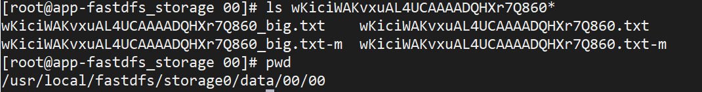
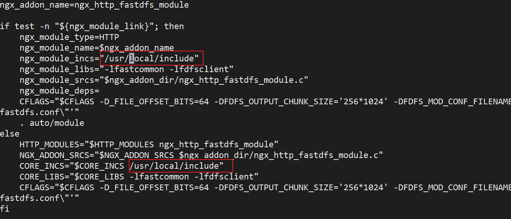

# 3.分布式文件系统-FastDFS+阿里OSS

## 第一章 概述

### 1-1 本章概述

* 概述
  * 分布式文件系统
  * 搭建FastDFS文件服务器
  * 整合第三方文件存储系统

* 目前文件上传的问题

  * 单向储存

  * 不支持集群

  * 文件数据冗余

  * 可扩展性差

* 目前的文件上传架构如下

  

  文件上传之后会存存储在一台tomcat上，在文件读取时，若将请求打到Tomcat1上，则正常获取；若打到Tomcat2或是Tomcat3上，则无法正常获取到文件数据。

  若是在文件上传时，将文件传输到分布式文件服务器。若在读取时，三个Tomcat则都可以访问到这个文件服务器获取文件数据。这样就可以解决单一的文件存储问题，同时他也支持集群、扩容等功能。
  
* 什么是分布式文件系统

  * 随着文件数据的越来越多，通过tomcat或nginx虚拟化的静态资源文件在单一的一个服务器节点内是存不下的，如果用多个节点来存储也是不利于管理和维护，所以我们需要一个系统来管理多台计算机节点上的文件数据，这就是分布式文件系统。
  
  * 分布式文件系统是一个允许文件通过网络在多台节点上分享的文件系统，多台计算机节点共同组成一个整体，为更多的用户提供分享文件。比如常见的网盘，本质就是一个分布式的文件存储系统。虽然我们是一个分布式的文件系统，但是对用户来说是透明的，用户使用像是访问本地磁盘一样。
  
  * 分布式文件系统可以提供冗余备份，所以容错能力很高。 系统中有某些节点宕机，但是整体文件服务不会停止，还是能够为用户提供服务还是运作的，数据也不会丢失。
  
  * 分布式文件系统的可扩展性强，增加或减少节点都很简单，不会影响线上服务，增加完毕后会发布到线上，加入到集群中为用户提供服务。
  * 分布式文件系统可以提供负载均衡能力，在读取文件副本的时候可以由多个节点共同提供服务，而且可以通过横向扩展来确保性能的提高。
  
* 为什么要使用分布式文件系统

  使用分布式文件系统可以解决如下几点问题：
  1. 海量文件数据存储

  2. 文件数据高可用(冗余备份)

  3. 读写性能和负载均衡
    以上3点都是我们之前使用tomcat或nginx所不能够实现的，这也是我们为什么要使用分布式文件系统的原因

* FastDFS 与 HDFS

  说到分布式文件存储，肯定会有人想到HDFS，他们两者主要定位和应用场景是不一样的。

  1. Hadoop中的文件系统HDFS主要解决并行计算中分布式存储数据的问题。其单个数据文件通常很大，采用了分块（切分）存储的方式数据大文件存储来使用的场景。
  2. FastDFS主要用于互联网网站，为文件上传和下载提供在线服务。所以在负载均衡、动态扩容等方面都支持得比较好，FastDFS不会对快存储。FastDFS用于存储中小文件都是不错的，比如用户头像啊，一些较小的音视频文件啊等等都行。

### 1-3 fastdfs概念梳理

FastDFS的相关内容可以参考如下网站：

* 百度百科：https://baike.baidu.com/item/fastdfs/5609710?fr=aladdin
* 开源中国：https://www.oschina.net/p/fastdfs?hmsr=aladdin1e1
* Github：https://github.com/happyfish100/fastdfs

### 1.4 附：FastDFS概念梳理


### 1-5 fastdfs架构原理与上传下载流程解析

#### 1. FastDFS架构


FastDFS服务端有两个角色：跟踪器（tracker）和存储节点（storage）。跟踪器主要做调度工作，在访问上起负载均衡的作用。

其中tracker和storage之间是有心跳检测的，storage会定期向tracker提交状态信息，所以在搭建的时候tracker是要先进行启动，才能启动storage，因为storage需要向tracker提交状态信息。

上传文件交互过程：

1. client询问tracker上传到的storage，不需要附加参数；

2. tracker返回一台可用的storage；

3. client直接和storage通讯完成文件上传；

下载文件交互过程：

1. client询问tracker下载文件的storage，参数为文件标识（卷名和文件名）；
2. tracker返回一台可用的storage；
3. client直接和storage通讯完成文件下载。

跟踪器和存储节点都可以由一台多台服务器构成。跟踪器和存储节点中的服务器均可以随时增加或下线而不会影响线上服务。其中跟踪器中的所有服务器都是对等的，可以根据服务器的压力情况随时增加或减少。

为了支持大容量，存储节点（服务器）采用了分卷（或分组）的组织方式。存储系统由一个或多个卷组成，卷与卷之间的文件是相互独立的，所有卷的文件容量累加就是整个存储系统中的文件容量。一个卷可以由一台或多台存储服务器组成，一个卷下的存储服务器中的文件都是相同的，卷中的多台存储服务器起 到了冗余备份和负载均衡的作用。

在卷中增加服务器时，同步已有的文件由系统自动完成，同步完成后，系统自动将新增服务器切换到线上提供服务。例如GroupC中若只有一个Node6，现在新增两个节点Node7和Node8，那就必须等这两个节点从Node6完成数据同步之后才能上线提供服务。

当存储空间不足或即将耗尽时，可以动态添加卷。只需要增加一台或多台服务器，并将它们配置为一个新的卷，这样就扩大了存储系统的容量。

#### 2. FastDFS上传过程


#### 3. FastDFS下载过程


## 第二章 FastDFS环境搭建

###2-1 配置fastdfs环境准备工作

1. 安装C语言编译器

   ```
   yum install -y gcc gcc-c++
   ```

2. 安装libevent，Libevent 是一个用[C语言](https://baike.baidu.com/item/C语言/105958)[编写](https://baike.baidu.com/item/编写/1517598)的、轻量级的开源高性能事件通知库

   ```
   yum install -y libevent
   ```

3. 安装libfastcommon

   ```
   tar -zxvf libfastcommon.tar.gz
   
   cd libfastcommon-1.0.42/
   
   ./make.sh
   
   ./make.sh install
   ```

4. 安装fastdfs

   ```
    tar -zxvf fastdfs-6.04.tar.gz
    
    cd fastdfs-6.04/
    
    ./make.sh
   
   ./make.sh install
   
   cd conf/
   
   # 拷贝配置文件到dfs配置下
   cp * /etc/fdfs/
   ```
###2-3 配置tracker服务

这里我那本机的两个虚拟机来进行配置，具体如下：

* 192.168.156.135：tracker
* 192.168.156.137：storage

1. 修改/etc/fdfs/tracker.conf，具体修改内容如下：

   ```
   # the base path to store data and log files
   base_path=/usr/local/fastdfs/tracker
   ```

2. 创建配置文件中的文件夹

   ```
   mkdir -p /usr/local/fastdfs/tracker
   ```

3. 启动tracker服务

   ```
   /usr/bin/fdfs_trackerd /etc/fdfs/tracker.conf
   ```

4. 查看tracker进程

   ```
   ps -ef|grep tracker
   ```

5. 停止tracker服务

   ```
   /usr/bin/stop.sh /etc/fdfs/tracker.conf
   ```

### 2-5 配置storage服务

#### 1. 配置storage

1. 修改/etc/fdfs/storage.conf，具体修改内容如下：

   ```
   # 修改组名
   group_name=imooc
   # 修改storage的工作空间
   base_path=/usr/local/fastdfs/storage
   # 修改storage的存储空间
   store_path0=/usr/local/fastdfs/storage
   # 修改tracker的地址和端口号，用于心跳
   tracker_server=192.168.156.135:22122
   # 后续结合nginx的一个对外服务端口号
   http.server_port=8888
   ```
   
2. 创建配置文件中的文件夹

   ```
   mkdir -p /usr/local/fastdfs/storage
   ```
   
3. 启动storage服务，这里切记要先启动tracker后启动storage

   ```
   /usr/bin/fdfs_storaged /etc/fdfs/storage.conf
   ```

4. 查看storage进程

   ```
   ps -ef|grep storage
   ```

5. 停止storage进程

   ```
   /usr/bin/stop.sh /etc/fdfs/storage.conf
   ```

#### 2. client测试文件上传

1. 修改/etc/fdfs/client.conf

   ```
   # the base path to store log files
   base_path=/usr/local/fastdfs/client
   
   # tracker_server can ocur more than once for multi tracker servers.
   # the value format of tracker_server is "HOST:PORT",
   #   the HOST can be hostname or ip address,
   #   and the HOST can be dual IPs or hostnames seperated by comma,
   #   the dual IPS must be an inner (intranet) IP and an outer (extranet) IP,
   #   or two different types of inner (intranet) IPs.
   #   for example: 192.168.2.100,122.244.141.46:22122
   #   another eg.: 192.168.1.10,172.17.4.21:22122
   
   tracker_server=192.168.156.135:22122
   # tracker_server=192.168.0.197:22122
   ```

2. 创建配置文件中的文件夹

   ```
   mkdir -p /usr/local/fastdfs/client
   ```

3. 执行文件上传命令

   ```
   /usr/bin/fdfs_test /etc/fdfs/client.conf upload hello.txt
   ```

4. 执行结果，我们可以看待拿到一个地址，例如：example file url: http://192.168.156.137/mall/M00/00/00/wKiciWAKvxuAL4UCAAAADQHXr7Q860.txt。这个地址目前还是不能访问的，后续需结合nginx。那这个文件究竟被fastDFS存储在哪里了呢？

   他被存储在`store_path0`

   

### 2-7 配置 nginx fastdfs实现文件服务器

fastdfs安装好以后是无法通过http访问的，这个时候就需要借助nginx了，所以需要安装fastdfs的第三方模块到nginx中，就能使用了。

**注：**nginx需要和storage在同一个节点。这里我在`192.168.156.137`这台服务器上配置

1. 安装nginx的fastdfs压缩包

   ```
   tar -zxvf fastdfs-nginx-module-1.22.tar.gz
   ```

2. 复制配置文件如下：

   ```
   cp fastdfs-nginx-module-1.22/src/mod_fastdfs.conf /etc/fdfs/
   ```

3. 修改/fastdfs-nginx-module/src/config文件，主要是修改路径，把local 删除，因为fastdfs安装的时候我们没有修改路径，原路径是`/usr/include`。这里这两处修改为`/usr/include`

   

4. 安装nginx，具体步骤参考`Java web环境配置`

5. 修改`/etc/fdfs/mod_fastdfs.conf`

   ```conf
   base_path=/usr/local/fastdfs/tmp
   tracker_server=192.168.156.135:22122
   group_name=mall
   url_have_group_name = true
   # 这个地址与sotrage一致
   store_path0=/usr/local/fastdfs/storage
   ```

6. 创建文件夹：`mkdir -p /usr/local/fastdfs/tmp `

7. 修改`/usr/local/myapp/program/nginx/conf/nginx.conf`中`http`标签配置如下，端口8888应与storage.conf中的`http.server_port`相同

   ```nginx
   server {
           listen       8888;
           server_name  localhost;
   
           location /mall/M00 {
                   ngx_fastdfs_module;
           }
       }
   
   ```

8. 启动nginx：`.nginx`，这样fastdfs就和nginx结合到了一起。通过如下地址就可以访问的fastdfs存储的文件，例如：http://192.168.156.137:8888/mall/M00/00/00/wKiciWAMO-qAFMBIAAAADQHXr7Q344_big.txt


