# 4. 分布式消息队列-RabbitMQ

## 第一章 分布式小队列（MQ）认知提升

### 1-1. 学习指南

#### 1. 主要内容

* 分布式小队列（MQ）认知提升
* RabbitMQ实战
* RabbitMQ可靠性投递基础组件封装
* Kafka应用实战
* Kafka高吞吐量日志收集实战
* 架构思考：分布式日志、跟踪、告警、分析平台

#### 2. 分布式小队列（MQ）认知提升内容

* 业界主流的分布式消息队列（MQ）与技术选型
* ActiveMQ特性原理与集群架构【预习或是复习】
* RabbitMQ特性原理与集群架构解析
* RocketMQ特性原理与集群架构【预习或是复习】
* Kafka特性原理与集群架构解析

### 1-2 业界主流的分布式消息队列（MQ）与技术选型

* 分布式消息队列（MQ）应用场景

  参考博文：https://www.cnblogs.com/yanglang/p/9259172.html

  * 服务解耦

    场景说明：用户下单后，订单系统需要通知库存系统。传统的做法是，订单系统调用库存系统的接口，假如库存系统无法访问，则订单减库存将失败，从而导致订单失败。

    加入消息队列后：

    * 订单系统：用户下单后，订单系统完成持久化处理，将消息写入消息队列，返回用户订单下单成功
    * 库存系统：订阅下单的消息，采用拉/推的方式，获取下单信息，库存系统根据下单信息，进行库存操作

    例如：在下单时库存系统不能正常使用。也不影响正常下单，因为下单后，订单系统写入消息队列就不再关心其他的后续操作了。实现订单系统与库存系统的应用解耦

  * 削峰填谷

    一般在秒杀或团抢活动中使用广泛；

    应用场景：秒杀活动，一般会因为流量过大，导致流量暴增，应用挂掉。为解决这个问题，一般需要在应用前端加入消息队列。

    * 可以控制活动的人数
    * 可以缓解短时间内高流量压垮应用
    * 用户的请求，服务器接收后，首先写入消息队列。假如消息队列长度超过最大数量，则直接抛弃用户请求或跳转到错误页面
    * 秒杀业务根据消息队列中的请求信息，再做后续处理

  * 异步化缓冲

    场景说明：用户注册后，需要发注册邮件和注册短信。传统的做法有两种 1.串行的方式；2.并行方式

    * 串行方式：将注册信息写入[数据库](http://lib.csdn.net/base/mysql)成功后，发送注册邮件，再发送注册短信。以上三个任务全部完成后，返回给客户端
    * 并行方式：将注册信息写入数据库成功后，发送注册邮件的同时，发送注册短信。以上三个任务完成后，返回给客户端。与串行的差别是，并行的方式可以提高处理的时间

    加入消息队列后：

    用户的响应时间相当于是注册信息写入数据库的时间。注册邮件，发送短信写入消息队列后，直接返回，因此写入消息队列的速度很快，基本可以忽略。

  * 日志处理

    日志处理是指将消息队列用在日志处理中，比如Kafka的应用，解决大量日志传输的问题。

    * 日志采集客户端，负责日志数据采集，定时写受写入Kafka队列
    * Kafka消息队列，负责日志数据的接收，存储和转发
    * 日志处理应用：订阅并消费kafka队列中的日志数据

* 分布式消息队列（MQ）应用思考点

  1. 生产端可靠性投递
  2. 消费端幂等
  3. MQ的高可用
  4. MQ的低延时
  5. MQ的可靠性
  6. MQ的消息的堆积能力
  7. MQ的扩展性
  8. 等等...

### 1-3 mq的技术选型关注点

* 业界主流的分布式消息队列

  1. ActiveMQ
  2. RabbitMQ
  3. RocketMQ
  4. Kafka

* 如何进行技术选型

  1. 各个MQ的性能、优缺点、相应的业务场景

    * ActiveMQ

      用于传统行业，中小型公司；

      并发和消息的承载能力一般；
    
    * RabbitMQ

      横向拓展能力弱；
  
  2. 集群结构模式 、分布式、可扩展、高可用、可维护性
  
  3. 综合成本问题，集群规模，人员成本
  
  4. 未来的方向、规划、思考
  
### 1-4 ActiveMQ集群架构与原理解析

  

### 1-5 RabbitMQ集群架构模型与原理解析

* RabbitMQ四种集群架构

  * 主备模式
  * 远程模式
  * 镜像模式（推荐）
  * 多活模式

* 主备模式

  * warren（兔子窝），一个主/备方案（主节点如果挂了，从节点提供服务，和ActiveMQ利用Zookeeper做主/备一样）

    也就是一个主/备方案，主节点提供读写，备用节点不提供读写。如果主节点挂了，就会自动切换到备用节点，原来的备用节点升级为主节点提供读写服务，当原来的主节点恢复运行后，原来的主节点就变成备用节点，和 activeMQ 利用 zookeeper 做主/备一样，也可以一主多备。

    实现RabbitMQ的高可用集群，一般在并发和数据量不高的情况下，这种模型非常好用且简单。主备模式也称之为Warren模式。

  * 架构图

    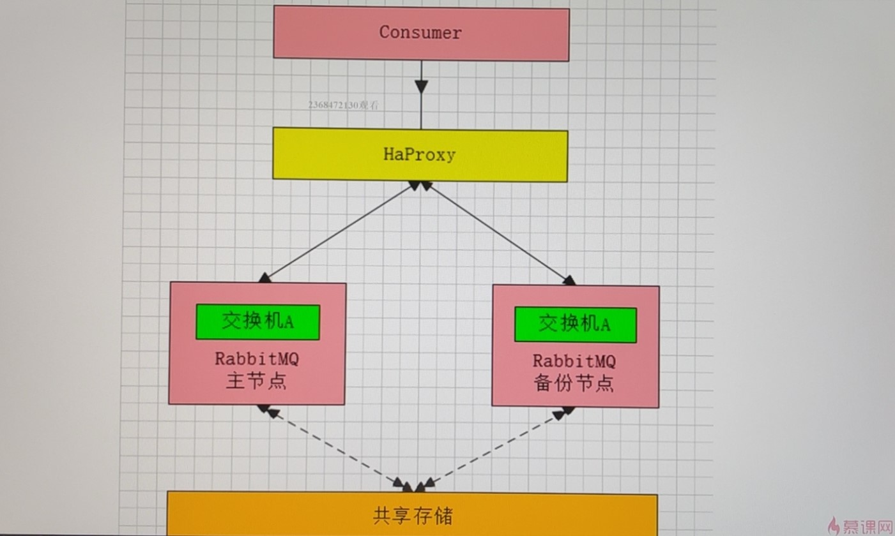

  * 主备模式-HaProxy配置

    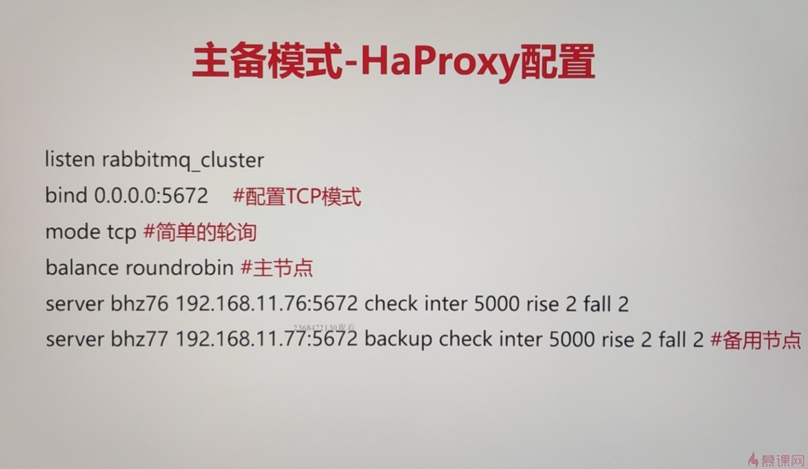

* 远程模式

  * 远距离通信和复制，可以实现双活的一种模式，简称Shovel模式。所谓的 shovel 就是把消息进行不同数据中心的复制工作，可以跨地域的让两个 MQ 集群互联，远距离通信和复制。

  * 所谓Shovel就是我们可以把消息进行不同数据中心的复制工作，可以跨地域的让两个MQ集群互联

  * 缺点：配置复杂，不推荐

  * Shovel架构模型

    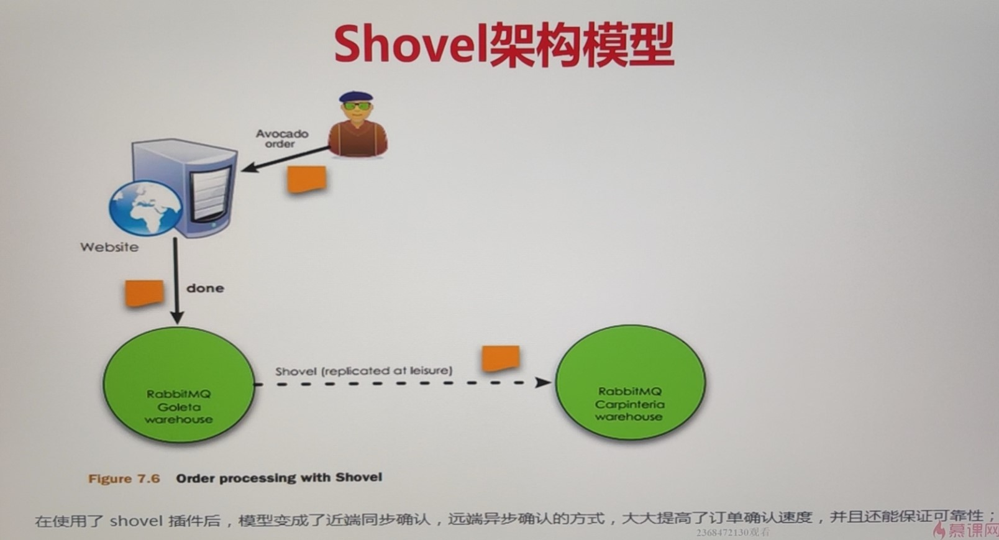

    RabbitMQ Goleta warehouse和RabbitMQ Carpinteria warehouse是两个不同地域的Rabbit集群。

    上面的图也就是说，跨地域的两个RabbitMQ集群会在空闲时进行数据复制。

  * Shovel集群的拓扑图

    当第一个集群消息处理不过来或是出现故障时，可以将消息转到第二个集群去做处理。

    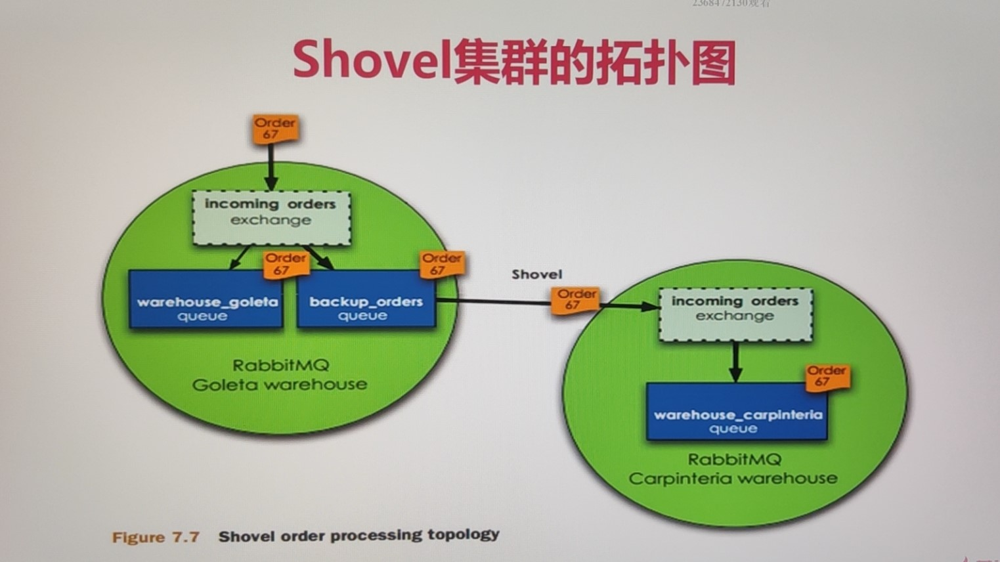

  * Shovel集群配置步骤

    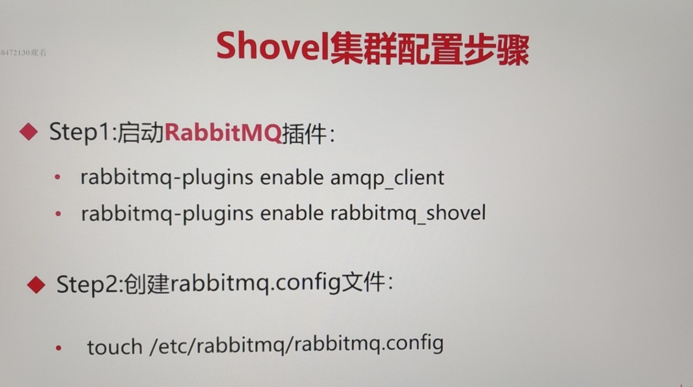

    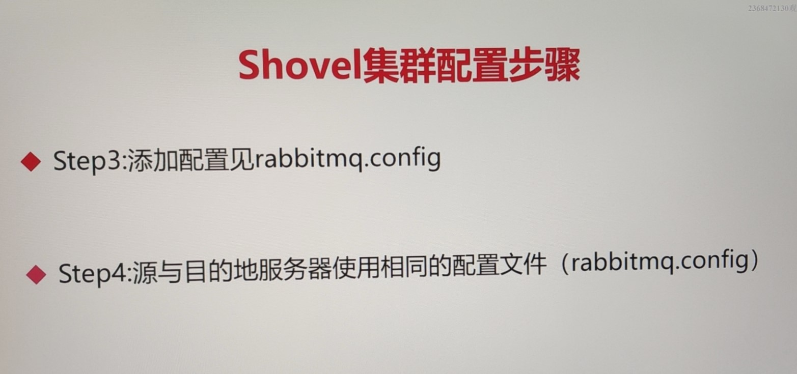

    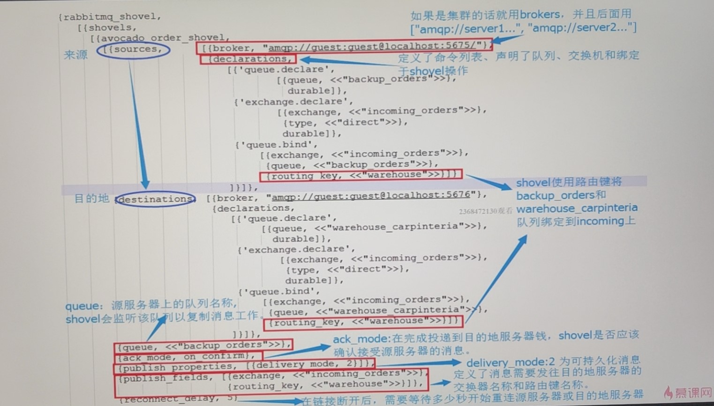

* 镜像模式

  * 集群模式非常经典的就是Mirror镜像模式，保证100%数据不丢失

  * 在实际工作中用的最多，并且实现集群非常的简单，一般互联网大厂都会构建这种镜像集群模式

  * Mirror镜像模式的特点

    * 高可靠
    * 数据同步
    * 3节点（防止脑裂）
    * 无法横向扩容（缺点）

  * RabbitMQ集群架构图

    用 KeepAlived 做了 HA-Proxy 的高可用，然后有 3 个节点的 MQ 服务，消息发送到主节点上，主节点通过 mirror 队列把数据同步到其他的 MQ 节点，这样来实现其高可靠。

    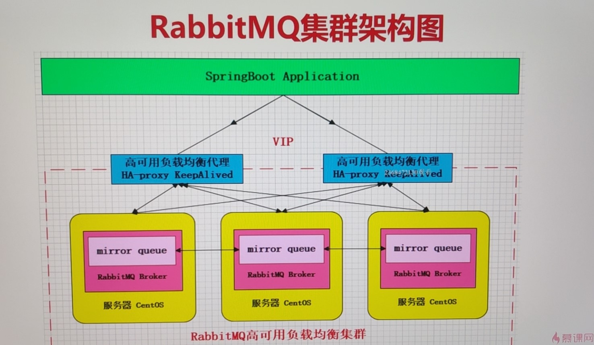
    
  * 架构搭建实操

    

* 多活模式

  * 这种模式也是实现异地数据复制的主流模式，因为Shovel模式配置比较复杂，所以一般来说实现异地集群都是使用这种双活或是多活模型来实现的

  * 这种模式需要依赖RabbitMQ的federation插件，可以实现持续的可靠的AMQP数据通信，多活模式实际配置与应用非常简单

  * Rabbit部署架构采用双中心模式（多中心），那么在两套（或多套）数据中心各部署一套RabbitMQ集群，各中心的RabbitMQ服务除了需要为业务提供正常的消息服务外，中心之间还需要实现部分队列消息共享

  * 多活集群架构图

    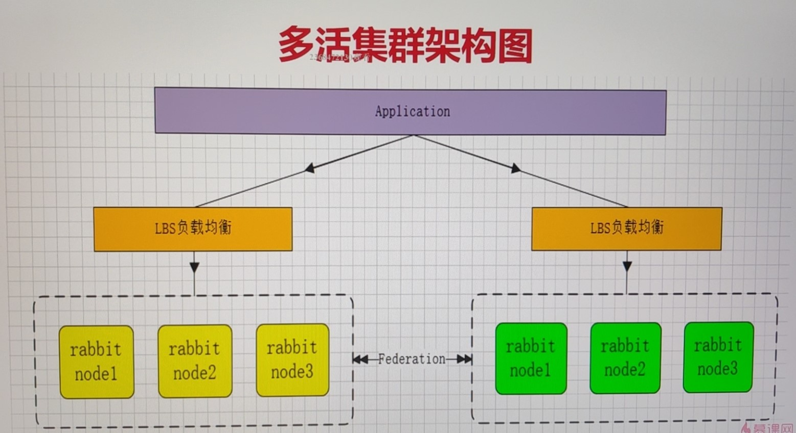

  * 多活模式-Federation插件

    federation 插件是一个不需要构建 cluster ，而在 brokers 之间传输消息的高性能插件，federation 插件可以在 brokers 或者 cluster 之间传输消息，连接的双方可以使用不同的 users 和 virtual hosts，双方也可以使用不同版本的 rabbitMQ 和 erlang。federation 插件使用 AMQP 协议通信，可以接受不连续的传输。

    federation 不是建立在集群上的，而是建立在单个节点上的，如图上黄色的 rabbit node 3 可以与绿色的 node1、node2、node3 中的任意一个利用 federation 插件进行数据同步。

    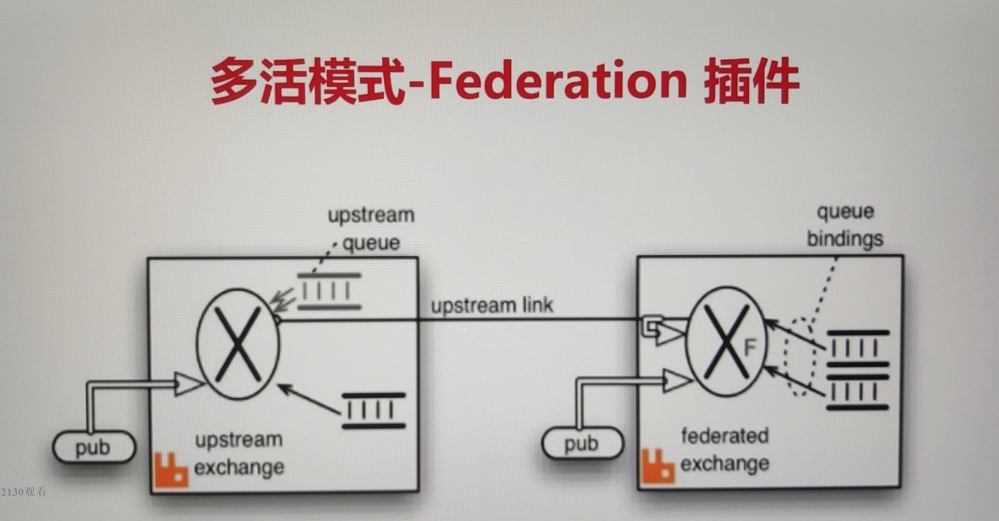

    如上图所示，federation exchanges 可以看成 downstream 从 upstream 主动拉取消息，但是并不是拉取所有消息，必须是在 downstream 上已经明确定义 Bingdings 关系的 exchange，也就是有实际的物理 queue 来接收消息，才会从 upstream 拉取消息到 downstream 。

    它使用 AMQP 协议实现代理间通信，downstream 会将绑定关系组合在一起，绑定/解绑命令将发送到 upstream 交换机。因此，federation exchange 只接收具有订阅的消息。

### 1-6 RocketMQ集群架构与原理解析


### 1-7 Kafka特性原理与集群架构解析

#### 1. Kafka介绍

* Kafka是Linkedin开源的分布式消息系统，目前归属于Apache顶级项目
* Kafka主要特点是基于Pull的模式来处理消息消费，追求高吞吐量，一开始的目的就是用于日志收集和传输
* 0.8版本开始支持复制，不支持事务，对消息的重复、丢失、错误没有严格要求，适合产生大量数据的互联网服务的数据收集业务
* Kafka的特点
  * 分布式
  * 跨平台
  * 实时性强
  * 伸缩性强，支持水平扩展
* Kafka高性能的原因
  * 顺序写，Page Cache空中接力，高效读写
  * 高性能，高吞吐
  * 后台异步、主动Flush
  * IO于预读策略，IO调度

### 1-8 kafka高性能核心pagecache与zerocopy原理解析

**Page cache**：页面缓存，是操作系统实现的一种磁盘缓存机制， 以此来减少磁盘IO操作。就是把磁盘中的数据缓存到内存中，将对磁盘访问变成对内存的访问。

如下图所示，一次网络正常文件读取的流程需要四次文件复制。

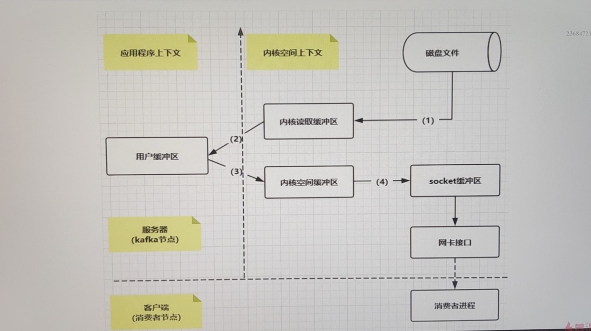

**zerocopy**，一次拷贝，Kafka就采用了这种方式。将磁盘中的数据读取到page cache中一次，然后将数据直接发送到网卡，发送给不同订阅者相同数据是可以复用同一个页面缓存，避免了重复复制的情况。如下如所示：
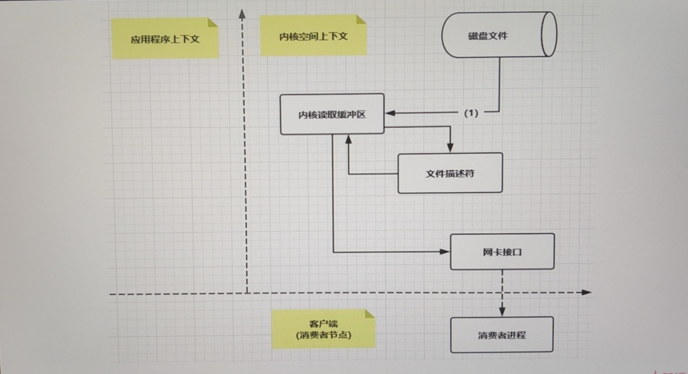

### 1-9 Kafka集群模式

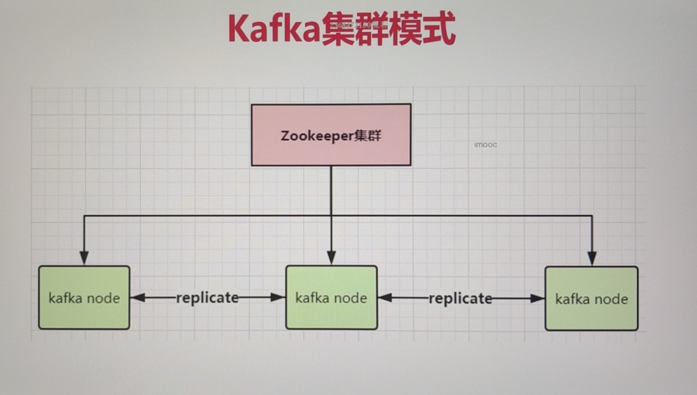

### 1-10 本章总结

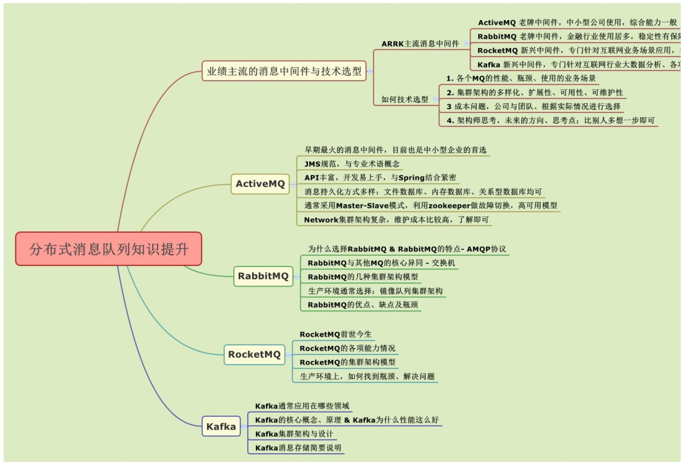

## 第二章 RabbitMQ实战

### 2-1学习指南

* AMQP核心概念
* 急速安装与入门
* RabbitMQ核心API
* RabbitMQ高级特性
* RabbitMQ集群架构实操
* 与SpringBoot整合实战-生产端和消费端详解
* MQ基础组件封装与实战

### 2-3 RabbitMQ简单入门
RabbitMQ是一个开源的消息代理和队列服务器，用来通过普通协议在完全不同的应用之间共享数据，RabbitMQ是使用Erlang语言来编写的，并且RabbitMQ是基
议的。各个互联网大厂都在使用RabbitMQ作为消息中间件，为什么呢，下面我们来一起看看，“她” 都有哪些优点！

* 采用Erlang语言作为底层实现：Erlang有着和原生Socket一样的延迟
* 开源、性能优秀，稳定性保障
* 提供可靠性消息投递模式（confirm）、返回模式（ return ）
* 与SpringAMQP完美的整合、API丰富
* 集群模式丰富，表达式配置，HA模式，镜像队列模型
* 保证数据不丢失的前提做到高可靠性、可用性

### 2-4 RabbitMQ高性能的原因

* Erlang语言最初在于交换机领域使用，是专门为通信应用设计的，比如控制交换机或者变换协议等，因此非常适 合于构建分布式，实时软[并行计算系统](https://baike.baidu.com/item/并行计算系统/19130839)。
* Erlang的优点：Erlang有着和原生Socket一样的延迟。

### 2-5 AMQP高级消息队列协议

* AMQP全称：Advanced Message Queuing Protocol，高级消息队里协议

* AMQP定义：是具有线代特征的二进制协议，是一个提供统一消息服务的应用层标准高级消息队列协议，是应用层协议的一个开放标准，为面向消息的中间件设计。

* 下图表达了AMQP协议的一些核心部件：消息的生产者publisher、消息的消费者consumer、MQBroker（Server）、以及内部的Virtual Host、Exchange、Message Queue

  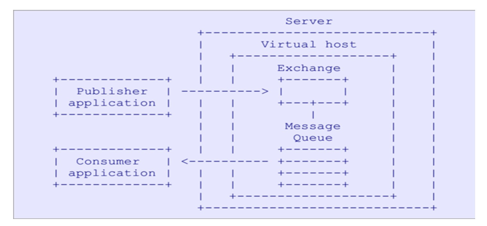

### 2-6 AMQP核心概念讲解

AMQP专有名词解释：

* Server：又称Broker，接受客户端的连接，实现AMQP实体服务
* Connection：连接，应用程序与Broker的网络连接
* Channel：网络信道，几乎所有的操作都在Channel中进行，Channel是进行消息读写的通道。客户端可建立多个Channel，每个Channel代表一个会话任务。
* Message：消息，服务器和应用程序之间传送的数据，由Properties和Body组成。Properties可以对消息进行修饰，比如消息的优先级、延迟等高级特性；Body则就是消息体内容。
* Virtual host：虚拟地址，用于进行逻辑隔离，最上层的消息路由。一个Virtual Host里面可以有若干个Exchange和Queue，同一个Virtual Host里面可以有若干个Exchange和Queue，同一个Virtual Host里面不能有相同名称的Exchange或Queue。
* Exchange：交换机，接收消息，并根据**路由键**转发消息到绑定的队列。
* Binding：Exchange和Queue之间的虚拟连接， binding中可以包含routing key。
* Routing key： 一个路由规则，虚拟机可用它来确定如何路由一个特定消息。
* Queue：也称为Message Queue，消息队列，保存信息并将它们转发给消费者。

### 2-7 rabbitmq整体架构与消息流转

#### 1. RabbitMQ的整体架构师什么样子的

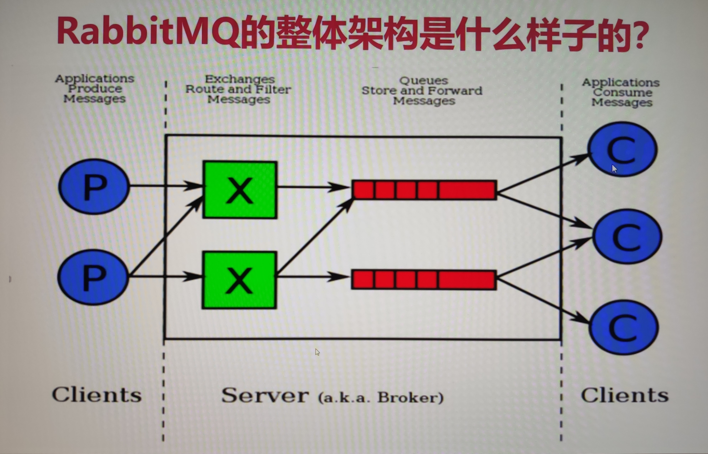

#### 2. RabbitMQ消息是如何流转的

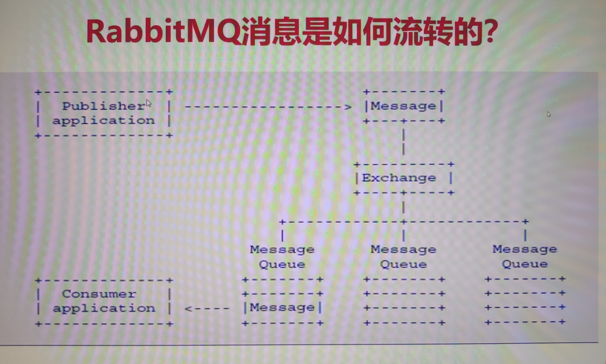

### 2-8 RabbitMQ的安装

具体的操作步骤可以参考`Java web环境配置`，这里我们在192.168.156.135上进行的安装。

### 2-9 RabbitMQ核心API

#### 核心API - Exchange概念

Exchange：接收消息，并根据路由键转发消息到所绑定的队列。这是RabbitMQ（AMQP）非常重要的概念。

上幅图说明问题：黄色的部分就是Exchange和Queue的关系，可见他们是一个路由的关系

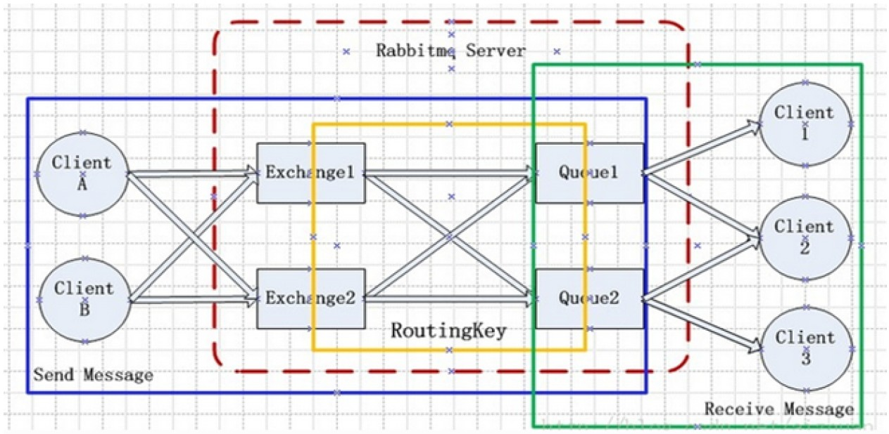

Exchange（交换机）本身有很多属性和类型，接下来容我一一介绍：

* Exchange（交换机）属性：

  * Type：交换机类型 direct、topic、fanout、headers
  * Durability：是否需要持久化 ，默认为 true 表示持久化
  * Auto Delete：当最后一个绑定到Exchange上的队列删除后，自动删除该Exchange
  * Internal：当前Exchange是否用于RabbitMQ内部使用，默认为False
  * Arguments：扩展参数，用于扩展AMQP协议制定化使用Name：交换机名称

* Exchange（交换机）类型：

  1. Direct Exchange：所有发送到Direct Exchange的消息被转发到RouteKey中指定的Queue，如下图所示：

     注意:Direct模式可以使用RabbitMQ自带的Exchange: default Exchange，所以不需要将Exchange进行任何绑定(binding)操作,消息传递时，RouteKey必须完全匹配才会被队列接收，否则该消息会被抛弃。

  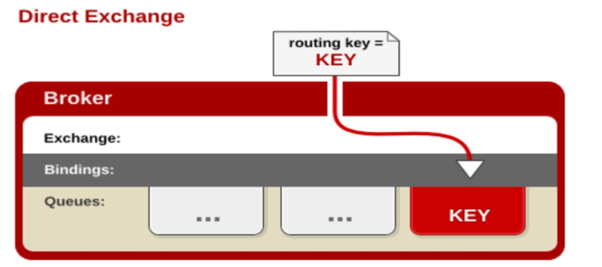

  2. Topic Exchange：所有发送到Topic Exchange的消息被转发到所有关心RouteKey中指定Topic的Queue上，Exchange 将RouteKey和某Topic进行模糊匹配，此时队列需要绑定一个Topic

    注意点：可以使用通配符进行模糊匹配：

    * 符号 “#” 匹配一个或多个词，例如：“log.#” 能够匹配到 “log.info.oa；

    * 符号"log.\*"匹配不多不少一个词，例如：“log.*” 只会匹配到 “log.error”；如下图所示：

    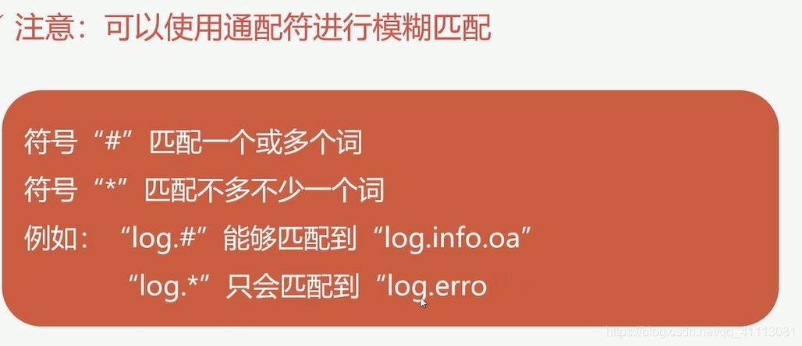

    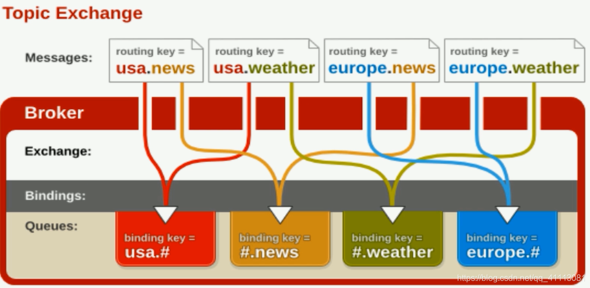
  
  3. Fanout Exchange
  
     * 不处理路由键，只需要简单的将队列绑定到交换机上
     * 发送到交换机的消息都会被转发到与该交换机绑定的所有队列上
     * Fanout交换机转发消息是最快的
  
     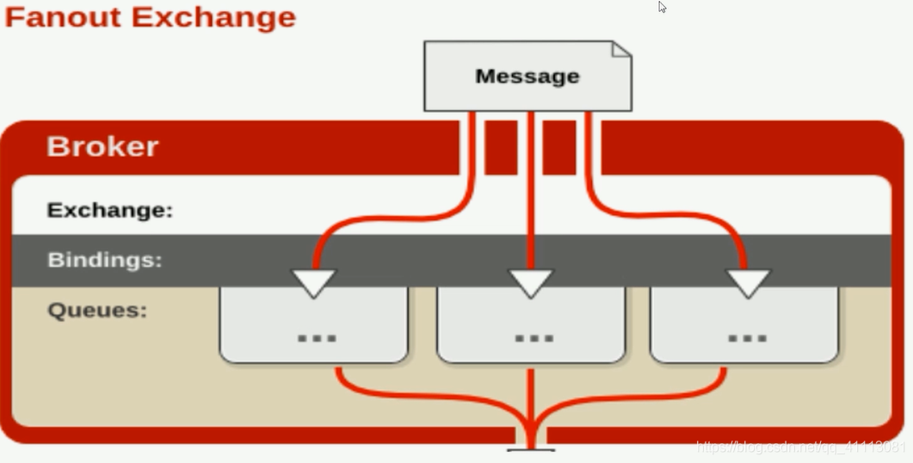

### 2-10 RabbitMQ高级特性

#### 1. Confirm确认消息

理解Confirm消息确认机制，是学习RabbitMQ的知识点中非常非常非常（重要的事情说三遍）重要的！

具体过程：

* 消息的确认，是指生产者投递消息后，如果Broker收到消息，则会给我们生产者一个应答。

* 生产者进行接收应答，用来确定这条消息是否正常的发送到Broker，这种方式也是消息的可靠性投递的核心保障

接下来我们通过一幅图说明Confirm消息，大致上就是producer发送消息给broker，broker把消息进行持久化，之后由broker主动发送ack响应给消息的生产，由消息的生产者确认这次响应，注意这里的响应过程是异步的。

生产端发送消息到Broker，然后Broker接收到了消息后，进行回送响应，生产端有一个Confirm Listener，去监听应答，当然这个操作是异步进行的，生产端将消息发送出去就可以不用管了，让内部监听器去监听Broker给我们的响应。

  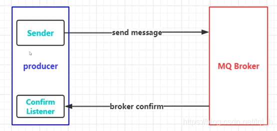

代码级别如何实现Confirm确认消息呢，我们一起来梳理一下，简单两步骤即可：

* 第一步：在channel上开启确认模式：channel.confirmSelect()
* 第二步：在channel上添加监听：addConfirmListener，监听成功和失败的返回结果，根据具体的结果对消息进行重新发送、或记录日志等后续处理

相关代码示例：

* 生产端实现（Producer ）

  ```java
  public class ConfirmProducer {
      
      public static void main(String[] args) throws Exception {
          //1 创建ConnectionFactory
          ConnectionFactory connectionFactory = new ConnectionFactory();
          connectionFactory.setHost("192.168.11.76");
          connectionFactory.setPort(5672);
          connectionFactory.setVirtualHost("/");
          
          //2 获取Connection
          Connection connection = connectionFactory.newConnection();
          //3 通过Connection创建一个新的Channel
          Channel channel = connection.createChannel();
          
          //4 指定我们的消息投递模式: 消息的确认模式 
          channel.confirmSelect();
          
          String exchangeName = "test_confirm_exchange";
          String routingKey = "confirm.save";
          
          //5 发送一条消息
          String msg = "Hello RabbitMQ Send confirm message!";
          channel.basicPublish(exchangeName, routingKey, null, msg.getBytes());
          
          //6 添加一个确认监听
          channel.addConfirmListener(new ConfirmListener() {
              //消息失败处理
              @Override
              public void handleNack(long deliveryTag, boolean multiple) throws IOException {
                  //deliveryTag；唯一消息标签
                  //multiple：是否批量
                  System.err.println("-------no ack!-----------");
              }
              //消息成功处理
              @Override
              public void handleAck(long deliveryTag, boolean multiple) throws IOException {
                  System.err.println("-------ack!-----------");
              }
          });
      }
  }
  ```

* 消费端实现

  ```java
  public class ConfirmConsumer {
   
      public static void main(String[] args) throws Exception {
          //1 创建ConnectionFactory
          ConnectionFactory connectionFactory = new ConnectionFactory();
          connectionFactory.setHost("192.168.11.76");
          connectionFactory.setPort(5672);
          connectionFactory.setVirtualHost("/");
          
          //2 获取Connection
          Connection connection = connectionFactory.newConnection();
          //3 通过Connection创建一个新的Channel
          Channel channel = connection.createChannel();
          
          String exchangeName = "test_confirm_exchange";
          String routingKey = "confirm.#";
          String queueName = "test_confirm_queue";
          
          //4 声明交换机和队列，然后进行绑定设置路由Key
          channel.exchangeDeclare(exchangeName, "topic", true);
          channel.queueDeclare(queueName, true, false, false, null);
          channel.queueBind(queueName, exchangeName, routingKey);
          
          //5 创建消费者 
          QueueingConsumer queueingConsumer = new QueueingConsumer(channel);
          channel.basicConsume(queueName, true, queueingConsumer);
          
          //6 接收消息
          while(true){
              Delivery delivery = queueingConsumer.nextDelivery();
              String msg = new String(delivery.getBody());
              System.err.println("消费端: " + msg);
          }
      }
  }
  ```

* 运行说明：

  先启动消费端，访问管控台：http://192.168.43.157:15672，检查Exchange和Queue是否设置OK，然后启动生产端，消息被消费端消费，生产端也成功监听到了ACK响应。

  ```
  # 消费端打印
  消费端: Hello RabbitMQ Send confirm message!
  # 生产端打印
  -------ack!-----------1
  ```

  什么时候会走 handleNack 方法呢，比如磁盘写满了，MQ出现了一些异常，或者Queue容量到达上限了等等

  也有可能两个方法都不走，比如生产端发送消息就失败了，或者Broker端收到消息在返回ack时中途出现了网络闪断。这种情况就需要定时任务去抓取中间状态的消息进行最大努力尝试次数的补偿重发，从而保障消息投递的可靠性。
  
#### 2. confirm模式

消息的投递模式有：confirm模式和return模式两种。

开启confirm模式channel.confirmSelect();

这种模式，消息到达交换机时触发，若成功/失败到达交换机时，调用成功/失败回调函数。

只要到达了交换机，就会调用回调方法。

#### 3. return模式

Return Listener用于处理一些不可路由的消息。我们的消息生产者，通过指定一个Exchange和Routingkey，把消息送到某一个队列中，然后我们的消费者监听队列，进行消息处理操作。但是在某些情况下，如果我们在发送消息的时候，当前的exchange不存在或者指定的路由key路由不到，这个时候我们需要监听这种不可达的消息，就要使用return listener。

只有成功到达了交换机且未到达队列才会触发回调函数。

basicPublish方法参数boolean mandatory默认是false，需要设置为true。

### 2-11 消息如何保障 100% 的投递成功方案

#### 1. 消息如何保障100%的投递成功

什么是生产端的可靠性投递？

* 保障消息的成功发出
* 保障MQ节点的成功接收
* 发送端收到MQ节点（Broker）的确认应答
* 完成的消息补偿机制

#### 2. 生产端可靠性投递

BAT/TMD互联网大厂的解决方案：

* 消息落库，对消息状态进行打标

  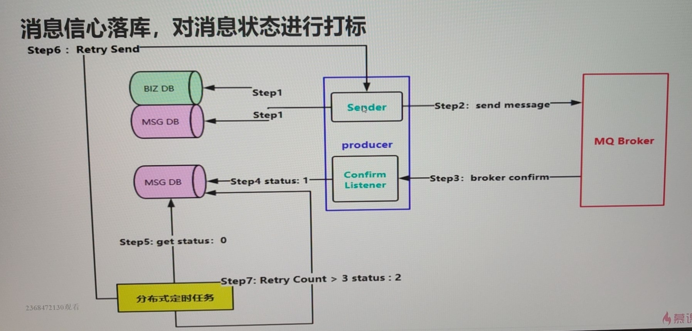

  1. 第一步：将业务逻辑数据入库，保存到**BIZ DB**；并将消息数据保存到**MSG DB**（消息状态status=0）。假设我这里有两个数据库。不足之处在于这里要做两次数据库操作；
  2. 第二步：将消息发送给Broker；
  3. 第三步：Broker发送消息应答，生产者的Confirm Listener则监听是否收到确认应答；
  4. 第四步：更新MSG DB，设置消息状态status=1，确认这条消息已经百分之百的投递成功了；
  5. 第五步：假如我们的消息因为网络等问题导致第二、三、四步骤发生失败，那就需要从**MSG DB**数据库中取出最近超过五分钟或是一定时长的消息状态仍为status=0的数据，采用分布式的定时任务，主要是为了避免重复操作
  6. 第六步：对status=0的消息进行重新发送；
  7. 第七步：如果消息的重发次数大于3次，这时需将消息的状态置为2，此时就可能需要人工进行介入处理；

  **注意：**若采用这种方式保障MQ的可靠性投递，在高并发场景下是否合适：答案是否定的，因为这个方案中不仅对业务数据进行了入库，而且对消息数据也做了入库，**做了两次db存储**。随着业务的发展，数据库就会成为瓶颈。

* 消息的延迟投递，做二次确认，回调检查

  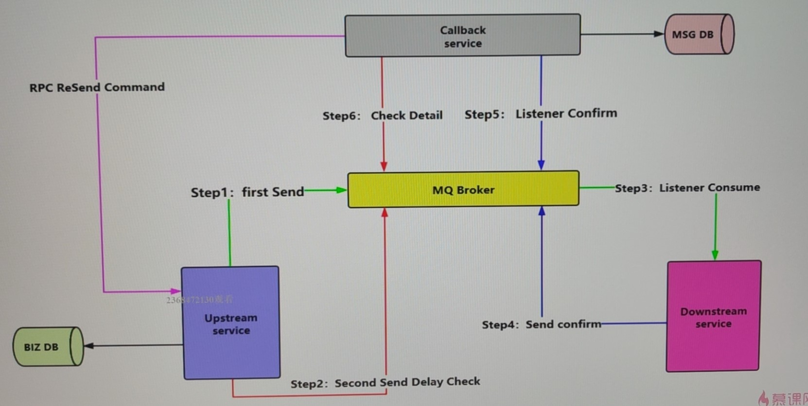

  * Upstream service：上游服务，消息生产者
  * Downstream service：下游服务，消息消费者
  * Callback service：回调服务，这是一个单独的服务，作为一个消息补偿服务

  上图的主要流程如下：

  1. 第一步：**业务数据落库后**，第一次发送消息到Broker
  2. 第二步：发送**延迟投递和检查的消息**，第二次发送消息要在第一次之后2分钟或是一段时间
  3. 第三步：Downstream service监听并消费消息（这条消息是第一次发送的）；
  4. 第四步：Downstream service发送**确认应答消息**；
  5. 第五步：Callback service监听确认应答消息，并对这条消息进行持久化的存储；
  6. 第六步：Callback service监听延迟投递的消息（这条消息是第二次发送的），这里Callback service会去MSG DB中去检查是否已经收到Downstream service对这笔消息的确认应答。若检查后发现没有收到，则执行第7七步；
  7. 第七步：Callback service会向Upstream service发送一个消息重发命令，要求Upstream service重新发送这条信息，重新执行以上步骤；

### 2-12 幂等性概念及业界主流解决方案

1. 密等性是什么？

   **幂等性：就是用户对于同一操作发起的一次请求或者多次请求的结果是一致的，不会因为多次点击而产生了副作用。**

   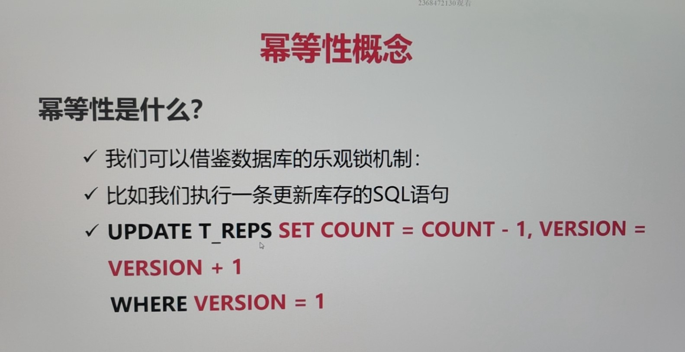

   假如同一时刻有两个请求同时执行这条update语句，但是我们必须保证只有一个请求进行该操作，所以在where条件后面加了版本号，这样第二个请求再去执行的时候就已经不再满足where条件了，所以不会成功。

2. MQ消费端幂等性的保障

   在海量订单产生的业务高峰期，如何避免消息的重复消费问题？

   消费端实现幂等性，就意味着我们的消息永远不会消费多次，即使我们收到多条一样的消息，那么我们也只处理一条

3. 业界主流的幂等性操作

   * **唯一ID + 指纹码**机制，利用数据库主键去重
   * 利用Redis的原子性去实现；

4. **唯一ID + 指纹码**机制

   * 唯一ID + 指纹码 机制，利用数据库主键去重，这里的指纹码可以是一个时间戳或者是业务规则
   * SELECT COUNT(1) FROM T_ORDER WHERE ID = 唯一ID + 指纹码，判断是否进行存在
   * 优点：实现简单
   * 缺点：高并发情况下，有数据库写入的性能瓶颈；
   * 解决方案：对ID进行分库分表，进行算法路由；
   
5. 利用Redis的原子性去实现

   * 使用Redis进行幂等，需要考虑的问题

     1. 第一：我们是否要进行数据落库，如果落库的话，关键解决的问题是**数据库和缓存如何做到原子性**，保证数据的一致性；
     2. 第二：如果不进行落库，那么都存储到缓存中，**如何设置定时同步的策略**，将缓存的数据同步到数据库中？

### 2-14 rabbitmq与springboot整合_生产端-1

#### 1. RabbitMQ整合Spring Boot 2.x步骤

1. 引入Maven依赖

   ```xml
   <dependency>
   	<groupId>org.springframework.boot</groupId>
   	<artifactId>spring-boot-starter-amqp</artifactId>
   </dependency>
   ```

2. 编辑Application.properties

#### 2. 消息生产端核心配置，配置消息模式

```properties
# 启动消息确认模式，这对可靠性投递很重要
spring.rabbitmq.publisher-confirms=true

# 设置return消息模式，注意要和mandatory一起适用
#spring.rabbitmq.publisher-returns=true
#spring.rabbitmq.template.mandatory=true
```

#### 3. 消息消费端核心配置

#### 4. @RabbitListener注解使用

* 消费端监听@RabbitListener

* 该注解是一个复合型注解，一般配合`@QueueBinding`,`@Queue`,`@Exchange`使用

* 具体使用：

  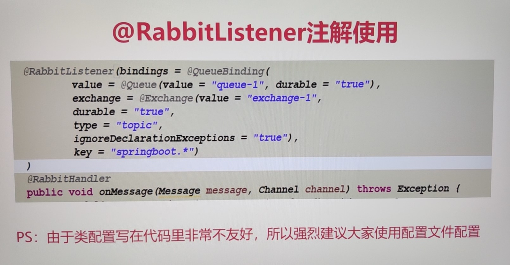

### 2-15 rabbitmq与springboot整合_生产端-2

编写消息生产端代码：cn.bravedawn.producer.component.RabbitSender

### 2-16 rabbitmq与springboot整合_消费端-1

#### 1. 消费者配置

```properties
# 消费者配置
## 表示消费者消费成功消息以后需要手工进行签收（ack），默认为auto
spring.rabbitmq.listener.simple.acknowledge-mode=manual
## 监听器最小线程数
spring.rabbitmq.listener.simple.concurrency=5
## 监听器最大线程数
spring.rabbitmq.listener.simple.max-concurrency=10
## 每个消费者可以处理的未确认消息的最大数量，说白了就是一条一条消费
spring.rabbitmq.listener.simple.prefetch=1
```

#### 2. 自定义配置

```properties
# 自定义消费者配置
##	最好不要在代码里写死配置信息，尽量使用这种方式也就是配置文件的方式
##	在代码里使用 	${}	方式进行设置配置: ${spring.rabbitmq.listener.order.exchange.name}
spring.rabbitmq.listener.order.queue.name=queue-1
spring.rabbitmq.listener.order.queue.durable=true
spring.rabbitmq.listener.order.exchange.name=exchange-1
spring.rabbitmq.listener.order.exchange.durable=true
spring.rabbitmq.listener.order.exchange.type=topic
spring.rabbitmq.listener.order.exchange.key=springboot.*
```

#### 2. 消费者监听代码

参考：cn.bravedawn.consumer.component.RabbitReceiver

### 2-17 rabbitmq与springboot整合_消费端-2

1. 首先启动rabbit-consumer项目

2. 观察rabbitMQ控制台的效果

   * Overview

     从这里可以看到连接是1个，会话是5个，交换机是8个，队列是1个，消费者是5个（一个会话对应一个消费者）

     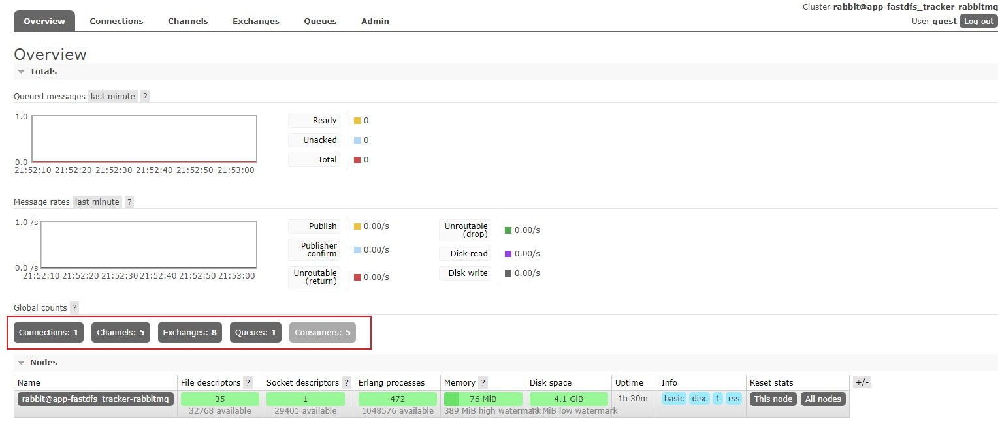

   * Connections

     可以看到有1个连接，5个会话

     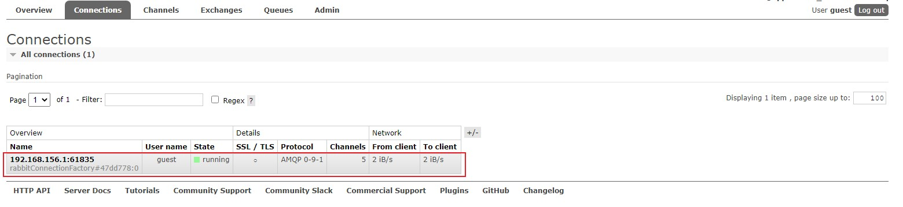

   * Channels

     可以看到有5个会话

     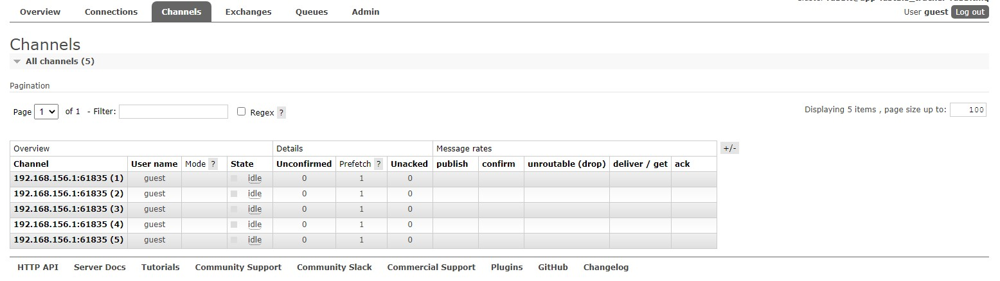

   * Exchanges

     可以看到有8个交换机，其中exchange-1是我们声明的，其他为RabbitMQ默认的

     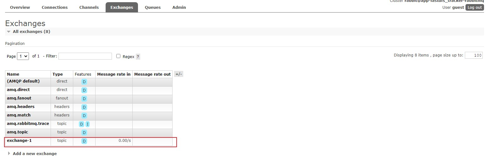

     与Exchanges绑定的队列

     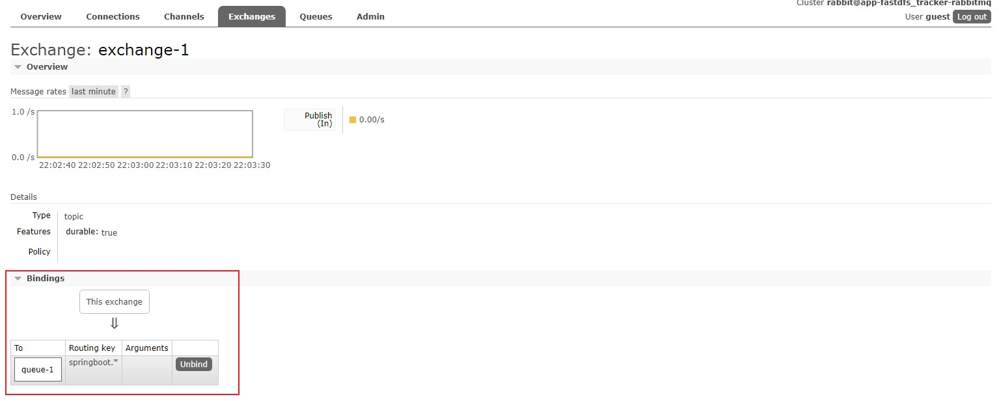

   * Queues

     可以看到我们声明的队列信息

     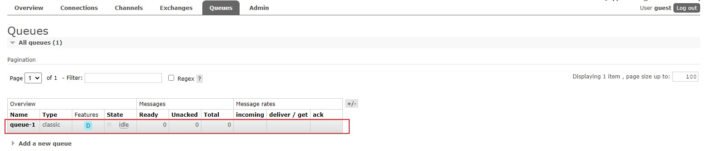

3. 编写生产者单元测试

  1. 执行cn.bravedawn.producer.ApplicationTest#testSender单元测试
  
     * 发送消息
      
       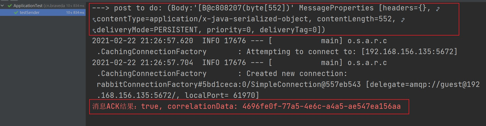
      
     * 接收消息
      
       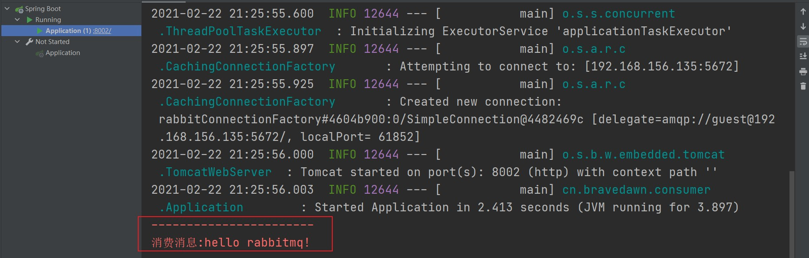
  
  2. 把consumer停掉，重新运行单元测试
  
     先关闭comsumer并且注释手动签收
  
     
  
     启动单元测试，发送消息
  
     
  
     从控制台上可以看到有一条消息尚未被消费
  
     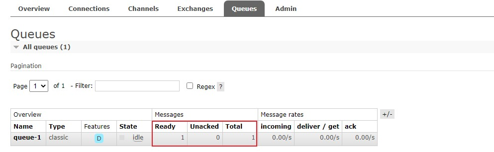
  
     此时我们重新启动consumer，控制台打印如下
  
     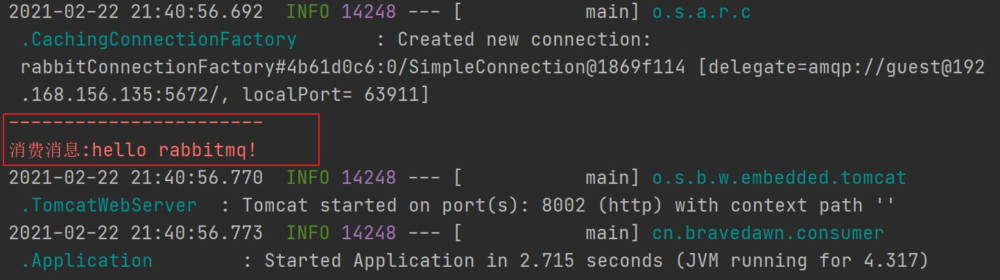
  
     这里进行了消息消费，但是被没有进行ack，控制台显示如下：
  
     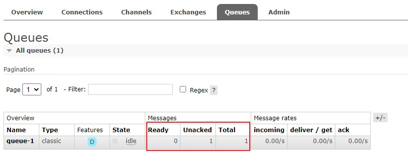
  
     此时，我们放开手动签收的代码注释，重新启动consumer，可以看到启动后又对这条消息进行了消费。
  
     
  
     查看控制台，此时这条消息就完成了ack
  
     
  
     也就是说如果消费端没有对该条消息进行ack，那么这条消息肯定不会删，消费端重启后会再次对该条消息进行ack。也就是说**broker端和消费端会保证消息ack的可靠性**。
  
     所以一般我们只需要做生产端和broker端之间的可靠性投递就行。

## 第三章 RabbitMQ基础组件封装

### 3-1 rabbitmq基础组件整体功能概述

* 基础组件实现关键点

  * 一线大厂的MQ组件实现思路和架构设计方案
  * 基础组件封装设计-迅速消息发送
  * 基础组件封装设计-确认消息发送
  * 基础组件封装设计-延迟消息发送

* 基础组件实现的功能点

  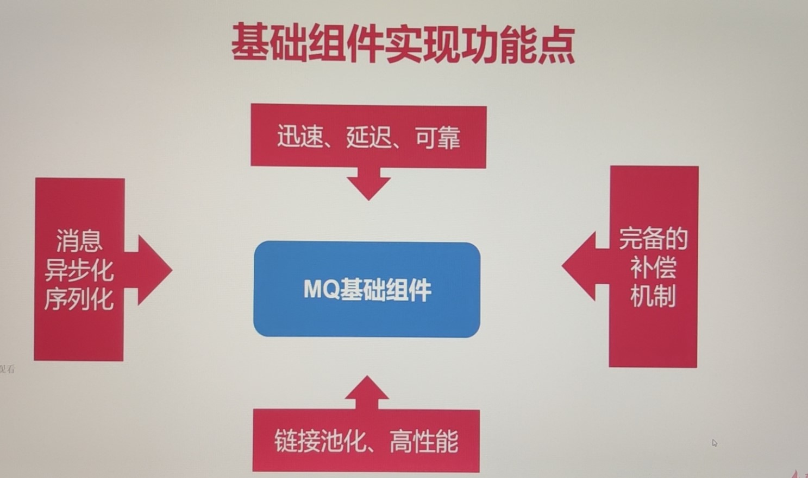
  
### 3-2 rabbitmq基础组件模块划分

新建项目rabbit-parent，github地址：https://github.com/depers/rabbit-parent

模块划分：

* rabbit-api：暴露给外面调用的api
* rabbit-common：公共组件
* rabbit-core-producer：核心代码，消息生产者
* rabbit-task：对**ElasticJob**的封装

### 3-3 rabbitmq基础组件api封装

1. cn.bravedawn.rabbit.api.Message：消息的封装
2. cn.bravedawn.rabbit.api.MessageType：消息的类型
3. cn.bravedawn.rabbit.api.MessageBuilder：消息的创建迟支持构建者模式
4. cn.bravedawn.rabbit.api.MessageProducer：消息发送的抽象定义
5. cn.bravedawn.rabbit.api.SendCallback：回调函数的抽象定义
6. cn.bravedawn.rabbit.api.MessageListener：消费者监听的抽象定义

### 3-5 自动装配与架构接口定义

1. 补充rabbit-common和rabbit-core-producer的pom依赖
2. 添加Spring自动装配的实现

### 3-6 发送迅速异步消息

1. cn.bravedawn.rabbit.producer.broker.ProducerClient：编写消息发送的客户端
2. cn.bravedawn.rabbit.producer.broker.RabbitBroker：具体发送不同种类型消息抽象定义
3. cn.bravedawn.rabbit.producer.broker.RabbitBrokerImpl：不同类型消息发送的实现类
4. cn.bravedawn.rabbit.producer.broker.AsyncBaseQueue：异步消息线程池封装

### 3-7 rabbittemplate池化封装

类cn.bravedawn.rabbit.producer.broker.RabbitBrokerImpl中：

```java
@Autowired
private RabbitTemplate rabbitTemplate;
```

我们在这里注入了RabbitTemplate，但是问题就出在这里了。这里注入的rabbitTemplate他是一个单例对象，但是RabbitTemplate他有大量的属性可以定制，比如我们要发送return消息或是confirm消息、修改routingKey以及一些个性化的设置。如果这样使用单例，他的性能就很慢。

所以我们需要针对RabbitTemplate做一个池化操作。这个我们可以以Message的topic属性为key，一个topic就对应一个RabbitTemplate，做池化之后**就可以多生产者去发送，提高性能**。

总结一下，做池化的原因：

1. 单例的RabbitTemplate，只有一个生产者去发送，性能不高
2. RabbitTemplate有自己个性化的配置

关于池化的具体实现参考：cn.bravedawn.rabbit.producer.broker.RabbitTemplateContainer

### 3-8 序列化与反序列化转换封装

#### 1. 在rabbit-common下的改动

1. cn/bravedawn/rabbit/common/serializer：封装序列化和反序列的接口和实现，其中涉及到了工厂模式的使用。
2. cn/bravedawn/rabbit/common/convert：封装了消息的转换逻辑，有一般实现和增强实现。其中涉及到了代理模式的使用。

#### 2. 在rabbit-core-producer下的改动

cn.bravedawn.rabbit.producer.broker.RabbitTemplateContainer设置消息转换逻辑：

```java
// 添加序列化反序列化和converter对象
Serializer serializer = serializerFactory.create();
GenericMessageConverter gmc = new GenericMessageConverter(serializer);
RabbitMessageConverter rmc = new RabbitMessageConverter(gmc);
newRabbitTemplate.setMessageConverter(rmc);
```

### 3-9 确认消息实现

在rabbit-core-producer中：

1. 编写cn.bravedawn.rabbit.producer.broker.RabbitBrokerImpl#confirmSend
2. 编写cn.bravedawn.rabbit.producer.broker.RabbitTemplateContainer#getTemplate，确认消息的逻辑

### 3-11 可靠性投递落地-集成数据源

#### 1. rabbit-common添加数据库操作依赖

```xml
<dependency>
    <groupId>org.springframework.boot</groupId>
    <artifactId>spring-boot-starter-jdbc</artifactId>
    </dependency>
<dependency>
    <groupId>org.mybatis.spring.boot</groupId>
    <artifactId>mybatis-spring-boot-starter</artifactId>
    <version>1.1.1</version>
</dependency>
<dependency>
    <groupId>com.alibaba</groupId>
    <artifactId>druid</artifactId>
    <version>1.1.10</version>
</dependency>
<dependency>
    <groupId>mysql</groupId>
    <artifactId>mysql-connector-java</artifactId>
</dependency>
```

#### 2. 数据源配置

参考：cn.bravedawn.rabbit.producer.config.database.DataSourceConfiguration

#### 3. 项目启动初始化数据库脚本

参考：cn.bravedawn.rabbit.producer.config.database.DataInitializerConfiguration

#### 4. Mybatis xml文件解析配置

参考：cn.bravedawn.rabbit.producer.config.database.MybatisConfiguration

#### 5.  Mybatis包扫描配置

参考：cn.bravedawn.rabbit.producer.config.database.MybatisMapperScanerConfig

### 3-12 可靠性投递落地-可靠性消息业务实现落地

这一节的具体实现思路参照2-11中消息落库，对消息状态进行打标的方案进行实现。

消息落库，对消息状态进行打标


1. 发送可靠消息：cn.bravedawn.rabbit.producer.broker.RabbitBrokerImpl#reliantSend

2. 消息回调确认添加可靠性消息的逻辑：cn.bravedawn.rabbit.producer.broker.RabbitTemplateContainer#confirm

   ```java
   // 	如果当前消息类型为reliant 我们就去数据库查找并进行更新
   if(MessageType.RELIANT.endsWith(messageType)) {
   	messageStoreService.success(messageId);
   }
   ```

3. 消息落库的service：cn.bravedawn.rabbit.producer.service.MessageStoreService

### 3-13 可靠性投递落地-esjob定时任务讲解-1

1. 新建es-job项目，配置maven

   ```xml
   <!--  elastic-job dependency -->
   <dependency>
       <groupId>com.dangdang</groupId>
       <artifactId>elastic-job-lite-core</artifactId>
       <version>${elastic-job.version}</version>
   </dependency>
   <dependency>
       <groupId>com.dangdang</groupId>
       <artifactId>elastic-job-lite-spring</artifactId>
       <version>${elastic-job.version}</version>
   </dependency>
   ```

2. 安装zookeeper，这里安装到了192.168.156.135上，具体的安装教程可以参考：https://blog.csdn.net/qq_43193386/article/details/114195210

3. 加载zookeeper相关配置，把注册中心加载到spring容器中，具体实现参考：cn.bravedawn.esjob.config.RegistryCenterConfig

4. 作业事件配置：cn.bravedawn.esjob.config.JobEventConfig

5. 简单任务配置：cn.bravedawn.esjob.config.SimpleJobConfig

6. 简单任务监听：cn.bravedawn.esjob.listener.SimpleJobListener

7. 编写一个简单任务：cn.bravedawn.esjob.task.MySimpleJob，**这一节重要讲了SimpleJob的使用**。

8. 启动项目，运行效果如下：

   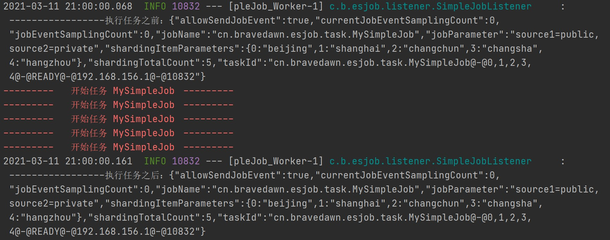

### 3-14 可靠性投递落地-esjob定时任务讲解-2

这一节主要介绍了elastic-job-lite-console的使用和界面介绍。

### 3-15 可靠性投递落地-esjob定时任务讲解-3

这一节主要讲了DataflowJob流式job的工作原理。

1. 配置流式job的相关参数：cn.bravedawn.esjob.config.DataflowJobConfig

2. 编写流式处理job：cn.bravedawn.esjob.task.SpringDataflowJob

3. 运行：

   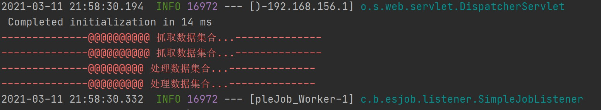

### 3-16 定时任务通用组件封装-1

1. 在rabbit-task/pom.xml中添加依赖
2. 编写注册中心相关配置：cn.bravedawn.rabbit.task.autoconfigure.JobZookeeperProperties
3. 编写自动装配类：rabbit-task/src/main/java/cn/bravedawn/rabbit/task/autoconfigure/JobParserAutoConfiguration.java

### 3-17 定时任务通用组件封装-2

1. 编写启用elasticJob的注解：

   ```java
   @Retention(RetentionPolicy.RUNTIME)
   @Target(ElementType.TYPE)
   @Documented
   @Inherited
   @Import(ElasticsearchAutoConfiguration.class)
   public @interface EnableElasticJob {
   }
   ```

2. 编写elasticJob相关配置注解：cn.bravedawn.rabbit.task.annotation.ElasticJobConfig

### 3-18 定时任务通用组件封装-3

1. 声明配置解析Bean：cn.bravedawn.rabbit.task.autoconfigure.JobParserAutoConfiguration

2. 编写配置解析逻辑：cn.bravedawn.rabbit.task.parser.ElasticJobConfParser

   这里涉及到Spring事件的相关知识点。

### 3-19 定时任务通用组件封装-4

1. 参照原有的简单任务的配置：cn.bravedawn.esjob.config.SimpleJobConfig，分别有五步：
   * 添加自己的真实的任务实现类
   * 添加注册中心
   * 添加liteJobConfiguration
   * 如果有eventTraceRdbDataSource，则也进行添加
   * 添加监听
2. 主要接续逻辑：cn.bravedawn.rabbit.task.parser.ElasticJobConfParser#onApplicationEvent
3. 这一节中涉及到了Spring IOC的相关知识。

### 3-20 定时任务通用组件封装-5

测试Rabbit-task对elastic-job的封装，这里使用的是[es-job项目](https://github.com/depers/es-job)，该项目的代码可参见：

1. 注释原有cn/bravedawn/esjob/config下的测试代码

2. 在启动类中添加Spring的包扫描路径，并添加`@EnableElasticJob`注解

3. 编写测试job：cn.bravedawn.esjob.task.MySimpleJob2

4. 启动运行：

   

### 3-21 可靠性消息重试实现集成定时任务组件-1

1. 在rabbit-core-producer的pom文件中引入rabbit-task依赖：

   ```xml
   <dependency>
       <groupId>cn.bravedawn</groupId>
       <artifactId>rabbit-task</artifactId>
       <version>1.0-SNAPSHOT</version>
   </dependency>
   ```

2. 在cn.bravedawn.rabbit.producer.autoconfigure.RabbitProducerAutoConfiguration中添加：

   ```java
   @EnableElasticJob
   @ComponentScan("cn.bravedawn.rabbit.producer.*")
   ```

3. 在rabbit-common项目中添加mybatis的类型处理器：cn.bravedawn.rabbit.common.mybatis.handler.MessageJsonTypeHandler

4. 编写可靠性消息补偿任务：cn.bravedawn.rabbit.producer.task.RetryMessageDataflowJob

### 3-22 可靠性消息重试实现集成定时任务组件-2

1. 完成可靠性补偿任务：cn.bravedawn.rabbit.producer.task.RetryMessageDataflowJob

### 3-23 可靠性消息最终演示

1. 演示成功案例：cn.bravedawn.rabbit.ApplicationTest#testProductClientSuccess
2. 演示失败案例并重试三次：cn.bravedawn.rabbit.ApplicationTest#testProductClientFailure

### 3-24 批量消息发送封装

1. 借助ThreadLocal缓存消息数组：cn.bravedawn.rabbit.producer.broker.MessageHolder
2. 编写批量发送消息的线程池：cn.bravedawn.rabbit.producer.broker.MessageHolderAsyncQueue
3. 实现批量发送消息：cn.bravedawn.rabbit.producer.broker.RabbitBrokerImpl#sendMessages

### 3-25 延迟消息应用与封装

本章延迟消息的发送依赖于RabbitMQ的延迟插件去实现。

1. 查看已安装的插件：`rabbitmq-plugins list`

2. 下载延迟消息插件：http://www.rabbitmq.com/community-plugins.html，并把插件放到/usr/lib/rabbitmq/lib/rabbitmq_server-3.8.11/plugins

3. 启用插件：`rabbitmq-plugins enable rabbitmq_delayed_message_exchange`

4. 访问`http://192.168.156.135:15672/`，可以看到交换机类型叫：x-delayed-message

   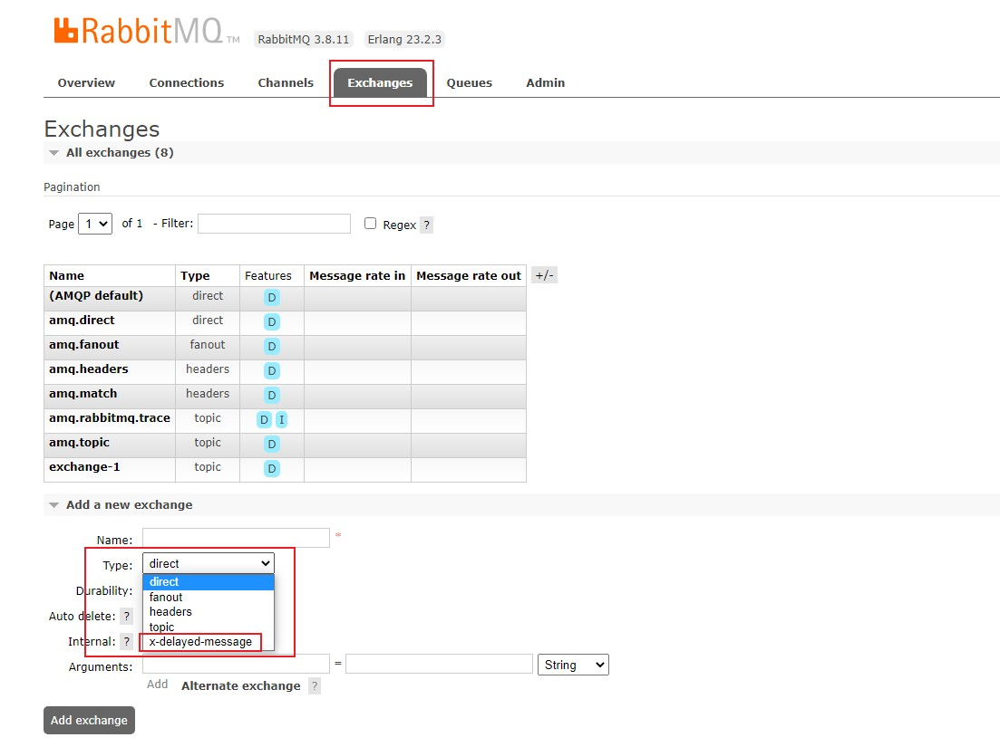

5. 添加交换机，注意下面的type和Arguments是必填的

   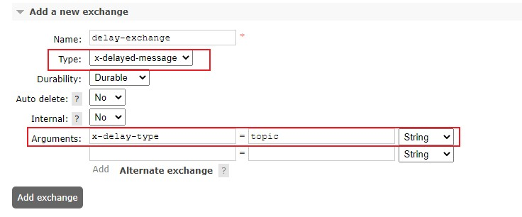

6. 添加成功后如下图：

   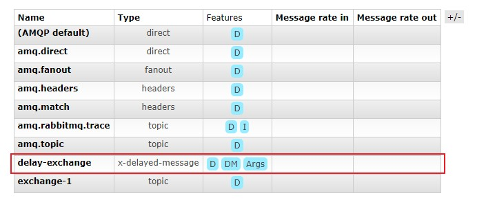

7. 新建队列并与exchange关联

   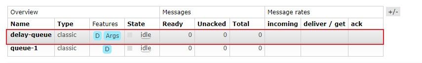

   将队列delay-queue绑定到delay-exchange：

   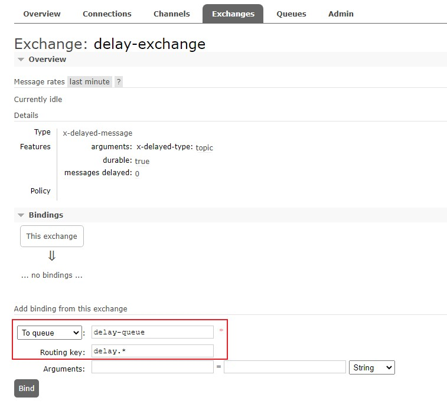

8. 模拟发送一条消息，Headers里面是配置延迟消息的时间，单位ms，延迟15后发送：

   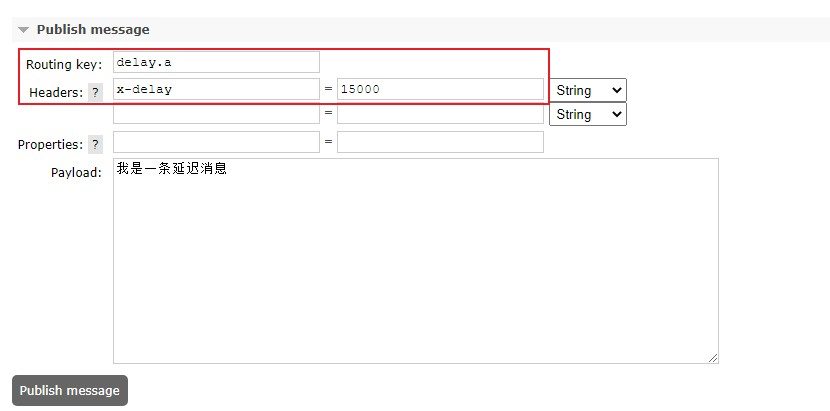

   15s后查看delay-queue发现就会一条记录：

   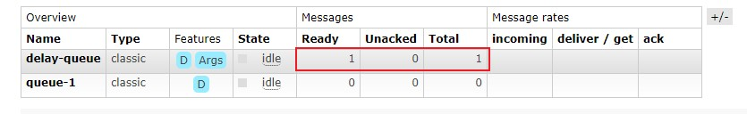

9. 在代码中实现延迟消息，在消息的格式转化时，cn.bravedawn.rabbit.common.convert.RabbitMessageConverter#toMessage如下：

   ```java
   // 设置延时时间
   messageProperties.setDelay(msg.getDelayMills());
   return this.delegate.toMessage(object, messageProperties);
   ```


### 3-26 总结与复习

参考：rabbit-core-producer/src/main/resources/document/3-26 总结与复习.pdf

### 3-27 本周作业练习

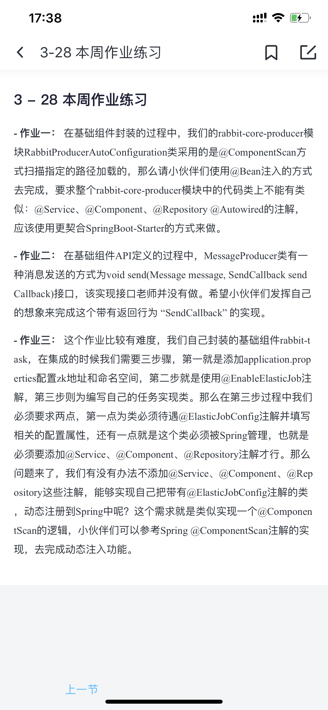