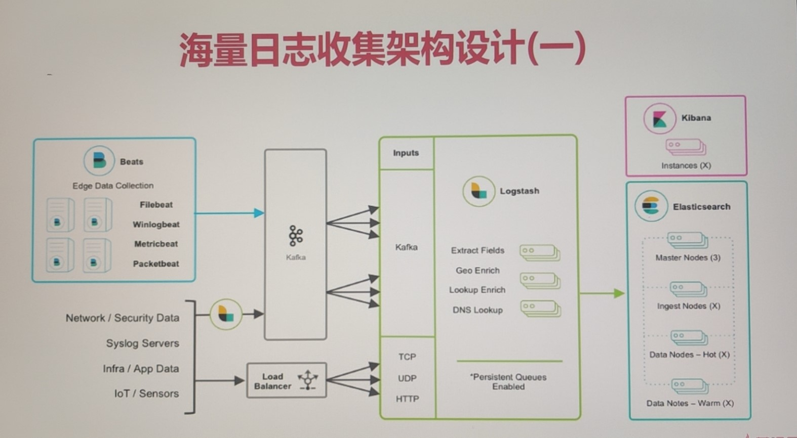
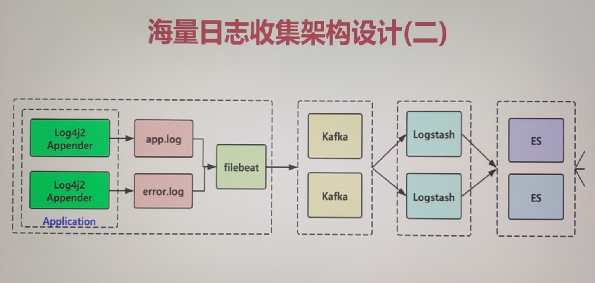
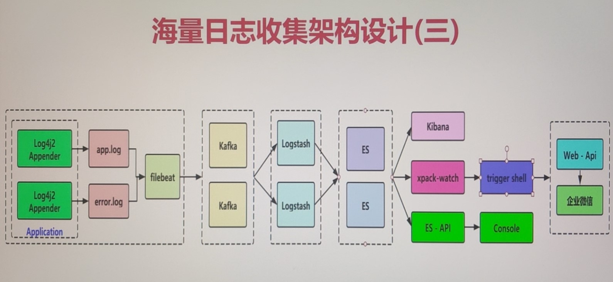

## 5. Kafka海量日志收集实战架构设计

### 1-1 本章导航

* Kafka核心概念、设计、应用场景
* Kafka环境搭建、急速入门
* 与Spring Boot整合实战
* Kafka高吞吐量核心实战
  * 日志收集设计
  * 日志输出（日志组件输出log4j2）
  * 日志收集（FileBeat）
  * 日志过滤（logstash）
  * 日志持久化（elasticsearch）
  * 日志可视化（kibana）
* 分布式日志收集、链路追踪、监控告警平台架构讲解

### 1-4 Kafka与springboot整合_生产者讲解

1. 新建项目：mall-kafka，包含两个子项目：kafka-producer和kafka-consumer。本节主要介绍kafka-producer。

2. 配置mall-kafka项目pom

3. 配置kafka-producer的application.properties文件

   这里涉及到了一个kafka的核心配置，kafka生产端消息确认（持久化）配置

   ```properties
   # acks=0：生产者在成功写入消息之前不会等待任何来自服务器的响应。不做任何等待，把消息发送过去就完了
   # acks=1（推荐）：只要集群的首领节点收到消息，生产者就会收到一个来自服务器成功响应，生产者就认为消息投递成功了
   # acks=-1：表示分区leader必须等待消息被成功写入到所有的ISR副本(同步副本)中才认为producer请求成功。这种方案提供最高的消息持久性保证，但是理论上吞吐率也是最差的。
   # 这个配置可以参考：https://blog.csdn.net/zp17834994071/article/details/108113578
   ## 	这个是kafka生产端最重要的选项
   spring.kafka.producer.acks=1
   ```

   上面有几个概念需要我声明一下：

   * 分区leader：一个分区里面会有多个副本（replica，或者是Follower）和一个从副本中选举的leader
   * 分区：Partition
   * ISR副本：ISR(In-Sync Replica)：是Replicas的一个子集，表示目前Alive且与Leader能够“Catch-up”的Replicas集合。也就是保持同步的副本，他的含义就是，跟Leader始终保持同步的Follower有哪些。

   下面是我对以上三个配置的理解：

   * acks=0：生产者直接发就行，不管消息是否同步完成。
   * acks=1：只要Partition Leader接收到消息而且写入本地磁盘了，就认为成功了。leader就会发确认应答。
   * acks=-1：Partition Leader接收到消息之后，还必须要求ISR列表里跟Leader保持同步的那些Follower都要把消息同步过去，才能认为这条消息是写入成功了。

4. 编写kafka发送消息的service：cn.bravedawn.kafka.producer.KafkaProducerService

### 1-5 Kafka与springboot整合_消费者讲解

1. 编辑kafka-consumer的application.properties：kafka-consumer/src/main/resources/application.properties

2. 编辑消息消费者：cn.bravedawn.kafka.consumer.KafkaConsumerService

3. 在kafka-producer中编写测试案例：cn.bravedawn.producer.KafkaProducerTest

4. 通过以下命令对Kafka的topic和partition进行查看和操作：

   * 创建topic主题命令（创建名为test的topic， 1个分区分别存放数据，数据备份总共1份）：

     ```shell
     ./kafka-topics.sh --zookeeper 192.168.156.135:2181 --create --topic test --partitions 1 --replication-factor 1
     
     ## --zookeeper 为zk服务列表
     ## --create 命令后 --topic 为创建topic 并指定 topic name
     ## --partitions 为指定分区数量
     ## --replication-factor 为指定副本集数量
     ```

   * 查看topic列表命令：

     ```shell
     ./kafka-topics.sh --zookeeper 192.168.156.135:2181 --list
     ```

   * kafka查看消费进度：（当我们需要查看一个消费者组的消费进度时，则使用下面的命令。注意运行该命令之前先运行mall-consumer创建group）

     ```shell
     ./kafka-consumer-groups.sh --bootstrap-server 192.168.156.135:9092 --describe --group group01
     
     ## --bootstrap-server 连接的kafka服务器
     ## --describe 指定是展示详细信息命令
     ## --group 指定客户端监听的群组id
     ```

   * kafka命令发送数据：（然后我们就可以编写数据发送出去了）

     ```shell
     ./kafka-console-producer.sh --broker-list 192.168.156.135:9092 --topic test
     ```

   * kafka命令接受数据：（然后我们就可以看到消费的信息了）

     ```shell
     kafka-console-consumer.sh --bootstrap-server 192.168.156.135:9092 --topic test --from-beginning
     ```

   * 删除topic命令：

     ```shell
     kafka-topics.sh --zookeeper 192.168.156.135:2181 --delete --topic test
     ```

5. 测试

   *  分别在192.168.156.135上启动zookeeper和Kafka
   * 启动kafka-consumer
   * 启动kafka-producer的测试案例：cn.bravedawn.producer.KafkaProducerTest

## 第二章 Kafka海量日志收集实战
### 2-1 架构设计讲解

其中引入Kafka的背景：

为保证日志传输数据的可靠性和稳定性，引入Kafka作为消息缓冲队列，FileBeat先将数据传递给消息队列，接着，Logstash server（Logstash，主要用来拉取消息队列数据，过滤并分析数据）将格式化的数据传递给Elasticsearch进行存储。最后，由Kibana将日志和数据呈现给用户。由于引入了Kafka缓冲机制，即使远端Logstash server因故障停止运行，数据也不会丢失，可靠性得到了大大的提升。

该架构优点在于引入了消息队列机制，提升日志数据的可靠性，但依然存在Logstash占用系统资源过多的问题，在海量数据应用场景下，可能会出现性能瓶颈。

此架构适合大型集群、海量数据的业务场景，它通过将前端Logstash Agent替换成Filebeat，有效降低了收集日志对业务系统资源的消耗。同时，消息队列使用kafka集群架构，有效保障了收集数据的安全性和稳定性，而后端Logstash和Elasticsearch均采用集群模式搭建，从整体上提高了ELK系统的高效性、扩展性和吞吐量。





最终实现的设计如下：



### 2-2 Log4j2日志输出实战

1. 新建项目collector：cn.bravedawn.collector.controller.IndexController

   * cn.bravedawn.collector.controller.IndexController#index：演示日志格式
   * cn.bravedawn.collector.controller.IndexController#err：打印错误日志

2. 配置pom文件

   一定要配置disruptor，log4j2依赖于disruptor：

   ```xml
   <dependency>
   	<groupId>com.lmax</groupId>
   	<artifactId>disruptor</artifactId>
   	<version>3.3.4</version>
   </dependency>
   ```

3. 配置application.properties文件

4. 配置log4j2.xml文件：log-collector/src/main/resources/log4j2.xml

5. 解析PatternLayout

   ```
   [%d{yyyy-MM-dd'T'HH:mm:ss.SSSZZ}]
   [%level{length=5}]
   [%thread-%tid]
   [%logger]
   [%X{hostName}]
   [%X{ip}]
   [%X{applicationName}]
   [%F,%L,%C,%M]
   [%m]
   ## '%ex'%n
   -------------------------------------------
   [2021-03-31T22:46:25.619+08:00]
   [ERROR]
   [http-nio-8001-exec-2-29]
   [cn.bravedawn.collector.controller.IndexController]
   [] [] []
   [IndexController.java,70,cn.bravedawn.collector.controller.IndexController,err]
   [算术异常]
   ## ' java.lang.ArithmeticException: / by zero
   	at cn.bravedawn.collector.controller.IndexController.err(IndexController.java:68)
   ```

6. MDC的使用

   具体写法参见：cn.bravedawn.collector.util.InputMDC

   ```log
   [2021-04-04T20:53:46.221+08:00] [INFO] [http-nio-8001-exec-1-27] [cn.bravedawn.collector.controller.IndexController]
               [DESKTOP-HCSNSE1] [192.168.230.1] [collector] [IndexController.java,89,cn.bravedawn.collector.controller.IndexController,mdc] [我是一条有mdc的info日志] ## ''
   ```

7. 编写Controller方法，测试日志
   * 正常日志输出：cn.bravedawn.collector.controller.IndexController#index
   * 错误日志输出：cn.bravedawn.collector.controller.IndexController#err
   * MDC日志输出：cn.bravedawn.collector.controller.IndexController#mdc

### 2-3 Filebeat日志收集实战

1. Filebeat安装入门

   具体安装参见**Java web环境配置**，这里安装的服务器是192.168.156.135。

配置文件

实战应用

对接Kafka

### 2-4 Logstash日志过滤实战

logstash安装入门

ELK环境搭建

logstash基础语法

实战应用

### 2-5 elasticsearch & kibana存储可视化实战

ElasticSearch索引创建周期、命名规范选择

Kibana控制台应用、可视化日志

监控和告警

* Watcher作用介绍和基本使用
* Watcher API详解
* Watcher实战监控告警

### 2-6 watcher监控告警实战

