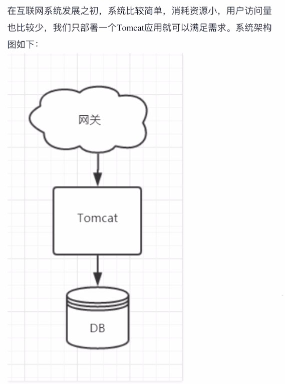
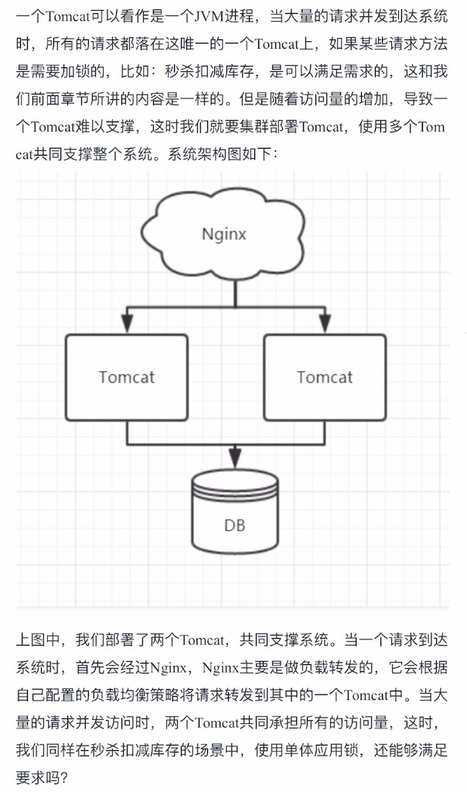
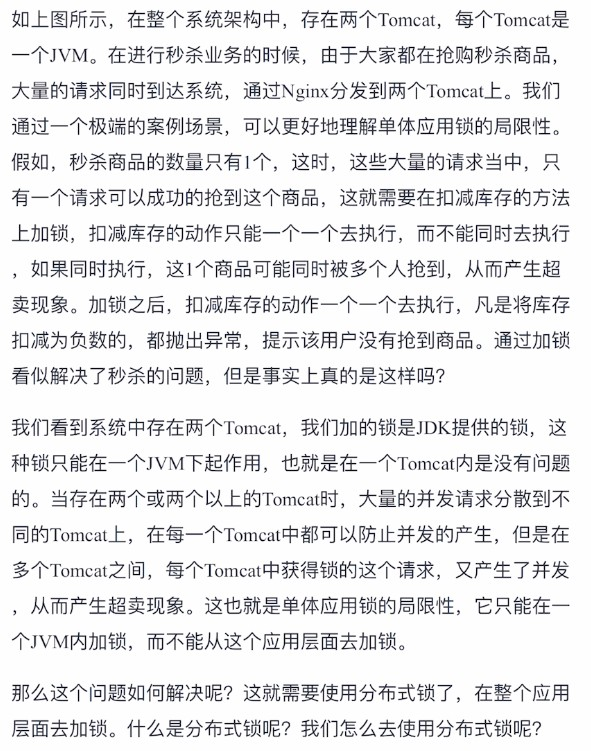
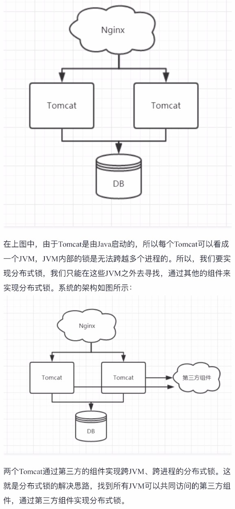
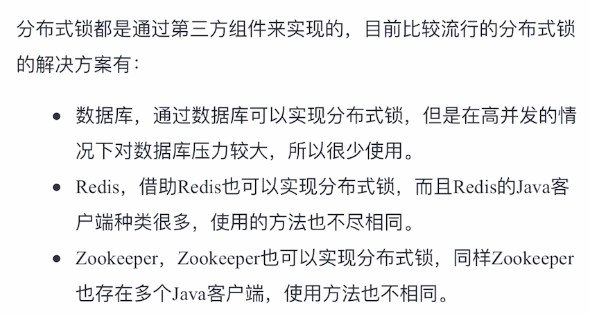
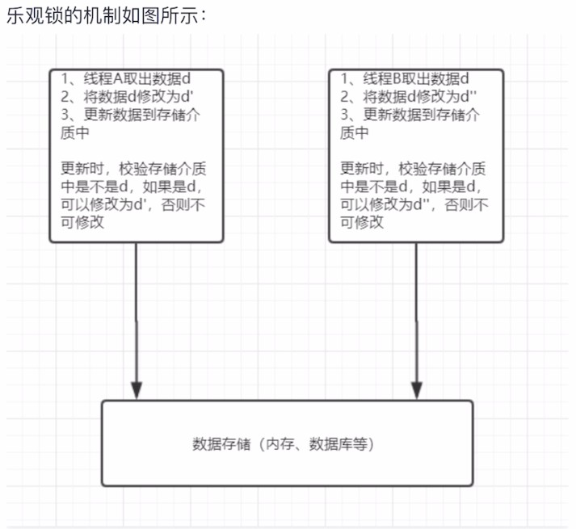
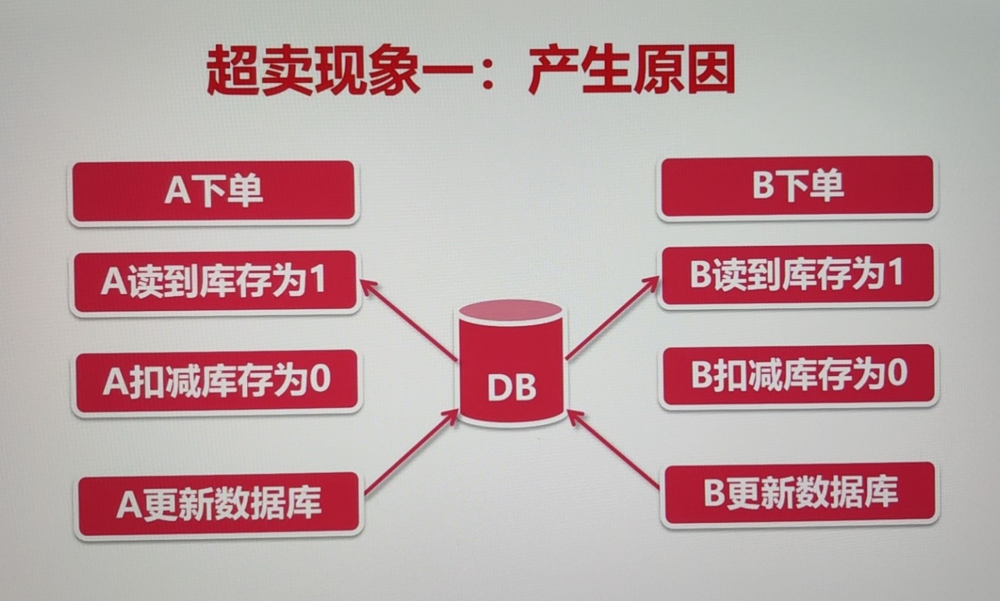

# 6.并发和分布式锁

## 第一章 认识锁

### 1. 什么是锁

* 定义：锁（Lock）或互斥（mutex）是一种同步机制，用于在有许多执行线程的环境中强制对资源的访问控制。锁旨在强制实施互斥排他、并发控制策略。

* 场景：假设我们去超市买东西，需要寄存自己的东西到储物柜。假如有3个人，但是储物柜只有1个，大家同时要往这个柜子里面放东西，这个场景就构造了一个多线程竞争的案例。

  1. 我们先创建一个柜子的类，假设柜子中存储的物品就是数字。

     ```java
     /**
      * @author : depers
      * @program : mybatis
      * @description: 柜子，柜子中存储的是数字
      * @date : Created in 2021/4/26 20:38
      */
     public class Cabinet {
     
         // 存储在柜子里面的数字
         private int storeNumber;
     
         public void setStoreNumber(int storeNumber) {
             this.storeNumber = storeNumber;
         }
     
         public int getStoreNumber() {
             return this.storeNumber;
         }
     }
     ```

  2. 抽象用户，这里同时有3个人

     ```java
     /**
      * @author : depers
      * @program : mybatis
      * @description: 用户
      * @date : Created in 2021/4/26 20:40
      */
     public class User {
     
         // 柜子
         private Cabinet cabinet;
     
         // 存储的数字
         private int storeNumber;
     
         public User(Cabinet cabinet, int storeNumber) {
             this.cabinet = cabinet;
             this.storeNumber = storeNumber;
         }
     
         public void useCabinet() {
             cabinet.setStoreNumber(storeNumber);
         }
     }
     ```

  3. 创建一个启动类，来模拟三个人竞争储物柜的场景

     ```java
     /**
      * @author : depers
      * @program : mybatis
      * @description: 启动类，模拟抢盘子
      * @date : Created in 2021/4/26 20:42
      */
     public class Starter {
     
         public static void main(String[] args) {
             // 创建一个柜子实例，因为只有一个柜子
             Cabinet cabinet = new Cabinet();
     
             // 新建一个线程池，有三个线程模拟三个用户
             ExecutorService es = Executors.newFixedThreadPool(3);
     
             // 测试不加同步控制
             testSimple(es, cabinet);
     
             // 添加同步控制
             // testSync(es, cabinet);
     
             es.shutdown();
         }
     
     
         static void testSimple(ExecutorService es, Cabinet cabinet) {
             for (int i = 0; i < 3; i++) {
                 final int storeNumber = i;
                 es.execute(()->{
                     User user = new User(cabinet, storeNumber);
                     user.useCabinet();
                     System.out.println("我是用户" + storeNumber + ", 我存储的数字是：" + cabinet.getStoreNumber());
                 });
             }
         }
     
         static void testSync(ExecutorService es, Cabinet cabinet) {
             for (int i = 0; i < 3; i++) {
                 final int storeNumber = i;
                 es.execute(()->{
                     synchronized (cabinet) {
                         User user = new User(cabinet, storeNumber);
                         user.useCabinet();
                         System.out.println("我是用户" + storeNumber + ", 我存储的数字是：" + cabinet.getStoreNumber());
                     }
                 });
             }
         }
     
     }
     ```

     执行`testSample`方法，效果如下。这种情况下因为三个线程同步执行，三个用户同时去储物柜放东西，但是储物柜里面只能放一件东西，导致打印出了数字其实是最后一个线程所设置的值，因为三个线程同时持有一个柜子，所以打印出的结果是一样的。

     ```
     我是用户2, 我存储的数字是：0
     我是用户1, 我存储的数字是：0
     我是用户0, 我存储的数字是：0
     ```

     就需要锁去控制，怎么解决这个问题呢？Java中有一个关键字`synchronized`，他可以放在代码块或是方法上，这个关键字表示只有获得锁的线程才能执行这个代码块或是方法。因为在这个场景中Cabinet是一个临界资源（竞争资源），所以我们使用`synchronized`代码块来做这件事。

     执行`testSync`方法，效果如下：

     ```java
     我是用户0, 我存储的数字是：0
     我是用户1, 我存储的数字是：1
     我是用户2, 我存储的数字是：2
     ```

     当线程一获得锁时，其他线程就只能等待，所以上面的打印结果是合适的。

### 2. Java中单体应用锁的局限性&分布式锁

#### 1. 互联网架构的演进






#### 2. 单体应用锁的局限性



#### 3. 什么是分布式锁


#### 4. 分布式锁的设计思路



#### 5. 目前存在的分布式的方案



### 3. Java中锁的解决方案

#### 1. 乐观锁和悲观锁

* 乐观锁

  在更新数据库操作时，我们往往会进行如下步骤：

  1. 在检索数据时，将数据的版本号（version）或者最后的更新时间一并检索出来；
  2. 操作员更改数据之后，点击保存，在数据库中执行update操作；
  3. 在执行update操作时，用步骤1检索出来的版本号或者最后更新时间与数据库中的记录作比较；
  4. 如果版本号或最后更新时间一致，则可以更新；
  5. 如果不一致，就提示用户：”您修改的数据已被他人修改过，请重新查询确认“；

  上述流程就是乐观锁的实现方式。
  
  给一个乐观锁的定义：假设一个线程在读取数据的时候，该数据不会被其他线程修改。但是在更新数据的时候会校验数据有没有被修改过。
  
  在Java中，它是一种比较交换的机制，简称CAS（Compare And Swap）机制。
  
  该机制中，一旦检测到有冲突产生，也就是上面说到的版本号或者最后更新时间不一致，他就会进行重试，知道没有冲突为止。
  
  
  
  案例一：线程不安全的计数：
  
  ```java
  /**
   * @author : depers
   * @program : mybatis
   * @description: i++测试
   * @date : Created in 2021/4/26 21:57
   */
  public class IPlusPlusExample {
  
      private int i = 0;
  
      public static void main(String[] args) {
  
          IPlusPlusExample example = new IPlusPlusExample();
  
          // 线程池：50个线程
          ExecutorService es = Executors.newFixedThreadPool(50);
  
          // 闭锁
          CountDownLatch cdl = new CountDownLatch(5000);
          for (int i = 0; i < 5000; i++) {
              es.execute(() -> {
                  example.i++;
                  cdl.countDown();
              });
          }
          es.shutdown();
  
          try{
              // 等待5000个任务执行完成后，打印出执行结果
              cdl.await();
              System.out.println("执行完成后，i=" + example.i);
          } catch (InterruptedException e) {
              e.printStackTrace();
          }
      }
  }
  ```
  
  案例二：使用原子类实现乐观锁
  
  ```java
  /**
   * @author : depers
   * @program : mybatis
   * @description: i++测试，使用AtomicInteger实现乐观锁
   * @date : Created in 2021/4/26 21:57
   */
  public class IPlusPlusExample2 {
  
      private AtomicInteger i = new AtomicInteger(0);
  
      public static void main(String[] args) {
  
          IPlusPlusExample2 example = new IPlusPlusExample2();
  
          // 线程池：50个线程
          ExecutorService es = Executors.newFixedThreadPool(50);
  
          // 闭锁
          CountDownLatch cdl = new CountDownLatch(5000);
          for (int i = 0; i < 5000; i++) {
              es.execute(() -> {
                  example.i.incrementAndGet();
                  cdl.countDown();
              });
          }
          es.shutdown();
  
          try{
              // 等待5000个任务执行完成后，打印出执行结果
              cdl.await();
              System.out.println("执行完成后，i=" + example.i);
          } catch (InterruptedException e) {
              e.printStackTrace();
          }
      }
  }
  ```
  
  案例三：使用`synchonized`实现悲观锁
  
  ```java
  /**
   * @author : depers
   * @program : mybatis
   * @description: i++测试，使用synchronized关键字实现悲观锁
   * @date : Created in 2021/4/26 21:57
   */
  public class IPlusPlusExample3 {
  
      private int i = 0;
  
      public static void main(String[] args) {
  
          IPlusPlusExample3 example = new IPlusPlusExample3();
  
          // 线程池：50个线程
          ExecutorService es = Executors.newFixedThreadPool(50);
  
          // 闭锁
          CountDownLatch cdl = new CountDownLatch(5000);
          for (int i = 0; i < 5000; i++) {
              es.execute(() -> {
                  synchronized (example) {
                      example.i++;
                  }
                  cdl.countDown();
              });
          }
          es.shutdown();
  
          try{
              // 等待5000个任务执行完成后，打印出执行结果
              cdl.await();
              System.out.println("执行完成后，i=" + example.i);
          } catch (InterruptedException e) {
              e.printStackTrace();
          }
      }
  }
  
  ```
  
  案例四：使用`ReentrantLock`实现悲观锁
  
  ```java
  /**
   * @author : depers
   * @program : mybatis
   * @description: i++测试，使用ReentrantLock实现悲观锁
   * @date : Created in 2021/4/26 21:57
   */
  public class IPlusPlusExample4 {
  
      private int i = 0;
  
      // 添加了ReentrantLock锁
      Lock lock = new ReentrantLock();
  
      public static void main(String[] args) {
  
          IPlusPlusExample4 example = new IPlusPlusExample4();
  
          // 线程池：50个线程
          ExecutorService es = Executors.newFixedThreadPool(50);
  
          // 闭锁
          CountDownLatch cdl = new CountDownLatch(5000);
          for (int i = 0; i < 5000; i++) {
              es.execute(() -> {
                  example.lock.lock();
                  example.i++;
                  example.lock.unlock();
                  cdl.countDown();
              });
          }
          es.shutdown();
  
          try{
              // 等待5000个任务执行完成后，打印出执行结果
              cdl.await();
              System.out.println("执行完成后，i=" + example.i);
          } catch (InterruptedException e) {
              e.printStackTrace();
          }
      }
  }
  ```

### 4. Redission介绍


## 第二章 锁实战

实战项目：https://github.com/depers/mall/tree/master/distribute/demo

### 1. 使用锁解决电商中的超卖

#### 什么是超卖

* 举例：某件商品库存数量10件，结果卖出了15件
* 商品卖出的数量超出了库存数量
* 超卖导致商家没有商品发货、发货时间延长，买卖双方易发生纠纷

#### 超卖现象一

* 现象：

  * 系统中库存为1，但是产生了两笔订单。卖家在商品发货时，发现只有1件商品，但是有2笔订单
  * 假如商品只剩下最后1件，A和B同时看到这个商品，加入购物车，并同时提交订单，此时就会出现上述的超卖现象。参考代码：cn.bravedawn.demo.service.OrderService#createOrderV1

* 产生的原因：

  * 扣减库存的动作，在程序中进行，在程序中计算剩余库存

  * 在并发场景下，导致库存计算错误，如下图所示

    

* 解决的办法：

  * 扣减库存不在程序中进行，而是通过数据库
  * 向数据库传递库存增量，扣减1个库存，增量为-1
  * 在数据库update语句计算库存，通过update行锁解决并发

* 采用数据库行锁解决的效果：效果就是还是会生成5个订单，并且库存会减为-4。参考代码：cn.bravedawn.demo.service.OrderService#createOrderV2

#### 超卖现象二

结合超卖现象一的解决方法来看，由此产生了超卖的第二种现象

* 现象：

  * 系统中库存变为1
  * 卖家不知所措，询问平台客服

* 产生的原因：

  * 并发检验库存，造成库存充足的假象
  * update更新库存，导致库存变为负数

* 解决方法：

  * 校验库存，扣减库存统一加锁
  * 使之成为原子性的操作
  * 并发时，只有获得锁的线程才能校验、扣减库存
  * 扣减库存结束后，释放锁，确保库存不会扣成负数

* 技术实现：

  * 基于`Synchronized`锁解决超卖问题（最原始的锁）+ 声明式事务：

    

  * 

