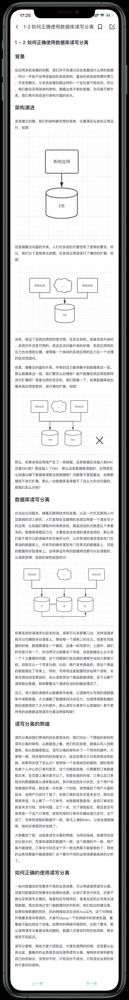
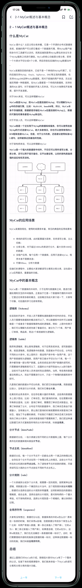
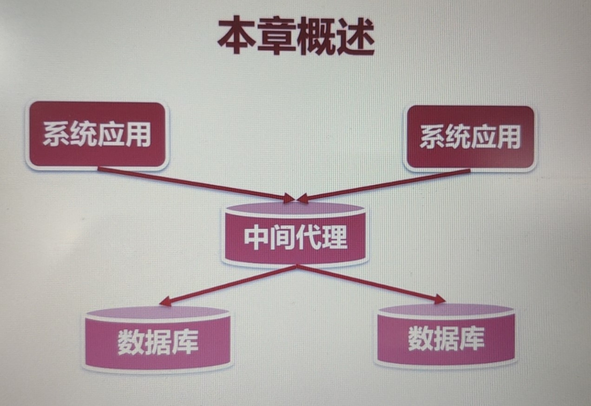
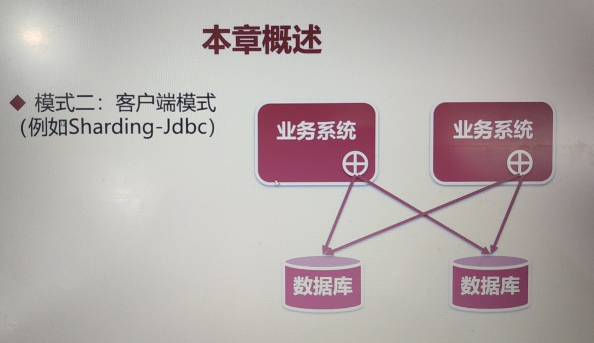
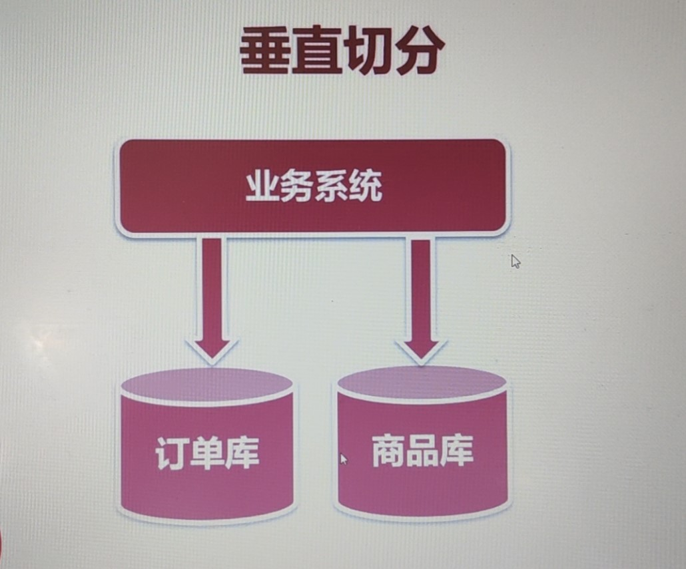
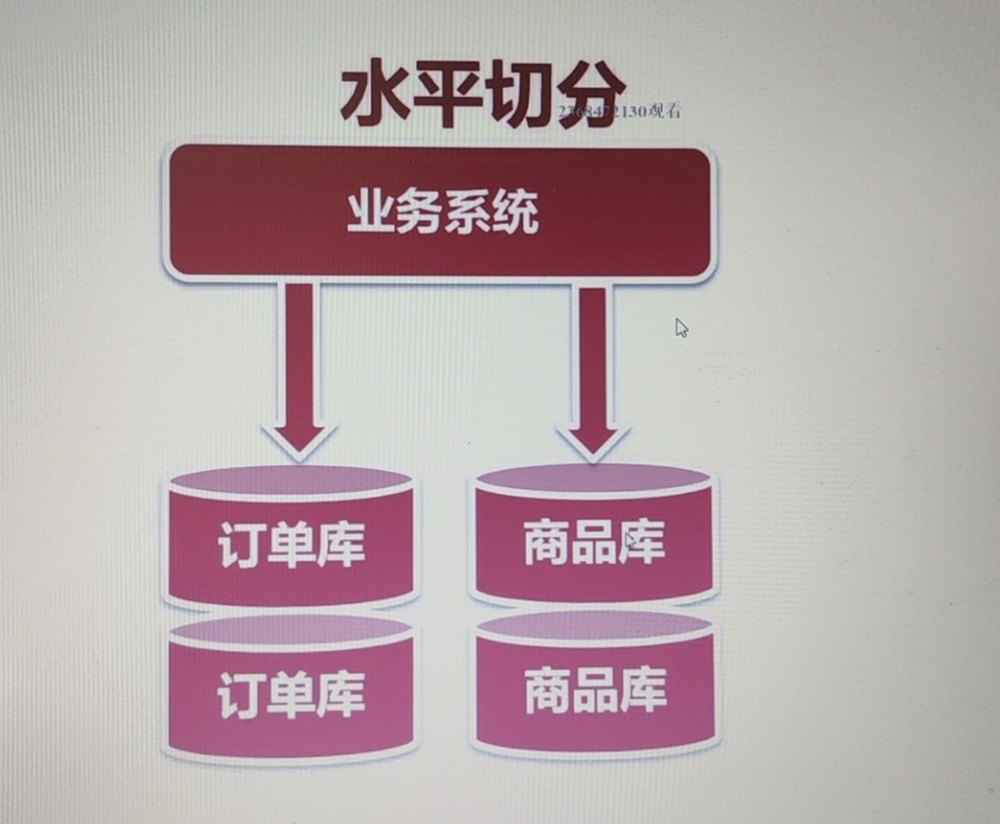
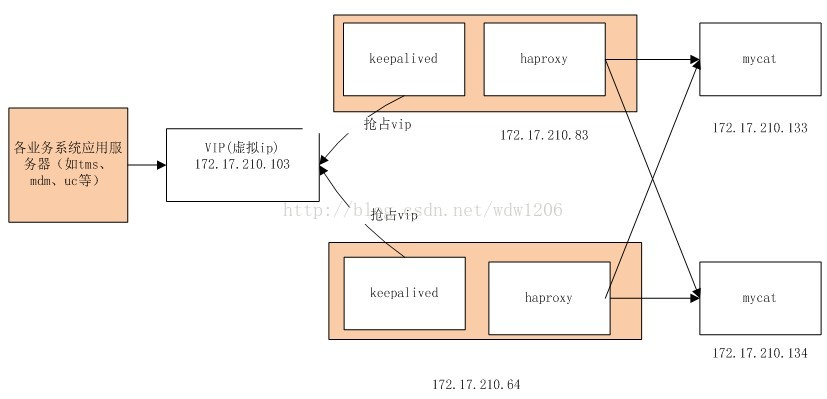
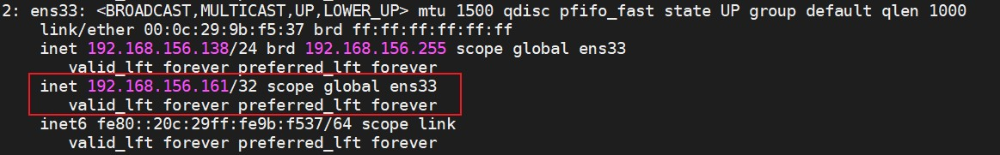
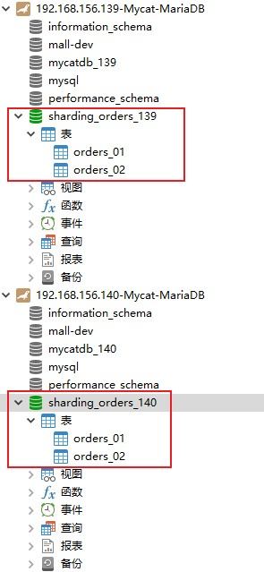

# 7.读写分离、分库分表

## 第一章 基础知识

### 1-1 海量数据的存储与访问瓶颈解决方案-数据切分


### 1-2 如何正确使用数据库读写分离



## 第二章 Mycat实战

### 2-1 MyCat概述与基本概念



### 2-2 分库分表概述

#### 1. 本章概述

* 互联网大数据时代，如何解决数据库性能瓶颈

* 读多写少的情况下，采用读写分离

* 海量数据的情况，采用数据切分

  * 数据切分方式一：垂直切分
  * 数据切分方式二：水平切分

* 实现读写分离和数据切分的两种模式

  * 模式一：中间层代理（例如：MyCat）

    

  * 模式二：客户端模式（例如：Sharding-Jdbc）

    

### 2-3  如何选择垂直切分、水平切分

#### 垂直切分

1. 切分规则：

   * 按照业务去切分
   * 每种业务一个数据库
   * 不同业务之间，禁止跨库join联查

2. 架构图

   

3. 优点

   * 拆分后业务清晰，拆分规则明确
   * 系统之间容易扩展和整合
   * 数据维护简单

4. 缺点

   * 部分业务表无法join，只能通过接口调用，提升系统的复杂度
   * 跨库事务难以处理
   * 垂直切分之后，某些业务数据过于庞大，仍然存在单体性能瓶颈

#### 水平切分

1. 切分规则

   * 将一张表的数据按照某种规则分到不同的数据库中

   * 需确定分片的规则

   * 使用分片字段查询时，可确定实体库。意思就是如果我是按照用户id进行的分片，这里的id就是分片字段，就可以确定去查那个库；

     使用其他字段查询时，要查询所有的表。意思是如果这个字段不是分片字段，我就要查所有的库，然后将他们的结果记性汇总返回；

2. 结构图

   

3. 优点

   * 解决了单库大数据、高并发的性能瓶颈
   * 拆分规则封装好，对应用端几乎透明，开发人员无需关系拆分细节
   * 提高了系统的稳定性和负载能力

4. 缺点

   * 拆分规则很难抽象
   * 分片事务一致性难以解决
   * 二次扩展时，数据迁移、维护难度大

#### 如何选择

先垂直后水平

### 2-4 MyCat-MySql安装

#### 1. MySQL的安装

关于MySQL的安装，我这里不再做赘述。在本案例中我们使用MariaDB代替

#### 2. MyCat的安装

1. 下载解压安装，这里我们使用的MyCat版本是1.6.7.3。切记一定要用这个版本，不然后面的流程会莫名报错。

2. 编辑conf/server.xml，配置MyCat用户

   ```xml
   <user name="root" defaultAccount="true">
   	<property name="password">123456</property>
   	<property name="schemas">user</property>
   	<property name="defaultSchema">user</property>
   </user>
   ```

3. 编辑schema.xml，这里我们使用的是`auto-sharding-long`算法进行分片

  ```xml
  <?xml version="1.0"?>
  <!DOCTYPE mycat:schema SYSTEM "schema.dtd">
  <mycat:schema xmlns:mycat="http://io.mycat/">
  
  	<schema name="u" checkSQLschema="true" sqlMaxLimit="100" randomDataNode="dn139">
  		<table name="user" primaryKey="id" dataNode="dn139,dn140" rule="sharding-by-intfile" autoIncrement="true" fetchStoreNodeByJdbc="true">
  		</table>
  	</schema>
  
  	<dataNode name="dn139" dataHost="db139" database="user_139" />
  	<dataNode name="dn140" dataHost="db140" database="user_140" />
  
  	<dataHost name="db139" maxCon="1000" minCon="10" balance="0"
  			  writeType="0" dbType="mysql" dbDriver="jdbc" switchType="1"  slaveThreshold="100">
  		<heartbeat>select user()</heartbeat>
  		<!-- can have multi write hosts -->
  		<writeHost host="M1" url="jdbc:mysql://192.168.156.139:3306" user="root"
  				   password="fx1212">
  		</writeHost>
  	</dataHost>
  
  	<dataHost name="db140" maxCon="1000" minCon="10" balance="0"
  			  writeType="0" dbType="mysql" dbDriver="jdbc" switchType="1"  slaveThreshold="100">
  		<heartbeat>select user()</heartbeat>
  		<!-- can have multi write hosts -->
  		<writeHost host="M1" url="jdbc:mysql://192.168.156.140:3306" user="root"
  				   password="fx1212">
  		</writeHost>
  	</dataHost>
  
  </mycat:schema>
  ```
  
4. 查看rule.xml

   ```xml
   <tableRule name="auto-sharding-long">
       <rule>
           <columns>id</columns>
           <algorithm>rang-long</algorithm>
       </rule>
   </tableRule>
   ```

   接着我们看下`rang-long`算法

   ```xml
   <function name="rang-long"
       class="io.mycat.route.function.AutoPartitionByLong">
       <property name="mapFile">autopartition-long.txt</property>
   </function>
   ```

   接着我们去看下`autopartition-long.txt`文件

   ```txt
   # range start-end ,data node index
   # K=1000,M=10000.
   0-500M=0
   500M-1000M=1
   1000M-1500M=2
   ```

   其中这里配置了三个分片的id区间的规则，但是我们只配置了两台数据库服务器，所以这里我们需要修改下逻辑：

   ```
   # range start-end ,data node index
   # K=1000,M=10000.
   0-500M=0
   500M-1000M=1
   ```

5. 启动MyCat的时候，报错

   ```
   [root@es1 mycat]# ./bin/mycat console
   Running Mycat-server...
   wrapper  | --> Wrapper Started as Console
   wrapper  | Launching a JVM...
   wrapper  | Startup failed: Timed out waiting for a signal from the JVM.
   wrapper  | JVM did not exit on request, terminated
   wrapper  | JVM exited on its own while waiting to kill the application.
   wrapper  | JVM exited in response to signal SIGKILL (9).
   wrapper  | Launching a JVM...
   wrapper  | INT trapped.  Shutting down.
   wrapper  | JVM exited unexpectedly while stopping the application.
   wrapper  | <-- Wrapper Stopped
   ```

   解决办法：编辑/conf/wrapper.conf文件，配置超时策略

   ```
   wrapper.startup.timeout=300 //超时时间300秒
   wrapper.ping.timeout=120
   ```

   重新启动：`./mycat console`

6. 通过Navicat连接的时候会出现几个问题

   1. 切记连接的时候使用 **8066**端口
   2. [**navicate连接mycat报1184错误**](http://www.hu-rong.com/article/499s)

7. 测试一：在MyCat中插入id=1，username=fengxiao的数据，观察192.168.156.139的user表中的数据，你会发现这条数据实际上被插入到了这个库中

8. 测试二：在MyCat中插入id=5000001，username=fengxiao2的数据，观察192.168.156.140的user表中的数据，你会发现这条数据实际上被插入到了这个库中。这也恰好验证了之前autopartition-long.txt文件的分片配置

### 2-5. Mycat中的分库分表、读写分离的配置

#### 1. server.xml配置

* 配置MyCat的用户名、密码、权限、Schema等。

  ```xml
  <user name="root" defaultAccount="true">
      <property name="password">123456</property>
      <property name="schemas">user,order,product</property>
      <!--这里的schema和schema中的schema标签声明相对应-->
      <property name="defaultSchema">user,order,product</property>	
  </user>
  
  <user name="user">
      <property name="password">user</property>
      <property name="schemas">TESTDB</property>
      <property name="readOnly">true</property>
      <property name="defaultSchema">TESTDB</property>
  </user>
  ```

* 如同给MySql新建用户一样
* 客户端连接MyCat与连接MySql无异

#### 2. MySql8兼容

在MySql8由于修改了原有的加密方式，如果仍要按照之前的加密方式登录mysql命令行工具的话，操作命令如下：

```
mysql -uroot -p -P8066 -h127.0.0.1 --default-auth=mysql_native_password
```

### 2-6. schema.xml基础标签简介

* 配置dataHost（节点主机），包括读host、写host

  ```xml
  <dataHost name="localhost1" maxCon="1000" minCon="10" balance="0"
  		  writeType="0" dbType="mysql" dbDriver="jdbc" switchType="1"  slaveThreshold="100">
  	<!--balance 针对读请求的负载均衡类型：
  		0不开启读写分离，也就是说所有的读请求落在writeHost上；
  		1和2读写均匀分配，如果我在写库里面配置了多个读库，那么读请求既有可能落到读库上也有可能落在写库上；
  		3读落在readHost上，所有的读请求都会落到读请求上；-->
  	<!--writeType 针对所有的写请求(insert/update/delete)：
  		0表示你所有的写请求会落在第一个writeHost上面，建议使用0；
  		1表示随机；-->
  	<heartbeat>select user()</heartbeat>
  	<!-- can have multi write hosts -->
  	<writeHost host="hostM1" url="jdbc:mysql://localhost:3306" user="root"
  			   password="root">
  			<!-- can have multi read hosts-->
  	</writeHost>
  	<!-- <writeHost host="hostM2" url="localhost:3316" user="root" password="123456"/> -->
  </dataHost>
  ```

* 配置dataNode（数据节点），指定到具体的数据库

  ```xml
  <dataNode name="dn1" dataHost="localhost1" database="db1" />
  ```

* 配置schema，表名，数据节点，分片规则等

  ```xml
  <!--checkSQLschema: 是否去掉SQL中的数据库名，select * from user139.user; 去除user139;
      sqlMaxLimit: 指的就是检索数据的时候的默认会给一个limit，仅对分片表有效;
  	randomDataNode：属性定义将一些随机语句发送到该数据节点中
   -->
  <schema name="TESTDB" checkSQLschema="true" sqlMaxLimit="100" randomDataNode="dn1"</schema>
  ```


### 2-7. schema配置实操

* Mycat的第二种启动方式：`mycat start`

* 修改了Mycat的schema.xml文件，如何实现不重启mycat使得配置生效呢？
  * 修改了schema.xml文件
  * Mycat有一个管理端的连接：**端口9066**
  * 使用navicat连接之后，选择数据库，接着右键单击选择命令列界面，进行如下操作：
    * `show @@help`;
    * `reload @@config`，通过执行这条命令就可以使刚才修改的schema.xml文件生效
    * `reload @@config_all`，如果你修改了`dataHost`节点的内容，要想生效得执行这条命令

### 2-8. MySQL主从搭建

这里我们搭建主从数据库的服务器使用的是：192.168.156.139（主），192.168.156.138（从）

* MySQL主从

  * 主配置log-bin，指定文件的名字。编辑MySQL主上的/etc/my.cnf的[mysqld]：

    ```
    log-bin=imooc_mysql
    ```

  * 主配置server-id，默认为1。MySQL实例中全局唯一，并且大于0。编辑MySQL主上的/etc/my.cnf的[mysqld]：

    ```
    server-id=1
    ```

  * 从配置server-id，与主不能重复。MySQL实例中全局唯一，并且大于0。与主上的 server-id 区分开。编辑MySQL从上的/etc/my.cnf的[mysqld]：

    ```
    server-id=2
    ```

  * 主库创建备份账户并授权 `REPLICATION SLAVE`，具体的操作命令如下（MySQL shell）：

    ```sql
    # 创建用户，其中%指任意ip
    create user 'repl'@'%' identified by 'immoc@1234';
    # 授权
    grant replication slave on *.* to 'repl'@'%';
    # 刷新
    flush privileges;
    ```

  * 主库进行锁表，阻止所有的写入操作（MySQL shell）： `FLUSH TABLES WITH READ LOCK;`

  * 主库找到log-bin的位置 （MySQL shell）：`SHOW MASTER STATUS;`

  * 将主库的数据进行备份（Linux shell）：`mysqldump --all-databases --master-data > dbdump.db -uroot -pfx1212`，上面这句命令得去复制一个新的linux shell中去执行。**切记这里不要退出上面执行命令的mysql shell，否则上面的锁表操作就会失效，数据就会入库。**

  * 在从库的服务器上复制主库服务器上的dump文件：`scp root@192.168.156.139:~/dbdump.db .`。接着将dump的数据导入140的这台MySQL中：`mysql < dbdump.db -uroot -pfx1212`

  * 主库进行解锁，解锁后，主上可以写入数据（MySQL shell）：`unlock tables`

  * 从库设置主从配置（MySQL shell）：

    ```sql
    CHANGE MASTER TO
    MASTER_HOST='master_host_name',
    MASTER_USER='replication_user_name',
    MASTER_PASSWORD='replication_password',
    MASTER_LOG_FILE='recorded_log_file_name',
    MASTER_LOG_POS='recorded_log_position';
    
    # 具体的配置
    change master to 
    master_host='192.168.156.139',
    master_user='repl',
    master_password='immoc@1234',
    master_log_file='imooc_mysql.000001',
    master_log_pos=330;
    ```

    然后执行：`start slave`

  * 从库查看MySQL从的状态：`show slave status`

### 2-9. 分片规则：枚举分片算法

  * schema.xml配置

    * rule属性：定义分片表的分片规则，必须与`rule.xml`中的tableRule对应

  * 分片枚举

    * 使用：在配置文件中配置可能的枚举id，自己配置分片节点。主要的使用场景就是对**可枚举的值**进行单独的分片配置。

    * schema.xml全量配置，将table标签的rule属性修改为`sharding-by-intfile`：

      ```xml
      <?xml version="1.0"?>
      <!DOCTYPE mycat:schema SYSTEM "schema.dtd">
      <mycat:schema xmlns:mycat="http://io.mycat/">
      
      	<schema name="user" checkSQLschema="true" sqlMaxLimit="100" randomDataNode="dn139">
      		<table name="user" primaryKey="id" dataNode="dn139,dn140" rule="sharding-by-intfile" autoIncrement="true" fetchStoreNodeByJdbc="true">
      		</table>
      	</schema>
      
      	<dataNode name="dn139" dataHost="db139" database="user_139" />
      	<dataNode name="dn140" dataHost="db140" database="user_140" />
      
      	<dataHost name="db139" maxCon="1000" minCon="10" balance="0"
      			  writeType="0" dbType="mysql" dbDriver="jdbc" switchType="1"  slaveThreshold="100">
      		<heartbeat>select user()</heartbeat>
      		<!-- can have multi write hosts -->
      		<writeHost host="M1" url="jdbc:mysql://192.168.156.139:3306" user="root"
      				   password="fx1212">
      			<readHost host="S1" usl="192.168.156.138:3306" user="root" password="fx1212">
      			</readHost>
      		</writeHost>
      	</dataHost>
      
      	<dataHost name="db140" maxCon="1000" minCon="10" balance="0"
      			  writeType="0" dbType="mysql" dbDriver="jdbc" switchType="1"  slaveThreshold="100">
      		<heartbeat>select user()</heartbeat>
      		<!-- can have multi write hosts -->
      		<writeHost host="M1" url="jdbc:mysql://192.168.156.140:3306" user="root"
      				   password="fx1212">
      		</writeHost>
      	</dataHost>
      
      </mycat:schema>
      ```

    * rule.xml配置，修改枚举分片的特定列，这里我们改成`province_id`。除此之外，配置`<property name="defaultNode">0</property>`，设置默认节点。

      ```xml
      <tableRule name="sharding-by-intfile">
          <rule>
          	<columns>province_id</columns>
          	<algorithm>hash-int</algorithm>
          </rule>
      </tableRule>
      ...
      <function name="hash-int"
                class="io.mycat.route.function.PartitionByFileMap">
          <property name="mapFile">partition-hash-int.txt</property>
          <property name="defaultNode">0</property>
      </function>
      ```

    *  修改partition-hash-int.txt，设置枚举规则

      ```
      10000=0
      10010=1
      DEFAULT_NODE=0
      ```

    * 达到的效果就是，province_id=10000的数据将会保存到139节点上，province_id=10010的数据将会保存到140节点上。

### 2-10 分片规则：取模

1. 修改schema.xml，将table标签的rule属性修改为`mod-long`

2. 修改rule.xml

   ```xml
   <tableRule name="mod-long">
       <rule>
       	<columns>user_id</columns>
       	<algorithm>mod-long</algorithm>
       </rule>
   </tableRule>
   
   <function name="mod-long" class="io.mycat.route.function.PartitionByMod">
   	<property name="count">3</property>
   </function>
   ```

3. reload配置：`reload @@config_all`

### 2-11 全局表

假如我们有这么一种场景，省市区的表数据基本不不会变，如果我们也采用分表的话，在不同的分片（不同的数据库）上做联表查询是是非常耗时的。为了解决这个问题，我们可以把这张表设置为全局表，这样的话每个分片上都放一份这样的数据，做联表查询的时候只会在自己分片的表上做联表查询。

全局表的特点：

* 数据量不是很大
* 需要分片的表做联合查询，避免跨库的联合查询

1. 在139和140的数据库中，新建省份表：

   ```sql
   CREATE TABLE `province` (
     `province_id` int(11) NOT NULL,
     `province_name` varchar(255) DEFAULT NULL,
     PRIMARY KEY (`province_id`)
   ) ENGINE=InnoDB DEFAULT CHARSET=utf8mb4;
   ```

2. 修改schema.xml，修改如下：

   ```xml
   <schema name="user" checkSQLschema="true" sqlMaxLimit="100" randomDataNode="dn139">
   	<table name="user" primaryKey="id" dataNode="dn139,dn140" rule="sharding-by-intfile" autoIncrement="true" fetchStoreNodeByJdbc="true"/>
       <!--添加global表配置-->
   	<table name='province' dataNode="dn139,dn140" type="global"/>
   </schema>
   ```

3. reload配置：`reload @@config_all`

### 2-12 子表

1. 背景：拿订单表来举例，有一张order表，还有一张order_item表。如果我们对order表进行了水平切分，那这张表中的数据就会按照一定的分片规则，分散到不同的数据库中。我们经常会对order和order_item表进行联表查询，若对order_item表也做了分片，往往会将有关联关系的order_item数据分配到与对应order数据不相同的数据库上。为了解决这个问题，我们使用子表。他会将order和order_item的有关联的数据分配到同一分片上。

2. schema.xml配置
   * childTable标签：定义分片子表
   * nane属性：子表名称
   * joinKey属性：标志子表中的列，用于与父表做关联
   * parentKey属性：标志父表中的列，与joinKey对应
   
3. 实践

   * 编辑schema文件

     ```xml
     <schema name="mycatdb" checkSQLschema="true" sqlMaxLimit="100">
     	<table name="user" primaryKey="id" dataNode="dn139,dn140" rule="sharding-by-intfile" autoIncrement="true"/>
     	<table name='province' dataNode="dn139,dn140" type="global"/>
     	<!-- 添加子表配置 -->
     	<table name="my_order" dataNode="dn139,dn140" rule="auto-sharding-long">
     		<childTable name="order_item" joinKey="order_id" parentKey="id"/>
     </table>
     </schema>
     ```

   * 新建my_order表和order_item表

     ```sql
     CREATE TABLE `my_order` (
       `id` int(11) NOT NULL,
       `total_amount` decimal(10,2) NOT NULL,
       `order_status` tinyint(1) NOT NULL,
       PRIMARY KEY (`id`)
     ) ENGINE=InnoDB DEFAULT CHARSET=utf8mb4;
     ```

     ```sql
     CREATE TABLE `order_item` (
       `id` int(11) NOT NULL,
       `order_id` int(11) NOT NULL,
       `product_name` varchar(255) NOT NULL,
       `num` int(11) NOT NULL,
       PRIMARY KEY (`id`)
     ) ENGINE=InnoDB DEFAULT CHARSET=utf8mb4;
     ```

   * 插入两组数据

     ```sql
     insert into my_order (id, total_amount, order_status) values(1, 10,1);
     insert into my_order (id, total_amount, order_status) values(6000000, 100,1);
     
     insert into order_item (id, order_id, product_name, num) values(1, 1, '测试商品', 1);
     insert into order_item (id, order_id, product_name, num) values(2, 6000000, '测试商品2', 2);
     ```

   * 得到的效果就是：

     在139数据库中的my_order表中只有id为1的order和id为1的order_item数据；

     在140数据库中的my_order表中只有id为6000000的order和id为2的order_item数据；

### 2-13 Mycat的高可用原理

* 目的：避免Mycat成为系统中的单点

* Mycat的高可用架构：

  
  
  具体上面的这幅图可以参考博客：https://blog.csdn.net/wdw1206/article/details/44201331
  
* 具体实践

  1. 分别在192.168.156.138和192.168.156.139上面安装Mycat，可以直接将138的mycat复制过去，命令：`scp -r root@192.168.156.138:/usr/local/myapp/program/mycat .`

  2. 分别在192.168.156.138和192.168.156.140上安装haproxy

     * 执行：`yum search haproxy`
     * 安装：`yum -y install haproxy.x86_64 `

  3. 编辑配置文件：`vi /etc/haproxy/haproxy.cfg`

     ```
     # 连接haproxy的端口
     frontend  main *:5000
     
     # 采用tcp通信
     defaults
         mode                    tcp
         
     # 配置循环法，负载到两台mycat上
     backend app
         balance     roundrobin
         server  app1 192.168.156.138:8066 check
         server  app2 192.168.156.139:8066 check
     ```

  4. 分别启动haproxy：`haproxy -f /etc/haproxy/haproxy.cfg`

  5. 【问题版本】分别在192.168.156.138和192.168.156.140上安装keepalived，具体安装步骤参考之前的章节。这里我们把keepalived的核心配置文件给出：

     192.168.156.138配置：

     ```shell
     ! Configuration File for keepalived
     
     global_defs {
        # 路由id：当前安装keepalived节点主机的标识符，全局唯一
        router_id keep_140
     }
     
     
     # 基于vrrp协议的一个实例节点
     vrrp_instance VI_1 {
         # 表示节点的状态，当前的136为Nginx的主节点，这里有两个可配置参数 MASTER/BACKUP
         state MASTER
         # 当前实例绑定的网卡
         interface ens33
         # 虚拟的路由id，主备节点配置一致即可
         virtual_router_id 51
         # 优先级/权重，谁的优先级高，在MASTER挂掉以后，就能成为MASTER
         priority 80
         # 主备之间同步检查的时间间隔，默认为1s
         advert_int 1
         # 认证授权的密码，防止非法节点的进入
         authentication {
             auth_type PASS
             auth_pass 1111
         }
         # 虚拟IP配置
         virtual_ipaddress {
             192.168.156.161
         }
     }
     
     # 标识一个虚拟服务器定义块
     virtual_server 192.168.156.161 6000 {
         # 以秒为单位指定检查间隔，这里设置为6秒
         delay_loop 6
         # 配置负载均衡选择特定的调度程序，rr-轮询
         lb_algo rr
         # 选择特定的转发方法
         lb_kind NAT
         # 指定持久连接的超时值
         persistence_timeout 50
         # 指定协议类型
         protocol TCP
     
         # 指定真实的服务器成员
         real_server 192.168.156.138 5000 {
             # 指定负载均衡决策的真实服务器权重
             weight 1
             # 使用TCP Connect检查真实服务器可用性,是keepalived在做负载均衡的时候，会去检测这个真实节点的可用性，如果不可以将会剔除该节点。在这里这个real_server可以配置多个
             TCP_CHECK {
                 connect_port 5000
                 connect_timeout 10000
             }
         }
     
     }
     ```

     192.168.156.140配置：

     ```shell
     ! Configuration File for keepalived
     
     global_defs {
        # 路由id：当前安装keepalived节点主机的标识符，全局唯一
        router_id keep_140
     }
     
     
     # 基于vrrp协议的一个实例节点
     vrrp_instance VI_1 {
         # 表示节点的状态，当前的136为Nginx的主节点，这里有两个可配置参数 MASTER/BACKUP
         state BACKUP
         # 当前实例绑定的网卡
         interface ens33
         # 虚拟的路由id，主备节点配置一致即可
         virtual_router_id 51
         # 优先级/权重，谁的优先级高，在MASTER挂掉以后，就能成为MASTER
         priority 80
         # 主备之间同步检查的时间间隔，默认为1s
         advert_int 1
         # 认证授权的密码，防止非法节点的进入
         authentication {
             auth_type PASS
             auth_pass 1111
         }
         # 虚拟IP配置
         virtual_ipaddress {
             192.168.156.161
         }
     }
     
     # 标识一个虚拟服务器定义块
     virtual_server 192.168.156.161 6000 {
         # 以秒为单位指定检查间隔，这里设置为6秒
         delay_loop 6
         # 配置负载均衡选择特定的调度程序，rr-轮询
         lb_algo rr
         # 选择特定的转发方法
         lb_kind NAT
         # 指定持久连接的超时值
         persistence_timeout 50
         # 指定协议类型
         protocol TCP
     
         # 指定真实的服务器成员
         real_server 192.168.156.140 5000 {
             # 指定负载均衡决策的真实服务器权重
             weight 1
             # 使用TCP Connect检查真实服务器可用性,是keepalived在做负载均衡的时候，会去检测这个真实节点的可用性，如果不可以将会剔除该节点。在这里这个real_server可以配置多个
             TCP_CHECK {
                 connect_port 5000
                 connect_timeout 10000
             }
         }
     
     }
     ```

     接着启动keepalived：`./sbin/keepalived -f /etc/keepalived/keepalived.conf`

     如下图就说明启动成功了：

     

     上面的脚本也有问题，他只是实现了keepalived之间的主备切换，若是其中一台haproxy宕机，则不能完成keepaliaved的切换，进而导致整个服务不可用。

  6. 【完善版】去除TCP_CHECK，增加track_script监测脚本：

     192.168.156.138配置：

     ```shell
     ! Configuration File for keepalived
     
     global_defs {
        # 路由id：当前安装keepalived节点主机的标识符，全局唯一
        router_id keep_140
     }
     
     vrrp_script check_haproxy_alive {
         # 若该命令返回0，则说明haproxy正常运行，返回1则说明haproxy挂了，进而触发keepalived进行主备切换
         script "killall -0 haproxy"
         interval 2 # 每隔2秒运行上一行脚本
     }
     
     
     # 基于vrrp协议的一个实例节点
     vrrp_instance VI_1 {
         # 表示节点的状态，当前的136为Nginx的主节点，这里有两个可配置参数 MASTER/BACKUP
         state MASTER
         # 当前实例绑定的网卡
         interface ens33
         # 虚拟的路由id，主备节点配置一致即可
         virtual_router_id 51
         # 优先级/权重，谁的优先级高，在MASTER挂掉以后，就能成为MASTER
         priority 80
         # 主备之间同步检查的时间间隔，默认为1s
         advert_int 1
         # 认证授权的密码，防止非法节点的进入
         authentication {
             auth_type PASS
             auth_pass 1111
         }
         # 虚拟IP配置
         virtual_ipaddress {
             192.168.156.161
         }
     
         # 配置监测haproxy的脚本
         track_script {
             check_haproxy_alive
         }
     }
     
     # 标识一个虚拟服务器定义块
     virtual_server 192.168.156.161 6000 {
         # 以秒为单位指定检查间隔，这里设置为6秒
         delay_loop 6
         # 选择特定的调度程序，rr-轮询
         lb_algo rr
         # 选择特定的转发方法
         lb_kind NAT
         # 指定持久连接的超时值
         persistence_timeout 50
         # 指定协议类型
         protocol TCP
     
         # 指定真实的服务器成员
         real_server 192.168.156.138 5000 {
             # 指定负载均衡决策的真实服务器权重
             weight 1
         }
     
     }
     ```

     192.168.156.140配置：

     ```shell
     ! Configuration File for keepalived
     
     global_defs {
        # 路由id：当前安装keepalived节点主机的标识符，全局唯一
        router_id keep_140
     }
     
     vrrp_script check_haproxy_alive {
         # 若该命令返回0，则说明haproxy正常运行，返回1则说明haproxy挂了，进而触发keepalived进行主备切换
         script "killall -0 haproxy"
         interval 2 # 每隔2秒运行上一行脚本
     }
     
     
     # 基于vrrp协议的一个实例节点
     vrrp_instance VI_1 {
         # 表示节点的状态，当前的136为Nginx的主节点，这里有两个可配置参数 MASTER/BACKUP
         state BACKUP
         # 当前实例绑定的网卡
         interface ens33
         # 虚拟的路由id，主备节点配置一致即可
         virtual_router_id 51
         # 优先级/权重，谁的优先级高，在MASTER挂掉以后，就能成为MASTER
         priority 80
         # 主备之间同步检查的时间间隔，默认为1s
         advert_int 1
         # 认证授权的密码，防止非法节点的进入
         authentication {
             auth_type PASS
             auth_pass 1111
         }
         # 虚拟IP配置
         virtual_ipaddress {
             192.168.156.161
         }
     
         # 配置监测haproxy的脚本
         track_script {
             check_haproxy_alive
         }
     }
     
     # 标识一个虚拟服务器定义块
     virtual_server 192.168.156.161 6000 {
         # 以秒为单位指定检查间隔，这里设置为6秒
         delay_loop 6
         # 选择特定的调度程序，rr-轮询
         lb_algo rr
         # 选择特定的转发方法
         lb_kind NAT
         # 指定持久连接的超时值
         persistence_timeout 50
         # 指定协议类型
         protocol TCP
     
         # 指定真实的服务器成员
         real_server 192.168.156.140 5000 {
             # 指定负载均衡决策的真实服务器权重
             weight 1
         }
     
     }
     ```

     以上配置就可以实现haproxy宕机后，keepalived会主动切换主备的逻辑，实现了真正的高可用。


### 2-14 【技术落地】分库分表前期准备与整体规划

* 计划对数据库mall-dev的orders、order_items、order_status三张表进行分表操作

* 配置Mycat的server.xml文件，配置用户：

  ```xml
  <user name="root" defaultAccount="true">
      <property name="password">fx1212</property>
      <property name="schemas">mall-dev</property>
      <property name="defaultSchema">mall-dev</property>
  </user>
  ```

* 配置Mycat的schema.xml文件，配置分片表：

  ```xml
  <?xml version="1.0"?>
  <!DOCTYPE mycat:schema SYSTEM "schema.dtd">
  <mycat:schema xmlns:mycat="http://io.mycat/">
  
      <!--
  		这里着重要讲的是dataNode属性：
  		因为我们只针对mall-dev数据库的orders/order_items/order_status三张表做分表操作，
  		那这样的话，只声明我需要进行分表的库表到table标签中，其他不需要分片的表默认去dn139去进行操作
  	-->
  	<schema name="mycatdb" checkSQLschema="true" sqlMaxLimit="100" dataNode="dn139">
  		<table name="orders" dataNode="dn139,dn140" rule="auto-sharding-long">
  			<childTable name="order_items" joinKey="order_id" parentKey="id"/>
  			<childTable name="order_status" joinKey="order_id" parentKey="id"/>
  		</table>
  	</schema>
  
  	<dataNode name="dn139" dataHost="db139" database="mall-dev" />
  	<dataNode name="dn140" dataHost="db140" database="mall-dev" />
  
  	<dataHost name="db139" maxCon="1000" minCon="10" balance="0"
  			  writeType="0" dbType="mysql" dbDriver="jdbc" switchType="1"  slaveThreshold="100">
  		<heartbeat>select user()</heartbeat>
  		<!-- can have multi write hosts -->
  		<writeHost host="M1" url="jdbc:mysql://192.168.156.139:3306" user="root"
  				   password="fx1212">
  			<readHost host="S1" url="jdbc:mysql://192.168.156.138:3306" user="root" password="fx1212" />
  		</writeHost>
  	</dataHost>
  
  	<dataHost name="db140" maxCon="1000" minCon="10" balance="0"
  			  writeType="0" dbType="mysql" dbDriver="jdbc" switchType="1"  slaveThreshold="100">
  		<heartbeat>select user()</heartbeat>
  		<!-- can have multi write hosts -->
  		<writeHost host="M2" url="jdbc:mysql://192.168.156.140:3306" user="root"
  				   password="fx1212">
  		</writeHost>
  	</dataHost>
  
  </mycat:schema>
  ```


### 2-15【技术落地】分片规则的配置

这里我们要为orders表选一个分片规则，想法是将同一个用户的订单数据统一存放在同一个数据库中。根据orders表的user_id字段进行分片，由于该字段是一个字符串类型，所以这里我们采用一致性hash算法的分片规则来进行配置。

关于一致性hash算法的详细内容，可以参考《Java企业级电商项目架构演进之路-Tomcat集群与Redis分布式》这里对一致性hash算法的内容和hash倾斜性的问题都做了详细的描述。

具体步骤如下：

1. 修改rule.xml文件

   ```xml
   <tableRule name="sharding-by-murmur">
       <rule>
           <!-- 修改分片字段为user_id -->
      		<columns>user_id</columns>
       	<algorithm>murmur</algorithm>
       </rule>
   </tableRule>
   
   <function name="murmur"
             class="io.mycat.route.function.PartitionByMurmurHash">
       <property name="seed">0</property><!-- 默认是0 -->
       <!-- 这里我们有两台数据库，所以设置为2个节点 -->
       <property name="count">2</property><!-- 要分片的数据库节点数量，必须指定，否则没法分片 -->
       <!-- 虚拟节点就是为了解决hash倾斜性的问题的 -->
       <property name="virtualBucketTimes">160</property><!-- 一个实际的数据库节点被映射为这么多虚拟节点，默认是160倍，也就是虚拟节点数是物理节点数的160倍 -->
   </function>
   ```

2. 修改schema.xml的分片规则为：`sharding-by-murmur`

   ```xml
   <schema name="mycatdb" checkSQLschema="true" sqlMaxLimit="100" dataNode="dn139">
       <table name="orders" dataNode="dn139,dn140" rule="sharding-by-murmur">
       	<childTable name="order_items" joinKey="order_id" parentKey="id"/>
       	<childTable name="order_status" joinKey="order_id" parentKey="id"/>
       </table>
   </schema>
   ```

3. 设置之后测试分片，分别插入两组数据，看是否能分别保存到139或是140的mall-dev表中。

## 第三章 Sharding-JDBC

### 3-1 Sharding-JDBC简介

* 简介

  1. 是一个开源的分布式的关系型数据库中间件
  2. 目前已经进入了Apache的孵化器
  3. 采用客户端代理模式，只需要配置好数据库服务就行，直接在应用程序这边进行数据库分片配置
  4. 定位为轻量级的Java框架，以Jar包提供服务
  5. 可以理解为增强版的JDBC
  6. 完全兼容各种ORM框架
  7. 提供了4中配置方式，分别是Java API、Yaml、SpringBoot和Spring命名空间

* 整体设计


* 与Mycat的区别
  1. Mycat是服务端代理，Sharding-JDBC是客户端代理。（如果公司的运维人员和DBA能力比较强建议采用Mycat，否则建议Sharding-JDBC）
  2. **Mycat不支持同一库的水平切分，而Sharding-JDBC支持**。也就是说一张order的逻辑表，用Mycat来切分的话，两个切分后的order表是位于不同的两个数据库中的。而对于Sharding-JDBC来说他是支持在同一个库中存在两张切分后的order表的。
* 相关文档：
  * https://shardingsphere.apache.org/document/legacy/4.x/document/cn/manual/sharding-jdbc/
  * https://shardingsphere.apache.org/document/current/cn/features/sharding/

### 3-2 Sharding-JDBC的分片表

#### 1. 准备工作

* 这里我采用192.156.168.139和192.168.156.140的sharding_orders_139和sharding_orders_140两个数据库，来做实验如下图：

  

  具体的建表SQL如下：

  ```sql
  CREATE TABLE `orders_01` (
    `id` int(11) NOT NULL,
    `order_amount` decimal(10,2) NOT NULL,
    `order_status` int(1) NOT NULL,
    `user_id` int(11) NOT NULL,
    PRIMARY KEY (`id`) USING BTREE
  ) ENGINE=InnoDB DEFAULT CHARSET=utf8mb4;
  ```

* 创建一个sharding-jdbc的demo项目：https://github.com/depers/mall/tree/master/sharding-jdbc-demo

* 切分策略：再order表中，使用`user_id`进行数据库的切分，再通过`id`进行表的切分

#### 2. 基于Spring命名空间配置sharding-jdbc

1. pom引入sharding-jdbc依赖

   ```xml
   <!-- for spring namespace -->
   <dependency>
   	<groupId>org.apache.shardingsphere</groupId>
   	<artifactId>sharding-jdbc-spring-namespace</artifactId>
   	<version>4.0.0-RC2</version>
   </dependency>
   ```

2. 配置sharding-jdbc.xml文件：

   ```xml
   <?xml version="1.0" encoding="UTF-8"?>
   <beans xmlns="http://www.springframework.org/schema/beans"
          xmlns:xsi="http://www.w3.org/2001/XMLSchema-instance"
          xmlns:p="http://www.springframework.org/schema/p"
          xmlns:context="http://www.springframework.org/schema/context"
          xmlns:tx="http://www.springframework.org/schema/tx"
          xmlns:sharding="http://shardingsphere.apache.org/schema/shardingsphere/sharding"
          xsi:schemaLocation="http://www.springframework.org/schema/beans
                           http://www.springframework.org/schema/beans/spring-beans.xsd
                           http://shardingsphere.apache.org/schema/shardingsphere/sharding
                           http://shardingsphere.apache.org/schema/shardingsphere/sharding/sharding.xsd
                           http://www.springframework.org/schema/context
                           http://www.springframework.org/schema/context/spring-context.xsd
                           http://www.springframework.org/schema/tx
                           http://www.springframework.org/schema/tx/spring-tx.xsd">
       <context:annotation-config />
   
       <bean id="ds0" class="com.zaxxer.hikari.HikariDataSource" destroy-method="close">
           <property name="driverClassName" value="com.mysql.cj.jdbc.Driver" />
           <property name="jdbcUrl" value="jdbc:mysql://192.168.156.139:3306/sharding_orders_139?serverTimezone=Asia/Shanghai&amp;useSSL=false&amp;useUnicode=true&amp;characterEncoding=UTF-8" />
           <property name="username" value="root" />
           <property name="password" value="fx1212" />
       </bean>
   
       <bean id="ds1" class="com.zaxxer.hikari.HikariDataSource" destroy-method="close">
           <property name="driverClassName" value="com.mysql.cj.jdbc.Driver" />
           <property name="jdbcUrl" value="jdbc:mysql://192.168.156.140:3306/sharding_orders_140?serverTimezone=Asia/Shanghai&amp;useSSL=false&amp;useUnicode=true&amp;characterEncoding=UTF-8" />
           <property name="username" value="root" />
           <property name="password" value="fx1212" />
       </bean>
   
   
       <sharding:data-source id="shardingDataSource">
           <sharding:sharding-rule data-source-names="ds0,ds1">
               <sharding:table-rules>
                   <sharding:table-rule logic-table="orders" actual-data-nodes="ds$->{0..1}.orders_$->{1..2}"
                                        database-strategy-ref="databaseStrategy" table-strategy-ref="tableStrategy" />
               </sharding:table-rules>
           </sharding:sharding-rule>
       </sharding:data-source>
   
   
       <sharding:inline-strategy id="databaseStrategy" sharding-column="user_id"
                                 algorithm-expression="ds$->{user_id % 2}"/>
   
       <sharding:inline-strategy id="tableStrategy" sharding-column="id"
                                 algorithm-expression="orders_$->{id % 2 + 1}"/>
   
       <bean class="org.mybatis.spring.SqlSessionFactoryBean">
           <property name="dataSource" ref="shardingDataSource"/>
           <property name="mapperLocations" value="classpath*:/mapper/*.xml"/>
       </bean>
   
   </beans>
   ```

3. 编写单元测试：cn.bravedawn.shardingjdbcdemo.ShardingJdbcDemoApplicationTests#insert

4. 问题探究：https://mkyong.com/java/jaxbexception-implementation-of-jaxb-api-has-not-been-found-on-module-path-or-classpath/

#### 3. 基于Spring Boot配置sharding-jdbc

1. 修改pom文件，引入依赖。 注释Spring命名空间的依赖

   ```xml
   <!-- for spring boot -->
   <dependency>
   	<groupId>org.apache.shardingsphere</groupId>
   	<artifactId>sharding-jdbc-spring-boot-starter</artifactId>
   	<version>${sharding-sphere.version}</version>
   </dependency>
   ```

2. 注释cn.bravedawn.shardingjdbcdemo.ShardingJdbcDemoApplication的xml引入：`//@ImportResource("classpath:sharding-jdbc.xml")`

3. 编辑application.properties文件

   ```properties
   spring.shardingsphere.datasource.names=ds0,ds1
   
   spring.shardingsphere.datasource.ds0.type=com.zaxxer.hikari.HikariDataSource
   spring.shardingsphere.datasource.ds0.driver-class-name=com.mysql.cj.jdbc.Driver
   spring.shardingsphere.datasource.ds0.jdbcUrl=jdbc:mysql://192.168.156.139:3306/sharding_orders_139?serverTimezone=Asia/Shanghai&amp;useSSL=false
   spring.shardingsphere.datasource.ds0.username=root
   spring.shardingsphere.datasource.ds0.password=fx1212
   
   spring.shardingsphere.datasource.ds1.type=com.zaxxer.hikari.HikariDataSource
   spring.shardingsphere.datasource.ds1.driver-class-name=com.mysql.cj.jdbc.Driver
   spring.shardingsphere.datasource.ds1.jdbcUrl=jdbc:mysql://192.168.156.140:3306/sharding_orders_140?serverTimezone=Asia/Shanghai&amp;useSSL=false
   spring.shardingsphere.datasource.ds1.username=root
   spring.shardingsphere.datasource.ds1.password=fx1212
   
   spring.shardingsphere.sharding.tables.orders.actual-data-nodes=ds$->{0..1}.orders_$->{1..2}
   spring.shardingsphere.sharding.tables.orders.database-strategy.inline.sharding-column=user_id
   spring.shardingsphere.sharding.tables.orders.database-strategy.inline.algorithm-expression=ds$->{user_id % 2}
   spring.shardingsphere.sharding.tables.orders.table-strategy.inline.sharding-column=order_id
   spring.shardingsphere.sharding.tables.orders.table-strategy.inline.algorithm-expression=orders_$->{id % 2 + 1}
   
   mybatis.mapper-locations=/mapper/*.xml
   ```
   

### 3-3 Sharding-JDBC的全局表

广播表（全局表）的特点：

* 数据量不是很大
* 需要分片的表做联合查询，避免跨库的联合查询

#### 1. 基于Spring命名空间配置全局表

1. 在192.156.168.139和192.168.156.140的sharding_orders_139和sharding_orders_140两个数据库新建表area，表结构如下：

   ```sql
   CREATE TABLE `area` (
     `id` int(11) NOT NULL,
     `name` varchar(255) NOT NULL,
     PRIMARY KEY (`id`) USING BTREE
   ) ENGINE=InnoDB DEFAULT CHARSET=utf8mb4;
   ```

2. 修改pom

   ```xml
   <!-- for spring namespace -->
   <dependency>
   	<groupId>org.apache.shardingsphere</groupId>
   	<artifactId>sharding-jdbc-spring-namespace</artifactId>
   	<version>${sharding-sphere.version}</version>
   </dependency>
   ```

3. 配置sharding-jdbc.xml

   ```xml
   <sharding:data-source id="shardingDataSource">
       <sharding:sharding-rule data-source-names="ds0,ds1">
           <sharding:broadcast-table-rules>
           	<sharding:broadcast-table-rule table="area"/>
           </sharding:broadcast-table-rules>
       </sharding:sharding-rule>
   </sharding:data-source>
   ```

4. 修改ShardingJdbcDemoApplication

   ```java
   @ImportResource("classpath:sharding-jdbc.xml")
   ```

#### 2. 基于Spring Boot配置全局表

1. 修改pom

   ```xml
   <dependency>
   	<groupId>org.apache.shardingsphere</groupId>
   	<artifactId>sharding-jdbc-spring-boot-starter</artifactId>
   	<version>${sharding-sphere.version}</version>
   </dependency>
   ```

2. 配置application.properties

   ```properties
   spring.shardingsphere.sharding.broadcast-tables=area
   ```

3. 这里还写了两个测试案例，请参考
   * cn.bravedawn.shardingjdbcdemo.ShardingJdbcDemoApplicationTests#testGlobal
   * cn.bravedawn.shardingjdbcdemo.ShardingJdbcDemoApplicationTests#testSelectGlobal

### 3.4 Sharding-JDBC的子表

在Mycat中我们称之为**子表**，在Sharding-JDBC中我们称之为**绑定表**。

1. 在192.156.168.139和192.168.156.140的sharding_orders_139和sharding_orders_140两个数据库中新建表order_item_1和order_item_2

   ```sql
   CREATE TABLE `order_item_1` (
     `id` int(11) NOT NULL,
     `order_id` int(11) NOT NULL,
     `product_name` varchar(255) NOT NULL,
     `num` int(2) NOT NULL,
     `user_id` int(11) NOT NULL,
     PRIMARY KEY (`id`)
   ) ENGINE=InnoDB DEFAULT CHARSET=utf8mb4;
   ```

2. 因为在Sharding-JDBC中无法指定父表和子表的关联字段，只能通过相同的分片字段才行。所以我们修改orders表的主键id为`order_id`

#### 1. 基于Spring命名空间配置子表

1. 配置sharding-jdbc.xml，添加order_item的table-rule标签和binding-table-rules标签

   ```xml
   <sharding:data-source id="shardingDataSource">
       <sharding:sharding-rule data-source-names="ds0,ds1">
           <sharding:table-rules>
               <sharding:table-rule logic-table="orders" actual-data-nodes="ds$->{0..1}.orders_$->{1..2}"
                                    database-strategy-ref="databaseStrategy" table-strategy-ref="OrdersTableStrategy" />
               <sharding:table-rule logic-table="order_item" actual-data-nodes="ds$->{0..1}.order_item_$->{1..2}"/>
           </sharding:table-rules>
   
           <sharding:broadcast-table-rules>
               <sharding:broadcast-table-rule table="area"/>
           </sharding:broadcast-table-rules>
   
           <sharding:binding-table-rules>
               <sharding:binding-table-rule logic-tables="orders,order_item" />
           </sharding:binding-table-rules>
       </sharding:sharding-rule>
   </sharding:data-source>
   ```

2. 测试一：

   ```java
   @Test
   public void testOrderItem() {
       OrderItem orderItem = new OrderItem();
       orderItem.setId(3);
       orderItem.setOrderId(20);
       orderItem.setProductName("MacBook Air 笔记本");
       orderItem.setNum(1);
       orderItem.setUserId(1);
       orderItemMapper.insertSelective(orderItem);
   }
   ```

   按照上面的规则，子表order_item会遵从父表orders的规则，将这条记录落在192.168.156.140（ds1）的order_item_1这张表中。

3. 测试二：

   ```java
   @Test
   public void testOrderItem() {
       OrderItem orderItem = new OrderItem();
       orderItem.setId(3);
       orderItem.setOrderId(20);
       orderItem.setProductName("MacBook Air 笔记本");
       orderItem.setNum(1);
       // orderItem.setUserId(1);
       orderItemMapper.insertSelective(orderItem);
   }
   ```

   按照上面的规则，因为没有设置user_id，这条记录会默认存在192.168.156.139（ds0）的order_item_1这张表中。

#### 2. 基于Spring Boot配置子表

### 3.5 读写分离的配置

