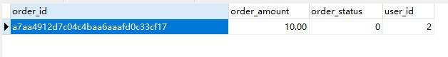
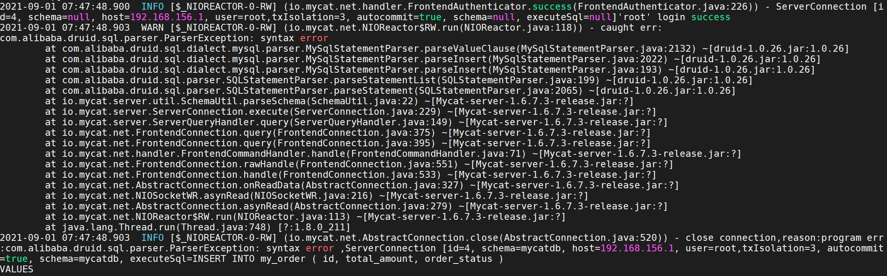
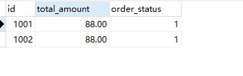
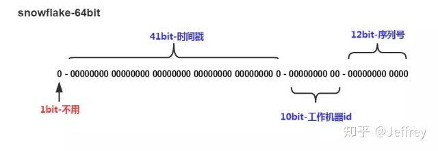
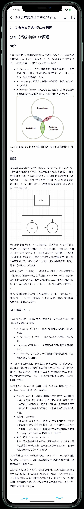

# 8. 分布式全局ID、分布式事务和数据一致性

##  第一章 分布式全局ID

### 1-1 分布式全局id——概述和引发的问题

#### 1. 本章概述

1. 分库分表的系统中，由于id引发的问题
2. 使用UUID作为id实现主键全局唯一性保证
3. 通过统一ID序列表，实现全局id
4. 雪花算法作为全局id
5. 多种方案的比较

#### 3. 业界常见的分布式ID生成策略

分布式ID生成策略常见的有如下几种：

1. 数据库自增ID。
2. UUID生成。
3. Redis的原子自增方式。
4. 数据库水平拆分，设置初始值和相同的自增步长。
5. 批量申请自增ID。
6. 雪花算法。
7. 百度UidGenerator算法(基于雪花算法实现自定义时间戳)。
8. 美团Leaf算法(依赖于数据库，ZK)。
9. Twitter snowflake算法

#### 2. 分库分表引发的id问题

在通常情况下，每个表都有唯一标识，通常使用id，id通常采用自增的方式，在分库分表的情况下，每张表的id都是从0开始自增的。不同的分片上id可能是重复的，导致id在全局不唯一，进而出现业务上的混乱。

### 1-2 分布式主键UUID

#### 1. UUID

* UUID：通用唯一识别码（Universally Unique Identifier）
* 使用UUID，保证每一条记录的id都是不同的
* 缺点：只是单纯的一个id，没有实际意义，长度32位，太长了
* **Mycat不支持UUID的方式，Sharding-Jdbc支持UUID的方式**

#### 2. UUID实战

#### 前置准备

1. 将192.168.156.139和192.168.156.140的sharding-orders数据库中的orders_1和orders_2的order_id字段修改为`varchar(32)`
2. 将项目sharding-jdbc-demo的orders表的mapper文件重新生成

##### Spring Boot

1. 编写自定义的分片表达式

   ```java
   /**
    * @author : depers
    * @program : sharding-jdbc-demo
    * @description: 自定义UUID分片策略
    * @date : Created in 2021/8/30 21:28
    */
   public class UuidSharding implements PreciseShardingAlgorithm<String> {
       @Override
       public String doSharding(Collection<String> collection, PreciseShardingValue<String> preciseShardingValue) {
           String uuid = preciseShardingValue.getValue();
           int mode = uuid.hashCode() % collection.size();
   
           String[] strs = collection.toArray(new String[0]);
           mode = Math.abs(mode);
   
           System.out.println("分片表：" + strs[0] + ", " + strs[1]);
           System.out.println("mode = " + mode);
           return strs[mode];
       }
   }
   ```

2. 修改application.properties

   ```properties
   spring.shardingsphere.sharding.tables.orders.table-strategy.standard.sharding-column=order_id
   spring.shardingsphere.sharding.tables.orders.table-strategy.standard.precise-algorithm-class-name=cn.bravedawn.shardingjdbcdemo.sharding.UuidSharding
   
   spring.shardingsphere.sharding.tables.orders.key-generator.column=order_id
   spring.shardingsphere.sharding.tables.orders.key-generator.type=UUID
   ```

3. 运行测试程序

   ```java
   @Test
   public void insertByCustomOrderIdInsert(){
       Orders orders = new Orders();
       orders.setUserId(2);
       orders.setOrderAmount(BigDecimal.TEN);
       orders.setOrderStatus(0);
   
       ordersMapper.insertSelective(orders);
   }
   ```

4. 效果

   

##### Spring命名空间

1. 修改sharding-jdbc.xml

   ```xml
   <sharding:table-rules>
   	<sharding:table-rule logic-table="orders" actual-data-nodes="ms$->{0..1}.orders_$->{1..2}" database-strategy-ref="databaseStrategy" table-strategy-ref="standard" key-generator-ref="uuid"/>
   </sharding:table-rules>
   
   <sharding:key-generator id="uuid" column="order_id" type="UUID"/>
   
   <bean id="uuidSharding" class="cn.bravedawn.shardingjdbcdemo.sharding.UuidSharding"/>
   
   <sharding:standard-strategy id="standard" sharding-column="order_id" precise-algorithm-ref="uuidSharding"/>
   ```

2. 其他和SpringBoot相同

### 1-3 MyCat全局id （统一ID序列表）

* ID的值统一的从一个集中的ID序列生成器中获取。多个数据库从一个ID序列生成器中获取ID。

* **ID序列生成器MyCat支持，Sharding-Jdbc不支持。**

* MyCat中有两种方式：本地文件方式和数据库方式。

* 本地文件方式用于测试，数据库方式用于生产。
* 优点：ID集中管理，避免重复。
* 缺点：并发量大时，ID生成器压力较大。

#### 本地文件的方式

1. server.xml 中配置：

   ```xml
   <system><property name="sequnceHandlerType">0</property></system>
   ```


   注：sequnceHandlerType 需要配置为 0，表示使用本地文件方式。

2. sequence_conf.properties配置：

   ```
   MY_ORDER.HISIDS=
   MY_ORDER.MINID=1001
   MY_ORDER.MAXID=2000
   MY_ORDER.CURID=1000
   ```

   其中 `HISIDS` 表示使用过的历史分段(一般无特殊需要可不配置)，`MINID` 表示最小 ID 值，`MAXID` 表示最大
   ID 值，`CURID` 表示当前 ID 值。

3. schema.xml配置：

    ```xml
    <table name="my_order" dataNode="dn139,dn140" rule="auto-sharding-long" autoIncrement="true" primaryKey="id">
    </table>
    ```

4. 启动MyCat：`./mycat start`

5. 在mycat中执行该sql：

   ```sql
   INSERT INTO my_order ( id, total_amount, order_status )
   VALUES
   (
       next VALUE FOR mycatseq_my_order,
       88,
   	1
   )
   ```

   执行这条语句的时候会报错：

   

   解决办法是，修改schema.xml文件，将checkSQLschema置为false。

   ```xml
   <schema name="mycatdb" checkSQLschema="false" sqlMaxLimit="100">
   ```

   当该值设置为 true 时，如果我们执行语句(select * from USERDB.eg_user)则 MyCat 会把语句修改为(select * from eg_user)。即把表示 schema 的字符去掉，避免发送到后端数据库执行时报**（ERROR1146 (42S02): Table ‘ USERDB.eg_user’ doesn’ t exist）。 

   接下来执行这条sql就没有问题了。

6. 效果如下，可以看到id就是按照配置的顺序往下执行的

   

7. 如果我们执行如下SQL：

   ```
   INSERT INTO my_order (total_amount, order_status )
   VALUES
   (
       88,
   	1
   )
   ```

#### 数据库的方式

因为Mycat项目老是有一些迷之bug，放弃对该项目的学习。

### 1-4 分布式id——雪花算法

#### 1. 雪花算法

* SnowFlake是由Twitter提出的分布式ID算法
* 一个64bit的long型数字
* 引入了时间戳，保持递增



* 组成部分：
  1. **.第一位** 占用1bit，其值始终是0，没有实际作用，表示正数
  2. **时间戳** 占用41bit，精确到毫秒，总共可以容纳约69年的时间。
  3. **工作机器id** 占用10bit，其中高位5bit是数据中心ID，低位5bit是工作节点ID，做多可以容纳1024个节点。
  4. **序列号** 占用12bit，每个节点每毫秒0开始不断累加，最多可以累加到4095，一共可以产生4096个ID。
* SnowFlake算法在同一毫秒内最多可以生成多少个全局唯一ID呢：： **同一毫秒的ID数量 = 1024 x 4096 = 4194304**
* 基本保持全局唯一，同一机器在毫秒内并发最大可生成4096个ID
* 时间回调，可能会引起ID重复。就是服务器时间没有同步，需要将数据库时间修改为之前的时间。
* Mycat和Sharding-JDBC均支持雪花算法
* Sharding-JDBC可设置最大容忍回调时间

#### 2. Sharding-jdbc上的雪花算法实践

##### Spring Boot

1. 配置applications.proerties

   ```properties
   spring.shardingsphere.sharding.tables.orders.key-generator.column=order_id
   spring.shardingsphere.sharding.tables.orders.key-generator.type=SNOWFLAKE
   spring.shardingsphere.sharding.tables.orders.key-generator.props.worker.id=345
   spring.shardingsphere.sharding.tables.orders.key-generator.props.max.tolerate.time.difference.milliseconds=10
   ```

2. 运行测试程序：cn.bravedawn.shardingjdbcdemo.ShardingJdbcDemoApplicationTests#insertByCustomOrderIdInsert

##### Spring命名空间

1. 配置sharding-jdbc.xml

   ```xml
   <sharding:key-generator id="snowflake" column="order_id" type="SNOWFLAKE" props-ref="snow"/>
   
   <bean:properties id="snow">
       <!--worker.id：工作机器id，取值范围在0到1024
           max.tolerate.time.difference.milliseconds：最大容忍回调时间，单位ms
       -->
   	<prop key="worker.id">678</prop>
   	<prop key="max.tolerate.time.difference.milliseconds">10</prop>
   </bean:properties>
   
   <sharding:table-rule logic-table="orders" actual-data-nodes="ms$->{0..1}.orders_$->{1..2}" database-strategy-ref="databaseStrategy" table-strategy-ref="standard" key-generator-ref="snowflake"/>
   ```

2. 将139和140的sharding_orders数据库的orders表的id字段类型修改为bigint

3. 运行测试程序：cn.bravedawn.shardingjdbcdemo.ShardingJdbcDemoApplicationTests#insertByCustomOrderIdInsert

### 1-5 分布式全局ID方案落地

在mall项目中，我们使用的是idworker，github地址是：https://github.com/imadcn/idworker

## 第二章 分布式事务

### 2-1 概述

1. CAP原理
2. ACID原理和BASE原理
3. 基于XA协议的两阶段提交
4. 事务补偿机制
5. 基于本地消息表的最终一致性方案
6. 基于MQ消息队列的最终一致性方案

### 2-2 分布式系统中的CAP原理



### 2-3 由于分库分表引发的事务问题

* 传统的应用都是单一数据库事务，所有的业务都在同一数据库内，数据库的事务可以很好的得到支持。
* 在分布式系统中，将业务切分成多个数据库，多个独立的数据库之间，无法统一事务，造成数据不一致的情况。
  * 例如：将A用户的钱转给B用户，但是这两个用户的数据位于两个不同的数据库中，就可能会导致事务问题
  * 例如：将提交订单业务拆分为用户库、订单库、商品库。一个下单操作，用户使用积分购买商品，用户库扣减积分，订单库生成订单，商品库扣减库存。由于他们不在同一数据库，不能保证事务统一。
* 解决分布式事务的方案：
  1. 基于XA协议的两阶段提交
  2. 事务补偿机制
  3. 基于本地消息表+定时任务的最终一致性方案
  4. 基于MQ消息队列的最终一致性方案
* 参考博客：
  * https://segmentfault.com/a/1190000040321750
  * https://www.cnblogs.com/chengxy-nds/p/14046856.html

### 2-4 XA协议的两阶段提交（原理)

#### 1. 简介

* XA是由X/Open组织提出的分布式事务的规范

* XA规范主要定义了(全局)事务管理器(TM)和(局部)资源管理器(RM)之间的接口。

* 本地的数据库如mysql在XA中扮演的是RM角色

* 提交分为两个阶段：prepare和commit

#### 2.两阶段

* 第一阶段（prepare）：即所有的参与者RM准备执行事务并锁住需要的资源。参与者ready时，向TM报告已准备就绪。

  img1

* 第二阶段 (commit/rollback)：当事务管理者(TM)确认所有参与者(RM)都ready后，向所有参与者发送commit命令。

  img2

  目前主流的数据库基本都支持XA事务，包括mysql、oracle、sqlserver、postgre

#### 3. 特点

* 保证数据的强一致性
* *commit阶段出现问题，事务出现不一致，需人工处理*，**这句话我觉得有问题**
* 效率低下，性能与本地事务相差10倍

#### 4. 实现

1. MySQL5.7及以上均支持XA协议
2. MySQL Connector/J 5.0以上 支持XA协议
3. Java系统中实现中，数据源采用Atomikos


