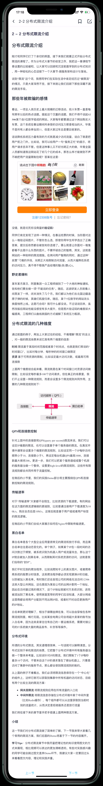
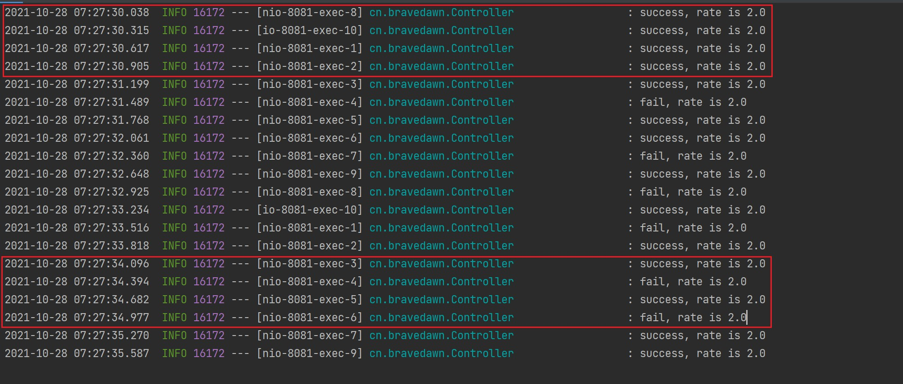
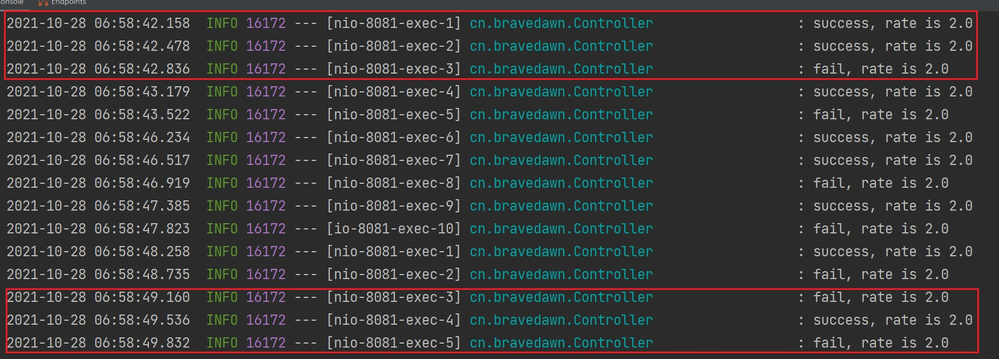
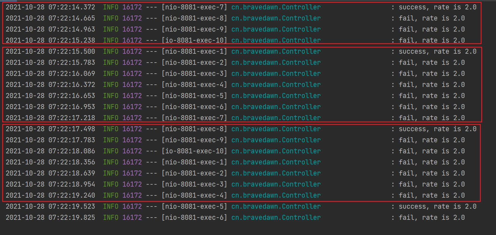
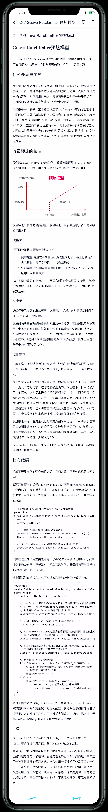
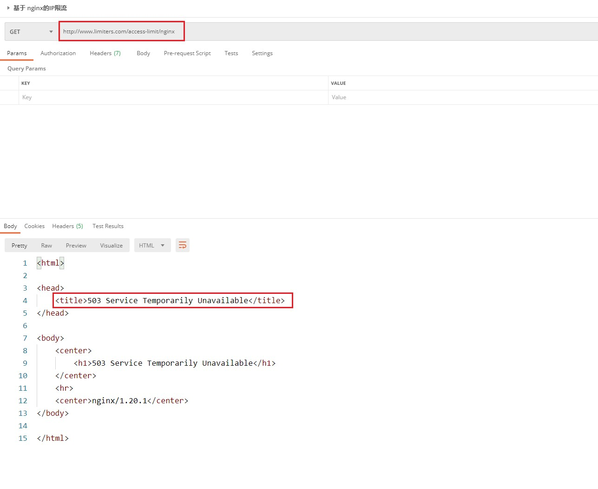
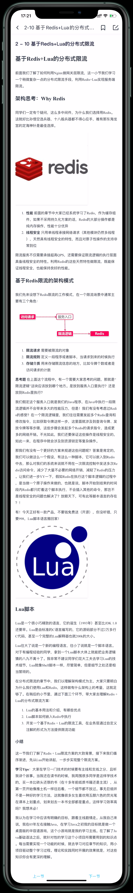
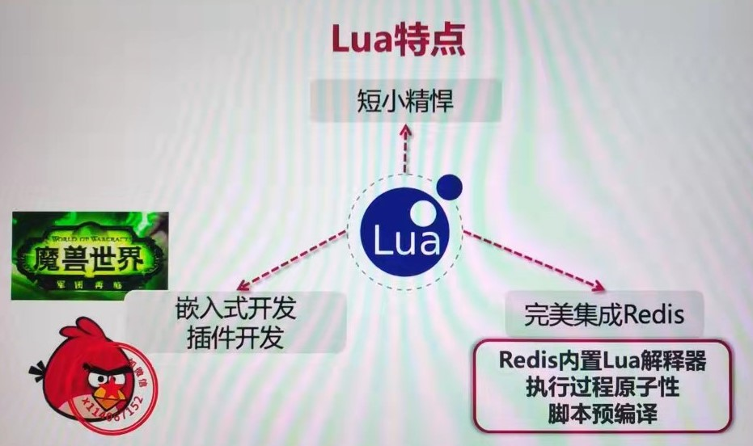

# 17周 分布式接口幂等性，分布式限流

## 第一章 分布式接口幂等性

### 1-1 概述与接口重试的问题

#### 1. 本章概述

* 什么是幂等性
* 幂等性设计的核心思想
* select、update、delete、insert和混合操作的接口幂等性

#### 2. 接口设计与重试机制引发的问题

1. 提交订单按钮如何防止重复提交
2. 表单录入页如何防止重复提交
3. 微服务接口，客户端重试时，会对业务数据产生影响吗？

#### 3. 接口幂等性

> 参考文章：https://juejin.cn/post/6844903815552958477

1. 幂等性：f(f(x)) = f(x)
2. 幂等性元素运行多次，还等于它原来的运算结果
3. 在系统中，一个接口运行多次，与运行一次的效果是一致的
4. 要考虑幂等性设计的场景：重复提交，接口重试，前端操作抖动等
5. 示例场景：
   * 用户多次点击提交订单，后台应只生成一个订单
   * 支付时，由于网络问题重发，应该只扣一次钱
6. 注意：并不是所有的接口都要求幂等性设计，要根据业务而定
7. **幂等性设计的核心思想**：通过唯一的业务单号保证幂等性
8. 并发情况下的幂等性设计：整个业务逻辑过程要加锁
9. 非并发情况下的幂等性设计：查询业务单号有没有操作过，没有则执行操作
10. 相关数据库操作幂等性设计原则：
    * Select操作：不会对业务数据有影响，天然幂等
    * Delete操作：多次操作结果一致，天然幂等
    * Updata操作：更新操作传入数据版本号，通过乐观锁实现幂等性
    * Insert操作：此时没有唯一的业务单号，使用Token保证幂等
    * 混合操作：找到操作的唯一业务单号，有则可以使用分布式锁。没有可以通过Token保证幂等，这里根据token来添加分布式锁保证请求的幂等性。

### 1-2 update操作的幂等性

#### 基于乐观锁实现幂等性（版本号机制）

1. 实现逻辑

   - 在数据库表设计的时候将将`version`字段添加到表字段中
   - 取出记录时，获取当前`version`
   - 更新时，带上这个`version`
   - 执行更新时， `set version = newVersion where version = oldVersion`
   - 如果`version`不对，就更新失败

2. 核心SQL

   ```sql
   update table set name = 'Aron', version = version + 1 where id = #{id} and version = #{version};  
   ```

3. 观点

   乐观锁的版本号机制可以勉强以 `token` 或者`状态标识` 作为版本号来实现幂等性。

### 1-3 自己对幂等性的理解和整理

感觉这个视频的作者对并发和幂等性的了解也不深入，具体看一下我在notion中整理的笔记：[幂等性/并发/防重放](https://phrygian-earwig-e60.notion.site/2f1c31dfa08d40418e63d59fddfc40e8)

对于mall项目的幂等性控制，这里我采用**redis去重进行幂等性校验**

## 第二章 分布式限流

### 2-1 章节内容介绍

* 分布式限流介绍
  * 常见方案
  * 技术选型
* 分布式限流常用算法
* 基于客户端的限流方案
  * [demo] Guava RateLimiter客户端限流
  * [算法源码] Guava的预热模型
* 基于Nginx的分布式限流
  * [demo] 基于IP地址的限流方案
  * [demo]基于最大连接数的限流方案
* 基于Redis + Lua的分布式限流
* 30分钟了解Lua
  * [demo] Lua基本用法和介绍
  * [demo] Redis预加载Lua
* 电商项目改造 - 客户端分布式限流
  * [demo] 基于Redis + Lua实现限流
  * [demo] 定义自定义注解封装限流逻辑
* 课程小节与作业

### 2-2 分布式限流介绍



### 2-3 分布式限流的几种方案


### 2-4 限流方案常用算法讲解

下列图片中关于滑动窗口算法的讲解，我觉得不是很准确。关于限流的算法还可以参考《Java并发编程》第15章第二节的内容。


### 2-5 【Demo】Guava RateLimiter客户端限流（阻塞模式）

* 创建**rate-limit**子项目，引入依赖项

  相关代码可以参考项目

* 非阻塞式的限流方案

  1. 每次请求中请求1个令牌

     第一个红框有问题，为啥刚开始居然四个请求每次拿一个令牌，怎么全部都成功了？

     第二个红框我觉得才是正常的，每秒产生两个令牌，三个请求只有两个成功才是合适的。

     

  2. 每次请求中请求2个令牌

     如下图所示，有两个圈出来的红框。

     第一个红框，为什么刚开始在同一秒中两次请求分别拿两个令牌是可以成功的？

     第二个红框，这种情况我认为是正常的，因为我每秒只产生两个令牌，所以同一秒内应该只有一个请求可以通过才是正常的。

     

  3. 每次请求中请求4个令牌

     在这幅图里面你就会发现，第一个红框为啥一秒内就能获得4个令牌，而第二、三个红框应该才是正确的。

     

* 有效时间内的非阻塞式限流方案

  如果我在一定时间内要求的令牌数大于一定时间内能够产生的令牌数，那请求一定就会失败。比如在这段演示代码中我们每秒产生两个令牌，要是我每次请求要求100个令牌，有效时间是5s，那我在5s内最多产生10个令牌，不可能产生100个，所以除第一次请求成功外，其他时候请求都是失败的。

  ```java
   // 限定时间的非阻塞限流
  @GetMapping("/tryAcquireWithTimeout")
  public String tryAcquireWithTimeout(Integer count, Integer timeout) {
      if (limiter.tryAcquire(count, timeout, TimeUnit.SECONDS)) {
          log.info("success, rate is {}", limiter.getRate());
          return "success";
      } else {
          log.info("fail, rate is {}", limiter.getRate());
          return "fail";
      }
  }
  ```

* 同步阻塞式的限流方案

* 总结

  Guava中的RateLimiter适合做单机资源比较敏感的请求上，并不适合在集群环境中使用。

https://www.cnblogs.com/fnlingnzb-learner/p/13086185.html

### 2-6 Guava RateLimiter预热模型

在流量预热的做法的折线图中，以横坐标为准，从右到左是流量从忙时变为闲时的过程，令牌的速率逐渐降低，从左到右是流量从闲时变为忙时的过程，令牌的发放速率逐渐加快。



### 2.7 基于Nginx的IP限流

1. 添加Controller方法

   ```java
   // Nginx专用
   // 1. 修改host文件 -> www.limiters.com = localhost 127.0.0.1
   //    (127.0.0.1	www.limiters.com)
   // 2. 修改nginx -> 将步骤1中的域名，添加到路由规则当中
   //    配置文件地址： /usr/local/nginx/conf/nginx.conf
   // 3. 添加配置项：参考resources文件夹下面的nginx.conf
   //
   // 重新加载nginx(Nginx处于启动) => sudo /usr/local/nginx/sbin/nginx -s reload
   @GetMapping("/nginx")
   public String nginx() {
       log.info("Nginx success");
       return "success";
   }
   ```

2. 网关层配置（修改host文件和nginx.conf文件）

   * 修改host文件

     ```
     127.0.0.1 www.limiters.com
     ```

   * 修改nginx文件

     1. 编辑nginx.conf文件，在http模块下添加如下代码

        ```nginx
        include vhost/*.conf;
        ```

     2. 编辑limiter.conf

        ```nginx
        # 根据IP地址限制速度
        # 1） 第一个参数 $binary_remote_addr
        #    binary_目的是缩写内存占用，remote_addr表示通过IP地址来限流
        # 2） 第二个参数 zone=iplimit:20m
        #    iplimit是一块内存区域（记录访问频率信息），20m是指这块内存区域的大小
        # 3） 第三个参数 rate=1r/s
        #    比如100r/m，标识访问的限流频率
        limit_req_zone $binary_remote_addr zone=iplimit:20m rate=1r/s;
        
        server {
            server_name www.limiters.com;
            location /access-limit/ {
                proxy_pass http://127.0.0.1:10086/;
        
                # 基于IP地址的限制
                # 1） 第一个参数zone=iplimit => 引用limit_req_zone中的zone变量
                # 2） 第二个参数burst=2，设置一个大小为2的缓冲区域，当大量请求到来。
                #     请求数量超过限流频率时，将其放入缓冲区域
                # 3) 第三个参数nodelay=> 缓冲区满了以后，直接返回503异常
                limit_req zone=iplimit burst=2 nodelay;
            }
        }
        ```

3. 实验，我们使用postman连续发送请求，一旦频率高了就能够拿到503错误

   

### 2.8 基于Nginx的连接数限制和单机限流

1. 配置服务器限流（类似IP限流）

   修改limiter.conf文件，基于服务器限流指的就是对于单机部署的应用来说，这台服务器接收请求访问的速率。

   ```nginx
   # 根据服务器级别做限流
   limit_req_zone $server_name zone=serverlimit:10m rate=100r/s;
   
   server {
       server_name www.limiters.com;
       location /access-limit/ {
           proxy_pass http://127.0.0.1:10086/;
   
           # 基于服务器级别的限制
           # 通常情况下，server级别的限流速率是最大的
           limit_req zone=serverlimit burst=100 nodelay;
       }
   }
   ```

2. 配置连接数限流

   修改limiter.conf文件，声明连接数的配置，一个是基于ip的连接数，一个是基于服务器级别的连接数配置：

   这里的连接数，按照我的理解就是发送请求连接服务器的个数。

   ```nginx
   # 基于连接数的配置
   limit_conn_zone $binary_remote_addr zone=perip:20m;
   limit_conn_zone $server_name zone=perserver:20m;
   
   server {
       server_name www.imooc-training.com;
       location /access-limit/ {
           proxy_pass http://127.0.0.1:10086/;
   
           # 每个server最多保持100个连接
           limit_conn perserver 100;
           # 每个IP地址最多保持1个连接
           limit_conn perip 5;
   
           # 异常情况，返回504（默认是503）
           limit_req_status 504;
           limit_conn_status 504;
       }
   
       # 彩蛋
       location /download/ {
           limit_rate_after 100m;
           limit_rate 256k;
       }
   }
   ```

3. 添加Controller方法（耗时接口）

   ```Java
   @GetMapping("/nginx-conn")
   public String nginxConn(@RequestParam(defaultValue = "0") int secs) {
       try {
           Thread.sleep(1000 * secs);
       } catch (Exception e) {
       }
       return "success";
   }
   ```

### 2-10 基于Redis+Lua的分布式限流



### 2-11 Lua介绍和基本用法

1. Lua的特点

   

2. 在idea中安装Lua开发的插件，Lua或是EmmyLua

3. lua的hello world程序

   ```lua
   print 'Hello Lua'
   ```

4. lua的限流程序

   ```lua
   -- 模拟限流（假的）
   
   -- 用作限流的Key
   local key = 'My Key'
   
   -- 限流的最大阈值=2
   local limit = 2
   
   -- 当前流量大小
   local currentLimit = 0
   
   -- 是否超出限流标准
   if currentLimit + 1 > limit then
       print 'reject'
       return false
   else
       print 'accept'
       return true
   end
   ```

   ### 2-12 Redis预加载Lua

   1. Redis中执行Lua脚本

      首先进入redis-cli工具，执行如下命令片段：

      ```lua
      # 执行lua脚本，不带参数
      eavl "return redis+lua" 0
      
      # 执行lua脚本，带参数
      eval "return {KEYS[1], ARGV[1]}" 2 K1 K2 V1 V2
      
      # 执行lua脚本，参数个数设置为0，带参数
      eval "return {KEYS[1], ARGV[1]}" 0 K1 K2 V1 V2
      ```

   2. Lua脚本预导入Redis中

      ```lua
      # [不带参数]将脚本 script 添加到脚本缓存中，但并不立即执行这个脚本。
      script load "return 'hello redis+lua'"
      
      # [不带参数执行]将脚本 script 添加到脚本缓存中，但并不立即执行这个脚本。
      script load "return 'hello redis+lua'"
      evalsha "53b2700be01e76aa1b060e09c828dae642520f2e" 0
      
      # [带参数]这里注意的是连接语句和变量的写法，用的是..
      script load "return 'hello lua'..KEYS[1]"
      evalsha "6e2466b4db65a6b11ee99749d4a489804d7d668e" 1 ley1 val1
      
      # 从脚本缓存中移除所有脚本
      script flush
      
      # 判断签名脚本是否在脚本缓存中
      script exists "6e2466b4db65a6b11ee99749d4a489804d7d668e"
      ```

### 2-12 限流组件封装一-Redis+Lua

1. 编写Lua限流脚本

2. Spring-data-redis组件集成Lua和Redis

   DefaultRedisScript加载Lua脚本

   RedisTemplate配置（调用Redis）

3. 在Controller中添加测试方法，验证限流效果

   https://m.php.cn/redis/421952.html

### 2-13 限流组件封装二-自定义注解

1. 基于AspectJ创建自定义注解AccessLimit

2. 配置限流规则的切面

3. 为目标方法添加@AccessLimit注解，验证效果
