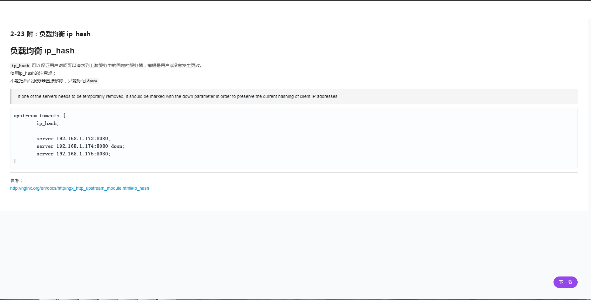
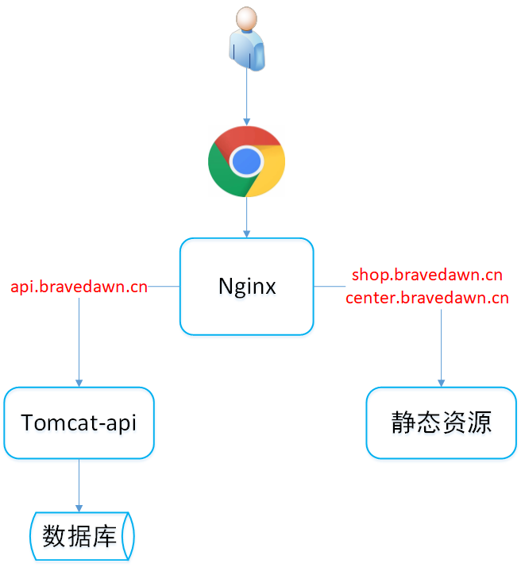

# 阶段二：从单体到高可用集群演进

## 01.LVS+Nginx实现高可用集群

### 第1章 Nginx快速认知

#### 1-1.集群阶段开篇概述

* 阶段规划
  * 从单体到集群过度
  * Nginx入门
  * Nginx实现集群和负载均衡
  * 高可用Nginx方案与实现
  * 生产环境Nginx替换tomcat
* 项目规模的演进
  1. 项目初期
     * 2-3人团队
     * 用户量：100-500
  2. 小型项目
     * 5-10人团队
     * 用户量：1000-10000
  3. 中型项目
     * 20-30人团队
     * 用户量：50000-500000
  4. 大型项目
     * 50-100人团队
     * 用户量：百万级
  5. 巨型项目
     * 100+团队
     * 用户量：千万级
  6. 大厂级项目
     * 1000+团队
     * 用户量：亿级

* 单体架构的优点
  * 小团队成型即可完成开发-测试-上线
  * 迭代周期短，速度快
  * 打包方便，运维省事
* 单体架构面临的挑战
  * 单节点宕机造成所有服务不可用
  * 随着项目的迭代，代码的耦合度太高（迭代，测试，部署）
  * 单节点并发能力有限
* 集群概念
  * 计算机“群体”构成整个系统
  * 这个“群体”构成一个整体，不能独立存在
  * “人多力量大”，集群可以提升并发与可用性
  * 多台计算机构成的系统中，每台计算机做相同的事情称为集群；每台计算机做不同的事情称之为分布式
* 使用集群的优势
  * 提高系统性能
  * 提高系统可用性
  * 可扩展性高
* 使用集群的注意点
  * 用户会话- 分布式会话
  * 定时任务-单独用一台服务器来做定时任务
  * 内网互通

#### 1-2.什么是Nginx？常用的Web服务器有哪些？

1. 什么是Nginx
   * Nginx（engine x）是一个高性能的HTTP和反向代理web服务器，同时也提供IMAP/POP3/SMTP服务
   * 主要功能是反向代理
   * 通过配置文件可以实现集群和负载均衡
   * 静态资源虚拟化
2. 常用的web服务器
   * MS IIS——asp .net
   * Weblogic、Jboss——传统行业 ERP/物流/电信/金融
   * Tomcat、Jetty——J2EE
   * Apache、Nginx——静态服务，反向代理
   * Netty——高性能服务器编程

#### 1-3.什么是反向代理？

1. 什么是正向代理
   * 客户端请求目标服务器之间的一个代理服务器
   * 请求会先经过代理服务器，然后在转发请求到目标服务器，获得内容后最后响应给客户端
2. 什么是反向代理
   * 用户请求目标服务器，由代理服务器决定访问那个ip
3. 反向代理之路由
   * 通过Nginx可以规避端口访问的问题

#### 1-7 Nginx进程模型解析

* Nginx的两个进程

  * master进程：主进程
  * worker进程：工作进程

  master进程是一个领导者，worker进程是为master进程服务的。

  当程序员通过nginx命令进行操作后时，主进程会将命令**分发给worker进程**进行执行，worker进程之间是相互独立的。

* Nginx中worker进程数量配置

  1. 编辑/usr/local/myapp/program/nginx/conf/nginx.conf，编辑worker_processes参数进行配置，默认只有一个工作进程。

     ```
     worker_processes  1;
     ```

  2. 保存后，`ngxin -s reload`

#### 1-8 Nginx处理Web请求机制解析

1. worker抢占机制

   当我们提供80端口的http服务时，一个连接请求过来，每个进程都有可能处理这个连接。

   每个worker进程都是从master进程fork过来，在master进程里面，先建立好需要listen的socket（listenfd）之后，这句话的意思就是说master进程会监听来自客户端的请求，然后再fork出多个worker进程。且所有worker进程的listenfd会在新连接到来时变得可读，为了保证只有一个进程处理该连接，所有worker进程在注册listenfd读事件前抢**accept_mutex的锁**，worker进程处理请求的过程大概如下图所示：

   

2. 传统服务器事件处理

   在传统服务器时间处理模型是同步阻塞，如下图中三个客户端进行请求，client1被worker1阻塞，client2被worker2阻塞。以此类推，每当请求过来之后，master进程不得不重新fork一个进程去做处理。

   

3. Nginx事件处理

   nginx的高并发就是通过worker的抢占机制同时搭配了**异步非阻塞方式**来实现的。在 Linux 下，Nginx 使用 epoll 的 I/O 多路复用模型进行实现。

   编辑/usr/local/myapp/program/nginx/conf/nginx.conf对其进行配置：

   ```nginx
   events {
      # 默认使用epoll
      use epoll;
      # 每个worker进程允许连接的客户单最大连接数
      worker_connections  1024;
   }
   ```

#### 1-9 nginx.conf 配置结构与指令语法

1. nginx.conf配置结构
   1. main 全局配置
   2. event 配置工作模式以及连接数
   3. http http模块相关配置
      1. server 虚拟主机配置，可以有多个
         1. localtion 路由规则，表达式
         2. upstream 集群，内网服务器

#### 1-10 同步与异步，阻塞与非阻塞

下图中：

* BIO：（Blocking IO）同步并阻塞
* NIO：（Non-Blocking）同步非阻塞
* AIO：（Asynchronous IO）异步非堵塞


#### 1-11 nginx.conf 核心配置文件


#### 1-12 nginx.conf 核心配置文件详解

1. 修改worker进行执行用户，将默认的nobady修改为root

   ```nginx
   user root;
   ```

2. 修改worker工作进程数，设置为等于 CPU 的核数，若该服务器上还有别的应用在部署，可以设置为N-1个

   ```nginx
   worker_processes  1;
   ```

3. 修改错误日志配置，notice是nginx的日志级别分别是debug、info、notice、warn、error和crit

   ```nginx
   error_log  logs/error.log  notice;
   ```

4. 修改nginx的进程号，可以直接注释

   ```nginx
   pid logs/nginx.pid;
   ```

5. 修改nginx事件模式和连接数

   ```nginx
   events {
      # 默认使用epoll
      use epoll;
      # 每个worker进程允许连接的客户单最大连接数
      worker_connections  1024;
   }
   ```

6. http是指令块，针对http网络传输的一些配置指令

   ```nginx
   http {
   }
   ```

7. include引入外部配置，增加可读性。避免单个文件过大

   ```nginx
   include mime.types;
   ```

#### 1-15 nginx.pid打开失败以及失效的解决方案

nginx默认会将pid放在logs文件下的，启动之后才有这个文件。

1. 错误一：nginx:[error] open() "/var/run/nginx/nginx.pid" failed（2: No such file or directory）

   1. 方案一：可能是/var/run/nginx这个目录不存在

      使用mkdir命令新建这个文件，然后`nginx -s reload`

   2. 方案二：可能是nginx.pid文件不存在

      这个问题请参考错误二的解决方法

2. 错误二：nginx:[error] invalid PID number "" in "/var/run/nginx/nginx.pid"

   通过下面命令重新制定nginx的核心配置文件然后`nginx -s reload`：

   ```sh
   ./nginx -c ../conf/nginx.conf
   ```

#### 1-16 Nginx常用命令解析

* `nginx -s stop`：暴力关闭nginx（饭店吃饭，关门赶顾客走）
* `nginx -s quit`：优雅关闭nginx（饭店吃饭，等顾客吃完再关门）
* `nginx -t`：测试配置文件语法
* `nginx -v`：nginx版本
* `nginx -V`：nginx版本并展示详细的配置信息
* `nginx -h`/`nginx -?`：nginx命令帮助
* `nginx -c`：设置nginx核心配置文件

#### 1-17 Nginx日志切割 - 手动

其中`kill -USR1`命令中USR1的解释：

USR1亦通常被用来告知应用程序重载配置文件；例如，向Apache HTTP服务器发送一个USR1信号将导致以下步骤的发生：停止接受新的连接，等待当前连接停止，重新载入配置文件，重新打开日志文件，重启服务器，从而实现相对平滑的不关机的更改。

这里实现了nginx不关机，重新打开日志文件的功能。


下面是图中具体的脚本mall\conf\nginx\cut_my_log.sh：

```shell
#!/bin/bash
LOG_PATH="/usr/local/myapp/program/nginx/logs"
RECODE_TIME=$(date -d "yesterday" +%Y-%m-%d+%H:%M)
PID=/usr/local/myapp/nginx/logs/nginx.pid

mv ${LOG_PATH}/access.log ${LOG_PATH}/access.${RECODE_TIME}.log
mv ${LOG_PATH}/error.log ${LOG_PATH}/error.${RECODE_TIME}.log

# 向nginx主进程大发送信号，用于重新打开日志文件
kill -USR1 `cat $PID`
```

#### 1-19 Nginx日志切割 - 定时


#### 1-21 虚拟主机 - 使用Nginx为静态资源提供服务


使用下面这段脚本进行静态资源的配置：

```nginx
server {
    listen  90;
    server_name localhost;

    location / {				  #通过/请求
        root    /home/fooie-shop; #静态文件路径
        index   index.html;		  #首页设置
    }

    location /imooc {             #通过/imooc请求
        root /home;				  #静态文件路径会和请求路径进行拼接，访问/home/imooc下的文件
    }

    location /static {			  #通过/static请求
        alias /home/imooc;        #通过设置static别名，访问/home/imooc项目的文件
    }
}
```

#### 1-22 使用Gzip压缩提升请求效率

前端浏览器访问网站时会请求大量的多媒体文件和js、css文件。通过在nginx中使用Gzip对其进行压缩。下面是在nginx.conf中的配置：

```nginx
# 开启gzip压缩功能。目的：提高传输效率，节省带宽
gzip on;

# 限制最小压缩。小于1字节文件不会压缩
gzip_min_length 1;

# 定义压缩的级别（压缩比，文件越大，压缩越多，但是cpu使用会越多）
gzip_com_level 3;

# 定义压缩文件的类型
gzip_types text/plain application/javascript application/x-javascript text/css application/xml text/javascript application/x-httpd-php image/jpeg image/gif image/png application/json;
```

#### 1-24 location的匹配规则解析

1. `空格/`：location的默认匹配规则，普通匹配

   ```nginx
   # 通过/访问
   location / {
   
   # 通过/imooc访问。只要服务器的文件目录存在
   location /imooc {
   ```

2. `=`：精准匹配。通过http://.../imooc/img/face1.png可以精准的访问到/home/imooc/img/face1.png这张图片

   ```nginx
   location = /imooc/img/face1.png {
   	root /home;
   }
   ```

3. `~*`：匹配正则表达式，不区分大小写

   ```nginx
   # 正则表达式。*代表不区分大小写
   location ~* \.(GIF|png|bmp|jpg|jpeg) {
       root /home;
   }
   # 正则表达式, 区分大小写精准匹配
   location ~* \.(GIF|png|bmp|jpg|jpeg) {
       root /home;
   }
   ```

4. `^~`：以某个字符路径开头

   配置这个规则之后，用户只能访问/home/imooc/img下的资源了

   ```nginx
   # ^~ 以某个字符路径开头请求
   location ^~ /imooc/img {
   	root /home;
   }
   ```
   
5. `~ `：表示区分大小写的正则匹配

6. `!~`和`!~*`：分别为区分大小写不匹配及不区分大小写不匹配 的正则


### 第2章 Nginx进阶与实战

#### 2-0 在Nginx中解决跨域问题

参考文章：https://segmentfault.com/a/1190000011145364

* 什么是跨域？

  跨域是指一个域下的文档或脚本试图去请求另一个域下的资源，这里跨域是广义的。

  其实我们通常所说的跨域是狭义的，是由浏览器同源策略限制的一类请求场景。

* 什么是同源策略？

  同源策略/SOP（Same origin policy）是一种约定，由Netscape公司1995年引入浏览器，它是浏览器最核心也最基本的安全功能，如果缺少了同源策略，浏览器很容易受到XSS、CSFR等攻击。所谓同源是指**"协议+域名+端口"三者相同**，即便两个不同的域名指向同一个ip地址，也非同源。

* 同源策略限制以下几种行为：

  * Cookie、LocalStorage 和 IndexDB 无法读取
  * DOM 和 Js对象无法获得
  * AJAX 请求不能发送

* 常见跨域场景

  ```
  URL                                      说明                    是否允许通信
  http://www.domain.com/a.js
  http://www.domain.com/b.js         同一域名，不同文件或路径           允许
  http://www.domain.com/lab/c.js
  
  http://www.domain.com:8000/a.js
  http://www.domain.com/b.js         同一域名，不同端口                不允许
   
  http://www.domain.com/a.js
  https://www.domain.com/b.js        同一域名，不同协议                不允许
   
  http://www.domain.com/a.js
  http://192.168.4.12/b.js           域名和域名对应相同ip              不允许
   
  http://www.domain.com/a.js
  http://x.domain.com/b.js           主域相同，子域不同                不允许
  http://domain.com/c.js
   
  http://www.domain1.com/a.js
  http://www.domain2.com/b.js        不同域名                         不允许
  ```

* 跨域解决方案

  1. 跨域资源共享（CORS）

     * Cross-Origin Resource Sharing

     * 允许浏览器向跨Origin的服务器发起js请求获取响应

     * 普通跨域请求：只服务端设置Access-Control-Allow-Origin即可，前端无须设置，若要带cookie请求：前后端都需要设置。

       * 前端axios设置：

         ```js
         axios.defaults.withCredentials = true
         ```

       * 后台Java：

         ```java
         CorsConfiguration config = new CorsConfiguration();
         config.addAllowedOrigin("http://localhost:8080");
         ```

  2. nginx跨域配置

     ```NGINX
     server {
         listen  90;
         server_name localhost;
         
         # 允许跨域请求的域，*代表所有
         add_header 'Access-Control-Allow-Origin' *;
         # 允许带上cookie请求
         add_header 'Access-Control-Allow-Credentials' 'true';
         # 允许请求的方法，比如GET/POST/PUT/DELETE
         add_header 'Access-Control-Allow-Methods' *;
         # 允许请求的header
         add_header 'Access-Control-Allow-Headers' *;
     
         location / {				  
             root    /home/fooie-shop;
             index   index.html;
         }
     }
     ```

#### 2-1 在Nginx中配置静态资源防盗链

* 什么是盗链
   客户端向服务器请求资源时，为了减少网络带宽，提升响应时间，服务器一般不会一次将所有  资源完整地传回给客户端。比如在请求一个网页时，首先会传回该网页的文本内容，当客户端  浏览器在解析文本的过程中发现有图片存在时，会再次向服务器发起对该图片资源的请求，服  务器将存储的图片资源再发送给客户端。在这个过程中，如果该服务器上只包含了网页的文本  内容，并没有存储相关的图片资源，而是将图片资源链接到其他站点的服务器上，就形成了盗链行为。

* nginx中防盗链配置

  ```nginx
  # 对源站点验证
  valid_referers *.bravedawn.cn;
  #非法引入会进入下方判断
  if ($invalid_referer) {
  	return 404;
  }
  ```

#### 2-2 Nginx的模块化设计解析

* 具体文字叙述：https://www.w3cschool.cn/nginx/yg731pe9.html

#### 2-3 Nginx的集群负载均衡解析

假如我们的集群环境中有三个角色，分别是客户端、Nginx和多台Tomcat服务器。客户端发送请求到服务器，首先会经过Nginx，Nginx在这里充当了网关、反向代理器和负载均衡器的角色。由Nginx将请求分发给不同的Tomcat服务器。

如果多台Tomcat服务器中有一台宕机，Nginx就不会给他分发请求，他会给其他别的Tomcat分发请求。

#### 2-6 四层、七层与DNS负载均衡

* 四层与七层负载均衡在原理上的区别请阅读这两篇文章：
  * https://www.cnblogs.com/readygood/p/9757951.html
  * https://www.jianshu.com/p/fa937b8e6712

* 四层负载均衡实现
  * F5硬负载均衡
  * LVS四层负载均衡
  * Haproxy四层负载均衡
  * Nginx四层负载均衡
* 七层负载均衡实现
  * Nginx七层负载均衡
  * Haproxy七层负载均衡
  * apache七层负载均衡
* 全局负载均衡：根据地区来选择不同的地区机房进行访问
  * 参考文章：https://www.cnblogs.com/foxgab/p/6900101.html

#### 2-8 使用Nginx搭建3台Tomcat集群

在本节中我们总共启动四台虚拟机，分别是一台nginx服务器和三台tomcat服务器。下面是Nginx的配置脚本：

```nginx
upstream tomcats {
	server 192.168.1.173:8080;
	server 192.168.1.174:8080;
	server 192.168.1.175:8080;
}

server {
	listen 80;
	server_name www.tomcats.com;

	location / {
		proxy_pass http://tomcats;
	}
}
```

#### 2-9 使用JMeter测试单节点与集群的并发异常率

本节涉及到Jmeter的具体使用，详情请参考本节视频。

#### 2-10 负载均衡之轮训

根据2-8节的配置，Nginx默认使用的负载均衡策略是轮询，就是Nginx将请求轮流分发给各个服务器。

#### 2-11 负载均衡之权重

> 在多服务器集群中，将更多的请求分发给配置和性能较高的服务器。

* 优点：考虑了每台服务器处理能力的不同

* 配置：

  ```nginx
  upstream www.happymmall.com{
      server www.happymmall.com:8080 weight=15;
      server www.happymmall.com:9080 weight=10;
  }
  ```

* 注意：在本课程中采用权重配置负载均衡，**weight默认是1**。如果多个配置权重的节点，比较相对值，例如上面的配置一个是15，一个是10只代表请求访问8080的概率是访问8090的1.5倍。

#### 2-12 upstream的指令参数之max_conns

1. 关于max_conns参数的文档：http://nginx.org/en/docs/http/ngx_http_upstream_module.html

2. Nginx配置脚本：

   ```nginx
   upstream tomcats {
   	server 192.168.156.135:8080 max_conns=2;
   	server 192.168.156.135:8088 max_conns=2;
   }
   
   server {
   	listen 80;
   	server_name www.tomcats.com;
   
   	location / {
   		proxy_pass http://tomcats;
   	}
   }
   ```

3. 使用Jmeter进行测试

   * 测试计划位置：mall\conf\nginx\jmeter测试计划\max_cons测试计划.jmx

   * 截图如下

     

   * 在测试计划的线程组设置中，将ramp-up period设置为0。关于这个参数Jmeter官方文档的说明如下：
   
     * 决定多长时间启动所有线程。如果使用10个线程，ramp-up period是100秒，那么JMeter用100秒使所有10个线程启动并运行。每个线程会在上一个线程启动后10秒（100/10）启动。Ramp-up需要要充足长以避免在启动测试时有一个太大的工作负载，并且要充足小以至于最后一个线程在第一个完成前启动。  一般设置ramp-up=线程数启动，并上下调整到所需的。
   
     * 用于告知JMeter 要在多长时间内建立全部的线程。默认值是0。如果未指定ramp-up period ，也就是说ramp-up period 为零， JMeter 将立即建立所有线程。假设ramp-up period 设置成T 秒， 全部线程数设置成N个， JMeter 将每隔T/N秒建立一个线程。
   
     * **Ramp-Up Period(in-seconds)代表隔多长时间执行，0代表同时并发**
   
   * 从上图中我们可以看到该请求的最大连接数是4。正如之前我配置的`max_conns=2`。两台服务器的话那么最大的请求连接数就是4。


#### 2-14 upstream的指令参数之slow_start


#### 2-16 upstream的指令参数之down与backup


#### 2-18 upstream的指令参数之max_fails 与 fail_timeout


#### 2-20 使用Keepalived提高吞吐量


#### 2-22 负载均衡原理 - ip_hash



#### 2-24  一致性hash算法

在集群中增加和移除一个节点，传统取余的hash算法会重新规划服务器节点hash值，对服务器的冲击很大，很多会话或是缓存都会出现没有命中的情况。而一致性hash算法则能否大大减少增加和减少一个节点对集群环境的冲击。

#### 2-25 负载均衡 url_hash 与 least_conn


#### 2-27 Nginx控制浏览器缓存

1. 缓存
   * 浏览器与Nginx服务器之间：静态资源会缓存在浏览器
   * **Nginx**服务器与上游服务器（Tomcat、Apache、Nginx）之间：上游静态资源会缓存到**Nginx**端
2. Nginx conf中expires指令，通过该指令控制浏览器中的缓存动作。针对于html、css和js等文件进行缓存
   * expires [time]
   * expires @[time] @22h30m
   * expires -[time]
   * expires epoch
   * expires off
   * expires max

#### 2-30 Nginx的反向代理缓存


#### 2-32 使用Nginx配置SSL证书提供HTTPS访问


#### 2-33 动静分离的那些事儿

1. 动静分离的特点

   * 分布式
   * 前后端解耦
   * 静态归Nginx
   * 接口服务化

2. 动静分离

   * 静态数据：css/js/html/images/audios/videos/...
   * 动态数据：得到的响应可能会和上一次不同

3. 动静分离的实现方式

   * CDN

     * 使用户就近获取所需内容，降低网络拥塞，提高用户访问响应速度和命中率。
     * 静态资源部署在云服务提供商的服务器上

   * Nginx

     1. 使用Nginx为静态资源提供服务
     2. 在nginx的上游可以部署nginx服务器集群，在集群中对静态资源提供服务。通过upstream进行配置
     3. 在nginx的上游可以部署Tomcat服务器集群，提供动态的接口数据，从而实现动静分离，他也可以使用upstream进行配置

     

4. 动静分离的问题

   1. 跨域
      1. Spring Boot
      2. Nginx
      3. Jsonp
      
   2. 分布式会话
     
      分布式缓存中间件Redis

#### 2-34 部署Nginx到云端 - 安装Nginx

1. 现阶段部署架构

   

2. Nginx架构图

   

#### 2-35 部署Nginx到云端 - 配置反向代理（部署后端程序）

1. 后端nginx配置文件：

   ```nginx
   upstream api.bravedawn.cn {
   	server 192.168.156.134:8088;
   	# server 192.168.156.135:8088;
   }
   
   server {
   	listen 80;
   	server_name api.bravedawn.cn;
   
   	location ~ {
   		proxy_pass http://api.bravedawn.cn;
   	}
   }
   ```

2. 后端代码虚拟机部署路径：/usr/local/myapp/mall/Architecture-2/tomcat-api

#### 2-37 部署Nginx到云端 - 实现动静分离与虚拟主机

1. 修改前端请求地址配置，在js/app.js文件下：

   ```js
   /* 生产环境 */
   serverUrl: "http://api.bravedawn.cn/mall-api",       // 接口服务接口地址
   shopServerUrl: "http://shop.bravedawn.cn",           // 门户网站地址
   centerServerUrl: "http://center.bavedawn.cn",   	 // 用户中心地址
   
   ```

2. 前端的nginx配置：

   ```nginx
   server {
   	listen 80;
   	server_name shop.bravedawn.cn;
   
   	location / {
   		root /usr/local/myapp/mall/Architecture-2/front/foodie-shop;
   		index index.html;
   	}
   }
   
   server {
   	listen 80;
   	server_name center.bravedawn.cn;
   
   	location / {
   		root /usr/local/myapp/mall/Architecture-2/front/foodie-center;
   		index index.html;
   	}
   }
   ```

3. 前端代码虚拟机部署路径：/usr/local/myapp/mall/Architecture-2/front

### 第3章 Keepalived 原理与实战

#### 3-1 高可用集群架构 Keepalived 双机主备原理

1. Nginx高可用（High Availablity）

   现在我们有两台Nginx服务器，一主一备。如果主Nginx挂掉之后，那么备Nginx就会顶替主机的位置充当主Nginx。如果原来的主Nginx服务器修复之后，他又会回到自己原来的位置，作为主Nginx服务器。

2. Keepalived概念

   * 解决单点故障
   * 组件免费
   * 可以实现高可用HA机制
   * 基于VRRP协议

3. 虚拟路由冗余协议 VRRP

   * Virtual Router Redundancy Protocol
   * 解决内网单机故障的路由协议
   * 构建有多个路由器MASTER、BACKUP
   * 虚拟IP - VIP（Virtual IP Address）

4. Keepalived双机主备原理

   1. 用户通过虚拟Ip去访问Nginx服务器的
   2. 虚拟IP会进行心跳检测，判断Nginx服务器是否正常运行
   3. 如果主Nginx宕机之后，虚拟IP就会与备用Nginx服务器进行绑定
   4. 切记主备Nginx服务器的硬件配置应该相同，这样才能保证切换到备用机之后服务的正常运行

#### 3-2 Keepalived安装

1. Keepalived官网：https://www.keepalived.org/

2. keepalived安装规划

   1. VIP：192.168.156.161
   2. 主Nginx：192.168.156.136
   3. 备Nginx：192.168.156.135

3. Keepalived的安装步骤：

   

4. 安装过程中一些重要的命令：

  * 配置安装目录和核心配置文件路径：`./configure --prefix=/usr/local/myapp/program/keepalived --sysconf=/etc`
  * 安装libnl/libnl-3依赖：`yum -y install libnl libnl-3`

#### 3-4 Keepalived核心配置文件

1. 对keepalived核心配置文件进行配置:

   ```nginx
   ! Configuration File for keepalived
   
   global_defs {
      # 路由id：当前安装keepalived节点主机的标识符，全局唯一
      router_id keep_136
   }
   
   # 基于vrrp协议的一个实例节点
   vrrp_instance VI_1 {
       # 表示节点的状态，当前的136为Nginx的主节点，这里有两个可配置参数 MASTER/BACKUP
       state MASTER
       # 当前实例绑定的网卡
       interface ens33
       # 虚拟的路由id，主备节点配置一致即可
       virtual_router_id 51
       # 优先级/权重，谁的优先级高，在MASTER挂掉以后，就能成为MASTER
       priority 100
       # 主备之间同步检查的时间间隔，默认为1s
       advert_int 1
       # 认证授权的密码，防止非法节点的进入
       authentication {
           auth_type PASS
           auth_pass 1111
       }
       # 虚拟IP配置
       virtual_ipaddress {
           192.168.156.161
       }
   }
   ```

2. 然后启动keepalived，使用`ip addr`命令查看效果：

   从下图中我们就可以看到，我配置的虚拟节点起作用了。

   
   
3. keepalived的默认日志文件位置：`/var/log/messages`

4. 笔记图片

   

#### 3-6 把Keepalived 注册为系统服务

1. 复制下面两个文件到etc目录下

   

2. `cp init.d/keepalived /etc/init.d/ `

3. `cp sysconfig/keepalived /etc/sysconfig/`

4. `systemctl daemon-reload`：重新加载某个服务的配置文件，如果新安装了一个服务，归属于 systemctl 管理，要是新服务的服务程序配置文件生效，需重新加载。

5. 然后就可以使用`systemctl`命令进行启动了

#### 3-7 Keepalived实现双机主备高可用

1. 按照3-4节的步骤在虚拟机192.168.156.135上安装keepalived

2. 备用节点的keepalived的配置：

   ```nginx
   ! Configuration File for keepalived
   
   global_defs {
      # 路由id：当前安装keepalived节点主机的标识符，全局唯一
      router_id keep_135
   }
   
   # 基于vrrp协议的一个实例节点
   vrrp_instance VI_1 {
       # 表示节点的状态，当前的135为Nginx的备用节点，这里有两个可配置参数 MASTER/BACKUP
       state BACKUP
       # 当前实例绑定的网卡
       interface ens33
       # 虚拟的路由id，主备节点配置一致即可
       virtual_router_id 51
       # 优先级/权重，谁的优先级高，在MASTER挂掉以后，就能成为MASTER
       priority 80
       # 主备之间同步检查的时间间隔，默认为1s
       advert_int 1
       # 认证授权的密码，防止非法节点的进入
       authentication {
           auth_type PASS
           auth_pass 1111
       }
       # 虚拟IP配置，主备节点使用相同的虚拟IP
       virtual_ipaddress {
           192.168.156.161
       }
   }
   ```

3. 【问题】[keepalived的vip无法ping通排查过程](keepalived的vip无法ping通排查过程)

4. 这里我们设置host为：

   ```nginx
   # keepalived
   
   192.168.156.136 www.136.com
   192.168.156.161 www.ha.com
   192.168.156.135 www.135.com
   ```

5. 分别在192.168.156.136和192.168.156.135上启动Nginx和keepalived，此时我们访问上面的三个域名：

   * www.ha.com

     

   * www.136.com

     

   * www.135.com

     

6. 此时，我们在136上关闭keepalived

   * 访问www.ha.com

     

   * 在135上命令`ip addr`

     

7. 然后，我们在136上启动keepalived，来模拟修复的动作

   * 在136上命令`ip addr`

     

   * 在135上命令`ip addr`

     

#### 3-9 Keepalived配置Nginx自动重启，实现7x24不间断服务

1. 编写check_nginx_alive_or_dead.sh

   ```shell
   #!/bin/bash
   
   A=`ps -C nginx --no-headers |wc -l`
   # 判断nginx是否宕机
   if [ $A -eq 0 ];then
       # 这里写自己安装的nginx的目录
       /usr/local/myapp/program/nginx/sbin/nginx
       # 等待3秒再次检查nginx，如果没有启动成功，则停止keepalived，使其启动备用机
       sleep 3
       if [ `ps -C nginx --no-headers |wc -l` -eq 0 ];then
           killall keepalived
       fi
   fi
   ```

   * `ps`命令解析：用于显示当前进程 (process) 的状态。
     * `-C`：-C<命令>  列出指定命令的状况
     * `--no-headers`：不打印开头(项目栏)
   * `wc`命令解析：利用wc指令我们可以计算文件的Byte数、字数、或是列数，若不指定文件名称、或是所给予的文件名为"-"，则wc指令会从标准输入设备读取数据。
     * `-l`或`--lines`： 只显示行数。

2. 修改keepalived核心配置文件keepalived.conf，在该文件中添加这一部分：

   ```shell
   # Keepalived配置Nginx自动重启，实现7x24不间断服务
   vrrp_script check_nginx_alive {
       script "/etc/keepalived/check_nginx_alive_or_dead.sh"
       interval 2 # 每隔2秒运行上一行脚本
       weight 10  # 如果脚本运行成功，则升级权重+10（priority 100+10）
       # weight -10 # 如果脚本运行失败，则升级权重-10（priority 100-10）
   }
   
   # 配置追踪nginx脚本
   track_script {
   	check_nginx_alive
   }
   ```

   完整配置：

   ```nginx
   ! Configuration File for keepalived
   
   global_defs {
      # 路由id：当前安装keepalived节点主机的标识符，全局唯一
      router_id keep_135
   }
   
   # Keepalived配置Nginx自动重启，实现7x24不间断服务
   vrrp_script check_nginx_alive {
       script "/etc/keepalived/check_nginx_alive_or_dead.sh"
       interval 2 # 每隔2秒运行上一行脚本
       weight 10  # 如果脚本运行成功，则升级权重+10（priority 100+10）
       # weight -10 # 如果脚本运行失败，则升级权重-10（priority 100-10）
   }
   
   # 基于vrrp协议的一个实例节点
   vrrp_instance VI_1 {
       # 表示节点的状态，当前的135为Nginx的备用节点，这里有两个可配置参数 MASTER/BACKUP
       state BACKUP
       # 当前实例绑定的网卡
       interface ens33
       # 虚拟的路由id，主备节点配置一致即可
       virtual_router_id 51
       # 优先级/权重，谁的优先级高，在MASTER挂掉以后，就能成为MASTER
       priority 80
       # 主备之间同步检查的时间间隔，默认为1s
       advert_int 1
       # 认证授权的密码，防止非法节点的进入
       authentication {
           auth_type PASS
           auth_pass 1111
       }
       # 虚拟IP配置，主备节点使用相同的虚拟IP
       virtual_ipaddress {
           192.168.156.161
       }
       
       # 配置追踪nginx脚本
       track_script {
           check_nginx_alive
       }
   }
   ```

3. 这两份配置文件我放在mall项目的`mall\conf\keepalived\Keepalived配置Nginx自动重启，实现7x24不间断服务`下

4. 笔记图片

   

#### 3-11 高可用集群架构 Keepalived 双主热备原理

* 概念：

  * 双机主备：一个主节点，一个备用节点。主节点挂了之后，备用节点升为主节点。若主节点没有挂，则备用节点其实什么都不做，存在资源浪费。
  * 双主热备：两个节点互为主备，你挂了我来，我挂了你来。

* keepalived双机主备图：

  

* keepalived双主热备图：

  

#### 3-12 云服务的DNS解析配置与负载均衡

本节通过演示腾讯云的域名解析实现DNS的负载均衡。

#### 3-13 实现keepalived双主热备

1. 192.168.156.126配置：

   ```nginx
   ! Configuration File for keepalived
   
   global_defs {
      # 路由id：当前安装keepalived节点主机的标识符，全局唯一
      router_id keep_136
   }
   
   # Keepalived配置Nginx自动重启，实现7x24不间断服务
   vrrp_script check_nginx_alive {
       script "/etc/keepalived/check_nginx_alive_or_dead.sh"
       interval 2 # 每隔2秒运行上一行脚本
       weight 10  # 如果脚本运行成功，则升级权重+10（priority 100+10）
       # weight -10 # 如果脚本运行失败，则升级权重-10（priority 100-10）
   }
   
   # 基于vrrp协议的一个实例节点
   vrrp_instance VI_1 {
       # 表示节点的状态，当前的136为Nginx的主节点，这里有两个可配置参数 MASTER/BACKUP
       state MASTER
       # 当前实例绑定的网卡
       interface ens33
       # 虚拟的路由id，主备节点配置一致即可
       virtual_router_id 51
       # 优先级/权重，谁的优先级高，在MASTER挂掉以后，就能成为MASTER
       priority 100
       # 主备之间同步检查的时间间隔，默认为1s
       advert_int 1
       # 认证授权的密码，防止非法节点的进入
       authentication {
           auth_type PASS
           auth_pass 1111
       }
       # 配置追踪nginx脚本
       track_script {
           check_nginx_alive
       }
       # 虚拟IP配置
       virtual_ipaddress {
           192.168.156.161
       }
   }
   
   # 双主热备配置-备机
   vrrp_instance VI_2 {    
       state BACKUP
       interface ens33
       virtual_router_id 52
       priority 80
       advert_int 1
       authentication {
           auth_type PASS
           auth_pass 1111
       }
       virtual_ipaddress {
           192.168.156.162
       }
   }
   ```

2. 192.168.156.126配置：

   ```nginx
   ! Configuration File for keepalived
   
   global_defs {
      # 路由id：当前安装keepalived节点主机的标识符，全局唯一
      router_id keep_135
   }
   
   # Keepalived配置Nginx自动重启，实现7x24不间断服务
   vrrp_script check_nginx_alive {
       script "/etc/keepalived/check_nginx_alive_or_dead.sh"
       interval 2 # 每隔2秒运行上一行脚本
       weight 10  # 如果脚本运行成功，则升级权重+10（priority 100+10）
       # weight -10 # 如果脚本运行失败，则升级权重-10（priority 100-10）
   }
   
   # 基于vrrp协议的一个实例节点
   vrrp_instance VI_1 {
       # 表示节点的状态，当前的136为Nginx的主节点，这里有两个可配置参数 MASTER/BACKUP
       state BACKUP
       # 当前实例绑定的网卡
       interface ens33
       # 虚拟的路由id，主备节点配置一致即可
       virtual_router_id 51
       # 优先级/权重，谁的优先级高，在MASTER挂掉以后，就能成为MASTER
       priority 100
       # 主备之间同步检查的时间间隔，默认为1s
       advert_int 1
       # 认证授权的密码，防止非法节点的进入
       authentication {
           auth_type PASS
           auth_pass 1111
       }
       # 虚拟IP配置
       virtual_ipaddress {
           192.168.156.161
       }
   }
   
   
   # 双主热备配置-主机
   vrrp_instance VI_2 {    
       state MASTER
       interface ens33
       virtual_router_id 52
       priority 100
       advert_int 1
       authentication {
           auth_type PASS
           auth_pass 1111
       }
       track_script {
           check_nginx_alive
       }
       virtual_ipaddress {
           192.168.156.162
       }
   }
   ```

3. 测试

   1. host配置

      ```nginx
      # keepalived
      192.168.156.136 www.136.com
      192.168.156.135 www.135.com
      
      192.168.156.161 www.ha.com
      192.168.156.162 www.ha2.com
      ```

   2. 关闭136上的keepalived

   3. 访问www.ha.com，现在192.168.156.161已经指向了192.168.156.135

      

   4. 在135上使用`ip addr`

      

### 第4章 搭建高可用集群负载均衡

#### 4-1 LVS简介

1. LVS负载均衡

   * Linux Virtual Server
   * 章文嵩博士主导的开源的负载均衡项目
   * LVS（ipvs）已经集成到了Linux内核中
   * 负载均衡调度器，支持四层负载均衡
   * 官网：http://www.linuxvirtualserver.org/

2. LVS网络拓扑图

   

#### 4-2 为什么要使用 LVS + Nginx？

1. 为什么要使用LVS+Nginx

   * LVS基于四层，工作效率高
   * 单个Nginx承受不了压力，需要集群
   * LVS充当Ningx集群的调度者
   * Nginx接收请求来回，LVS可以只接受不响应

2. Nginx网络拓扑

   Nginx与Tomcat之前既有请求也有响应，所以Nginx的负载是有瓶颈的，是受限的。

   

3. LVS网络拓扑

   * LVS只会处理请求而不会处理响应。

   * LVS的核心是IPVS，他会生成一个虚拟IP，我们通过虚拟ip访问到LVS，LVS根据负载均衡算法选择真实的服务器（Nginx）进行处理，然后直接将结果返回给前端。

   

#### 4-3 LVS的三种模式

参考博文：

* https://juejin.im/entry/5d0217176fb9a07ea6486e19
* http://www.yulongjun.com/lb/20170817-01-lvs-introduction/
* https://www.jianshu.com/p/36880b085265

1. LVS模式之NAT

   * LVS在该模式下作用和Nginx是类似的
   * 在超大并发的场景下使用NAT模式是不太适应的，并发不是很大的话使用NAT也是可以的
   * LVS在公网下是可以访问的，用户可以ping通VIP。而Real Server是在内网的。

   

   

2. LVS模式之TUN

   * IP隧道（IP tunneling）是将一个IP报文封装在另一个IP报文的技术，这可以使得目标为一个IP地址的数据报文能被封装和转发到另一个IP地址。IP隧道技术亦称为IP封装技术（IP encapsulation）。
   * 每个节点都必须有一个网卡。
   * VIP和Real Server的ip都是公网ip。
   * Real Server的响应不经过LVS直接返回给浏览器，用户的请求（上行）和响应（下行）会很大。会极大的提高并发和吞吐量。

   

3. LVS模式之DR

   * Real Server都在内网中。
   * Real Server的响应都会交给Router统一返回给浏览器。
   * Router也有VIP。

   

#### 4-4 搭建LVS-DR模式- 配置LVS节点与ipvsadm

1. 相关术语

   - DS：Director Server。指的是前端负载均衡器节点
   - RS：Real Server。后端真实的工作服务器
   - VIP：向外部直接面向用户请求，作为用户请求的目标的IP地址，即lvs物理机外网ip
   - DIP：lvs节点的内网ip
   - RIP：Real Server IP，后端服务器的IP地址
   - CIP：Client IP，访问客户端的IP地址，即请求的来源ip

2. 服务器与IP约定

   1. LVS
      * DIP：192.168.156.136
      * VIP：192.168.156.150
   2. Nginx-1
      * VIP：192.168.156.150
      * RIP：192.168.156.135
   3. Nginx-2
      * VIP：192.168.156.150
      * RIP：192.168.156.137

3. 所有计算机节点关闭网络配置管理器，因为有可能会和网络接口冲突

   ```sh
   systemctl stop NetworkManager
   systemctl disable NetworkManager #停止开机自启动
   ```

4. 创建子接口（这样做是为了创造一个虚拟ip，后面使用keepalived搭建主备LVS后就无需这一步了）

   1. 进入网卡配置目录：`/etc/sysconfig/network-scripts`

   2. 拷贝`ifcfg-ens33`为`ifcfg-ens33:1`，编辑其内容为：

      ```shell
      # 启动地址协议：none, bootp, dhcp, static
      BOOTPROTO="static"
      # 网络接口名称，与ifcfg文件名同
      DEVICE="ens33:1"
      # 系统启动时是否激活
      ONBOOT="yes"
      # IP地址
      IPADDR=192.168.156.150
      # 子网掩码
      NETMASK=255.255.255.0
      ```

   3. 重启网络服务：`service network restart`

   4. 查看网络配置：`ip addr`，如下图所示说明子接口配置完成。

      

5. 安装LVS的管理工具ipvsadm：`yum install ipvsadm`。安装完成后，使用`ipvsadm -Ln`，如下图说明安装成功。

   

6. 课程安装图片

   

#### 4-6 搭建LVS-DR模式- 为两台RS配置虚拟IP

1. 环回接口资料：

* https://blog.csdn.net/ac69896366/article/details/26555019

* https://blog.csdn.net/weixin_30487317/article/details/96330405

* https://www.jianshu.com/p/36880b085265

  * **每台RS上都必须在环回网卡上绑定LB的虚拟服务IP**

    因为LB转发时并不会改写数据包的目的IP，所以RS收到的数据包的目的IP仍是LB的虚拟服务IP。为了保证RS能够正确处理该数据包，而不是丢弃，必须在RS的环回网卡上绑定LB的虚拟服务IP。这样RS会认为这个虚拟服务IP是自己的IP，自己是能够处理这个数据包的。否则RS会直接丢弃该数据包！

2. 配置虚拟网络子接口（环回接口）

   1. 进入网卡配置目录`/etc/sysconfig/network-scripts`，找到lo（本地 环回接口，用户构建虚拟网络子接口），拷贝一份新的随后进行修改；

   2. 拷贝`ifcfg-lo`为`ifcfg-lo:1`，编辑其内容为：

      ```shell
      # 网络接口名称
      DEVICE=lo:1
      # 配置ip地址
      IPADDR=192.168.156.150
      # 配置子网掩码
      NETMASK=255.255.255.255
      
      NETWORK=127.0.0.0
      # If you're having problems with gated making 127.0.0.0/8 a martian,
      # you can change this to something else (255.255.255.255, for example)
      BROADCAST=127.255.255.255
      ONBOOT=yes
      NAME=loopback
      ```

   3. 使ifcfg-lo:1文件生效：`ifup lo`。`ifup`命令用于激活指定的网络接口。

   4. 查看网络配置：`ip addr`，如下图所示说明环回接口配置完成。

      

2. 分别为135和137进行上述配置。

2. 课程配置图片

   

#### 4-8 搭建LVS-DR模式- 为两台RS配置arp

1. api-ignore：ARP响应级别（处理请求）

   * `0`：只要本机配置了ip，就能响应请求
   * `1`：请求的目标地址到达对应的网络接口才会响应请求

2. apr-announce：ARP通告行为（返回响应）

   * `0`：本机上任何网络接口都向外通告，所有的网卡都能接收通告
   * `1`：尽可能避免本网卡与不匹配的目标进行通告
   * `2`：只在本网卡通告

3. 具体配置步骤，分别为135和137进行如下配置

   1. 编辑sysctl.cong文件：`vim /etc/sysctl.conf`

   2. 具体配置

      ```nginx
      # configration for lvs
      # ARP响应级别
      net.ipv4.conf.all.arp_ignore = 1
      net.ipv4.conf.default.arp_ignore = 1
      net.ipv4.conf.lo.arp_ignore = 1
      
      # ARP通告行为
      net.ipv4.conf.all.arp_announce = 2
      net.ipv4.conf.default.arp_announce = 2
      net.ipv4.conf.lo.arp_announce = 2
      ```

   3. 刷新生效：`sysctl -p`

   4. 添加一个路由，用于接收数据报文，当有请求到本机后，会交给lo去处理

      ```shell
      route add -host 192.168.156.150 dev lo:1
      ```

   5. 防止重启失效，做如下处理，用于开机自启动

      ```shell
      echo "route add -host 192.168.156.150 dev lo:1" >> /etc/rc.local
      ```
      
   6. 查看路由配置：`route -n`（ -n ：不要使用通讯协定或主机名称，直接使用 IP 或 port number）

#### 4-10 搭建LVS-DR模式- 使用ipvsadm配置集群规则

1. 创建LVS节点，用户访问的集群调度者：`ipvsadm -A -t 192.168.156.150:80 -s rr`

   

2. 创建2台RS真实服务器

   ```shell
   ipvsadm -a -t 192.168.156.150:80 -r 192.168.156.135 -g
   ipvsadm -a -t 192.168.156.150:80 -r 192.168.156.137 -g
   ```

3. 配置之后使用`ipvsadm`查看

   

4. 配置本机host

   ```nginx
   # lvs
   192.168.156.150 www.lvs.com
   ```

5. 访问lvs节点

   

#### 4-12 搭建LVS-DR模式- 验证DR模式，探讨LVS的持久化机制

* `-p`：设置连接持久化时间
* `-set`：设置连接超时时间


#### 4-13 搭建Keepalived+Lvs+Nginx高可用集群负载均衡 - 配置Master

1. Keepalived+LVS高可用架构图

   

2. 具体配置步骤

   1. 安装keepalived

   2. 配置keepalived核心配置文件

      ```nginx
      ! Configuration File for keepalived
      
      global_defs {
         router_id LVS_136
      }
      
      
      vrrp_instance VI_1 {
          state MASTER
          interface ens33
          virtual_router_id 51
          priority 100
          advert_int 1
          authentication {
              auth_type PASS
              auth_pass 1111
          }
          virtual_ipaddress {
              192.168.156.150
          }
      }
      
      # 配置集群地址访问的IP+端口，端口和nginx保持一致，都是80
      virtual_server 192.168.156.150 80{
          # 健康检查的时间，单位：秒
          delay_loop 6
          # 配置负载均衡的算法，默认是轮询
          lb_algo rr
          # 设置LVS的模式 NAT|TUN|DR
          lb_kind DR
          # 设置会话持久化的时间
          persistence_timeout 5
          # 协议 -t
          protocol TCP
      
          # 负载均衡的真实服务器，也就是nginx节点的具体的真实ip地址
          real_server 192.168.156.135 80{
              # 轮询的默认权重配比设置为1
              weight 1
              # 设置健康检查
              TCP_CHECK {
                  # 检查的80端口
                  connect_port 80
                  # 超时时间 2s
                  connect_timeout 2
                  # 重试次数 2次
                  nb_get_retry 2
                  # 重试的间隔时间 3s
                  delay_before_retry 3
              }
          }
          real_server 192.168.156.137 80{
              weight 1
              # 设置健康检查
              TCP_CHECK {
                  # 检查的80端口
                  connect_port 80
                  # 超时时间 2s
                  connect_timeout 2
                  # 重试次数 2次
                  nb_get_retry 2
                  # 重试的间隔时间 3s
                  delay_before_retry 3
              }
          }
      }
      ```

   3. 清除之前lvs的配置：`ipvsadm -C`

   4. 然后启动keepalived，keepalived会根据配置文件的配置帮助我们设置lvs的相关配置。使用`ipvsadm -Ln`查看Lvs配置结果：
   
      

#### 4-14 搭建Keepalived+Lvs+Nginx高可用集群负载均衡 - 配置Backup

1. 安装keepalived

2. 配置keepalived核心配置文件

   ```nginx
   ! Configuration File for keepalived
   
   global_defs {
      router_id LVS_152
   }
   
   
   vrrp_instance VI_1 {
       state BACKUP
       interface ens33
       virtual_router_id 51
       priority 50
       advert_int 1
       authentication {
           auth_type PASS
           auth_pass 1111
       }
       virtual_ipaddress {
           192.168.156.150
       }
   }
   
   # 配置集群地址访问的IP+端口，端口和nginx保持一致，都是80
   virtual_server 192.168.156.150 80{
       # 健康检查的时间，单位：秒
       delay_loop 6
       # 配置负载均衡的算法，默认是轮询
       lb_algo rr
       # 设置LVS的模式 NAT|TUN|DR
       lb_kind DR
       # 设置会话持久化的时间
       persistence_timeout 5
       # 协议 -t
       protocol TCP
   
       # 负载均衡的真实服务器，也就是nginx节点的具体的真实ip地址
       real_server 192.168.156.135 80{
           # 轮询的默认权重配比设置为1
           weight 1
           # 设置健康检查
           TCP_CHECK {
               # 检查的80端口
               connect_port 80
               # 超时时间 2s
               connect_timeout 2
               # 重试次数 2次
               nb_get_retry 2
               # 重试的间隔时间 3s
               delay_before_retry 3
           }
       }
       real_server 192.168.156.137 80{
           weight 1
           # 设置健康检查
           TCP_CHECK {
               # 检查的80端口
               connect_port 80
               # 超时时间 2s
               connect_timeout 2
               # 重试次数 2次
               nb_get_retry 2
               # 重试的间隔时间 3s
               delay_before_retry 3
           }
       }
   }
   ```

3. 然后启动keepalived

4. 测试一：关闭LVS master节点，然后再启动主节点LVS。期间访问http://www.lvs.com/无影响

5. 测试二：关闭一台Nginx服务器，然后再启动Nginx服务器。期间访问http://www.lvs.com/无影响cd 