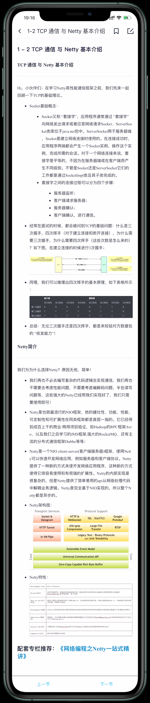

# 1-1 本章导航

* TCP通信与Netty基本介绍
* Netty极速入门+案例
* Netty技术选型应用于核心浅析
* Netty TCP拆包和粘包问题的处理
* Netty序列化实战Marshalling
* Netty序列化实在Protobuf
* Netty自定义协议实战
* Netty HTTP协议栈
* Netty HTTP协议栈 关于RxNetty Http应用
* Netty项目实战-数据可靠性通信场景分析与架构设计
* Netty项目实战-数据结构定于与分析
* Netty项目最佳实战-Server实现落地
* Netty项目最佳实践-Client实现落地
* Netty项目最佳实践-Netty负载均衡，高可用架构
* Netty项目最佳实践-性能调优实践-异步化数据处理
* Netty项目最佳实践-性能调用实践-Linux性能调优

# 1-2 TCP通信与Netty基本介绍

# 1-3 Netty极速入门

