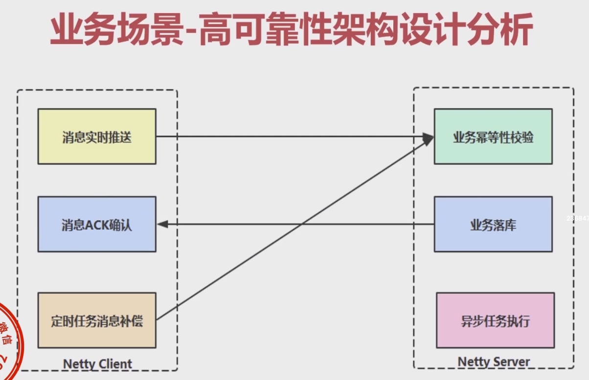
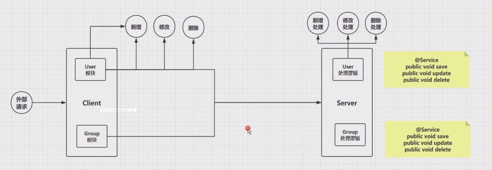

# 1-1 项目整体业务与技术实现

数据可靠性通信场景分析与架构设计

* 数据通信要求实时性高，且高性能，支持异构系统
* 需要保障不同的业务对应不同的实现
* 支持负载均衡策略、故障切换
* 需要可靠性保障的支持，数据不允许丢失

业务场景-高可靠性架构设计分析

Server端和Client端的设计

# 1-2 与Spring Boot整合环境介绍

这里主要介绍了项目的三个module，分别是：netty-client、netty-server、netty-common。

# 1-3 自定义数据格式定义讲解

使用protobuf定义user、group和message三种数据格式。

# 1-4 与Spring集成自定义注解扫描实现（上）

自定义注解`@Module`和`@Cmd`。

# 1-5 与Spring集成自定义注解扫描实现（下）

编辑`NettyProcessBeanSanner`对注解`@Module`和`@Cmd`进行扫描，并将注解标注的方法和类型进行预先加载扫描和缓存。

# 1-6 Server端封装与实现

* 在Server的处理链路上添加protobuf的handler
* 在`ServerHandler`中新启线程池去处理请求，并将响应返回给客户端

# 1-7 Client端落地封装与实现

