# 第18周 微服务架构认知、服务治理-Eurake

## 第一章 微服务拆分介绍

### 1-1 微服务介绍

### 1-2 微服务阶段课程概述

* Eurake：服务治理
* Ribbon：负载均衡
* Hystrix：服务容错
* Feign：服务间调用
* Config：分布式的配置中心
* Bus：消息总线
* Gateway：服务网关
* Sleuth：调用链追踪
* Stream：消息驱动
* Sentinel：限流
* 架构思考
* 业界案例
* Dubbo

### 1-3 为什么要将应用微服务化

### 1-4 微服务拆分的规范和原则

下面主要讲了四个原则，一压力模型拆分，二业务模型拆分，三领域模型拆分，四用户群体拆分

### 1-5 【架构思考】如何衡量微服务的利弊

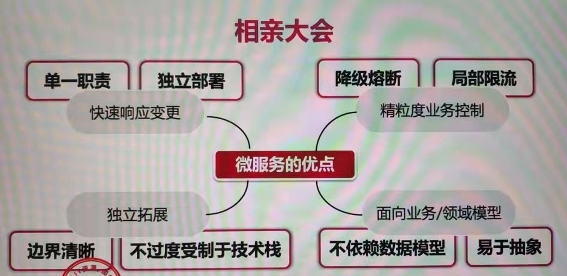

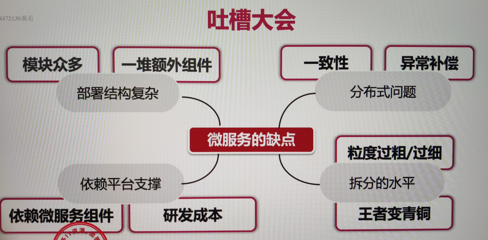

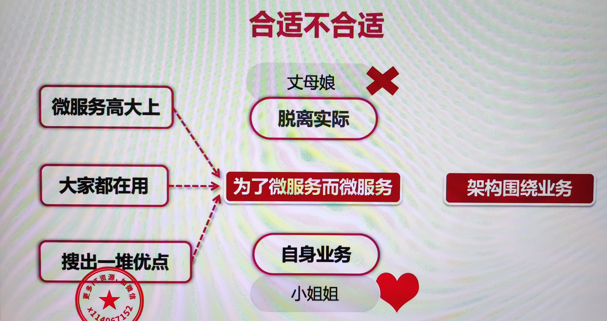

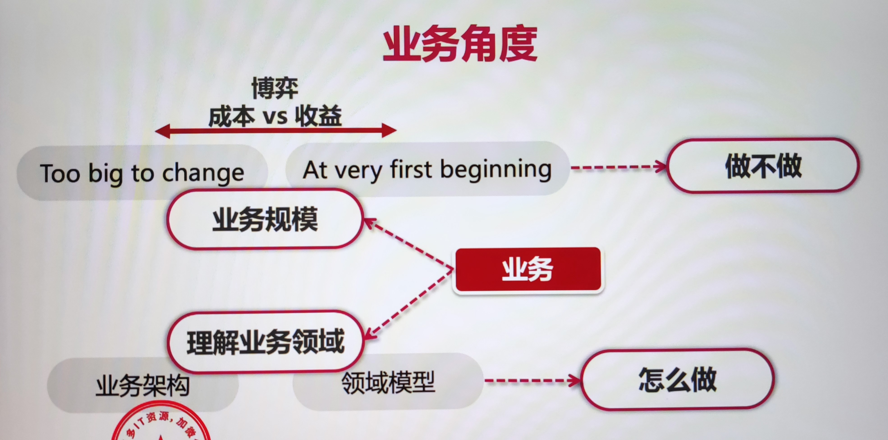

### 1-6 微服务架构所面临的技术问题

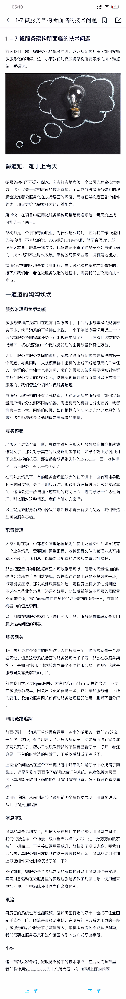

### 1-7 【案例分享】阿里新零售业务商品中心的微服务化过程

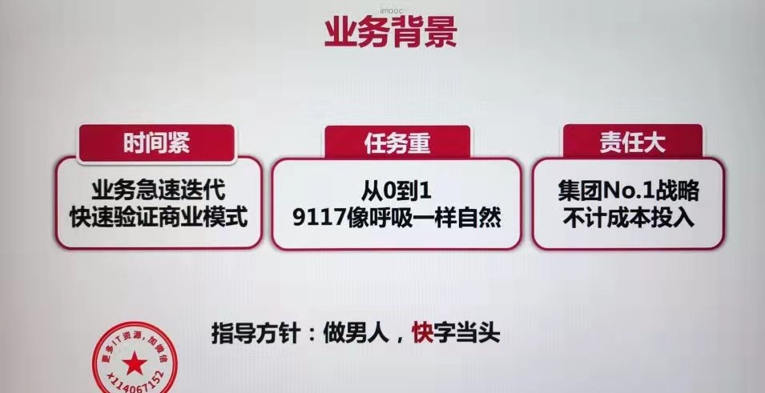

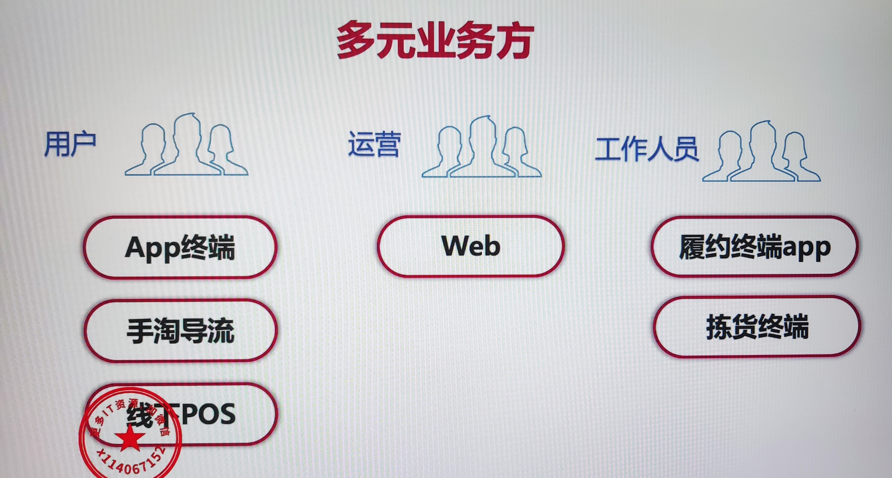

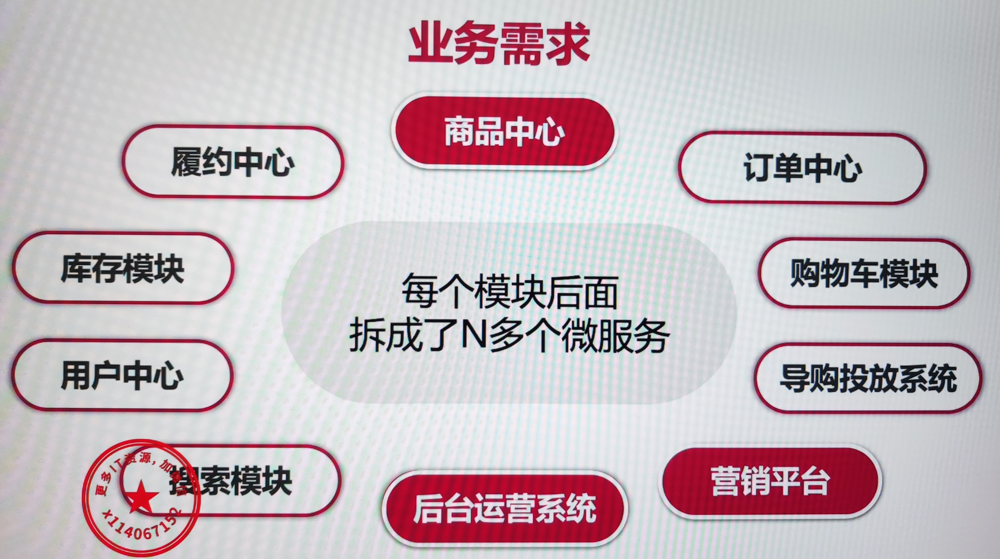

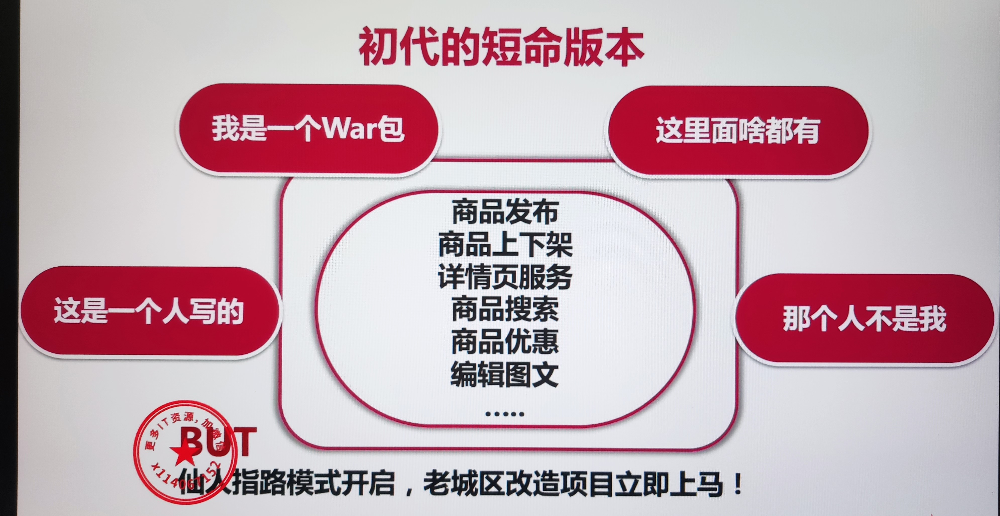

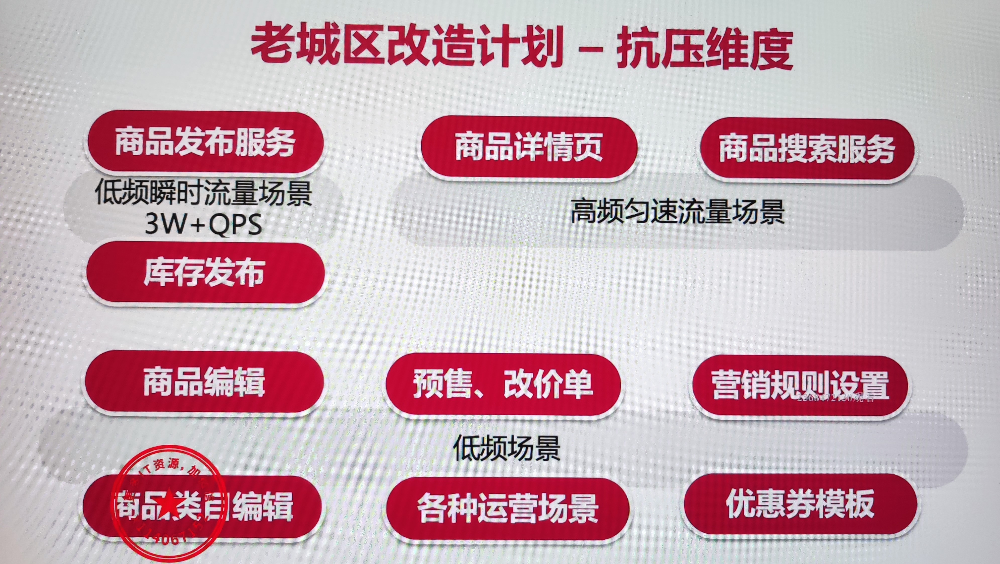

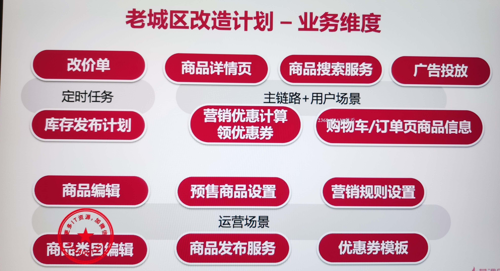

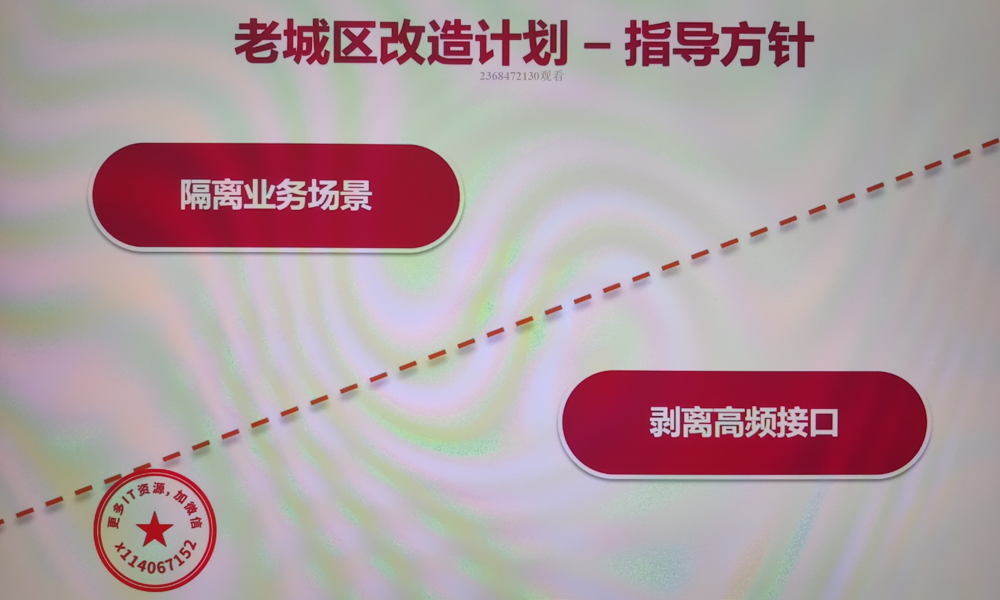

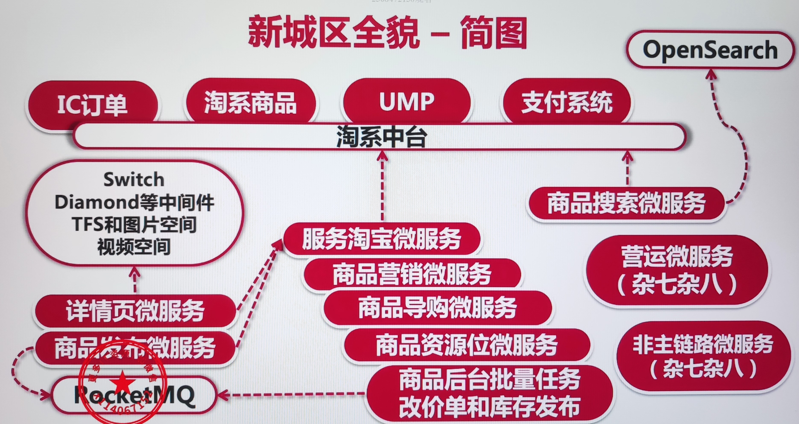

## 第二章 Spring Cloud简介

