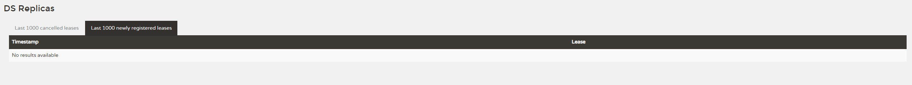

# 第18周 微服务架构认知、服务治理-Eurake

## 第一章 微服务拆分介绍

### 1-1 微服务介绍


### 1-2 微服务阶段课程概述

* Eurake：服务治理
* Ribbon：负载均衡
* Hystrix：服务容错
* Feign：服务间调用
* Config：分布式的配置中心
* Bus：消息总线
* Gateway：服务网关
* Sleuth：调用链追踪
* Stream：消息驱动
* Sentinel：限流
* 架构思考
* 业界案例
* Dubbo

### 1-3 为什么要将应用微服务化


### 1-4 微服务拆分的规范和原则

下面主要讲了四个原则，一压力模型拆分，二业务模型拆分，三领域模型拆分，四用户群体拆分


### 1-5 【架构思考】如何衡量微服务的利弊


### 1-6 微服务架构所面临的技术问题


### 1-7 【案例分享】阿里新零售业务商品中心的微服务化过程


## 第二章 Spring Cloud简介

### 2-1 本章概述

* 课程目录
  * Spring Cloud和微服务之间的关系
  * Spring Cloud整体架构
  * Spring Cloud组件库（产地来自三个地方：Netfix/Alibaba/开源社区）
  * 【架构思考】Spring Cloud疯狂更新-你的选择
  * 电商系统微服务化的构想
  * 开发环境和依赖组件的版本
  * 课程小节和作业

### 2-2 Spring Cloud和微服务架构的关系


### 2-3 Spring Cloud的整体架构


### 2-4 SpringCloud核心组件介绍


### 2-5 【架构思考】面对疯狂演进的版本，跟还是不跟？

* Spring的历史版本

  

* Spring对于每个大版本还会进行持续的维护

  

* Spring Cloud的维护策略

  

* 升级版本的利弊

  

* 推荐方式

  

### 2-6 【架构思考】电商系统微服务化的构想- 拆分规划

* 现有的项目结构

  

* 拆分计划

  

* 拆分后的项目结构

  

### 2-7 【架构思考】电商系统微服务化的构想- 微服务模块结构

* 微服务划分

  * 搜索服务：foodie-search

  * 商品服务：foodie-item

  * 购物车服务：foodie-cart

  * 权限校验服务：foodie-auth
  * 用户服务：foodie-user

  * 订单模块：foodie-order

* 服务内部结构

  其中Foodie-common会放到一个公共的服务中，不再单独出现在具体的服务中。

  

### 2-8 【架构思考】电商系统微服务化的构想- 微服务功能划分

1. 搜索服务：foodie-search

   

2. 商品服务：foodie-item

   

3. 购物车服务：foodie-cart

   

4. 权限校验服务：foodie-auth

   

5. 用户服务：foodie-user

   

6. 订单模块：foodie-order

   

### 2-9 Spring Cloud开机准备

首先Spring Cloud版本的开发代码，我们会基于Redis那一章节的逻辑进行升级（第七周）。这样主要是为了回顾第七周之后所学的知识点。


### 2-10 本周小结和作业


## 第三章 服务治理-Eurake

### 3-1. 本章概述

* 服务治理-概念&技术选型
* 深入Eurake-服务治理全链路（服务注册，服务发现，心跳和续约，服务下线、剔除和自保）
* 源码品读-服务注册、心跳检测和服务续约
* 注册中心高可用改造（双备份注册中心）
* 电商项目改造
* 课程小节和作业

### 3-2 什么是服务治理


### 3-3 注册中心知多少


### 3-4 服务治理技术选型

* 分布式系统中的CAP原理

  1. 一致性-Consistent
     * 强一致性：在任意时刻，所有节点中的数据是一样的。例如，对于关系型数据库，要求更新过的数据能被后续的访问都能看到，这是强一致性。（这里的C指的就是强一致性）
     * 弱一致性：数据更新后，如果能容忍后续的访问只能访问到部分或者全部访问不到，则是弱一致性。
     * 最终一致性：就是在一段时间后，节点间的数据会最终达到一致状态。

  2. 可用性-Availablity：每次请求都能获取到非错的响应，但是不保证获取的数据为最新数据。
  3. 分区容错性-Partition tolerance：指分布式系统中在遇到某个节点或网络分区故障时，仍能够对外提供服务。

  根据定理，分布式系统只能满足三项中的两项而不可能满足全部三项。理解CAP理论的最简单方式是想象两个节点分处分区两侧。允许至少一个节点更新状态会导致数据不一致，即丧失了C性质。如果为了保证数据一致性，将分区一侧的节点设置为不可用，那么又丧失了A性质。除非两个节点可以互相通信，才能既保证C又保证A，这又会导致丧失P性质。这里我们首先要保证P。

* 服务治理的组件

  1. Eurake
  2. Consul
  3. Nacos

* 服务治理组件比较

  

* 技术选型的思考

  

### 3-5 搭建注册中心

这个项目具体的实践内容参考：https://github.com/depers/mall/tree/master/mall/spring-cloud-demo

* 创建Demo顶层pom和子项目eurake-server

* 添加Eurake依赖

* 设置启动类

### 3-6 解读注册中心UI

启动eureka项目之后，浏览器访问http://localhost:20000/。下面我分模块介绍下各部分展示的逻辑：

#### 1. System Status


这面这块逻辑不用动，eurake默认展示。

*  Environment: 环境，默认为test，该参数在实际使用过程中，可以不用更改

* Data center： 数据中心

* Current time：当前的系统时间

* Uptime：已经运行了多少时间

* Lease expiration enabled：是否启用租约过期 ，自我保护机制关闭时，该值默认是true， 自我保护机制开启之后为false。

  和enable-self-preservation是否开启自我保护，密切关系

  当enable-self-preservation=false，自我保护关闭时，Lease expiration enabled显示为true

  当enable-self-preservation=true时，自我保护开启时，Lease expiration enabled显示为false

* Renews threshold： 每分钟最少续约数，Eureka Server 期望每分钟收到客户端实例续约的总数。
* Renews (last min)： 最后一分钟的续约数量（不含当前，1分钟更新一次），Eureka Server 最后 1 分钟收到客户端实例续约的总数。

#### 2. 红字提醒
 系统在三种情况下会出现红色加粗的字体提示：

a. 在配置上，自我保护机制关闭

RENEWALS ARE LESSER THAN THE THRESHOLD. THE SELF PRESERVATION MODE IS TURNED OFF.THIS MAY NOT PROTECT INSTANCE EXPIRY IN CASE OF NETWORK/OTHER PROBLEMS.

renewals are lesser than the threshold. the self preservation mode is turned off.this may not protect instance expiry in case of network/other problems.

b. 自我保护机制开启了

EMERGENCY! EUREKA MAY BE INCORRECTLY CLAIMING INSTANCES ARE UP WHEN THEY'RE NOT. RENEWALS ARE LESSER THAN THRESHOLD AND HENCE THE INSTANCES ARE NOT BEING EXPIRED JUST TO BE SAFE.

emergency! eureka may be incorrectly claiming instances are up when they're not. renewals are lesser than threshold and hence the instances are not being expired just to be safe.

c. 在配置上，自我保护机制关闭了，但是一分钟内的续约数没有达到85% ， 可能发生了网络分区，会有如下提示

THE SELF PRESERVATION MODE IS TURNED OFF.THIS MAY NOT PROTECT INSTANCE EXPIRY IN CASE OF NETWORK/OTHER PROBLEMS.

the self preservation mode is turned off.this may not protect instance expiry in case of network/other problems.

#### 3. DS Replicas（Discovery Service Replicas）


**Instances currently registered with Eureka**：目前在Eureka注册的实例。他的四个参数：

Application：服务名称。配置的spring.application.name属性

AMIs：n/a (1)，字符串n/a+实例的数量

Availability Zones：实例的数量

Status：实例的状态 + eureka.instance.instance‐id的值。

1. 实例的状态分为UP、DOWN、STARTING、OUT_OF_SERVICE、UNKNOWN.
2. UP： 服务正常运行，特殊情况当进入自我保护模式，所有的服务依然是UP状态，所以需要做好熔断重试等容错机制应对灾难性网络出错情况
3. OUT_OF_SERVICE : 不再提供服务，其他的Eureka Client将调用不到该服务，一般有人为的调用接口设置的，如：强制下线。
4. UNKNOWN： 未知状态
5. STARTING ： 表示服务正在启动中
6. DOWN： 表示服务已经宕机，无法继续提供服务

#### 4. General Info


total-avail-memory：当前eureka-server服务被分配的总可用内存

environment : 环境名称，默认test

num-of-cpus : CPU的个数

current-memory-usage : 当前已经使用内存的百分比

server-uptime : 服务启动时间

registered-replicas : 相邻集群复制节点

unavailable-replicas ：不可用的集群复制节点，如何确定不可用？ 主要是server1 向 server2和server3发送接口查询自身的注册信息，如果查询不到，则默认为不可用，也就是说如果Eureka Server自身不作为客户端注册到上面去，则相邻节点都会显示为不可用。

available-replicas ：可用的相邻集群复制节点

#### 5. Instance Info


ipAddr：eureka服务端IP

status：eureka服务端状态

#### 6. Last 1000 cancelled leases：最后1000个取消的租约


#### 7. Last 1000 newly registered leases：最后1000个新注册的租约



#### Reference

* https://www.jianshu.com/p/21f4e27482f3
* https://blog.csdn.net/qq_43456816/article/details/114239479

### 3-7 创建服务提供者

这个项目具体的实践内容参考：https://github.com/depers/mall/tree/master/mall/spring-cloud-demo/eureka/eureka-client

* 创建eureka-client子项目

* 添加pom依赖

* 创建启动类和服务内容

* 观察在注册中心的展示

  

### 3-8 服务注册知多少


### 3-9 【源码品读】服务注册源码探秘

Debug流程：

* org.springframework.cloud.client.discovery.EnableDiscoveryClient

* org.springframework.cloud.client.discovery.EnableDiscoveryClientImportSelector#selectImports

* org.springframework.cloud.client.serviceregistry.AutoServiceRegistrationConfiguration

* org.springframework.cloud.client.serviceregistry.AutoServiceRegistrationProperties，这里使用Find Usages

* org.springframework.cloud.client.serviceregistry.AbstractAutoServiceRegistration

* org.springframework.cloud.client.serviceregistry.ServiceRegistry

* org.springframework.cloud.netflix.eureka.serviceregistry.EurekaServiceRegistry#register

* org.springframework.cloud.netflix.eureka.serviceregistry.EurekaServiceRegistry#maybeInitializeClient

* com.netflix.appinfo.ApplicationInfoManager#getInfo

  

* org.springframework.cloud.netflix.eureka.serviceregistry.EurekaAutoServiceRegistration#start，这里的

  ```
  this.context.publishEvent(new InstanceRegisteredEvent<>(this,
        this.registration.getInstanceConfig()));
  ```

  这句代码需要好好探究下。

* com.netflix.discovery.DiscoveryClient#register

* com.netflix.discovery.shared.transport.decorator.EurekaHttpClientDecorator#register

* com.netflix.discovery.shared.transport.decorator.SessionedEurekaHttpClient

  ```java
  eurekaHttpClient = TransportUtils.getOrSetAnotherClient(eurekaHttpClientRef, clientFactory.newClient());
  ```

* com.netflix.discovery.shared.transport.decorator.RetryableEurekaHttpClient#execute

* com.netflix.discovery.shared.transport.decorator.RetryableEurekaHttpClient#getHostCandidates

* java.util.concurrent.atomic.AtomicReference#compareAndSet

* 这个中间还有几层装饰器，等待大家挖掘。

* com.netflix.discovery.shared.transport.jersey.JerseyApplicationClient

* com.netflix.discovery.shared.transport.jersey.AbstractJerseyEurekaHttpClient#register

看不懂的地方：

1. org.springframework.context.annotation.Import
2. org.springframework.boot.context.properties.ConfigurationProperties
3. org.springframework.boot.context.properties.EnableConfigurationProperties

### 3-10 基于客户端/服务端的服务发现


### 3-11 创建服务消费者

* 创建eureka-consumer子项目

  项目的具体内容，参考：https://github.com/depers/mall/tree/master/mall/spring-cloud-demo/eureka/eureka-consumer

* 添加pom依赖

* 创建启动类和Controller

* 向eureka-client发起调用，参见：cn.bravedawn.Controller
