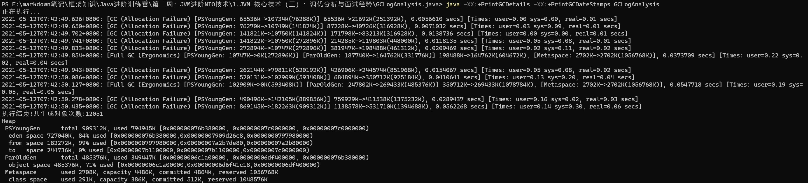

# 第3 课JVM 核心技术调优分析与面试经验
## 1. GC 日志解读与分析

### 1. 日志分析介绍

* 查看GC日志，日志中的参数含义分别是什么

  1. 编译：`javac .\GCLogAnalysis.java`

  2. 执行命令：`java -XX:+PrintGCDetails -XX:+PrintGCDateStamps GCLogAnalysis`

  3. 我们分析一下下面的这段日志

     

* 【问题】young GC和Full GC有什么区别

* Java8默认采用的是并行GC，默认的堆内存大概是物理内存的四分之一

* 堆内存的大小配置对性能有什么影响？

  堆内存配置较小的话，发生GC的频率较高，还会引发内存溢出，程序效率较低；

  提高堆内存的大小，发生GC的频率会降低，会提升程序的性能，会降低发生OOM的概率

* Young GC：只处理了堆里的年轻代
* Full GC：处理了堆里的年轻代和老年代，MateSpace区没有发生变化
* Minor GC（小型GC）：针对年轻代的GC
* Major GC（大型GC）：针对老年代的GC

### 2. 不同GC算法日志分析

#### 1.串行GC

* 在Minor GC下，主要是针对Eden区和存活区S0的处理

* 在FullGC下，只是针对老年代的处理

* 如何触发Full GC：将堆的大小缩小就可以触发

#### 2.并行GC

* 在Young GC，只处理Eden区和有数据的存活区，将数据复制到老年代。若是老年代内存不够，则触发Full GC

* 在Full GC下，既处理Young区，直接干到0；也处理老年代

* 如果不配置Xms 会怎么样？

  默认的Xms比较小，这样就会导致第一次GC的时间被提前

#### 3.CMS GC

* 假如Xmx/Xms 设置4g 会怎么样？

  设置成4g，只发生了Yong GC，没有发生CMS的并发GC。

#### 4. G1 GC

* 假如Xmx/Xms 设置4g 会怎么样？

  设置成4g，只发生了Yong GC

### 3.思考

1. 如何查看/分析不同GC 配置下的日志信息？
2. 各种GC 有什么特点和使用场景？

## 2. JVM线程堆栈数据分析

### 1. JVM线程模型

### 2. JVM内部线程分类

其中GC线程会暂停业务线程执行

### 3.安全点

### 4. 死锁检测

* 对于死锁的处理：

  1. 加超时时间
  2. 强制将一个死锁的线程干掉

* Java线程转储分析器：https://fastthread.io/

## 3. 内存分析与相关工具

思考：一个对象具有100个属性，与100个对象每个具有1个属性，哪个占用的内存空间更大？

答案是100个对象每个具有1个属性，因为前者更紧凑所占空间肯定更小

### 1.Java对象的内存占用情况

### 2.Java对象的内存占用分析

1. 对象头和对象引用
2. 包装类型
3. 多维数组
4. String

### 3.内存溢出问题分析

1. 堆内存溢出：OutOfMemoryError: Java heap space
2. 元数据内存溢出：OutOfMemoryError: PermGen space/OutOfMemoryError: Metaspace
3. 创建线程内存溢出：OutOfMemoryError: Unable to create new native thread

### 4.内存Dump分析工具

## 4. JVM 问题分析调优经验

### 1. 分配速率

* 分配速率，到底影响什么？

### 2. 过早提升

