# 第一章：初识Netty：背景、现状与趋势

## 01 课程介绍

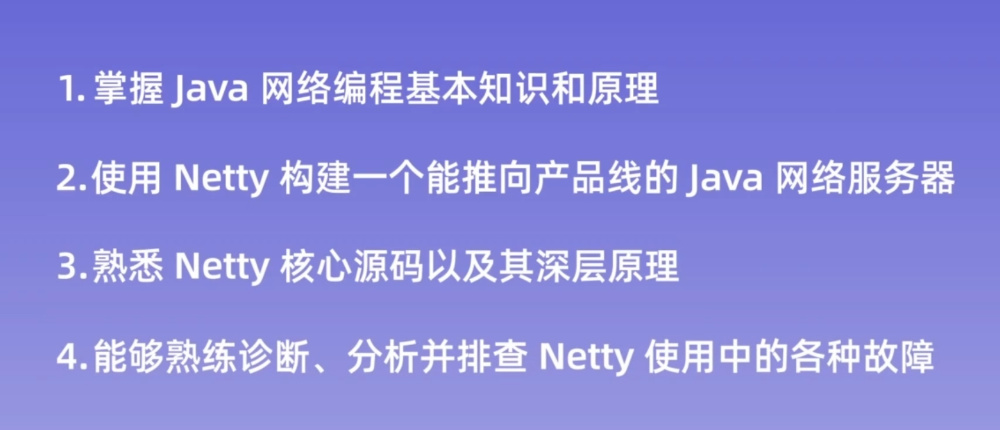

## 02 内容综述

介绍了六章的主要内容有哪些。

## 03 揭开Netty面纱

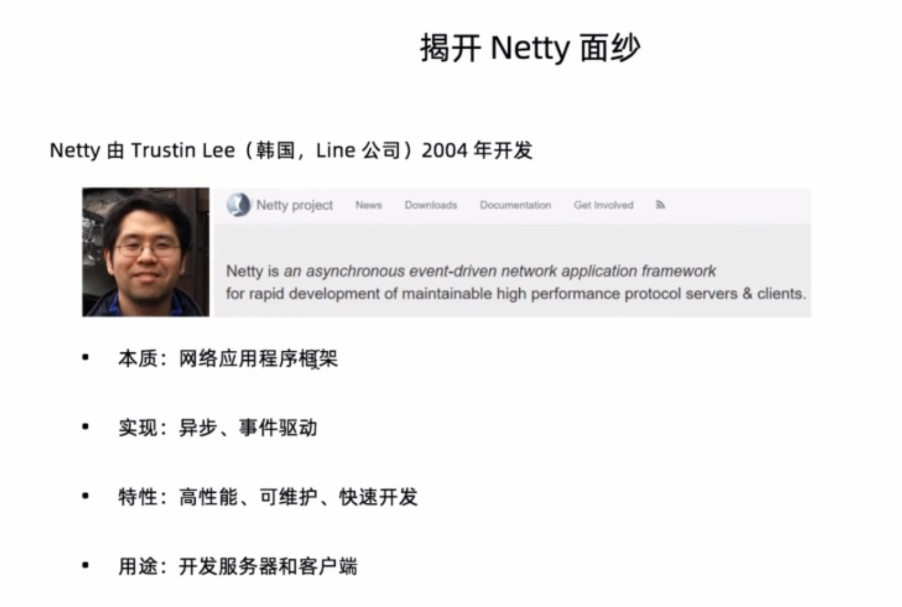

## 04 为什么舍近求远，不直接使用Java NIO

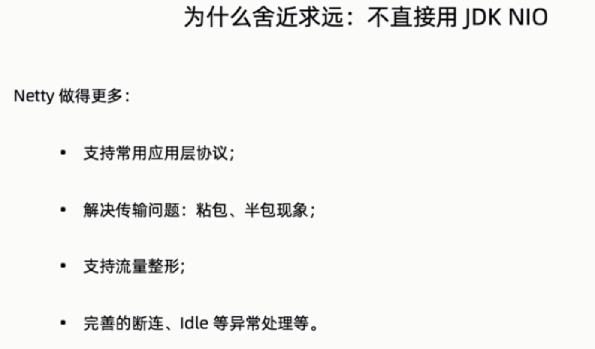

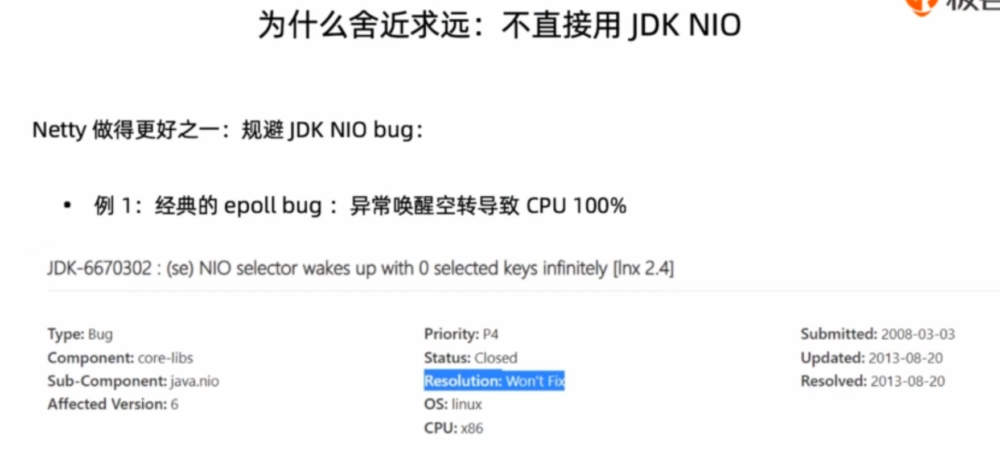

Netty是如何解决Epoll Bug的

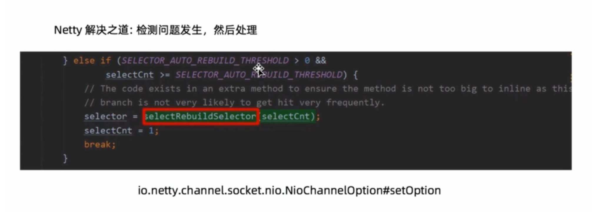

JDK的第二个bug

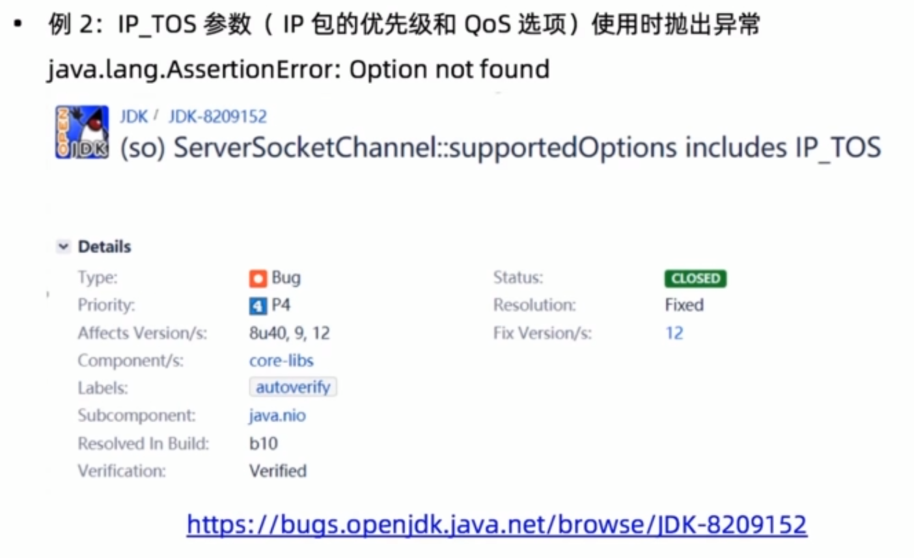

这个是怎么解决的呢？解决不就不支持。

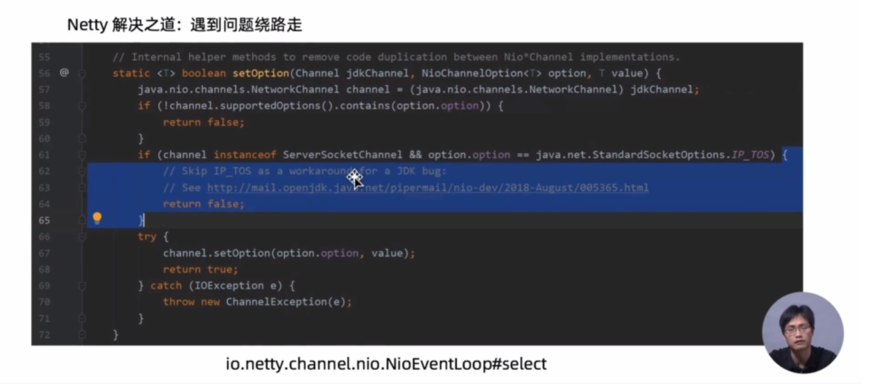

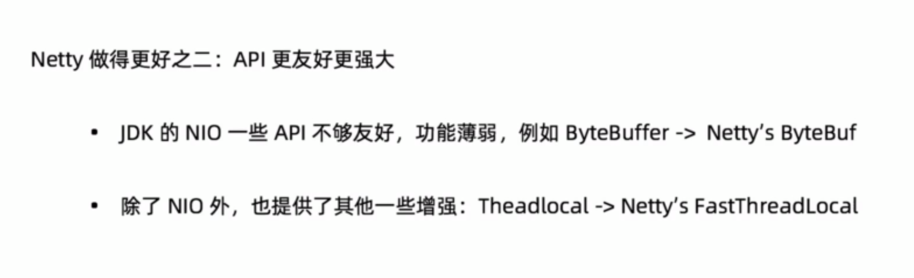

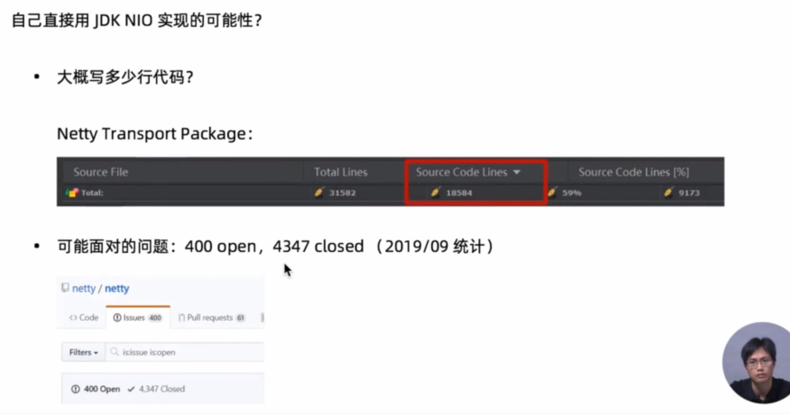

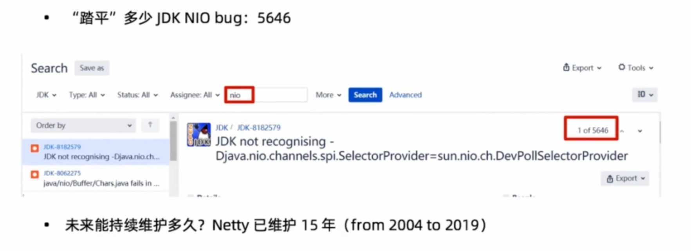

## 05 为什么要孤注一掷：独选Netty呢？

下面的这些框架中，Netty是完胜的。

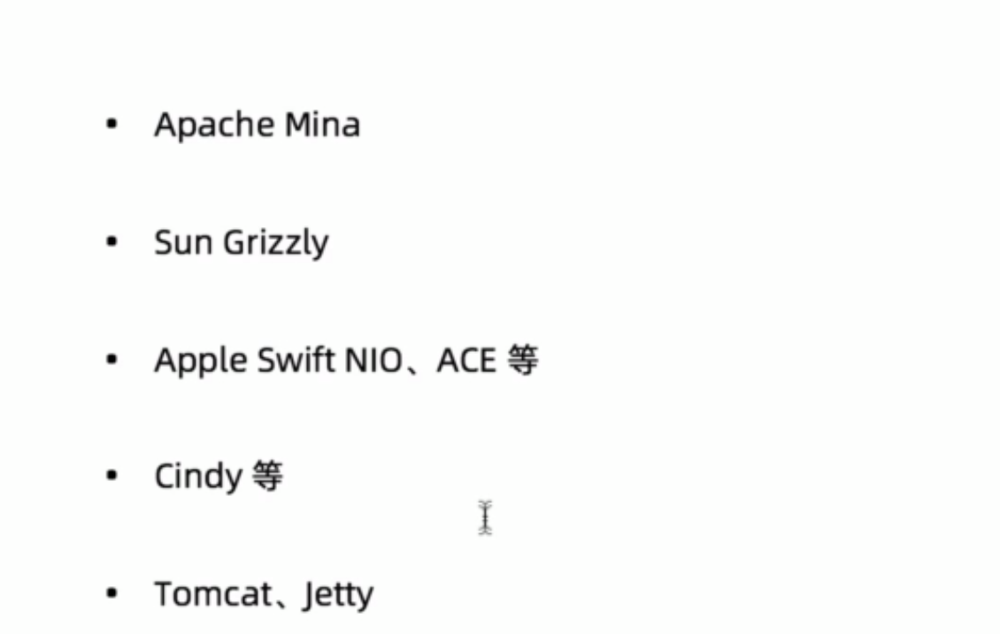

## 06 Netty的前尘往事

Netty前身是在JBoss社区下开发的项目，后来独立了社区来开发。

Netty和Mina的作者都是同一个人，但是Netty更好用。

## 07 Netty的现状与未来

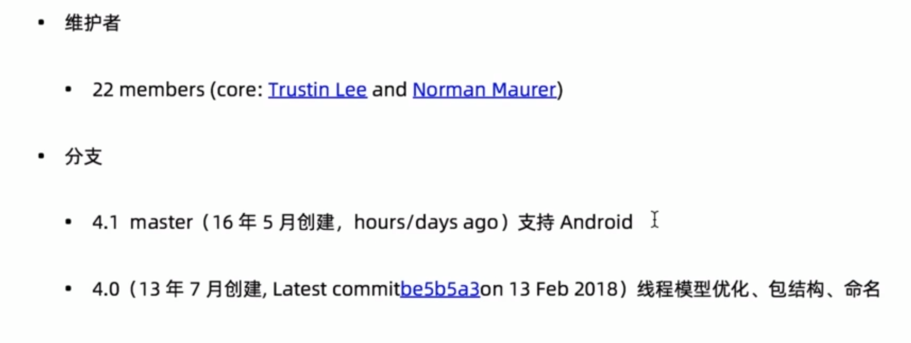

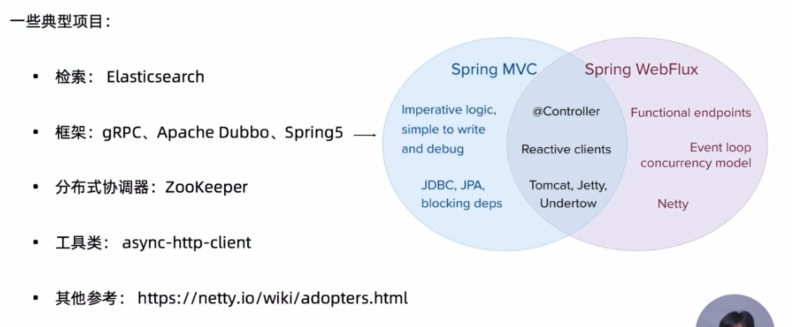

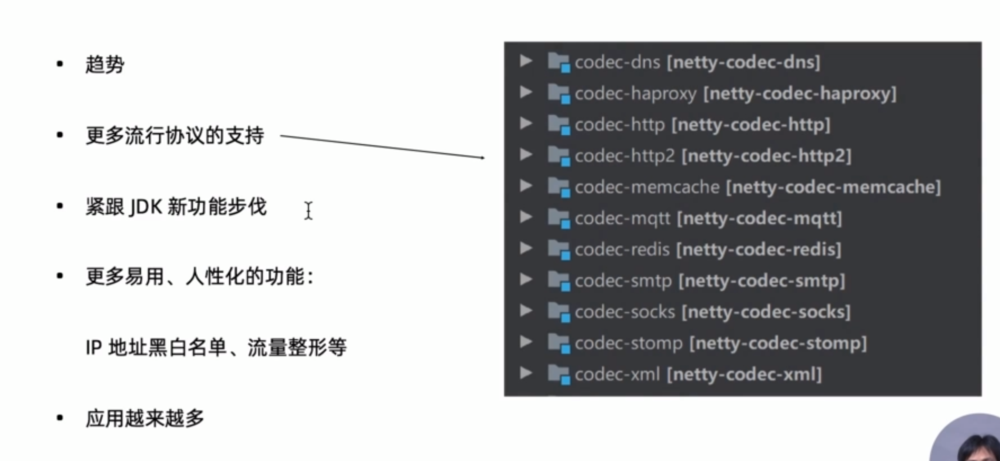
