# 第二章

## 08 Netty怎么切换三种IO模式

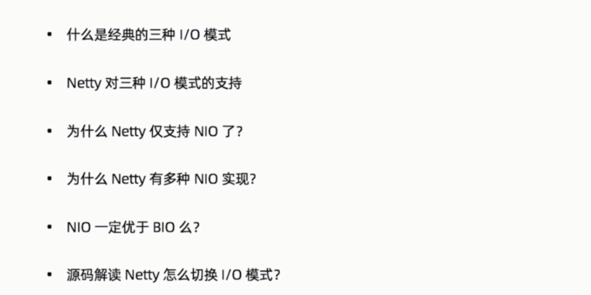

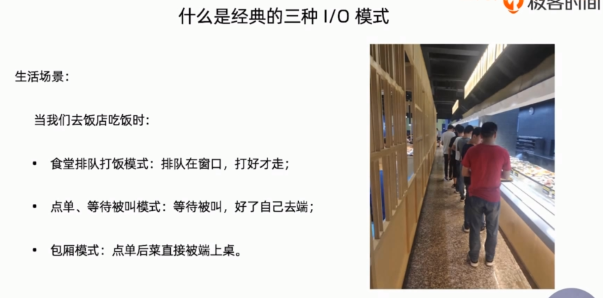

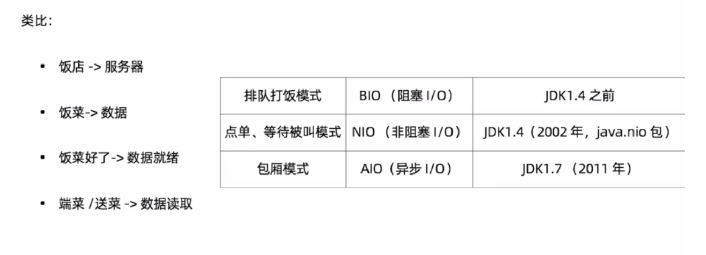

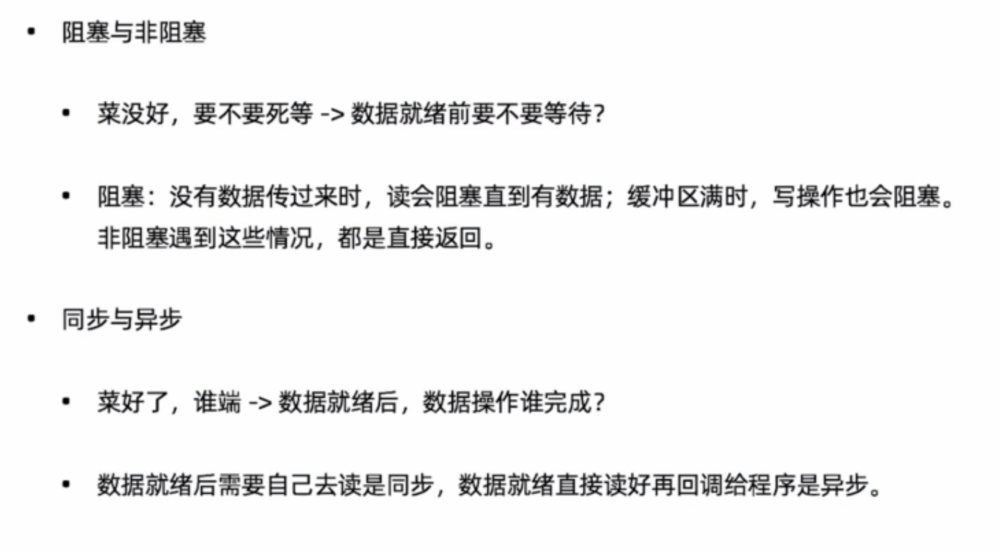

 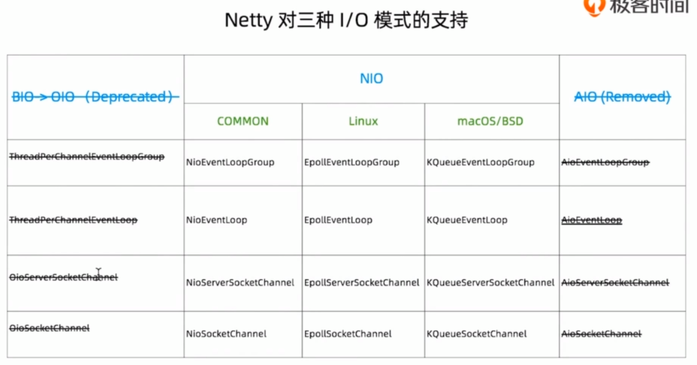

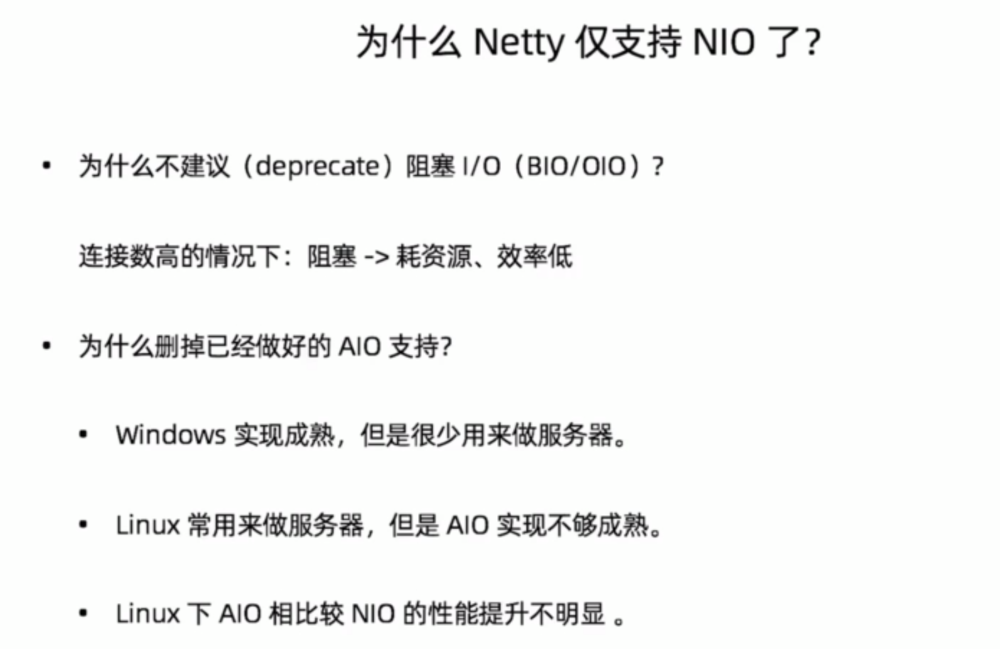

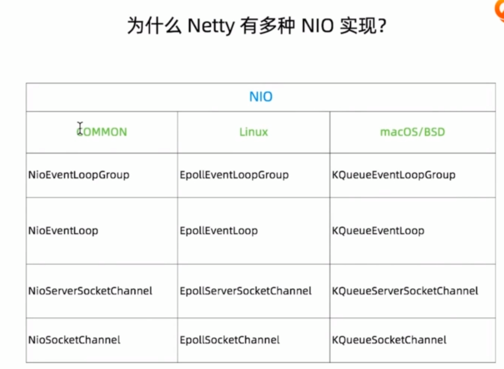

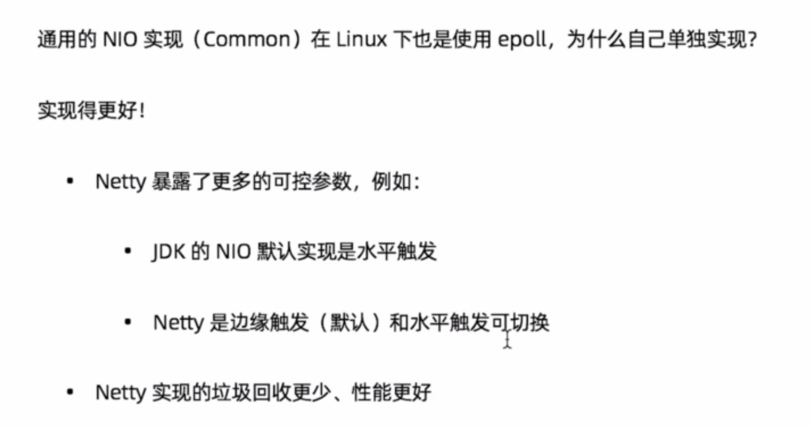

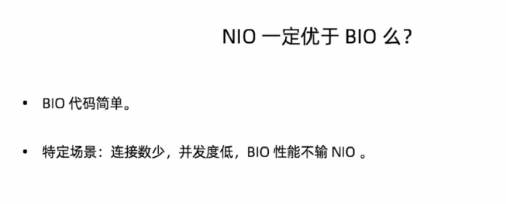

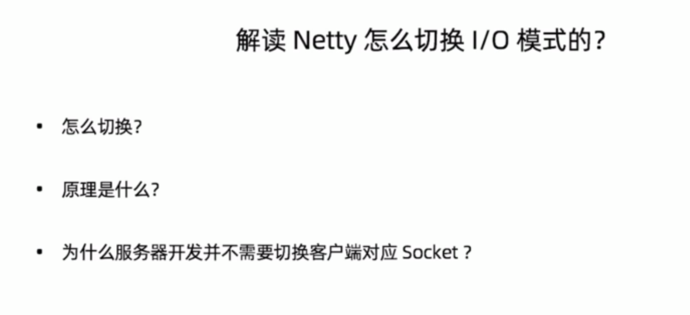

## 09 | 源码剖析：Netty对IO模式的支持

这一节主要介绍了上一节最后一张片子的三个问题，下面我来一一总结。

* 怎么切换
    1. 在服务端主程序中，将`NioEventLoopGroup`切换为`AIOEventLoopGroup`或是`OioEventLoopGroup`就可以切换为BIO或是AIO。
    1. 将`channel(NioServerSocketChannel.class)`中的`NioServerSocketChannel`换成`AIOServerSocketChannel`或是OioServerSocketChannel。
    
* 原理是什么

    * 在`NioEventLoop`中你就可以看到一个`run()`方法，这个是Netty实现个Reactor模型的关键。
    * 在`io.netty.bootstrap.AbstractBootstrap#channel`方法中，是通过**反射+泛型+工厂模式**实现了IO的切换。

* 为什么服务器开发不需要像客户端一样切换为Socket对象

    因为`NioServerSocketChannel`中有一个`o.netty.channel.socket.nio.NioServerSocketChannel#doReadMessages`方法，在这个方法中底层是通过Java的`ServerSocketChannel`封装的。

## 10 | Netty如何支持三种Reactor

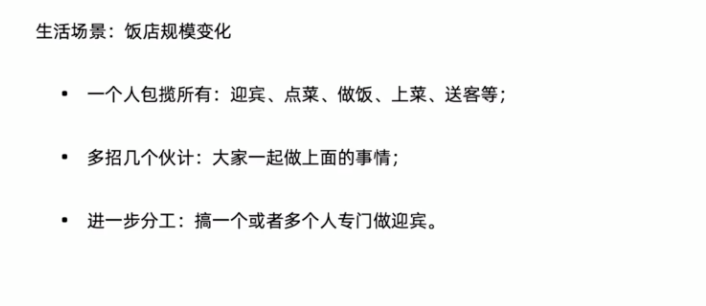

我们把服务端处理请求的过程抽象成我们饭店的生活场景，上面的第一种情况就是单线程，第二种是多线程，第三种是主从多线程，其中迎宾是饭店最重要的事情。

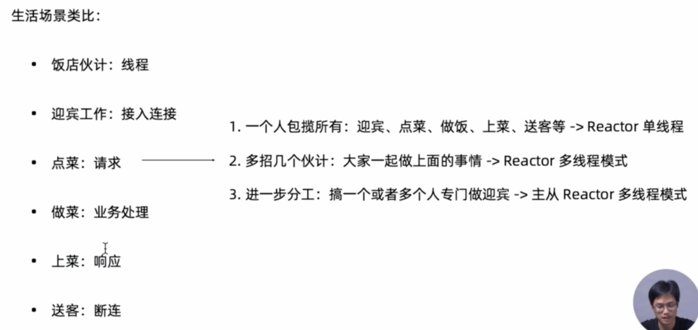

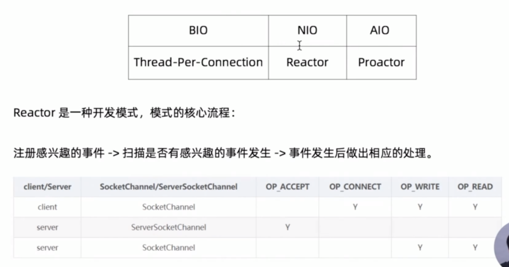

上图中针对Server端，`ServerSocketChannel`最重要的事情是接收客户端的请求，也就是”迎宾“。

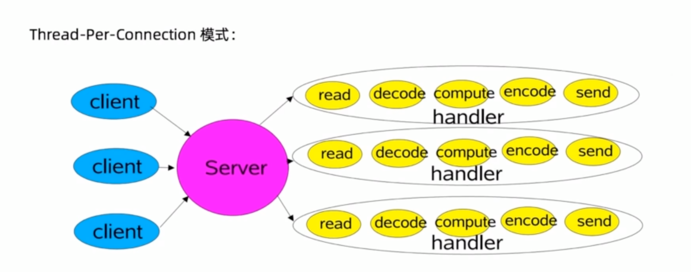

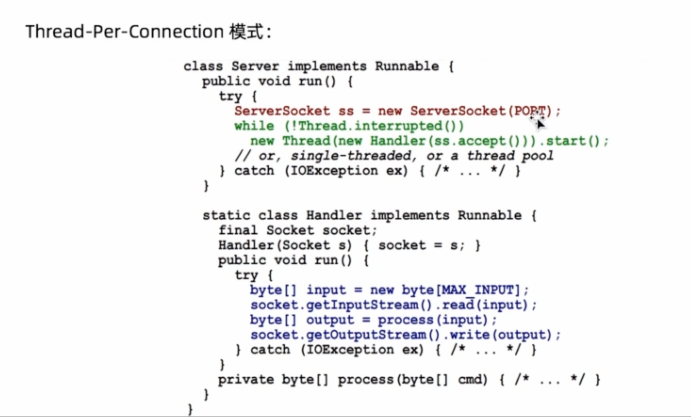

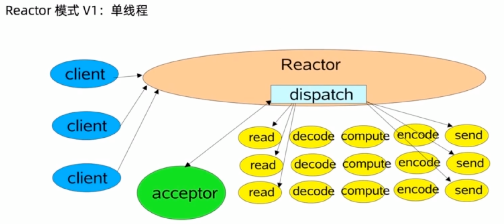

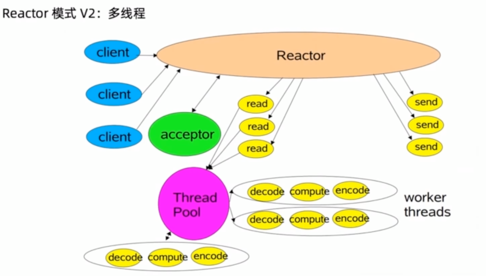

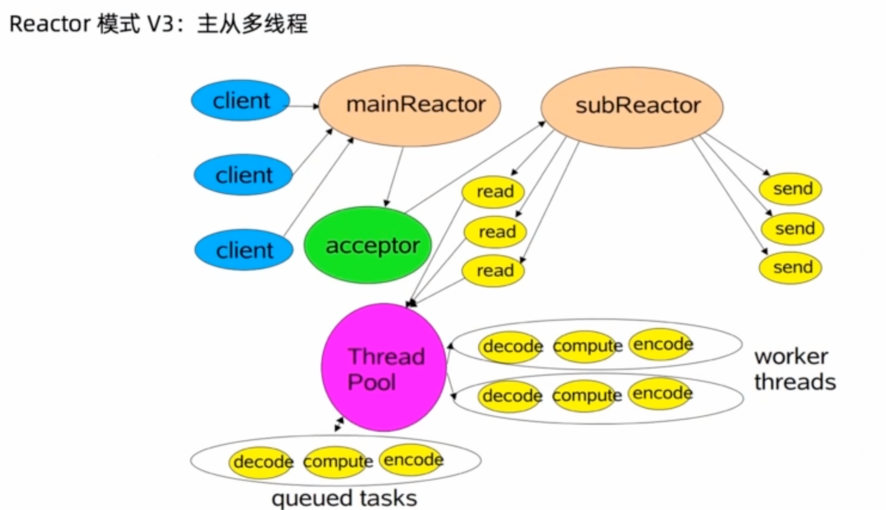

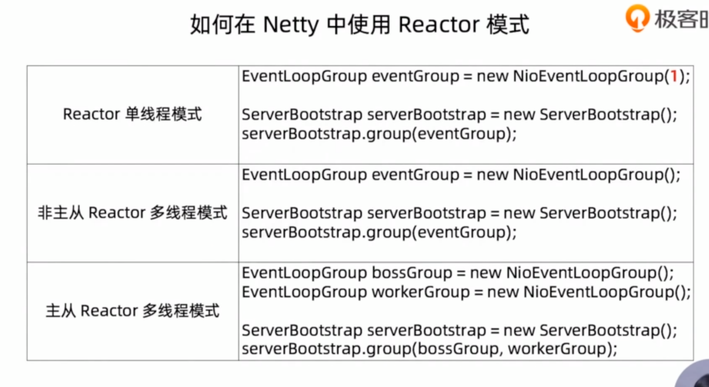

