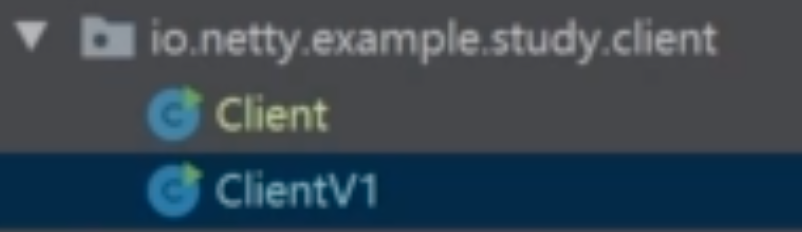

## 29 | 编写网络应用程序的基本步骤


## 30 | 案例介绍与数据结构设计


## 31 | 实现服务端编解码


## 32 | 实现一个服务器端

编写客户端。

## 33 | 实现一个客户端

编写服务端。  


## 34 | 完成一个客户端雏形



## 35 | 引入响应分发完善客户端

这一节很重要。


## 36 | Netty编码中易错点解析


* 第一个问题：initialBytesToStrip这个变量代表了在我们通过长度字段解析除了正文内容后，正文内容中是否包含长度，如果不包含长度则这个变量就要设置成长度字段的字节数，如果包含则这个变量应该设置为0，也就是说正文内容不跳过长度字段。

* 第二个问题：ChannelHandler的顺序采用V字形方法来梳理顺序，如下图：

    

* 第三个问题：这个问题主要是这个Handler是否有线程安全问题。关于这个问题的答案可以参考：https://mcnra9oc33tz.feishu.cn/wiki/KYx9wGlv0i2TVikUC1qcP08YnEb

* 第四个问题：在将对象转化为ByteBuf的时候，使用下面的代码，不要使用`ByteBufAllocator.DEFAULT`。

    ```
    ByteBuf byteBuf = ctx.alloc().buffer();
    ```

* 第五个问题：在我们自己写的业务处理`Handler`里面，要实现`SimpleChannelInboundHandler`，在`channelRead()`方法中他为我们做了buffer的释放操作。

* 第六个问题：`write()`方法只是将数据写到的队列并没有flush出去。

* 第七个问题：`ctx.channel.writeAndFlush()`会从 `ChannelPipeline` 的尾部开始，即从最后一个 `OutboundHandler` 开始执行。这意味着所有的 `OutboundHandler` 都会按照它们在管道中的顺序依次处理这个写操作。这种方式通常用于需要在整个处理器链中传播写操作的情况。

    `ctx.writeAndFlush()`写操作将从当前的 `ChannelHandler` 开始，并且只会执行当前 `ChannelHandler` 之后的 `OutboundHandler`。这意味着，如果在你的 `ChannelPipeline` 中有多个 `OutboundHandler`，只有紧随其后的 `OutboundHandler` 会处理这个写操作。这种方式通常用于在特定的处理器中发送响应或数据，而不希望在管道中的其他处理器中传播这个写操作。