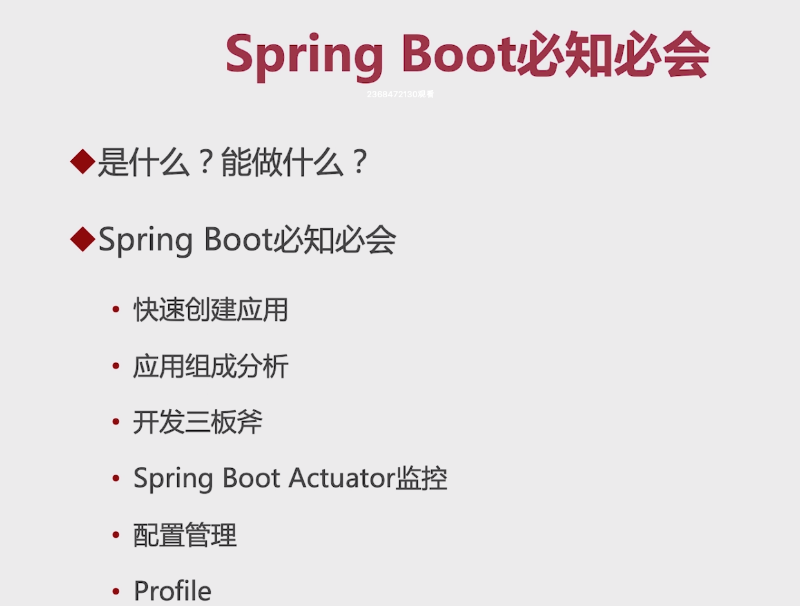
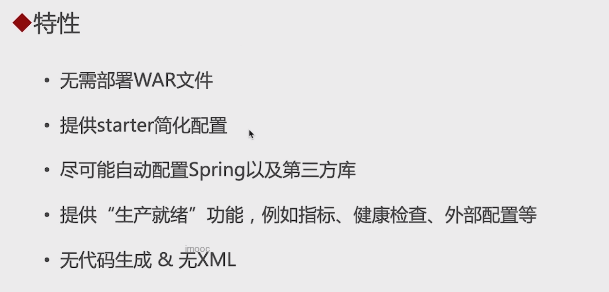
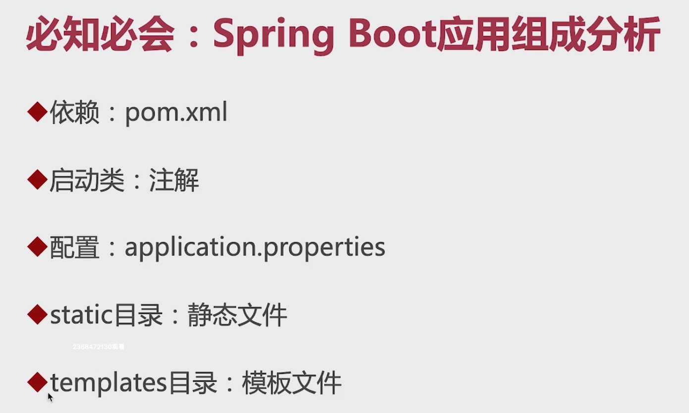
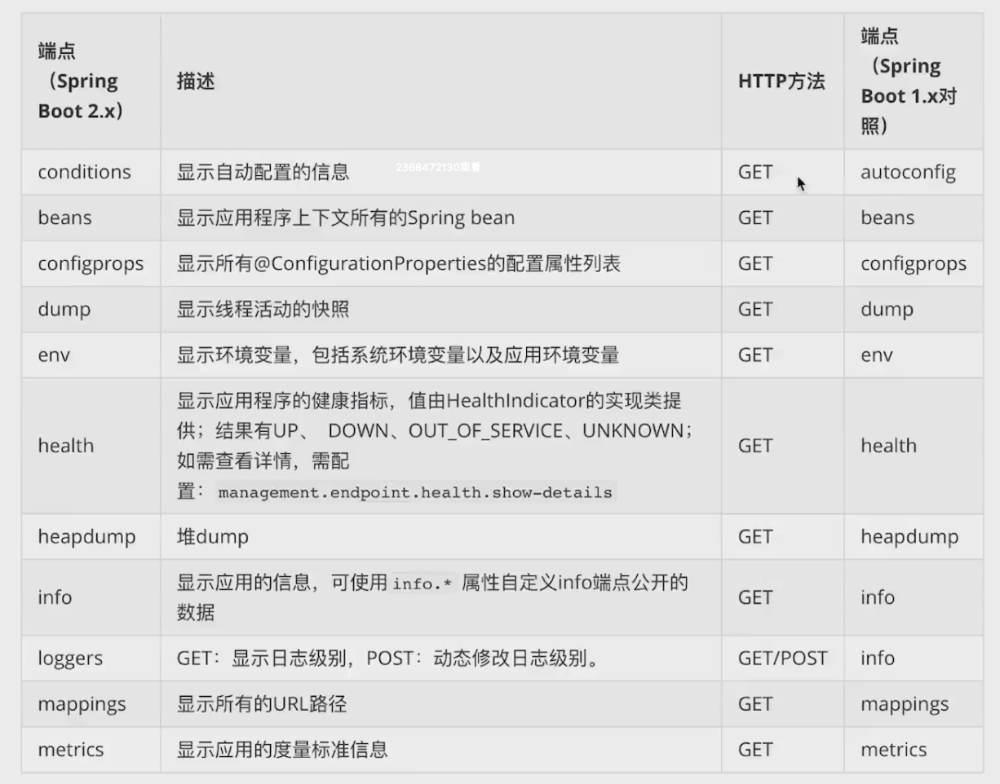
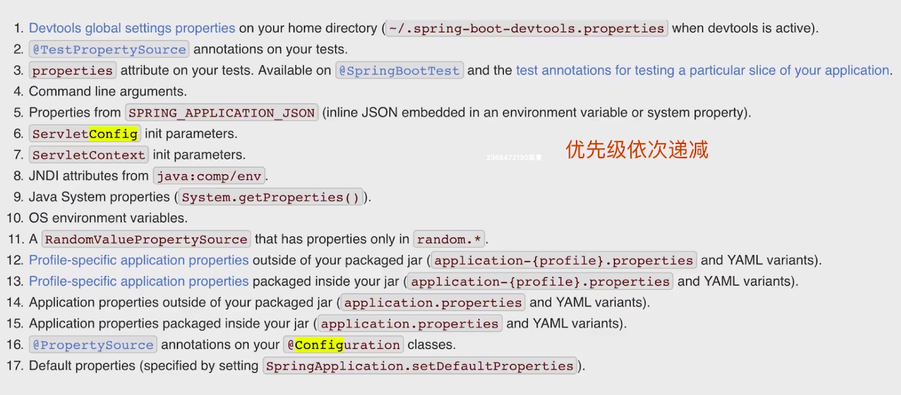

# 2-1 本章概述



# 2-2 Spring Boot是什么？能做什么？




 # 2-3 编写第一个Spring Boot应用

这里就是通过Spring Initializer创建项目。

# 2-4 Spring Boot应用的组成分析



# 2-5 Spring Boot开发三板斧

* 依赖整合：通过引入starter实现依赖的自动配置。
* 使用注解进行配置。
* 通过application.properties管理配置。

# 2-6 必会：Spring Boot Actuator

* 是Spring Boot提供的监控工具。

* 提供的端点，默认打开的端点：

    1. `/health：用来做健康检查的。
    2. `/info`：用来描述引用信息的。

* 常用端点

    

# 2-7 必会：Spring Boot配置管理

## 支持的配置文件格式

* .properties
* .yaml/.yml（推荐）
    * 优势：
        * 可读性更强；
        * 支持配置读取的有序性，这个是properties所不能的。

## 支持的配置方式

Spring Boot配置管理的17中姿势：



具体的文档可以参考：[24. Externalized Configuration](https://docs.spring.io/spring-boot/docs/1.3.9.BUILD-SNAPSHOT/reference/html/boot-features-external-config.html)

常用的配置管理方式：

1. 项目里面的配置文件

2. 环境变量

    比如我的properties文件中有一个配置：

    ```properties
    info.email=${email}
    ```

    这种读取环境变量的配置，要么在idea中运行前配置环境变量，要么在启动jar包的时候在启动命令后面添加：`--email=xxx`。

3. 外部配置文件

4. 命令行参数

    比如我们在启动jar包的时候可以直接指定配置：`java -jar xxx.jar --servlet.port=8080`

# 2.8 必会：Profile


