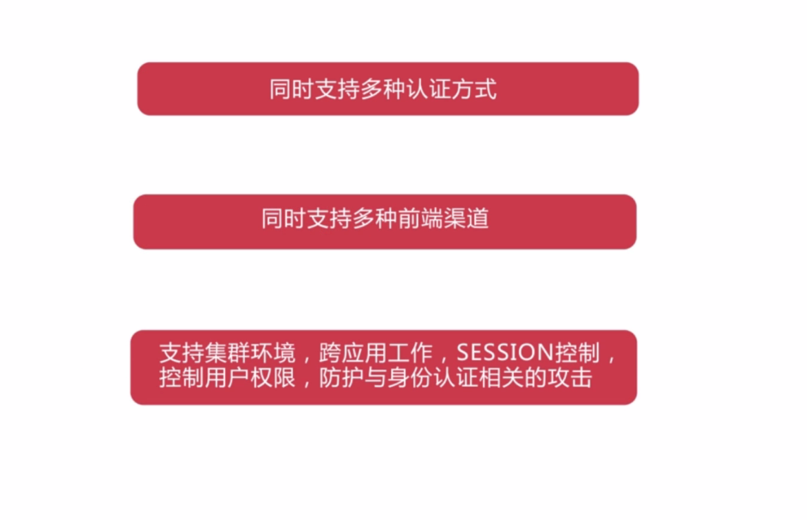
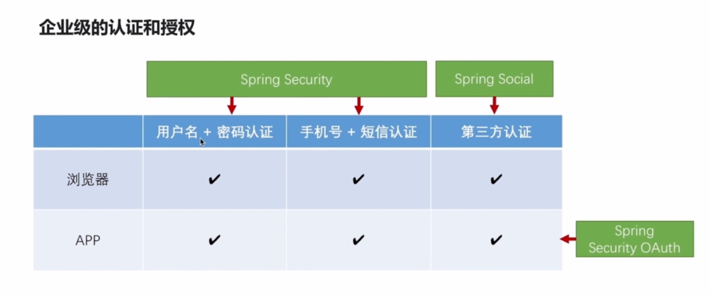
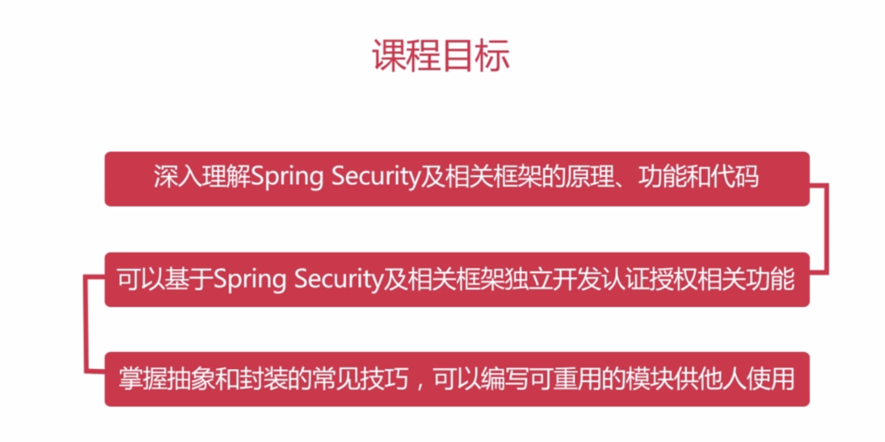
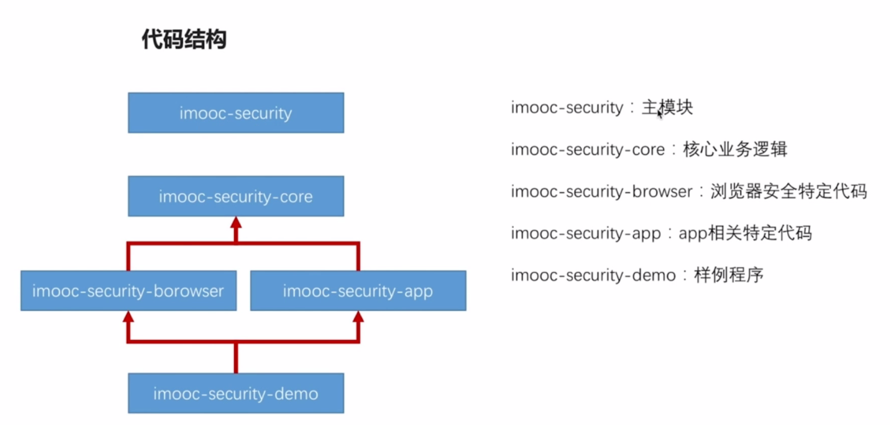
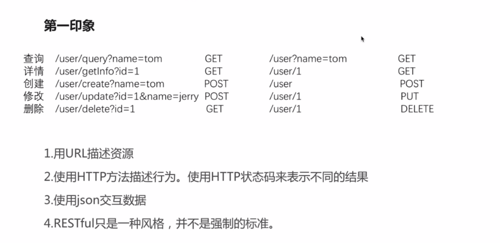
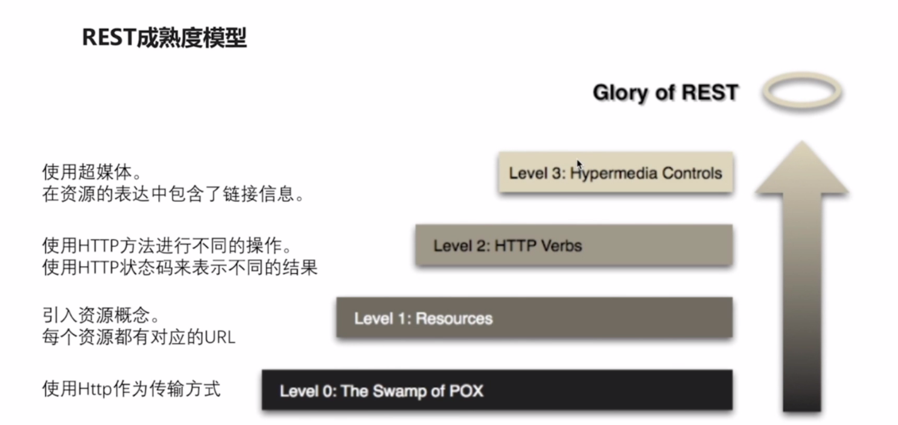

# Spring Security开发安全的REST服务

项目github地址：

## 第1章 课程导学

### 1.导学

* 企业级安全认证和授权模块考虑的问题和实现的特性

  

* 企业级认证和授权的组成

  

* 课程目标

  

## 第2章 开始开发

### 1.环境配置

* JDK1.8
* IDE
* MySQL

###  2.代码结构介绍

*  代码结构

  

* 分别在IDEA中新建spring-security、security-core、security-broewer、security-app和security-demo项目，按照项目示例代码的pom文件对上述的几个项目进行配置。

* spring-security module项目的pom文件解析

  ```xml
  <dependencyManagement>
      <dependencies>
          <dependency>
              <groupId>io.spring.platform</groupId>
              <artifactId>platform-bom</artifactId>
              <version>Brussels-SR4</version>
              <type>pom</type>
              <scope>import</scope>
          </dependency>
          <dependency>
              <groupId>org.springframework.cloud</groupId>
              <artifactId>spring-cloud-dependencies</artifactId>
              <version>Dalston.SR2</version>
              <type>pom</type>
              <scope>import</scope>
          </dependency>
      </dependencies>
  </dependencyManagement>  
  ```

  这里引入了spring.io和spring-cloud的作用：管理项目各依赖的版本，在开发过程中无需开发人员自己去选择合适的依赖版本。

### 3. Hello Spring Security项目实战

* 如何让maven项目打出spring boot 的可执行jar

  ```xml
  <build>
      <plugins>
          <plugin>
              <groupId>org.springframework.boot</groupId>
              <artifactId>spring-boot-maven-plugin</artifactId>
              <version>1.3.3.RELEASE</version>
              <executions>
                  <execution>
                      <goals>
                          <goal>repackage</goal>
                      </goals>
                  </execution>
              </executions>
          </plugin>
      </plugins>
      <finalName>demo</finalName>
  </build>
  ```

## 第三章 使用Spring MVC开发RESTful API

* Restful请求编写
* bernate.validator校验框架
* Controller测试案例的编写

### 1 Restful简介





### 2.查询请求

* 编写controller的测试案例

  ```java
  // 使用springRunner来运行这个类
  @RunWith(SpringRunner.class)
  @SpringBootTest
  public class UserControllerTest {
  
      @Autowired
      private WebApplicationContext wac;
  
      private MockMvc mockMvc;
  
      @Before
      public void setup(){
          // 伪造mvc环境
          mockMvc = MockMvcBuilders.webAppContextSetup(wac).build();
      }
  
      @Test
      public void whenQuerySuccess() throws Exception {
          mockMvc.perform(MockMvcRequestBuilders.get("/user")
          // 期望接收的参数是json格式     
          .contentType(MediaType.APPLICATION_JSON_UTF8))
          // 期望得到的响应状态码为200
          .andExpect(MockMvcResultMatchers.status().isOk())
          // 期望响应数据集合的长度是3
          .andExpect(MockMvcResultMatchers.jsonPath("$.length()").value(3));
      }
  }
  ```

* 使用注解声明RestFul API

  * 常用注解

    * @RestController标明此Controller提供RestAPI
    * @RequestMapping及变体。映射http请求url到java方法
    * @RequestParam映射请求参数到java 方法的参数
    * @PageableDefault指定分页参数默认值

  * 编写测试代码whenQuerySuccess方法的Controller代码

    ```java
    @GetMapping("/user")
    public List<User> getUserList(User user,
        @PageableDefault(size = 15, page = 1, sort = "age,asc") Page page){
        // 利用反射打印Object信息
        System.out.println(ReflectionToStringBuilder.toString(user));
    
        List<User> userList = Lists.newArrayList();
        userList.add(new User());
        userList.add(new User());
        userList.add(new User());
        return userList;
    }
    ```

* MockMvcResultMatchers.jsonPath()

  * JsonPath的github网站：https://github.com/json-path/JsonPath 

* @GetMapping注解中params参数详解

  * ```java
    @RequestMapping(value="/admin", method = RequestMethod.GET, params = "add")
    public String createCourse(){
        return "course_admin/edit";
    }
    ```

    * 映射地址/admin?add
    * 映射地址/admin?add=0  
    * 映射地址/admin?add=33
    * 映射地址/admin?add=*

### 3 用户详情请求

* @PathVariable：映射url片段到Java方法的参数

  ```java
  // 在url声明中使用正则表达式
  @GetMapping("/{id:\\d+}")
  @JsonView(User.UserInfoView.class)
  public User getUserInfo(@PathVariable String id){
      User user = new User();
      user.setUsername("tom");
      return user;
  }
  ```

* @JsonView控制json输出内容

  * @JsonView的使用步骤

    1. 使用接口来声明多个视图
    2. 在值对象的get方法上指定视图（如果项目中使用了lombok，则在对象的属性上指定视图）
    3. 在Controller方法上指定视图

  * 实战

    * cn.bravedawn.dto.User文件中

      ```java
      @Data
      public class User {
      
          // 使用接口来声明多个视图
          public interface UserSimpleView {};
          public interface UserInfoView extends UserSimpleView {};
      
          // 在对象的属性上指定视图
          @JsonView(UserSimpleView.class)
          private String username;
      
          @JsonView(UserInfoView.class)
          private String password;
      
          @JsonView(UserSimpleView.class)
          private int age;
      
      }
      ```

    * 在cn.bravedawn.web.controller.UserController

      ```java
      @GetMapping
      @JsonView(User.UserSimpleView.class)
      public List<User> getUserList(User user,
          @PageableDefault(size = 15, page = 1, sort = "age,asc") Pageable page){
          // 利用反射打印Object信息
          System.out.println(ReflectionToStringBuilder.toString(user));
      
          List<User> userList = Lists.newArrayList();
          userList.add(new User());
          userList.add(new User());
          userList.add(new User());
          return userList;
      }
      ```

### 4.用户创建请求

* @RequestBody映射请求题到Java方法的参数

  * 用法
    * 该注解适用于POST请求，因为他会接收content方法体中的参数，而GET方式无请求体 
    
    * 在post请求中，前端请求的参数会绑定到@RequestBody修饰的对象属性中。若在post请求中没有使用@RequestBody修饰的对象，则相关参数是不会绑定到对象的属性上
    
    * @RequestBody接收http请求中包裹在content中的参数
    
    * @RequestParam接收http请求中包裹在param中的参数
    
    * 若一个Controller方法中，即用了@RequestParam又用了@RequestBody。此时在该方法的参数中应该先写@RequestParam参数后写@RequestBody参数。例如：
    
      ```java
      public User create(@RequestParam String username, @Valid @RequestBody User user, BindingResult result){
      ```

* 日期类型参数的处理

  * 使用时间戳进行输出，在后端并不进行日期格式的装换

  * 通过日期获取时间戳：

    ```java
    Date date = new Date();
    System.out.println(date.getTime());
    ```

* @Valid注解和BindingResult验证请求参数的合法性并处理校验结果

  * controller方法：

    ```java
    public User create(@RequestParam String username, @Valid @RequestBody User user, BindingResult result){
    
    if (result.hasErrors()){
    	result.getAllErrors().stream().forEach(error -> System.out.println(error.getDefaultMessage()));
    }
    ```

  * User对象定义：

    ```java
    @Data
    public class User {
    
        // 使用接口来声明多个视图
        public interface UserSimpleView {};
        public interface UserInfoView extends UserSimpleView {};
    
        // 在对象的属性上指定视图
        @JsonView(UserSimpleView.class)
        @NotBlank
        private String username;
    
        @JsonView(UserInfoView.class)
        @NotBlank
        private String password;
    
        @JsonView(UserSimpleView.class)
        private int age;
    
        @JsonView(UserSimpleView.class)
        @NotBlank
        private String id;
    
        @JsonView(UserSimpleView.class)
        private Date birthday;
    }
    ```

### 5.修改和删除请求

hibernate.validator校验框架的学习：

1. 常用的验证注解

   

   

2. 自定义消息

   ```java
   @Past(message = "生日必须是过去的时间")
   private Date birthday;
   ```

3. 自定义校验注解

   1. 编辑校验注解cn.bravedawn.validator.MyConstraint

      ```java
      @Target({ElementType.METHOD, ElementType.FIELD})
      @Retention(RetentionPolicy.RUNTIME)
      @Constraint(validatedBy = MyConstraintValidator.class)
      public @interface MyConstraint {
      
          String message();
      
          Class<?>[] groups() default {};
      
          Class<? extends Payload>[] payload() default {};
      }
      ```

   2. 编辑校验规则实现类cn.bravedawn.validator.MyConstraintValidator。

      * 该校验规则类不用使用@Bean注解，该类会自动被spring注入；
      * 该类中也可以注入其他的类并调用他的方法；

      ```java
      public class MyConstraintValidator implements ConstraintValidator<MyConstraint, Object> {
      
          @Autowired
          private HelloService helloService;
      
          @Override
          public void initialize(MyConstraint myConstraint) {
              System.out.println("my validator init");
          }
      
          // 验证成功返回true，错误返回false
          @Override
          public boolean isValid(Object o, ConstraintValidatorContext constraintValidatorContext) {
              System.out.println("my validator value is : " + o);
              helloService.greeting("tom");
              return false;
          }
      }
      ```

   3. 在User对象中使用该注解

      ```java
      @MyConstraint(message = "测试message")
      private String username;
      ```
### 6.服务异常处理

1. Spring Boot中默认的错误处理机制

   1. 在Spring Boot中是如何处理error请求的？
      * 若用户是通过浏览器请求到了错误的页面，则会返回html页面。Spring Boot中代码实现org.springframework.boot.autoconfigure.web.BasicErrorController#errorHtml
      * 若用户是通过客户端发送的请求遇到错误，则会返回Json信息。Spring Boot中代码的实现org.springframework.boot.autoconfigure.web.BasicErrorController#error

2. 自定义异常处理

   自定义异常处理类cn.bravedawn.web.controller.ControllerExceptionHandler：

   ```java
   @ControllerAdvice
   public class ControllerExceptionHandler {
   
       @ExceptionHandler(UserNotExistException.class)
       @ResponseBody
       @ResponseStatus(HttpStatus.INTERNAL_SERVER_ERROR)
       public Map<String, Object> handleUserNotExistException(UserNotExistException ex) {
           Map<String, Object> result = new HashMap<>();
           result.put("id", ex.getId());
           result.put("message", ex.getMessage());
           return result;
       }
   
   }
   ```

### 7.使用切片拦截REST服务

1. 过滤器（Filter）

   1. 自定义请求计时的Filter，参见cn.bravedawn.filter.TimeFilter，所有的请求都会被这个Filter拦截。

   2. 如果项目中引用第三方的Filter，但是第三方的Filter是不能添加@Component注解的，如何在Spring Boot项目中引入第三方的Filter？

      编写配置类cn.bravedawn.config.WebConfig：

      ```java
      @Configuration
      public class WebConfig {
      
          @Bean
          public FilterRegistrationBean timeFilter() {
      
              FilterRegistrationBean registrationBean = new FilterRegistrationBean();
      
              TimeFilter timeFilter = new TimeFilter();
              registrationBean.setFilter(timeFilter);
      
              // 设置请求非拦截的路径，该处设置为所有请求路径
              List<String> urls = new ArrayList<>();
              urls.add("/*");
              registrationBean.setUrlPatterns(urls);
              return registrationBean;
          }
      }
      ```

   3. 采用Filter的不足：

      * 使用Filter是不能获取到具体是**那个Controller的那个方法**处理某一个请求。
      * 可以获取http请求和响应信息

2. 拦截器（Interceptor）

   1. 编写自定义拦截器cn.bravedawn.interceptor.TimeInterceptor，记得将该类声明为spring组件：

      ```java
      @Component
      public class TimeInterceptor implements HandlerInterceptor {
      
          /**
           * 该方法在进入控制器之前调用，该方法返回true之后，才会进入控制器
           * @param request
           * @param response
           * @param handler
           * @return
           * @throws Exception
           */
          @Override
          public boolean preHandle(HttpServletRequest request, HttpServletResponse response, Object handler) throws Exception {
              System.out.println("preHandle");
      
              System.out.println(((HandlerMethod)handler).getBean().getClass().getName());
              System.out.println(((HandlerMethod)handler).getMethod().getName());
      
              request.setAttribute("startTime", new Date().getTime());
              return true;
          }
      
          /**
           * 该方法在请求正常结束后调用，若报异常则不会调用该方法
           * @param request
           * @param response
           * @param o
           * @param modelAndView
           * @throws Exception
           */
          @Override
          public void postHandle(HttpServletRequest request, HttpServletResponse response, Object o, ModelAndView modelAndView) throws Exception {
              System.out.println("postHandle");
              Long start = (Long) request.getAttribute("startTime");
              System.out.println("time interceptor 耗时:"+ (new Date().getTime() - start));
          }
      
          /**
           * 在请求结束之后调用，若之前定义的ControllerExceptionHandler自定义异常处理类将异常处理之后，则该处的Exception e参数则为null
           * @param request
           * @param response
           * @param o
           * @param e
           * @throws Exception
           */
          @Override
          public void afterCompletion(HttpServletRequest request, HttpServletResponse response, Object o, Exception e) throws Exception {
              System.out.println("afterCompletion");
              Long start = (Long) request.getAttribute("startTime");
              System.out.println("time interceptor 耗时:"+ (new Date().getTime() - start));
              System.out.println("ex is "+ e);
          }
      }
      ```

   2. 对拦截器进行注册：

      ```java
      @Configuration
      public class WebConfig extends WebMvcConfigurerAdapter {
      
          @Autowired
          private TimeInterceptor timeInterceptor;
          
          @Override
          public void addInterceptors(InterceptorRegistry registry) {
              registry.addInterceptor(timeInterceptor);
          }
      }
      ```
      
   3. 采用拦截器的不足

      从上面的实例你可以看到，通过preHandle方法的handle方法，我们可以**获取请求调用的类和方法名**。但是并**不能获取请求的调用方法的具体参数**。

      在这里我们可以看下源码，在org.springframework.web.servlet.DispatcherServlet#doDispatch方法中：

      ```java
      // 如果preHandle方法返回false，则会直接return
      if (!mappedHandler.applyPreHandle(processedRequest, response)) {
      	return;
      }
      
      // 如果preHandle方法返回true，才会执行真正的
      // Actually invoke the handler.
      mv = ha.handle(processedRequest, response, mappedHandler.getHandler());
      ```

3. 切片（Aspect）

  **切片正好弥补了拦截器（Interceptor）的不足，它可以获取请求调用方法的具体参数。**但是他却**拿不到http请求和响应的信息。**

  1. 在security-demo引入AOP依赖
  
     ```
     <dependency>
     	<groupId>org.springframework.boot</groupId>
     	<artifactId>spring-boot-starter-aop</artifactId>
     </dependency>
     ```
  
  2. 切片的定义
  
     
  
     * 切片类
     * 切入点
     * 编写增强方法

### 8.Filter、Inteceptor、ControllerAdvice、Aspect和Controller的关系


* 6、7节所讲的内容的调用顺序如上图所示
* 从外到内，依次是Filter、Interceptor、ControllerAdvice、Aspect、Controller
* 从内到外，依次是Controller、Aspect、ControllerAdvice、Interceptor、Filter
* **若程序抛出异常，从内到外会依次传递，如果上述五层的某一层没有处理异常，则会继续向外层传递；若某一层处理了异常，则停止异常传递**
* 在Interceptor是不会进行任何异常处理的，如要进行异常的处理请在别的层级进行。

### 9.使用Rest方式处理文件服务

1. 编写文件上传的测试代码cn.bravedawn.UserControllerTest#whenUploadSuccess

2. 编写文件上传和文件下载的接口cn.bravedawn.web.controller.FileController

3. 其中在文件的下载代码中，涉及到了一个名为IOUtils的类，该类是在security-demo中的pom文件中引入了

   ```xml
   <dependency>
       <groupId>commons-io</groupId>
       <artifactId>commons-io</artifactId>
   </dependency>
   ```

### 10.异步处理REST服务


* 传统的同步处理机制，是主线程接收http请求，然后处理，最后主线程输出http响应
* 异步处理机制，是主线程接收http请求，副线程处理，最后再由主线程输出http响应。在副线程处理的时候，主线程还可以处理别的http请求，提高的服务的吞吐量。

1. 使用Runnable异步处理Rest服务

   * 编写代码cn.bravedawn.web.async.AsyncController#async

   * 执行的结果：

     

2. 使用DeferredResult一步处理Rest服务

   

   下面根据上图进行模拟：

   * 编写线程1：cn.bravedawn.web.async.AsyncController#async_de

   * 编写消息队列，并模拟应用2处理：cn.bravedawn.web.async.MockQueue

   * 编写线程2：cn.bravedawn.web.async.QueueListener#onApplicationEvent

   * 日志结果：

     

3. 异步处理配置

   在cn.bravedawn.config.WebConfig#configureAsyncSupport设置异步处理配置：

   ```java
   @Override
   public void configureAsyncSupport(AsyncSupportConfigurer configurer) {
       configurer
           // 设置callable拦截器
           .registerCallableInterceptors()
           // 设置DeferredResult拦截器
           .registerDeferredResultInterceptors()
           // 设置默认超时时间
           .setDefaultTimeout(1000)
           // 设置可重用的线程池
           .setTaskExecutor();
   }
   ```


### 11.使用swagger自动生成文档

1. 在security-demo项目中引入swagger相关依赖

   ```xml
   <!--引入swagger相关配置-->
   <dependency>
       <groupId>io.springfox</groupId>
       <artifactId>springfox-swagger2</artifactId>
       <version>2.7.0</version>
   </dependency>
   <dependency>
       <groupId>io.springfox</groupId>
       <artifactId>springfox-swagger-ui</artifactId>
       <version>2.7.0</version>
   </dependency>
   ```

2. 修改security-demo项目中的cn.bravedawn.DemoApplication

   ```java
   @EnableSwagger2
   ```

3. 常用的swagger注解

   * 写在controller类上

     ```java
     @Api(value = "购物车接口controller", tags = {"购物车接口相关的api"})
     ```

   * 写在controller方法上

     ```java
     @ApiOperation(value = "添加商品到购物车", notes = "添加商品到购物车", httpMethod = "POST")
     ```

   * 写在controller方法的参数上

     ```java
     @ApiParam(name = "itemId", value = "商品id", required = true)
                 @RequestParam String itemId
     ```

   * @ApiModel（）用于类：表示对类进行说明，用于参数用实体类接收

   * @ApiModelProperty（）用于方法，字段：表示对model属性的说明或者是数据操作更改

   * @ApiIgnore（）用于类，方法，方法参数：表示这个方法或者类被忽略

4. 更多详细的配置，请参见《Java架构师学习》中的“3.2 整合swagger2文档API”和“3.3 优化Swagger2显示”这两节的文档。

### 12.使用wiremock模拟rest服务

1. 在security-demo项目中引入swagger相关依赖

   ```xml
    <!--引入wiremock模拟后端数据-->
    <dependency>
        <groupId>com.github.tomakehurst</groupId>
        <artifactId>wiremock</artifactId>
    </dependency>
   ```

2. 下载wiremock程序包

   * wiremock官网地址：http://wiremock.org/

   * 启动wiremock jar文件

     ```
     java -jar wiremock-standalone-2.25.1.jar --port 8062
     ```

3. 编写Mock数据接口，详情参见cn.bravedawn.wiremock.MockServer

4. 启动项目，然后在浏览器中输入

## 第4章 使用Spring Security开发基于表单的登录

### 1.简介

Spring Security核心功能

1. 认证（你是谁）
2. 授权（你能干什么）
3. 攻击防护（防止伪造身份）

本章的主要内容：

1. Spring security基本原理
2. 实现用户名+密码验证
3. 实现手机号+短信认证

### 2.Spring Security基本原理

* 使用**httpBasic**方式验证身份

  1. 在security-demo项目中，修改application.properties

     ```java
     # 开启/关闭spring security默认验证配置
     security.basic.enabled = true
     ```

  2. 然后启动项目，在浏览器中请求http://localhost:8060/user，就会出现下图的图片：

     

  3. 然后在浏览器中输入用户名user，密码是项目启动时控制台打印的一串字符串：

     

  4. 登录之后就可以获取到请求的连接资源了

* 使用**formLogin**方式验证身份，在security-browser项目中配置security

  1. 编辑cn.bravedawn.browser.BrowserSecurityConfig

     ```java
     @Configuration
     public class BrowserSecurityConfig extends WebSecurityConfigurerAdapter {
     
         @Override
         protected void configure(HttpSecurity http) throws Exception {
             http.formLogin()
                     .and()
                     // 对请求进行授权配置
                     .authorizeRequests()
                     // 对所有请求
                     .anyRequest()
                     // 都要进行身份认证
                     .authenticated();
         }
     }
     ```

  2. 启动项目之后，在浏览器中输入http://localhost:8060/user，就会出现下图的图片，后面的操作和上面的一样。

     

  3. 如果你不想使用formLogin进行验证，想通过httpBasic方式进行验证，修改cn.bravedawn.browser.BrowserSecurityConfig：

     ```java
     @Configuration
     public class BrowserSecurityConfig extends WebSecurityConfigurerAdapter {
     
         @Override
         protected void configure(HttpSecurity http) throws Exception {
     
             //http..formLogin()
             // 采用默认方式验证
             http.httpBasic()
                     .and()
                     // 对请求进行授权配置
                     .authorizeRequests()
                     // 对所有请求
                     .anyRequest()
                     // 都要进行身份认证
                     .authenticated();
         }
     }
     ```

* Spring Security基本原理

  

  1. UsernamePasswordAuthenticationFilter（`http..formLogin()`）、BasicAuthenticationFilter（`http.httpBasic()`）

     定义用何种方式去进行身份验证

  2. FilterSecurityInterceptor

     * 过滤器链的最后一关（过了这一关之后直接就可以访问REST API）

     * 会根据绿色部分的过滤器的验证结果判断是否通行；

     * 若验证失败，他会根据不同的原因抛出响应的异常，异常抛向ExceptionTranslationFilter

  3. ExceptionTranslationFilter

     * 接收FilterSecurityInterceptor抛出的异常
     * 根据异常做出相应的处理，依据前面绿色部分的配置引导用户进行验证；
       * 若你是因为没有登录导致的异常，他会根据前面绿色过滤器的配置引导你去登录；
     
  4. 上述过滤器链的调用逻辑
  
     **FilterSecurityInterceptor-->ExceptionTranslationFilter-->UsernamePasswordAuthenticationFilter（验证逻辑的filter）**

### 3.自定义用户认证逻辑

1. 处理用户信息获取逻辑--UserDetailsService

   在项目sercurity-brower中，编辑cn.bravedawn.browser.MyUserDetailsService。在这个方法里面添加查询用户信息

2. 处理用户校验逻辑--UserDetails

   * 在项目sercurity-brower中，编辑cn.bravedawn.browser.MyUserDetailsService。对用户信息进行校验：

     ```java
     /**
     * 参数1：用户名
     * 参数2：密码
     * 参数3：校验用户是否可用
     * 参数4：校验用户是否没过期
     * 参数5：校验用户密码是否没过期
     * 参数6：校验用户是否没被锁
     * 参数7：权限信息数组
     */
     return new User(username, "123456", true, true, true, true,
     AuthorityUtils.createAuthorityList("admin"));
     ```

   * seceurty中org.springframework.security.core.userdetails.UserDetails接口的方法说明：
     * boolean isAccountNonExpired();
       * 校验用户是否**没过期**
     * boolean isAccountNonLocked();
       * 校验账户是不是**没锁定**
     * boolean isCredentialsNonExpired();
       * 校验密码是否**没过期**
     * boolean isEnabled();
       * 校验账户是否**可用**

3. 处理密码加密解密--PasswordEncoder

   * 编写spring security加密的实现类，在代码在security-browser的cn.bravedawn.browser.BrowserSecurityConfig中

     ```java
      /**
      * spring security默认密码实现配置
      * BCryptPasswordEncoder类是PasswordEncoder接口的实现类
      * @return
      */
      @Bean
      public PasswordEncoder passwordEncoder(){
      	return new BCryptPasswordEncoder();
      }
     ```

   * spring默认实现的加密算法，每次登陆的加密字符串都是不同的。如下图所示：

     

### 4.个性化用户认证流程

1. 自定义登录页面

   * 自定义登录页面配置

     1. 编辑cn.bravedawn.browser.BrowserSecurityConfig

        * 配置html登录页面
        * 配置登录逻辑的处理url
        * 若请求的url为/signIn.html，放开请求，无需身份认证
        * 关闭csrf防护

        ```java
        @Override
        protected void configure(HttpSecurity http) throws Exception {
        
            http.formLogin()
            //http.httpBasic()
            // 配置html登录页面
            .loginPage("/signIn.html")
            // 配置登录逻辑的处理url
            .loginProcessingUrl("/authentication/form")
            .and()
            // 对请求进行授权配置
            .authorizeRequests()
            // 若请求的url为/signIn.html，放开请求，无需身份认证
            .antMatchers("/signIn.html").permitAll()
            // 对所有请求
            .anyRequest()
            // 都要进行身份认证
            .authenticated()
            // 关闭csrf防护
            .and()
            .csrf().disable();
        }
        ```

     2. 编辑src/main/resources/resources/signIn.html

   * 处理不同类型的请求

   

     1. 编辑自定义的Controller方法，编辑cn.bravedawn.BrowserSecurityController

        ```java
        @RestController
        @Slf4j
        public class BrowserSecurityController {
        
            private RequestCache requestCache = new HttpSessionRequestCache();
        
            private RedirectStrategy redirectStrategy = new DefaultRedirectStrategy();
        
            @Autowired
            private SecurityProperties securityProperties;
        
            /**
            * 当需要身份认证时，跳转到这里
            *
            * @param request
            * @param response
            * @return
            * @throws IOException
            */
            @RequestMapping("/authentication")
            @ResponseStatus(code = HttpStatus.UNAUTHORIZED)
            public SimpleResponse requireAuthentication(HttpServletRequest request, HttpServletResponse response)
            throws IOException {
        
                // 获取之前请求的url
                SavedRequest savedRequest = requestCache.getRequest(request, response);
        
                if (savedRequest != null) {
                String targetUrl = savedRequest.getRedirectUrl();
                log.info("引发跳转的请求是:" + targetUrl);
                if (StringUtils.endsWithIgnoreCase(targetUrl, ".html")) {
                	redirectStrategy.sendRedirect(request, response, 	securityProperties.getBrowser().getLoginPage());
                }
                }
        
                return new SimpleResponse("访问的服务需要身份认证，请引导用户到登录页");
            }
        }
        ```

     2. 在security-demo项目中编写自定义登录页面，编辑src/main/resources/resources/demo-signIn.html

     3. 编写读取properties配置

      * 在security-demo项目中编辑src/main/resources/application.properties

        ```properties
        # 配置自定义登录页面路径
        bravedawn.security.browser.loginPage = /demo-signIn.html
        ```

      * 在security-core项目中编辑

        * cn.bravedawn.properties.BrowserProperties
        * cn.bravedawn.properties.SecurityProperties

      * 在security-core项目中配置读取属性配置，编辑cn.bravedawn.config.SecurityCoreConfig

     4. 在security-demo项目中，编辑cn.bravedawn.BrowserSecurityConfig，相关片段

      ```java
       // 配置身份校验路由
       .loginPage("/authentication")
       
       // 放开请求，无需身份认证
       .antMatchers(
           "/authentication",
           securityProperties.getBrowser().getLoginPage()
       ).permitAll()
      ```

2. 自定义登录成功处理--AuthenticationSuccessHandler

   * 在security-core中，编辑cn.bravedawn.properties.LoginResponseType

   * 在security-browser中，编辑cn.bravedawn.properties.BrowserProperties

     ```java
     private LoginResponseType loginResponseType = LoginResponseType.JSON;
     ```

   * 在security-browser中，编辑cn.bravedawn.authentication.CustomAuthenticationSuccessHandler

   * 在security-browser中，编辑cn.bravedawn.BrowserSecurityConfig

     ```java
     // 配置身份校验成功处理类
     .successHandler(customAuthenticationSuccessHandler)
     // 配置身份校验失败处理类
     .failureHandler(customAuthenticationFailureHandler)
     ```

   * 在security-demo中，编辑src/main/resources/resources/index.html

   * 在security-demo中，编辑src/main/resources/application.properties

     ```properties
     # 配置用户验证通过后的处理形式
     bravedawn.security.browser.loginResponseType = REDIRECT
     ```

3. 自定义登录失败处理--AuthenticationFailureHandler

   大部分操作和成功处理的差不多，只是编辑了cn.bravedawn.authentication.CustomAuthenticationFailureHandler。更多详情参见本节提交的commit。

### 5.认证流程源码详解

1. 认证处理流程说明，下面是整个调用的流程

   

   * org.springframework.security.web.authentication.AbstractAuthenticationProcessingFilter#**doFilter**
   * org.springframework.security.web.authentication.**UsernamePasswordAuthenticationFilter**#attemptAuthentication
   * 进行身份校验逻辑
     * org.springframework.security.authentication.**ProviderManager**#authenticate
     * org.springframework.security.authentication.dao.**AbstractUserDetailsAuthenticationProvider**#authenticate
     * 详细的身份校验逻辑
       * org.springframework.security.authentication.dao.**DaoAuthenticationProvider**#retrieveUser
       * org.springframework.security.core.userdetails.UserDetailsService#**loadUserByUsername**
       * org.springframework.security.authentication.dao.AbstractUserDetailsAuthenticationProvider.**DefaultPreAuthenticationChecks**#**check**
       * org.springframework.security.authentication.dao.**DaoAuthenticationProvider**#**additionalAuthenticationChecks**
       * org.springframework.security.authentication.dao.AbstractUserDetailsAuthenticationProvider.**DefaultPostAuthenticationChecks**#**check**
   * 校验之后的成功还是失败
     * org.springframework.security.web.authentication.AbstractAuthenticationProcessingFilter#**successfulAuthentication**
     * org.springframework.security.web.authentication.AbstractAuthenticationProcessingFilter#**successfulAuthentication**
     * cn.bravedawn.authentication.CustomAuthenticationSuccessHandler#**onAuthenticationSuccess**
     * org.springframework.security.web.authentication.AbstractAuthenticationProcessingFilter#**unsuccessfulAuthentication**
     * cn.bravedawn.authentication.CustomAuthenticationFailureHandler#**onAuthenticationFailure**

2. 认证结果如何在多个请求之间共享

   spring security将用户信息放到了session中，具体是如何操作的

   

   * 在org.springframework.security.web.authentication.AbstractAuthenticationProcessingFilter#successfulAuthentication方法中

     ```java
     SecurityContextHolder.getContext().setAuthentication(authResult);
     ```

   * org.springframework.security.core.context.SecurityContextImpl是SecurityContext的实现类

   * org.springframework.security.core.context.SecurityContextHolder是ThreadLocal的封装

     * Spring框架借助ThreadLocal来保存和传递用户登录信息。
     * ThreadLocal是线程级的程序变量，同一线程在不同的方法中可以对线程中变量进行设置和读取
     * 一般情况下一个访问的请求和响应都是在一个线程中进行的，也就是说把Authentication放入到当前的线程中，在另一个方法中还可以取出来

   * org.springframework.security.web.context.SecurityContextPersistenceFilter

     

     功能：

     1. 在请求进入之前，将用户信息从session中放入请求线程

     2. 在请求响应之后，从线程中把用户信息保存到session中

 3. 获取认证用户信息

    1. 通过SecurityContextHolder获取用户信息

      ```java
      @GetMapping("/me")
      public Object getCurrentUser(){
      	return SecurityContextHolder.getContext().getAuthentication();
      }
      ```

   2. 通过请求参数Authentication获取用户信息

      ```java
      @GetMapping("/me")
      public Object getCurrentUser(Authentication authentication){
      	return authentication;
      }
      ```

   3. 通过@AuthenticationPrincipal获取用户的主要信息

      ```java
      @GetMapping("/me")
      public Object getCurrentUser(@AuthenticationPrincipal UserDetails userDetails){
      	return userDetails;
      }
      ```

### 6.实现图形验证码功能

1. 开发生成图形验证码接口

   1. 在security-core中，编写cn.bravedawn.validate.code.ImageCode
   2. 在security-browser中，编写src/main/resources/resources/signIn.html，添加验证码的html
   3. 在security-core中，编写cn.bravedawn.validate.code.ValidateCodeController
      1. 根据随机数生成图片
      2. 将随机数存到session
      3. 在将生成的图片写到接口的响应中

2. 在认证流程中加入图形码校验

   1. 在security-core中编写cn.bravedawn.validate.code.ValidateCodeFilter

   2. 在security-code中编写cn.bravedawn.validate.code.ValidateCodeException

   3. 在security-browser中将图形码校验的filter加入认证流程

      ```java
      ValidateCodeFilter validateCodeFilter = new ValidateCodeFilter();
      validateCodeFilter.setAuthenticationFailureHandler(customAuthenticationFailureHandler);
      
      http
          // 在UsernamePasswordAuthenticationFilter之前校验图形验证码
         .addFilterBefore(validateCodeFilter,UsernamePasswordAuthenticationFilter.class)
      ```


### 7.图形验证码重构

1. 验证码基本参数可配置

   

   * 默认配置

     图形验证码的默认参数配置是在项目security-core的cn.bravedawn.properties.ImageCodeProperties

   * 应用级配置

     图形验证码的应用级配置是在项目security-demo的application.properties

     ```properties
     # 配置应用级图形验证码字符的长度
     bravedawn.security.code.image.length = 6
     bravedawn.security.code.image.width = 100
     ```

   * 请求级配置

     图形验证码的请求级配置：

     1. 在项目security-core的cn.bravedawn.validate.code.ValidateCodeController#createImageCode

        ```java
        // 请求参数级配置
        int width = ServletRequestUtils.getIntParameter(request.getRequest(), "width", securityProperties.getCode().getImage().getWidth());
        int height = ServletRequestUtils.getIntParameter(request.getRequest(), "height", securityProperties.getCode().getImage().getHeight());
        // 应用级配置
        int length = securityProperties.getCode().getImage().getLength();
        int expireIn = securityProperties.getCode().getImage().getExpireIn();
        ```

     2. 在项目security-brower的resources/signIn.html中

        ```html
        <tr>
            <td>图形验证码:</td>
            <td>
                <input type="text" name="imageCode">
                
            </td>
        </tr>
        ```

2. 验证码拦截的接口可配置

   1. 在项目security-core的cn.bravedawn.properties.ImageCodeProperties添加属性

      ```java
      // 需要验证码拦截的请求
      private String url;
      ```

   2. 在项目security-demo的application.properties配置url

      ```properties
      # 配置需要图形二维码验证的请求
      bravedawn.security.code.image.url = /user/*
      ```

   3. 编辑security-core中的cn.bravedawn.validate.code.ValidateCodeFilter

      * 实现接口InitializingBean并实现cn.bravedawn.validate.code.ValidateCodeFilter#afterPropertiesSet方法

      * 然后在cn.bravedawn.validate.code.ValidateCodeFilter#doFilterInternal方法中，添加请求拦截的验证

        ```java
        // 判断请求是否满足bravedawn.security.code.image.url配置的要求
        Boolean action = false;
        for (String url : urls){
            if(pathMatcher.match(url, request.getRequestURI())){
            	action = true;
            	break;
            }
        }
        if (action){
        ```

3. 验证码的生成逻辑可配置

   1. 在项目security-core中编写cn.bravedawn.validate.code.ValidateCodeGenerator接口，定义图形验证码生成方法
   2. 在项目security-core中编写cn.bravedawn.validate.code.ImageCodeGenerator，即图形验证码默认的具体实现
   3. 在项目security-core中编写图形验证码默认实现的配置类cn.bravedawn.validate.code.ValidateCodeBeanConfig
   4. 在项目security-demo中编写cn.bravedawn.code.DemoImageCodeGenerator用来取代图形验证码的默认实现。**在这个例子中通过编写接口，实现接口，配置接口从而实现了通过增量方式适应变化。**

### 8.记住我功能实现

1. 记住我功能基本原理

   

   

   上图中可以看到RememberMeAuthenticationFilter在过滤器链的位置。

2. 记住我功能具体实现

   1. 在项目security-browser的cn/bravedawn/BrowserSecurityConfig.java。加入记住我功能配置：

      ```java
      /**
      * 记住我功能配置
      * @return
      */
      @Bean
      public PersistentTokenRepository persistentTokenRepository(){
          JdbcTokenRepositoryImpl tokenRepository = new JdbcTokenRepositoryImpl();
          tokenRepository.setDataSource(dataSource);
          // 新建数据表之后注释这句代码
          // tokenRepository.setCreateTableOnStartup(true);
          return tokenRepository;
      }
      ```

   2. 在项目security-browser的cn/bravedawn/BrowserSecurityConfig.java添加认证流程配置：

      ```java
      // 配置记住我功能
      .rememberMe()
          .tokenRepository(persistentTokenRepository())
          .tokenValiditySeconds(securityProperties.getBrowser().getRememberMeSeconds())
          .userDetailsService(userDetailsService)
      ```

3. 记住我功能Spring Security源码解析

   * 向数据库和cookie保存token信息
     * 
   * 第二次登录时，校验token，无需登录