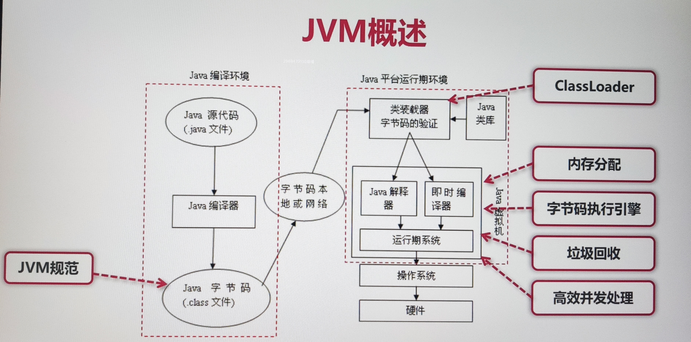
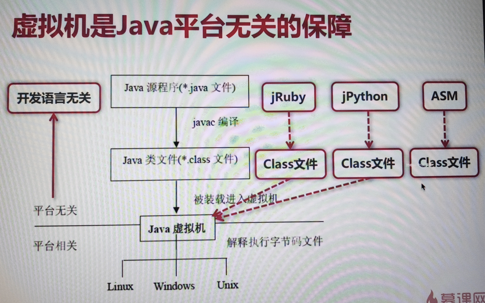

# 慕课网JVM实战课程

> 课程网址：https://coding.imooc.com/class/chapter/429.html#Anchor
>
> 开始时间：2023年1月5日
>
> 地点：陕西省西安市长安区融发心园3号楼3单元303室

## 第二章 认识JVM规范

### 2-1 从三种认知角度重识JVM

1. JVM概述

   * JVM：Java Virtual Machine，也就是Java虚拟机
   * 所谓虚拟机是指：通过软件模拟的具有完整硬件系统功能的、运行在一个完全隔离环境中的计算机系统。
   * JVM是通过软件来模拟Java字节码的指令集，是Java程序的运行环境。

2. 通过一张图来了解JVM

   

   * Java字节码文件需要遵守JVM规范进行编译生成。
   * 字节码文件通过ClassLoader加载到虚拟机。
   * 在Java虚拟机中，会为程序进行内存分配，然后放到字节码执行引擎中进行执行，运行过程中需要垃圾回收器进行垃圾回收，此外JVM还需要支持程序高效的并发处理。

3. 虚拟机是Java平台无关性的保障

   

### 2-2 JVM规范作用及其核心

1. JVM规范的作用

   * Java虚拟机规范为不同的硬件平台提供了一种编译Java技术代码的规范。

   * 该规范使Java软件独立于平台，因为编译是针对作为虚拟机的做的，与具体的硬件平台和操作系统无关。

2. Java规范定义的主要内容

   1. 字节码指令集（相当于中央处理器CPU）
   2. Class文件的格式
   3. 数据类型和值
   4. 运行时数据区
   5. 栈帧
   6. 特殊方法
   7. 类库
   8. 异常
   9. 虚拟机的启动、加载、链接和初始化

3. Java规范的网址：https://docs.oracle.com/javase/specs/index.html

### 2-3 理解JVM规范中的虚拟机结构

这里主要讲的还是JVM字节码指令这块的知识点。

### 2-4 如何学习JVM规范中的虚拟机结构

这部分的内容可以看《深入理解Java虚拟机》这本书的第六章6.4字节码指令简介的内容，也可以参考“**Note/读书笔记/《深入理解Java虚拟机》/第6章 类文件结构**”的内容。

