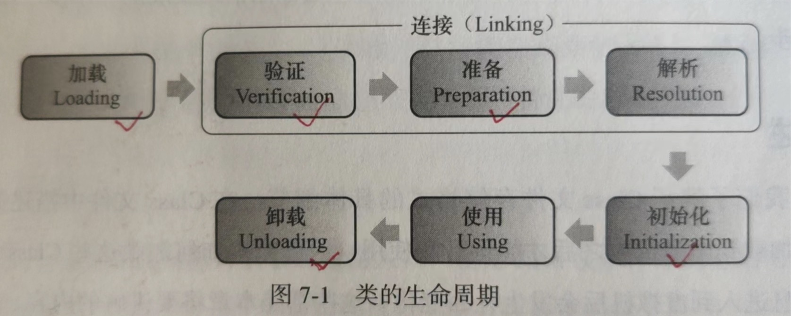
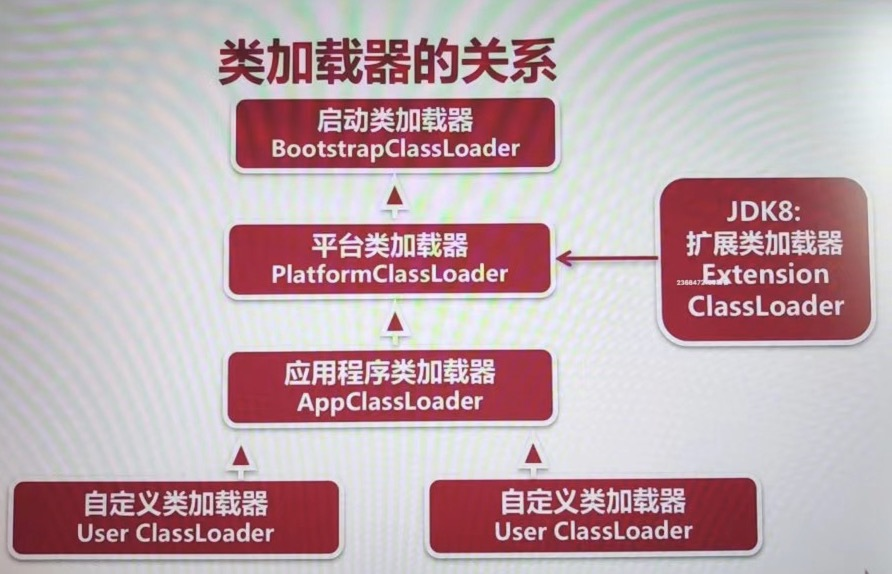

# 慕课网JVM实战课程

> 课程网址：https://coding.imooc.com/class/chapter/429.html#Anchor
>
> 开始时间：2023年1月5日
>
> 地点：陕西省西安市长安区融发心园3号楼3单元303室

## 第二章 认识JVM规范

### 2-1 从三种认知角度重识JVM

1. JVM概述

   * JVM：Java Virtual Machine，也就是Java虚拟机
   * 所谓虚拟机是指：通过软件模拟的具有完整硬件系统功能的、运行在一个完全隔离环境中的计算机系统。
   * JVM是通过软件来模拟Java字节码的指令集，是Java程序的运行环境。

2. 通过一张图来了解JVM

   

   * Java字节码文件需要遵守JVM规范进行编译生成。
   * 字节码文件通过ClassLoader加载到虚拟机。
   * 在Java虚拟机中，会为程序进行内存分配，然后放到字节码执行引擎中进行执行，运行过程中需要垃圾回收器进行垃圾回收，此外JVM还需要支持程序高效的并发处理。

3. 虚拟机是Java平台无关性的保障

   

### 2-2 JVM规范作用及其核心

1. JVM规范的作用

   * Java虚拟机规范为不同的硬件平台提供了一种编译Java技术代码的规范。

   * 该规范使Java软件独立于平台，因为编译是针对作为虚拟机的做的，与具体的硬件平台和操作系统无关。

2. Java规范定义的主要内容

   1. 字节码指令集（相当于中央处理器CPU）
   2. Class文件的格式
   3. 数据类型和值
   4. 运行时数据区
   5. 栈帧
   6. 特殊方法
   7. 类库
   8. 异常
   9. 虚拟机的启动、加载、链接和初始化

3. Java规范的网址：https://docs.oracle.com/javase/specs/index.html

### 2-3 理解JVM规范中的虚拟机结构

这里主要讲的还是JVM字节码指令这块的知识点。

### 2-4 如何学习JVM规范中的虚拟机结构

这部分的内容可以看《深入理解Java虚拟机》这本书的第六章6.4字节码指令简介的内容，也可以参考“**Note/读书笔记/《深入理解Java虚拟机》/第6章 类文件结构**”的内容。

### 2-5 Class字节码解析：理解ClassFile结构

1. 如何打开一个class文件，查看反编译的内容
   1. 通过Eclipse查看
   2. 通过16进制编辑器
   3. 通过`javap -v`查看

### 2-6 阅读Class字节码：常量池

参考“**Note/读书笔记/《深入理解Java虚拟机》/第6章 类文件结构**”的内容。

### 2-7 阅读Class字节码：类定义和属性

参考“**Note/读书笔记/《深入理解Java虚拟机》/第6章 类文件结构**”的内容。

### 2-8 阅读Class字节码：方法和方法调用

参考“**Note/读书笔记/《深入理解Java虚拟机》/第6章 类文件结构**”的内容。

### 2-9 ASM开发：编程模型和核心API

> 编码项目位于mall/jvm/jvm-demo

1. ASM概述
    * ASM是一个Java字节码操纵框架，它能被用来动态生成类或者增强既有类的功能。
    * ASM可以直接产生二进制class文件，也可以在类被加载入虚拟机之前动态改变类的行为，ASM从类文件中读入信息后，能够改变类行为，分析类信息，甚至能根据要求生成新类。
    * 目前许多框架入cglib，Hibernate，Spring都直接或间接的使用ASM操作字节码。
2. ASM编程模型
    * Core API：提供了基于事件形式的编程模型。该模型不需要一次性将整个类的结构读取到内存中，因此这种方式更快，需要更少的内存，但这种编程方式难度较大。
    * Tree API：提供了基于树形的编程模型。该模型需要一次性将一个类的完成结构全部读取到内存中，所以这种方式需要更多的内存，这种变成方式比较简单。
3. ASM的Core API
    * ASM Core API中操纵字节码的功能基于ClassVistor接口。这个接口中的每个方法对应了class文件中的每一项。
    * ASM提供了三个基于ClassVisitor接口的类来实现class文件的生成和转换。
        1. ClassReader：ClassReader解析一个类的class字节码。
        2. ClassAdapter：ClassAdapter是ClassVisitor的实现类，实现要变化的功能。
        3. ClassWriter：ClassWriter也是ClassVisitor的实现类，可以用来输出变化后的字节码。
4. ASM给我们提供了ASMifier工具来帮助开发，可使用ASMifier工具生成ASM结构来对比，然后编写自己的asm程序。

5. 使用ASMifier查看修改前代码的asm结构

    * Java源代码

        ```java
        public class Main {
        
            public void test() throws Exception{
                System.out.println("now in method test ---->");
                Thread.sleep(1000);
            }
        }
        ```

    * 使用ASMifier查看asm结构

        ```
        java -cp /Users/depers/Desktop/software/apache-maven-3.8.6/repository/org/ow2/asm/asm/9.4/asm-9.4.jar:/Users
        /depers/Desktop/software/apache-maven-3.8.6/repository/org/ow2/asm/asm-util/9.4/asm-util-9.4.jar org.objectweb.asm.util.ASMifier Main.class
        ```

6. 为代码添加运行耗时的计算逻辑

    第一种改法：

    ```java
    public void test() throws Exception {
    	  MyTimeLogger.start();
      	System.out.println("now in method test ---->");
      	Thread.sleep(1000L);
      	long var1 = System.currentTimeMillis();
      	MyTimeLogger.end();
    }
    ```

    第二种改法：

    ```java
    public void test() throws Exception {
        MyTimeLogger.start();
        System.out.println("now in method test ---->");
        Thread.sleep(1000L);
        long var1 = System.currentTimeMillis();
        MyTimeLogger.end();
    }
    ```

7. 通过ASMifier查看上面代码的asm结构，然后通过asm提供的api修改原有的class文件，上述两端代码的修改的程序可以参考cn.bravedawn.jvm.asm.MyClassVisitor.MyMethodVisitor和cn/bravedawn/jvm/asm/MyClassVisitor2。

8. 接着运行生成器修改已经编译好的class文件，具体可以参考cn.bravedawn.jvm.asm.Generator和cn.bravedawn.jvm.asm.Generator2。

9. 此时我们编写测试类，就可以发现asm针对字节码的修改意见体现到了程序中。这里代码可以参考cn.bravedawn.jvm.asm.MyTest和cn.bravedawn.jvm.asm.MyTest2。

### 2-10 ASM开发：ClassVisitor开发

参见2-9的内容，代码位于jvm-demo的cn/bravedawn/jvm/asm包下。

### 2-11 ASM开发：MethodVisitor开发

参见2-9的内容，代码位于jvm-demo的cn/bravedawn/jvm/asm包下。

### 2-12 ASM开发：实现模拟AOP的功能

参见2-9的内容，代码位于jvm-demo的cn/bravedawn/jvm/asm包下。

## 第三章 类加载、连接和初始化

### 3-1 类加载和类加载器

1. 类被加载到JVM开始，到卸载出内存，整个生命周期如图：

    

    * 加载：查找并加载类文件的二进制数据
    * 连接：就是将已经读入内存的类的二进制数据合并到JVM运行时环境中去，包含如下几个步骤：
        1. 验证：确保被加载类的正确性。
        2. 准备：为类的 静态变量 分配内存，并初始化它们。
        3. 解析：把常量池中的符号引用转换为直接引用。
    * 初始化：为类的静态变量赋值初始值。

2. 类加载要完成的功能

    1. 通过类的全限定名来获取该类的二进制字节流
    2. 把二进制字节流转化为方法区的运行时数据结构。
    3. 在堆上创建一个java.lang.Class对象，用来封装类在方法区内的数据结构，并向外提供了访问方法区内数据结构的接口。

3. 加载类的方式

    * 最常见的方式：本地文件系统中加载、从Jar等归档文件中加载。
    * 动态的方式：将java源文件动态编译成class。
    * 其他方式：网络下载、从专有数据库中加载等等。

4. 类加载器

    1. 启动类加载器（BootstrapClassLoader）
    2. 平台类加载器（PlatformClassLoader），在Java8中这个叫做扩展类加载器（ExtensionClassLoader）
    3. 应用程序类加载器（AppClassLoader）

5. 用户可以自定义加载器，是java.lang.ClassLoader的子类，用户可以定制类的加载方式，只不过自定义类加载器的顺序是在所有系统类加载器的最后。

6. 类加载器的关系

    

7. JDK8以后废弃扩展类加载器（Extension ClassLoader）的原因，可以参考文章：https://blog.csdn.net/qq_38003038/article/details/122733985

### 3-2 案例：类加载器使用

1. 类加载器的说明
    * 启动类加载器：用于加载启动的基础模块类，比如：java.base、java.management、java.xml等
    * 平台类加载器：用于加载一些平台相关的模块，比如：java.scripting、java.compiler*、java.corba*等
    * 应用程序类加载器：用于加载应用级别的模块，比如：jdk.compiler、jdk.jartool、jdk.jshell等，还加载了classpath路径中所有的类库。
    * Java程序不能直接引用启动类加载器，直接设置classLoader位`null`，默认就是用启动类加载器。
    * 类加载器并不需要等到某个类“**首次主动使用**”的时候才加载它，JVM规范允许类加载在预料到某个类将要被使用的时候就预先加载它。
    * 如果在加载的时候.class文件缺失，会在该类首次主动使用时报告`LinkageError`错误，如果一直没有被使用，就不会报错。
    * 这一块内容的代码演示可以参考：cn.bravedawn.jvm.classloader.ClassLoaderStudy
2. JDK8类加载器说明
    * 启动类加载器：负责将`<JAVA_HOME>/lib`，或者`-Xbootclasspath`参数指定的路径中的，且是虚拟机识别的类库加载到内存中（按照名字识别，比如rt.jar，对于不能识别的文件不予装载）。
    * 扩展类加载器：负责加载`<JRE_HOME>/lib/ext`或者`java.ext.dirs`系统变量所指定路径中的所有类库。
    * 应用程序类加载器：负责加载classpath路径中的所有类库。

### 3-3 双亲委派模型

1. JVM中的ClassLoader通常采用双亲委派模型，要求除了启动类加载器外，其余的类加载器都应该有自己的父级加载器。这里的父子关系是组合而不是继承，工作过程如下：

    > 这里是针对Java9及以上版本说的

    1. 一个类加载器接收到类的加载请求后，首先会搜索它内建加载器定义的所有“具名模块”。
    2. 在委派给父加载器之前，如果找到了合适的模块定义，将会使用负责那个模块的类加载器来完成加载。
    3. 如果class没有在这些加载器定义的具名模块中找到，那么将会委托给父类加载器去加载，直到启动类加载器这一层。
    4. 如果父级加载器反馈它不能完成加载请求，比如在它的搜索路径下找不到这个类，那子的（下一级）类加载器才自己来加载。

    **上面的通俗理解**：

    就拿我编写的cn.bravedawn.jvm.classloader.ClassLoaderStudy类，首先按照第一点他会通过AppClassLoader来加载，如果没有找到这个类所在的模块定义，就会去通过PlatformClassLoader去加载，如果在PlatformClassLoader加载的模块中找不到这个类，就会去找BoostrapClassLoader去加载这个类，如果还是找不到，就去找当前类加载器的下一级加载器去加载这个类。

2. 双亲委派模型的优势

    1. 双亲韦委派模型对于保证Java程序的稳定运行很重要，自己编写的类和Java提供的内库类只会被加载一次，从而避免了被恶意修改。
    2. 实现双亲委派的代码在java.lang.ClassLoader的loadClass()方法中，如果要自定义类加载器，推荐覆盖实现findClass()方法。

3. 参考文章：

    * [Java JVM JDK9-类加载机制 双亲委派模式](https://blog.csdn.net/xiaohulunb/article/details/103914303)

### 3-4 案例：自定义ClassLoader

