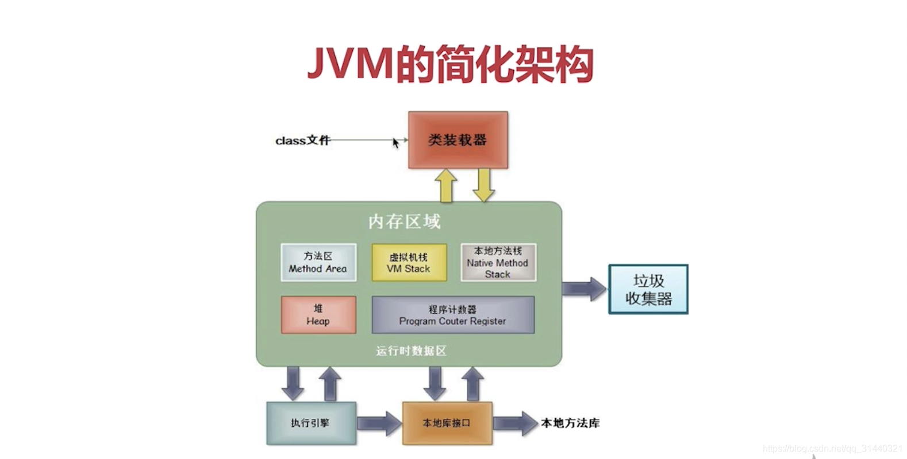
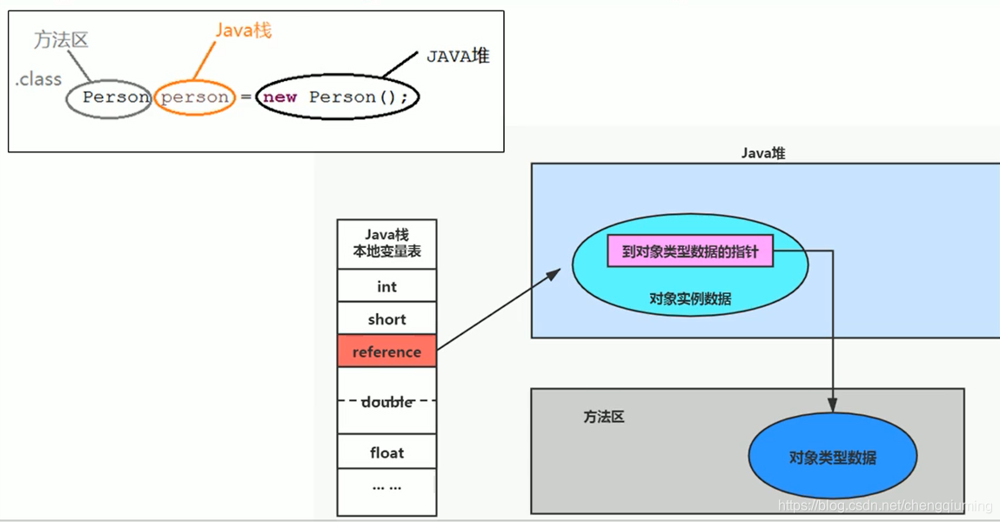
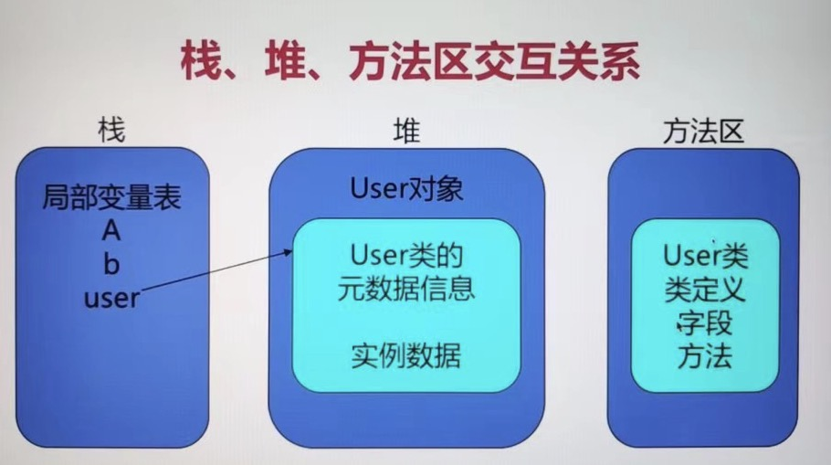
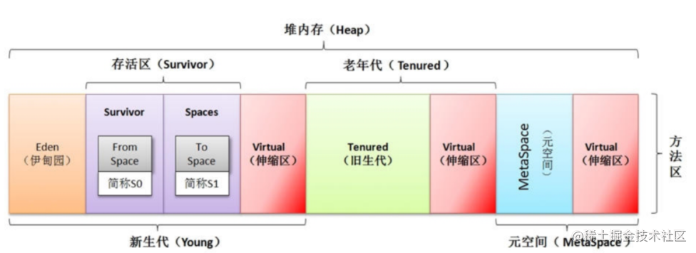
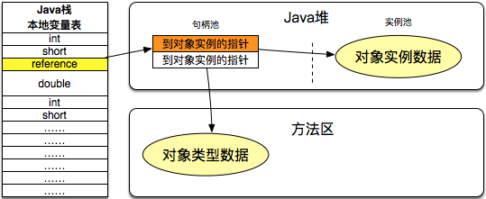
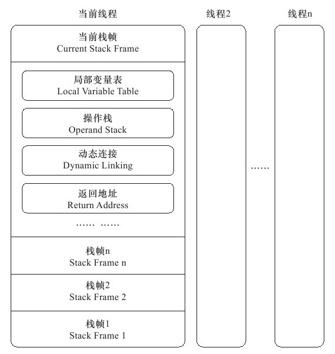
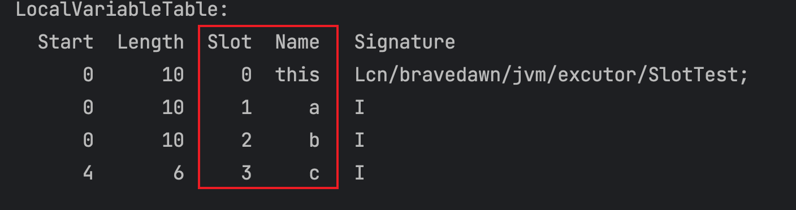
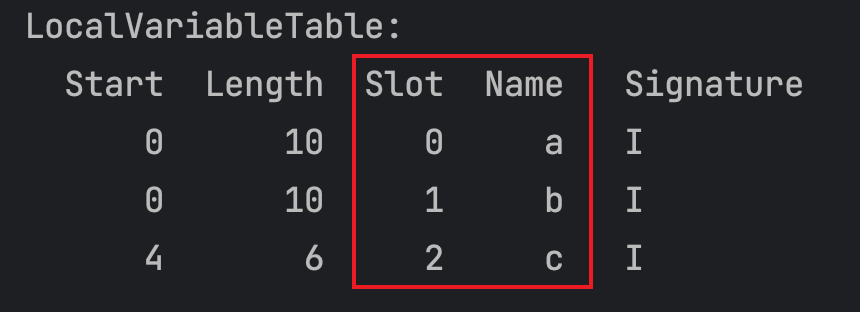
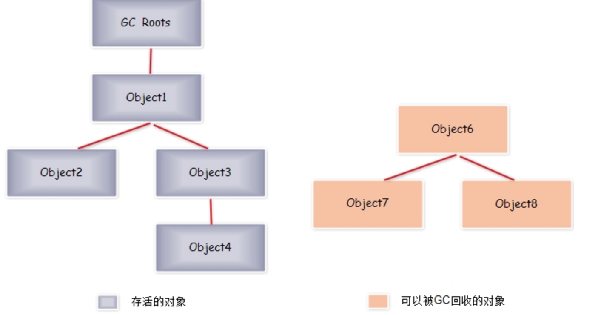

# 慕课网JVM实战课程

> 课程网址：https://coding.imooc.com/class/chapter/429.html#Anchor
>
> 开始时间：2023年1月5日
>
> 地点：陕西省西安市长安区融发心园3号楼3单元303室

## 第二章 认识JVM规范

> 这一章其实对应《深入理解Java虚拟机》的第六章

### 2-1 从三种认知角度重识JVM

1. JVM概述

   * JVM：Java Virtual Machine，也就是Java虚拟机
   * 所谓虚拟机是指：通过软件模拟的具有完整硬件系统功能的、运行在一个完全隔离环境中的计算机系统。
   * JVM是通过软件来模拟Java字节码的指令集，是Java程序的运行环境。

2. 通过一张图来了解JVM

   

   * Java字节码文件需要遵守JVM规范进行编译生成。
   * 字节码文件通过ClassLoader加载到虚拟机。
   * 在Java虚拟机中，会为程序进行内存分配，然后放到字节码执行引擎中进行执行，运行过程中需要垃圾回收器进行垃圾回收，此外JVM还需要支持程序高效的并发处理。

3. 虚拟机是Java平台无关性的保障

   

### 2-2 JVM规范作用及其核心

1. JVM规范的作用

   * Java虚拟机规范为不同的硬件平台提供了一种编译Java技术代码的规范。

   * 该规范使Java软件独立于平台，因为编译是针对作为虚拟机的做的，与具体的硬件平台和操作系统无关。

2. Java规范定义的主要内容

   1. 字节码指令集（相当于中央处理器CPU）
   2. Class文件的格式
   3. 数据类型和值
   4. 运行时数据区
   5. 栈帧
   6. 特殊方法
   7. 类库
   8. 异常
   9. 虚拟机的启动、加载、链接和初始化

3. Java规范的网址：https://docs.oracle.com/javase/specs/index.html

### 2-3 理解JVM规范中的虚拟机结构

这里主要讲的还是JVM字节码指令这块的知识点。

### 2-4 如何学习JVM规范中的虚拟机结构

这部分的内容可以看《深入理解Java虚拟机》这本书的第六章6.4字节码指令简介的内容，也可以参考“**Note/读书笔记/《深入理解Java虚拟机》/第6章 类文件结构**”的内容。

### 2-5 Class字节码解析：理解ClassFile结构

1. 如何打开一个class文件，查看反编译的内容
   1. 通过Eclipse查看
   2. 通过16进制编辑器
   3. 通过`javap -v`查看

### 2-6 阅读Class字节码：常量池

参考“**Note/读书笔记/《深入理解Java虚拟机》/第6章 类文件结构**”的内容。

### 2-7 阅读Class字节码：类定义和属性

参考“**Note/读书笔记/《深入理解Java虚拟机》/第6章 类文件结构**”的内容。

### 2-8 阅读Class字节码：方法和方法调用

参考“**Note/读书笔记/《深入理解Java虚拟机》/第6章 类文件结构**”的内容。

### 2-9 ASM开发：编程模型和核心API

> 编码项目位于mall/jvm/jvm-demo

1. ASM概述
    * ASM是一个Java字节码操纵框架，它能被用来动态生成类或者增强既有类的功能。
    * ASM可以直接产生二进制class文件，也可以在类被加载入虚拟机之前动态改变类的行为，ASM从类文件中读入信息后，能够改变类行为，分析类信息，甚至能根据要求生成新类。
    * 目前许多框架入cglib，Hibernate，Spring都直接或间接的使用ASM操作字节码。
2. ASM编程模型
    * Core API：提供了基于事件形式的编程模型。该模型不需要一次性将整个类的结构读取到内存中，因此这种方式更快，需要更少的内存，但这种编程方式难度较大。
    * Tree API：提供了基于树形的编程模型。该模型需要一次性将一个类的完成结构全部读取到内存中，所以这种方式需要更多的内存，这种变成方式比较简单。
3. ASM的Core API
    * ASM Core API中操纵字节码的功能基于ClassVistor接口。这个接口中的每个方法对应了class文件中的每一项。
    * ASM提供了三个基于ClassVisitor接口的类来实现class文件的生成和转换。
        1. ClassReader：ClassReader解析一个类的class字节码。
        2. ClassAdapter：ClassAdapter是ClassVisitor的实现类，实现要变化的功能。
        3. ClassWriter：ClassWriter也是ClassVisitor的实现类，可以用来输出变化后的字节码。
4. ASM给我们提供了ASMifier工具来帮助开发，可使用ASMifier工具生成ASM结构来对比，然后编写自己的asm程序。

5. 使用ASMifier查看修改前代码的asm结构

    * Java源代码

        ```java
        public class Main {
        
            public void test() throws Exception{
                System.out.println("now in method test ---->");
                Thread.sleep(1000);
            }
        }
        ```

    * 使用ASMifier查看asm结构

        ```
        java -cp /Users/depers/Desktop/software/apache-maven-3.8.6/repository/org/ow2/asm/asm/9.4/asm-9.4.jar:/Users
        /depers/Desktop/software/apache-maven-3.8.6/repository/org/ow2/asm/asm-util/9.4/asm-util-9.4.jar org.objectweb.asm.util.ASMifier Main.class
        ```

6. 为代码添加运行耗时的计算逻辑

    第一种改法：

    ```java
    public void test() throws Exception {
    	  MyTimeLogger.start();
      	System.out.println("now in method test ---->");
      	Thread.sleep(1000L);
      	long var1 = System.currentTimeMillis();
      	MyTimeLogger.end();
    }
    ```

    第二种改法：

    ```java
    public void test() throws Exception {
        MyTimeLogger.start();
        System.out.println("now in method test ---->");
        Thread.sleep(1000L);
        long var1 = System.currentTimeMillis();
        MyTimeLogger.end();
    }
    ```

7. 通过ASMifier查看上面代码的asm结构，然后通过asm提供的api修改原有的class文件，上述两端代码的修改的程序可以参考cn.bravedawn.jvm.asm.MyClassVisitor.MyMethodVisitor和cn/bravedawn/jvm/asm/MyClassVisitor2。

8. 接着运行生成器修改已经编译好的class文件，具体可以参考cn.bravedawn.jvm.asm.Generator和cn.bravedawn.jvm.asm.Generator2。

9. 此时我们编写测试类，就可以发现asm针对字节码的修改意见体现到了程序中。这里代码可以参考cn.bravedawn.jvm.asm.MyTest和cn.bravedawn.jvm.asm.MyTest2。

### 2-10 ASM开发：ClassVisitor开发

参见2-9的内容，代码位于jvm-demo的cn/bravedawn/jvm/asm包下。

### 2-11 ASM开发：MethodVisitor开发

参见2-9的内容，代码位于jvm-demo的cn/bravedawn/jvm/asm包下。

### 2-12 ASM开发：实现模拟AOP的功能

参见2-9的内容，代码位于jvm-demo的cn/bravedawn/jvm/asm包下。

## 第三章 类加载、连接和初始化

> 这一章对应于《深入理解Java虚拟机》第7章。

### 3-1 类加载和类加载器

1. 类被加载到JVM开始，到卸载出内存，整个生命周期如图：

    

    * 加载：查找并加载类文件的二进制数据
    * 连接：就是将已经读入内存的类的二进制数据合并到JVM运行时环境中去，包含如下几个步骤：
        1. 验证：确保被加载类的正确性。
        2. 准备：为类的 静态变量 分配内存，并初始化它们。
        3. 解析：把常量池中的符号引用转换为直接引用。
    * 初始化：为类的静态变量赋值初始值。

2. 类加载要完成的功能

    1. 通过类的全限定名来获取该类的二进制字节流
    2. 把二进制字节流转化为方法区的运行时数据结构。
    3. 在堆上创建一个java.lang.Class对象，用来封装类在方法区内的数据结构，并向外提供了访问方法区内数据结构的入口。

3. 加载类的方式

    * 最常见的方式：本地文件系统中加载、从Jar等归档文件中加载。
    * 动态的方式：将java源文件动态编译成class。
    * 其他方式：网络下载、从专有数据库中加载等等。

4. 类加载器

    定义：通过一个类的全限定名去获取描述此类的二进制字节流，实现这个动作的代码模块称之为“**类加载器**”。

    1. 启动类加载器（引导类加载器，BootstrapClassLoader，采用C++语言实现，是虚拟机的一部分。其他类加载器均由Java实现，独立于虚拟机外部，并且全都继承自抽象类 java.lang.ClassLoader。）
    2. 平台类加载器（PlatformClassLoader），在Java8中这个叫做扩展类加载器（ExtensionClassLoader）
    3. 应用程序类加载器（AppClassLoader）

5. 用户可以自定义加载器，是java.lang.ClassLoader的子类，用户可以定制类的加载方式，只不过自定义类加载器的顺序是在所有系统类加载器的最后。

6. 类加载器的关系

    

7. JDK8以后废弃扩展类加载器（Extension ClassLoader）的原因，可以参考文章：https://blog.csdn.net/qq_38003038/article/details/122733985

### 3-2 案例：类加载器使用

1. 类加载器的说明
    * 启动类加载器：用于加载启动的基础模块类，比如：java.base、java.management、java.xml等
    * 平台类加载器：用于加载一些平台相关的模块，比如：java.scripting、java.compiler、java.corba等
    * 应用程序类加载器：用于加载应用级别的模块，比如：jdk.compiler、jdk.jartool、jdk.jshell等，还加载了classpath路径中所有的类库。
    * Java程序不能直接引用启动类加载器，直接设置classLoader位`null`，默认就是用启动类加载器。
    * 类加载器并不需要等到某个类“**首次主动使用**”的时候才加载它，JVM规范允许类加载在预料到某个类将要被使用的时候就预先加载它。
    * 如果在加载的时候.class文件缺失，会在该类首次主动使用时报告`LinkageError`错误，如果一直没有被使用，就不会报错。
    * 这一块内容的代码演示可以参考：cn.bravedawn.jvm.classloader.ClassLoaderStudy
2. JDK8类加载器说明
    * 启动类加载器：负责将`<JAVA_HOME>/lib`，或者`-Xbootclasspath`参数指定的路径中的，且是虚拟机识别的类库加载到内存中（按照名字识别，比如rt.jar，对于不能识别的文件不予装载）。
    * 扩展类加载器：负责加载`<JRE_HOME>/lib/ext`或者`java.ext.dirs`系统变量所指定路径中的所有类库。
    * 应用程序类加载器：负责加载classpath路径中的所有类库。

### 3-3 双亲委派模型

1. JVM中的ClassLoader通常采用双亲委派模型，要求除了启动类加载器外，其余的类加载器都应该有自己的父级加载器。这里的父子关系是组合而不是继承，工作过程如下：

    > 这里是针对Java9及以上版本说的

    1. 一个类加载器接收到类的加载请求后，首先会搜索它内建加载器定义的所有“具名模块”。
    2. 在委派给父加载器之前，如果找到了合适的模块定义，将会使用负责那个模块的类加载器来完成加载。
    3. 如果class没有在这些加载器定义的具名模块中找到，那么将会委托给父类加载器去加载，直到启动类加载器这一层。
    4. 如果父级加载器反馈它不能完成加载请求，比如在它的搜索路径下找不到这个类，那子的（下一级）类加载器才自己来加载。

    **上面的通俗理解**：

    就拿我编写的cn.bravedawn.jvm.classloader.ClassLoaderStudy类，在委派给父加载器之前，先判断该类是否能够归属到某一个系统模块中，如果可以找到这样的归属关系，就优先委派给那个模块的加载器完成加载。如果没有找到这个类所在的模块定义，就会去通过上一级AppClassLoader去加载，如果在AppClassLoader加载的模块中找不到这个类，就会去通过上一级PlatformClassLoader去加载，如果在PlatformClassLoader加载的模块中找不到这个类，就会去找上一级BoostrapClassLoader去加载这个类，如果还是找不到，就去找当前类加载器的下一级加载器去加载这个类。

2. 参考文章：

    * [Java JVM JDK9-类加载机制 双亲委派模式](https://blog.csdn.net/xiaohulunb/article/details/103914303)

### 3-4 案例：自定义ClassLoader

我们在`cn.bravedawn.jvm.classloader.MyClassLoader`中定义了自己的`ClassLoader`，覆盖了原有的`findClass()`方法，这里我们通过读取本地文件的方式来获取到class文件的信息从而将class文件装载到虚拟机中。其他场景下我们也可以自定义自己的classloader，比如装载前修改class文件进行方法增强，权限校验，加解密class文件，网络中的class文件。

我在cn.bravedawn.jvm.classloader.MyClassLoaderTest测试类中加载MyClass.class文件，这里有两种情况：

1. 在项目中没有创建`class/cn/bravedawn/jvm/classloader/MyClass.class`的时候，我们运行MyClassLoaderTest测试类时，根据双亲委派模型，当我们编写的类加载器`MyClassLoader`加载`MyClass`的这个类的时候，首先会委托给父加载器`AppClassLoader`去加载，`AppClassLoader`在target目录下面找到了这个类的class文件，就将这个类进行了加载。此时输出的结果是：

    ```
    cls Class loader = jdk.internal.loader.ClassLoaders$AppClassLoader@5a39699c
    cls parent Class loader = jdk.internal.loader.ClassLoaders$PlatformClassLoader@1efbd816
    ```

2. 如果删除target下面的MyClass.class文件，创建`class/cn/bravedawn/jvm/classloader/MyClass.class`后，我们再次运行MyClassLoader.class测试类，此时JVM发现AppClassLoader加载不到MyClass.class，就会使用PlatformClassLoader去加载还是找不到，接着又会去BootstrapClassLoader去加载，最后发现都没加载到，就会使用子的加载器，即MyClassLoader去加载，此时的输出结果是：

    ```
    cls Class loader = cn.bravedawn.jvm.classloader.MyClassLoader@4909b8da
    cls parent Class loader = jdk.internal.loader.ClassLoaders$AppClassLoader@5a39699c
    ```

### 3-5 双亲委派模型说明

1. 双亲委派模型的重要特性
    1. 双亲韦委派模型对于保证Java程序的稳定运行很重要，自己编写的类和Java提供的内库类只会被加载一次，从而避免了被恶意修改。
    2. 实现双亲委派的代码在java.lang.ClassLoader的`loadClass()`方法中，如果要自定义类加载器，推荐覆盖实现findClass()方法。
    3. 如果有一个类加载器能够加载某个类，称为 **定义类加载器**，所有能成功返回该类的Class的类加载器 都称为 **初始类加载器**。
    4. 如果没有指定父加载器，默认将启动类加载器作为父加载器。
    5. 每个类加载器都有自己的命名空间，命名空间由该加载器及其所有父加载器所加载的类构成，不同的命名空间，可以出现 类的全路径名 相同的情况。比如说相同的一段程序（我在程序里面加一段Thread.sleep(50000)的逻辑），我其实可以在IDE里面运行两次这段程序，此时就实现了上面所谓的不同的命名空间。
    6. 运行时包由由同一个类加载器的类构成，决定两个类是否属于同一个运行时包，不仅要看**全路径名**是否一样，还要看**定义类加载器**是否相同。只有属于同一个运行时包的类才能实现相互包内可见。
2. 破坏双亲委派模型
    1. 双亲委派模型存在的问题：父加载器无法向下识别子加载器加载的资源。
    2. 为了解决这个问题，引入了线程上下文类加载器，可以通过Tread的setContextClassLoader()进行设置。这里举的例子就是DriverManager.getConnection()父加载器通过线程上下文类加载器获取子级类加载器去加载MySQL的Driver类。具体可以参考：cn.bravedawn.jvm.classloader.DriverManagerTest的实现。
    3. 另一种典型的情况就是实现热替换，比如OSGI的模块化热部署，它的类加载器就不再是严格按照双亲委派模型，很可能就在平级的类加载器中就执行了。

### 3-6 类连接和初始化

1. 类连接主要验证的内容
    * 类文件结构的检查：按照JVM的规范所规定的类文件结构进行校验。
    * 元数据验证：对字节码描述的信息进行**语义分析**，保证其符合Java语言规范的要求，主要是对**数据类型**的校验。
    * 字节码验证：通过对数据流和控制流进行分析，确保程序语义是合法和符合逻辑的。这里主要对**方法体**进行校验。
    * 符合引用验证：常量池中的各种符号引用进行匹配校验。符号引用验证的目的是确保**解析**动作能正常执行。
2. 类连接的准备
    * 准备阶段是正式为**类变量**（被static修饰的变量）分配内存并设置类变量初始值的阶段，这些变量所使用的内存都将在方法区中进行分配。
3. 类连接中的解析
    * 所谓解析就是把常量池中的符号引用转换为直接引用的过程。
    * 符号引用：符号引用是以一组符号来描述所引用的目标，与虚拟机的实现无关。
    * 直接引用：直接引用可以是直接指向目标的指针、相对偏移量或是一个能间接定位到目标的句柄，与虚拟机的实现相关。
    * 解析动作主要是针对类、接口、字段、类方法、接口方法、方法类型、方法句柄和调用点限定符7类符号引用进行的。
4. 类的初始化
    * 类的初始化是执行类构造器`<clinit>`方法的过程,下面的规则可以参考cn.bravedawn.jvm.classinit.Test的实验。
        1. 编译器会自动收集类的静态变量的赋值动作和静态语句块，最后合并到`<clinit>()`方法中。编译器收集的顺序由语句在源文件中出现的顺序所决定。
        2. 如果类还没有加载和连接，就先加载和连接
        3. 如果类存在父类，且父类没有初始化，就先初始化父类
        4. 如果类中存在初始化语句，就依次执行这些初始化语句
        5. 接口不能使用静态代码块。
        6. 如果是接口的话，下面的规则可以参考cn.bravedawn.jvm.classinit.interfaceinit.Test的实验：
            1. 初始化一个类的时候，并不会先初始化它实现的接口
            2. 初始化一个接口时，并不会初始化它的父接口
            3. 只有当程序首次使用接口里面的变量或者是调用接口方法的时候，才会导致接口初始化
        7. 调用ClassLoader类的loadClass方法来装载一个类，并不会初始化这个类，因为自定义类加载器去加载一个类并不是对类的主动使用。这个规则可以参考cn.bravedawn.jvm.classinit.ClassLoaderTest的实验。
        8. 若在多线程下同时去初始化一个类，只会有一个线程去执行这个类的`<Clinit>()`方法，其余线程会被阻塞。

### 3-7 案例：类的主动初始化

Java程序对于类的使用方式分为：主动使用和被动使用，JVM必须在每个类或接口**“首次主动使用”**时才初始化他们只会初始化一次，被动使用类是不会导致类的初始化的。

类主动引用的初始化时机，参考实现在cn/bravedawn/jvm/triggerclassinit/initiative：

1. 遇到new，getstatic，putstatic或invokestatic这四条字节码指令时
    1. 创建类实例
    2. 访问或设置某个类或接口的静态变量
    3. 调用类的静态方法
2. 在使用java.lang.reflect包的方法对类进行反射调用的时
3. 初始化一个类时，如果其父类还没有初始化时，会联动初始化其父类。（这里是**类和接口真正有区别的地方**，一个接口在初始化时，不会要求其父接口全部完成初始化，只有在真正使用父接口的时候才会初始化）。
4. JVM启动的时候运行的主类（包含main方法的那个类），会自动进行初始化
5. 当使用JDK 1.7的动态语言支持时，如果java.lang.invoke.MethodHandle实例最后的解析结果是REF_getStatic（使用MethodHandle读取类的静态字段）、REF_putStatic（使用MethodHandle设置类的静态字段）、REF_invokeStatic（使用MethodHandle调用类的静态方法）的方法句柄时，如果这个方法句柄没有被初始化过，就需要先进行初始化。

1. **定义了default方法的接口，当接口的实现类初始化时会初始化接口**

### 3-8 案例：类的初始化机制和顺序

1. 观察类的初始化顺序，参考实现：cn/bravedawn/jvm/triggerclassinit/InitOrderClass.java

2. 类的被动引用

    1. 通过子类引用父类的静态变量，参考实现：cn/bravedawn/jvm/triggerclassinit/passivity/parentstaticvariable
    2. 通过数组定义来引用类，参考实现：cn/bravedawn/jvm/triggerclassinit/passivity/array
    3. 常量，参考实现：cn/bravedawn/jvm/triggerclassinit/passivity/constant

3. 类的卸载

    * 当代表一个类的Class对象不再被引用，那么Class对象的生命周期就结束了，对应的在方法区中的数据也会被卸载。

    * JVM自带的类加载器装载的类，是不会卸载的；由用户自定义的类加载器加载的类是可以卸载的。

## 第四章 内存分配

> 这一章对应于《深入理解Java虚拟机》第二章

### 4-1 JVM的简化架构和运行时数据区

1. JVM的简化架构

    

2. 运行时数据区，主要包括 PC寄存器、Java虚拟机栈、Java堆、方法区、运行时常量池、本地方法栈等五部分。

3. PC寄存器（程序计数器，线程私有）

    1. 每个线程拥有一个PC寄存器，是线程私有的，用来存储指向下一条指令的地址。
    2. 在创建线程的时候，创建相应的PC寄存器。
    3. 执行native方法时，PC寄存器的值是未指定值（undefned）。
    4. 是一块较小的内存空间，是唯一一个在JVM规范中没有规定OutOfMemoryError的内存区域。

4. 虚拟机栈（线程私有）

    1. 这里的栈，是指虚拟机栈，或者说是虚拟机栈中局部变量表部分。
    2. 虚拟机栈是为虚拟机执行Java方法（也就是字节码）服务。
    3. 栈是由一系列帧（Frame）组成，因此Java栈也叫做栈帧，是线程私有的。
    4. 帧用来保存一个方法的局部变量、操作数栈（Java没有寄存器，所有参数传递使用操作数栈）、常量池指针、动态链接、方法返回值等。
    5. 每一次方法调用创建一个帧，并压栈；退出方法的时候，修改栈顶指针就可以把栈帧中的内容销毁。
    6. 局部变量表存放了编译器可知的各种基本数据类型和引用类型，每个slot存放32位的数据，其中long，double占两个槽位。
    7. 栈的优点：存取速度比堆块，仅次于寄存器。
    8. 栈的缺点：存在栈中的数据大小、生存期是在编译期决定的，缺乏灵活性。

5. 虚拟机堆（线程共享）

    1. 用来存放应用系统创建的对象和数组，所有线程共享Java堆。
    2. GC主要管理堆空间，対分代GC来说，堆也是分代的。
    3. 堆的优点：运行期动态分配内存大小，能自动进行垃圾回收。
    4. 堆的缺点：效率相对较慢。

6. 方法区（线程共享）

    1. 方法区是线程共享的，通常用来保存装载的类的结构信息，包括类信息、常量、静态变量、及时编译期编译后的代码等数据。
    2. 通常和元空间关联在一起，但具体的跟JVM实现和版本有关。
    3. JVM规范把方法区描述为堆的一个逻辑部分，但他有一个别名称为Non-Heap（非堆），应该是为了与Java堆区分开来讲的。

7. 运行时常量池

    1. 是Class文件中每个类或接口的常量池表，在运行期间的表示形式，通常包括：类的版本、字段、方法、接口等信息。
    2. 用于存放编译期生成的各种字面量和符号引用。
    3. 将在类加载后，在方法区的运行时常量池中存放。

8. 本地方法栈

    * 与虚拟机栈不同的是，本地方法栈在JVM中用来支持native方法执行的栈叫做本地方法栈。

9. 栈、堆、方法区交互关系

    具体文章：[图解栈、堆、方法区的交互关系](https://blog.csdn.net/chengqiuming/article/details/118650357)

    

    在上图中：

    - Person：存放在元空间，也可以说方法区
    - person：存放在Java栈的局部变量表中
    - new Person()：存放在Java堆中

    也可以参考视频中的这张图：

    

### 4-2 Java堆内存模型和分配

1. Java堆内存

    * Java堆用来存放应用系统创建的对象和数组，所有线程共享Java堆。
    * Java堆是在运行期可以动态分配内存大小，自动进行垃圾回收。
    * Java垃圾回收（GC）主要就是回收堆内存，对分代GC来说，堆也是分代的。

2. Java堆的结构

    

    * 新生代用来放新分配的对象，新生代中经过垃圾回收，没有回收掉的对象会被复制到老年代。
    * 老年代存储对象比新生代存储对象的年龄大得多。
    * 老年代存储一些大对象。
    * 整个堆的大小 = 新生代 + 老年代
    * 新生代的大小 = Eden + 存活区
    * 从前的持久代，用来存放Class、Method等元信息的区域，从JDK8开始就去掉了。取而代之的是元空间（MetaSpace，元空间在方法区中），元空间并不在虚拟机里面，而是直接使用本地内存。

3. 对象的内存布局

    这里的对象指的是Java语中new关键字执行得到的对象。

    * 对象在内存中的存储布局（以HotSpot虚拟机为例），分为：对象头（Header）、实例数据（Instance Data）和对齐填充（Padding）。
        * **对象头**，又包含两部分：
            1. Mark Word：存储对象自身的运行数据，如HashCode、GC分代年龄、锁状态标志等。
            2. 类型指针：对象指向它的类元数据的指针。
        * **实例数据**：真正存放对象实例数据的地方。
        * **对齐填充**：这部分不一定存在，也没有什么特定含义，仅仅是占位符。因为HotSpot要求对象起始地址都是8字节的整数倍，如果不是就对齐。

4. 对象的访问定位

    * 在JVM规范中只规定了**reference类型**是一个指向对象的引用，但没有规定这个引用具体如何去定位、访问堆中对象的具体位置。

    * 因此对象的访问方式取决于JVM的实现，目前主流的有：**使用句柄** 或 **使用指针** 两种方式。

        * 使用句柄，Java堆中会划分出一块内存来作为句柄池，reference中存储句柄的地址，句柄中存储对象的实例数据和类型数据的具体地址信息，如下图所示：

            

            * 优点：reference中存储的是稳定的句柄，对象被移动（垃圾回收时会移动对象）时只会改变句柄中的实例数据指针，而reference本身不需要修改。

            * 缺点：访问对象需要经过两次指针定位，速度慢。
        
        * 使用指针，Java堆中会直接存放访问类元数据的地址，reference存储的就直接是对象的地址，如下图所示：
          
            
            
            * 优点：速度快，节省了一次指针定位的时间开销。
            * 缺点：对象被移动后，需要修改reference中的指针。

### 4-3 案例：Trace跟踪和Java堆的参数配置

1. Trace跟踪参数

    * 可以打印GC的简要信息：`-Xlog:gc`
    * 打印GC详细信息：`-Xlog:gc*`
    * 指定GC log的路径地址：`-Xlog:gc:<garbage-collection.log>`
    * 每一次GC后，都打印堆信息：`-Xlog:gc+heap=debug`

2. GC日志格式

    > 以G1为例

    * GC发生的时间，也就是JVM从启动以来经过的秒数。
    * 日志级别信息和日志类型标记
    * GC识别号
    * GC类型和说明GC的原因
    * 容量：GC前容量 -> GC后容量（该区域总容量）
    * GC持续时间，单位秒。有的收集器会有更详细的描述，比如：user表示应用程序消耗的时间，sys表示系统内核消耗的时间、real表示操作从开始到结束的时间。

3. Java堆的参数

    * `-Xms`：初始堆大小，默认物理内存的1/64。
    * `-Xmx`：最大堆大小，默认物理内存的1/4。
    * `-Xmn`：新生代大小，默认整个堆的3/8。设置太小，会频繁进行GC；设置太大，就会造成full GC的执行，full GC的执行可能会执行很长时间，造成虚拟机的停顿。推荐新生代大小为总堆大小的25%-50%之间。
    * `-XX:+HeapDumpOnOutOfMemoryError`：OOM内存溢出时导出堆信息到文件。
    * `-XX:+HeapDumpPath`：导出OOM路径。

### 4-4 案例：新生代配置和GC日志格式

这里主要演示了配置打印GC日志和配置日志路径的案例。

### 4-5案例：使用MAT进行内存分析

这里主要演示了在发生内存溢出时，将虚拟机堆栈信息导出，然后再使用[MAT工具](https://www.eclipse.org/mat/)进行分析。

### 4-6 案例：堆、栈、元空间的参数配置

1. Java堆的参数：

    * `-XX:NewRatio`：老年代与新生代的比值。如果xms=xmx，并且设置了xmn的情况下，该参数不用设置。调节的是新生代和老年代之间的比值关系。

    * `-XX:SurvivorRatio`：Eden区和Survivor区的大小比值，设置为8，则两个Survivor区与一个Eden去的比值为2:8。一个Survivor占整个新生代的1/10。调节的是新生代中Eden和存活区的大小比值关系。

    * `-XX:OnOutOfMemoryError`：在OOM时，执行一个脚本。可以脚本中记录日志信息或是进行告警。

    上面相关参数的配置，请参考：cn.bravedawn.jvm.memory.HeapSizeTest

2. Java栈的参数

    * `-Xss`：通常只有几百K，决定了函数调用的深度。具体实践请参考：cn.bravedawn.jvm.memory.StackSizeTest

3. 元空间的参数

    * `-XX:MetaspaceSize`：初始空间大小
    * `-XX:MaxMetaspaceSize`：最大空间，默认是没有限制的。

    * `-XX:MinMetaspaceFreeRatio`：在GC之后，最小Matespace剩余空间容量的百分比。
    * `-XX:MaxMetaspaceFreeRatio`：在GC之后，最大的Metasapce剩余空间容量的百分比。

## 第五章 字节码执行引擎

> 对应《深入理解Java虚拟机》第8章

### 5-1 栈帧和局部变量表

1. 概述

    * JVM的字节码执行引擎，基本功能是输入字节码文件，然后对字节码进行解析并处理，最后输出到执行的结果。
    * 实现方式可能有通过解释器直接解释执行字节码，或者是通过即时编译器产生本地代码，也就是编译执行，当然也可能两者都有。编译执行比解释执行快。

2. 栈帧概述

    * 栈帧是用于支持JVM进行方法调用和方法执行的数据结构。
    * 栈帧随着方法调用而创建，随着方法的结束而消亡。
    * 栈帧里面存储了方法的局部变量（本地变量表）、操作数栈、动态连接、方法返回地址等信息。

3. 栈帧的概念结构

    

4. 局部变量表

    * 定义：用来存储方法参数和方法内部定义的局部变量的存储空间。

    * Slot

        * 以变量槽slot为单位，目前一个slot存放32位以内的数据类型。
        * 对于64位的数据占2个slot。
        * 对于实例方法，第0位slot存放的是this，然后从1到n一次分配给参数列表。
        
            * 参考实验 实例方法的本地变量表：cn.bravedawn.jvm.excutor.SlotTest
        
                
        
            * 参考实现 静态方法的本地变量表：cn.bravedawn.jvm.excutor.SlotTest2
        
                
        * 然后根据方法体内部定义的变量顺序和作用域来分配slot。
        * slot是复用的，以节省栈帧的空间，这种设计可能会影响到系统的垃圾收集行为。
    
    * 操作数栈
    
        * 定义：用来存放方法运行期间，各个指令操作的数据。
        * 特点
            1. 操作数栈中元素的数据类型必须和字节码指令的顺序严格匹配。
            2. 虚拟机在实现栈帧的时候可能会做一些优化，让两个栈帧出现部分重叠的区域，以存放公用数据。
    
    * 动态连接
    
        * 定义：每个栈帧持有一个指向运行时常量池中的该栈帧所属方法的引用，以支持方法调用过程的动态连接。
        * 内容：
            * 静态解析：类加载的时候（连接的解析阶段），符号引用就转化为直接引用。
            * 动态连接：运行期间转换为直接引用。
    
    * 方法返回地址
    
        * 定义：方法执行后返回的地址。
    
    * 方法调用
    
        * 定义：方法调用就是确定具体调用那一个方法，并不涉及方法内部的执行过程。
        * 内容：
            1. 部分方法是直接在类加载的解析阶段，就确定了直接引用关系。
            2. 但是对于实例方法，也称虚方法，因为重载和多态，需要运行期动态委派。

### 5-2 案例：slot是复用的

主要讨论了slot是可以复用的，具体的实现可以参考：jvm/jvm-demo/src/main/java/cn/bravedawn/jvm/excutor/SlotTest3.java

### 5-3 案例：操作数栈

### 5-4 静态分派和动态分派

* 如何执行方法中的字节码指令：JVM通过基于栈的字节码解释执行引擎来执行指令，JVM的指令集也是基于栈的。

## 第6章 垃圾回收

### 6-1 垃圾回收基础和根搜索算法

1. 垃圾回收概述
    * 什么是垃圾：简单说就是内存中已经不在被使用到的内存空间就是垃圾。

2. 垃圾回收的方法

    * 引用计数法
        * 原理：给对象添加一个引用计数器，有访问就加1，引用失效就减1。
        * 优点：实现简单、效率高
        * 缺点：不能解决对象之间循环引用的问题

    * 根搜索算法

        * 原理：从根（GC Roots）节点向下搜索对象节点，搜索走过的路径称为引用链，当一个对象到根之间没有连通的话，则该对象不可用。

            下图中，对象Object6、Object7、Object8虽然互相引用，但他们的GC Roots是不可到达的，所以它们将会被判定为是可回收的对象。

            

        * 可作为GC Roots的对象包括：

            * 虚拟机栈（栈帧局部变量）中引用的对象
            * 方法区类静态属性引用的对象
            * 方法区中常量引用的对象
            * 本地方法栈中JNI（即一般说的Native方法）引用的对象
            
        * HotSpot使用了一组叫做OopMap的数据结构达到了标准式GC的目的。

            * OopMap：在解释执行时/JIT时，记录下栈上某个数据对应的数据类型，比如地址1上的”12344“值是一个堆上地址引用，数据类型为com.aaaa.aaa.AAA

        * 在OopMap的协助下，JVM可以很快的做完GC Roots枚举，但是JVM并没有为每一条指令生成一个OopMap。

        * 记录OopMap的这些“特定位置”被称为**安全点**，即当前线程执行到安全点后才允许暂停进行GC。

        * 如果一段代码中，对象引用关系不再发生变化，这个区域中任何地方开始GC都是安全的，那么这个区域称为**安全区域**。
