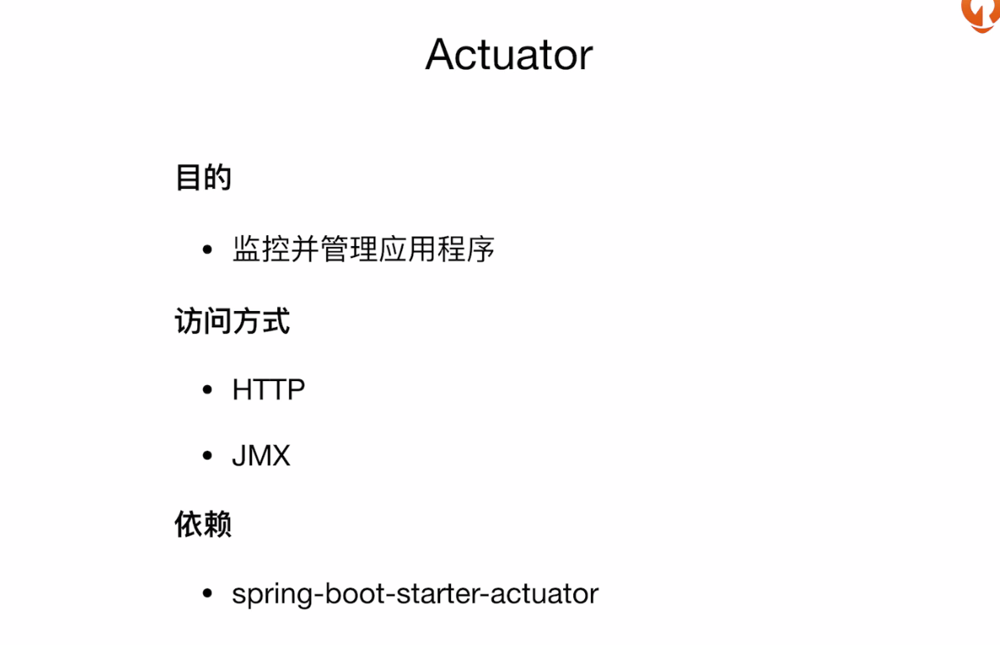
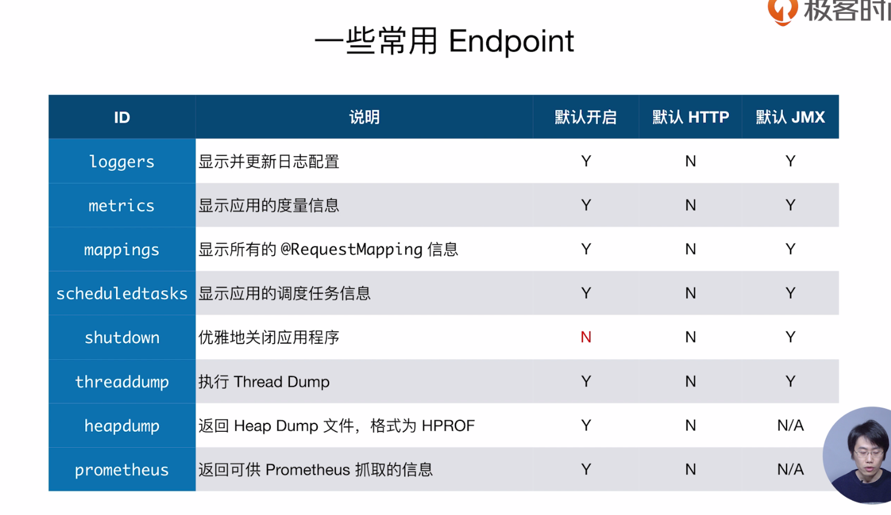
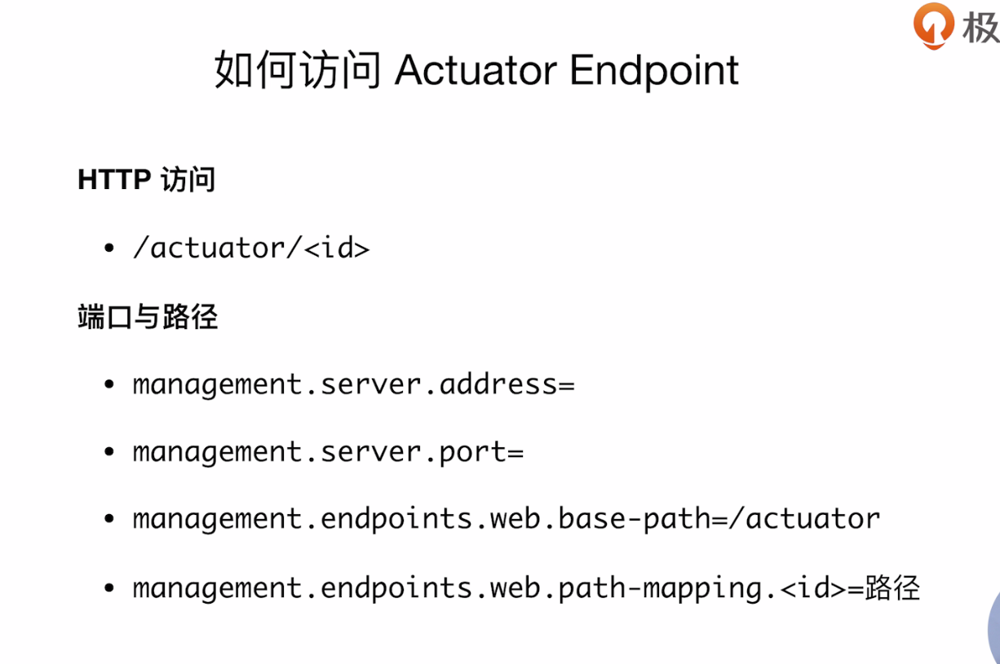
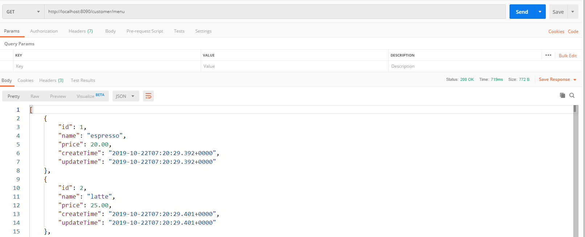

# 玩转Spring全家桶-下卷——极客时间

## 第十章：运行中的Spring Boot

### 75.认识 Spring Boot 的各类 Actuator Endpoint



JMX （Java Management Extensions，即Java管理扩展） ： JMX最常见的场景是监控Java程序的基本信息和运行情况，任何Java程序都可以开启JMX，然后使用JConsole或Visual VM进行预览。 







访问查看方式：

* 浏览器
* JConsole

### 76.动手定制自己的 Health Indicator


上图是应用程序的健康状态与其对应的http状态码。如果返回503说明系统的健康状态就是不好的。


#### 1.Spring Boot自带的Health Indicator的源码分析

* org.springframework.boot.actuate.jdbc.DataSourceHealthIndicator
* org.springframework.boot.actuate.system.DiskSpaceHealthIndicator

#### 2.自定义Health Indicator


项目代码：

* 地址： [https://github.com/depers/geektime-spring-code/tree/master/Chapter%2010/indicator-demo](https://github.com/depers/geektime-spring-code/tree/master/Chapter 10/indicator-demo) 

* 项目代码

  * 修改了pom文件

    ```xml
    <dependency>
    	<groupId>org.springframework.boot</groupId>
    	<artifactId>spring-boot-starter-actuator</artifactId>
    </dependency>
    
    <dependency>
    	<groupId>io.micrometer</groupId>
    	<artifactId>micrometer-registry-prometheus</artifactId>
    </dependency>
    ```

    其中 [Prometheus](https://prometheus.io/docs/introduction/overview/)是最近几年开始流行的一个新兴监控告警工具 。

  * 修改application.properties

    ```properties
    management.endpoints.web.exposure.include=*
    management.endpoint.health.show-details=always
    
    info.app.author=DigitalSonic
    info.app.encoding=@project.build.sourceEncoding@
    ```

  * 编写了geektime.spring.springbucks.waiter.support.CoffeeIndicator

  * 启动项目，访问  http://localhost:8080/actuator/health 

    

    上图所示，coffeeIndicator的status是UP。我们在data.sql中修改sql为：

    ```
    select 1
    ```

    此时，再访问  http://localhost:8080/actuator/health 

    

    此时，coffeeIndicator的status是DOWN，整个health的status也是DOWN，说明系统出现了问题。

### 77.通过 Micrometer 获取运行数据


Micrometer为最流行的监视系统提供了一个基于仪表客户端，使您无需供应商锁定即可仪表化基于JVM的应用程序代码。 考虑使用SLF4J，但是是度量界。（slf4j是日志界的门面，Micrometer是度量界的门面）

官网： http://micrometer.io/ 


其中具体的配置信息可以参考： https://docs.spring.io/spring-boot/docs/2.2.0.RELEASE/reference/html/production-ready-features.html#production-ready-metrics 


#### 1.自定义度量指标

* 项目代码地址： [https://github.com/depers/geektime-spring-code/tree/master/Chapter%2010/metrics-demo](https://github.com/depers/geektime-spring-code/tree/master/Chapter 10/metrics-demo) 

* 编写了geektime.spring.springbucks.waiter.service.CoffeeOrderService#bindTo

* 然后启动项目，访问metrics： http://localhost:8080/actuator/metrics/order.count 

  

* 访问prometheus： http://localhost:8080/actuator/prometheus 

  

### 78.通过 Spring Boot Admin 了解程序的运行状态


#### 1.配置spring-boot-admin-server和spring-boot-admin-client

这里需要将sba-server-demo和sba-client-demo以module的形式放在idea的统一目录下面。

* sba-server-demo项目代码

  1. 编辑pom文件

     ```xml
     <dependency>
         <groupId>org.springframework.boot</groupId>
     	<artifactId>spring-boot-starter-security</artifactId>
     </dependency>
     <dependency>
         <groupId>org.springframework.boot</groupId>
     	<artifactId>spring-boot-starter-web</artifactId>
     </dependency>
     <dependency>
         <groupId>de.codecentric</groupId>
     	<artifactId>spring-boot-admin-starter-server</artifactId>
     </dependency>
     ```

  2. 编辑application.properties

     ```properties
     spring.application.name=sba-server
     server.port=8080
     
     spring.security.user.name=geektime
     spring.security.user.password=sba-server-password
     ```

  3. 在geektime.spring.boot.sba.SbaServerApplication进行安全配置

  4. 代码地址： [https://github.com/depers/geektime-spring-code/tree/master/Chapter%2010/sba-server-demo](https://github.com/depers/geektime-spring-code/tree/master/Chapter 10/sba-server-demo) 

* sba-client-demo项目

  1. 编辑pom文件

     ```xml
     <dependency>
     	<groupId>org.springframework.boot</groupId>
     	<artifactId>spring-boot-starter-actuator</artifactId>
     </dependency>
     <dependency>
     	<groupId>org.springframework.boot</groupId>
         <artifactId>spring-boot-starter-security</artifactId>
     </dependency>
     <dependency>
     	<groupId>org.springframework.boot</groupId>
         <artifactId>spring-boot-starter-web</artifactId>
     </dependency>
     <dependency>
     	<groupId>de.codecentric</groupId>
     	<artifactId>spring-boot-admin-starter-client</artifactId>
     </dependency>
     ```

  2. 配置application.properties

  3. 代码地址： [https://github.com/depers/geektime-spring-code/tree/master/Chapter%2010/sba-client-demo](https://github.com/depers/geektime-spring-code/tree/master/Chapter 10/sba-client-demo) 

* 分别启动这两个项目

  * 在浏览器中输入http://localhost:8080/login，输入在sba-server-demo的appliation.properties中配置的用户名和密码。老师也说了，并不支持在产线上面使用spring boot admin，应该把监控的这部分工作和自己的运维监控系统结合起来。就可以登录到Spring admin的主页，如下图：

    
### 79.如何定制 Web 容器的运行参数


#### 1.通过配置的方式修改容器的配置

  

  

  

#### 2.通过编程的方式修改容器的配置


#### 3.项目代码

* 地址： [https://github.com/depers/geektime-spring-code/tree/master/Chapter%2010/tomcat-demo](https://github.com/depers/geektime-spring-code/tree/master/Chapter 10/tomcat-demo) 

* 配置方式：

  1. application.properties中的配置

     ```
     # 开启压缩
     server.compression.enabled=true
     # 压缩的最小大小为512b
     server.compression.min-response-size=512B
     
     # 显示exception的信息
     ## 是否包含异常的堆栈信息，默认是NEVER，其他ALWAYS，ON_TRACE_PARAM
     server.error.include-stacktrace=always
     ## 当服务器错误是，是否显示错误信息，默认为true
     server.error.include-exception=true
     ```

  2. 注释geektime.spring.springbucks.waiter.WaiterServiceApplication#customize方法

  3. 然后启动项目

  4. 下图是使用crul命令测试配置效果的截图，该效果演示了application.properties配置的前两行配置

     * 第一个红圈：正常的请求
     * 第二个红圈：使用gzip压缩的方式返回数据
     * 第三个红圈：Accept-Encoding 和Content-Encoding是HTTP中用来对采用哪种编码格式传输正文进行协定的一对头部字段
     * 第四个红圈：是压缩的内容
       
     
  5. 下图是演示开启打印异常的配置的效果，该效果演示了application.properties配置的后两行配置
     
* 编码配置方式：

  1. 在geektime.spring.springbucks.waiter.WaiterServiceApplication里面编写
  
     ```java
     @Override
     public void customize(TomcatServletWebServerFactory factory) {
     	Compression compression = new Compression();
     	compression.setEnabled(true);
     	compression.setMinResponseSize(DataSize.ofBytes(512));
     	factory.setCompression(compression);
     }
     ```
  
  2. 然后对application.properties中的配置进行注释
  
     ```properties
     # 开启压缩
     #server.compression.enabled=true
     ## 压缩的最小大小为512b
     #server.compression.min-response-size=512B
     ```
  
  3. 通过代码和上面的properties的配置效果是一样的

### 80.如何配置容器支持 HTTP 2（上）


通过java提供的keytool生成证书。命令：`keytool -genkey -alias springbucks -storetype PKCS12 -keyalg RSA -keysize 2048 -keystore springbucks.p12 -validity 365`


#### 1.项目代码，配置容器支持https

本节有ssl-waiter-service和ssl-customer-service两个程序，这个采用new module的方式将这两个项目都引入IDEA中。

* 项目地址：
  *  [https://github.com/depers/geektime-spring-code/tree/master/Chapter%2010/ssl-waiter-service](https://github.com/depers/geektime-spring-code/tree/master/Chapter 10/ssl-waiter-service) 
  *  [https://github.com/depers/geektime-spring-code/tree/master/Chapter%2010/ssl-customer-service](https://github.com/depers/geektime-spring-code/tree/master/Chapter 10/ssl-customer-service) 

* ssl-waiter-service项目

  1. 编辑application.properties

     ```
     server.port=8443
     server.ssl.key-store=classpath:springbucks.p12
     server.ssl.key-store-type=PKCS12
     server.ssl.key-store-password=spring
     ```

  2. 启动项目，在terminal中输入命令`curl -k -v https://localhost:8443/coffee/1`，就可以顺利的访问这个链接。

     * curl命令简单介绍
       * -k：发送https请求的时候，不做认证（当用https请求出错的时候，可以试下加-k）
       * -v：看到详细的请求头中的信息

     

* ssl-customer-service项目

  1. 编辑application.properties

     ```properties
     waiter.service.url=https://localhost:8443
     
     security.key-store=classpath:springbucks.p12
     security.key-pass=spring
     ```

  2. 编辑org.springframework.http.client.HttpComponentsClientHttpRequestFactory

     * SSLContextBuilder构造sslContext
     * NoopHostnameVerifier: 这个主机名验证器基本上就是把主机名验证关闭了,它接受任何有效的SSL会话来匹配目标主机。
     * 配置HttpComponentsClientHttpRequestFactory

  3. 编辑geektime.spring.springbucks.customer.CustomerRunner#url

  4. 然后启动项目就可以看到效果了

### 81.如何配置容器支持 HTTP 2（下）


Spring Boot不支持明文的http/2，只支持https的http/2。


RestTemplate支持的http库中，目前只有OkHttp是支持Http/2的。所以在本节的演示代码中，使用了okhttp来代替之前的Apache HttpComponent。

#### 1.代码演示，配置容器支持http/2

本节有http2-waiter-service和http2-customer-service两个程序，这个采用new module的方式将这两个项目都引入IDEA中。

* 代码地址：
  *  [https://github.com/depers/geektime-spring-code/tree/master/Chapter%2010/http2-waiter-service](https://github.com/depers/geektime-spring-code/tree/master/Chapter 10/http2-waiter-service) 
  *  [https://github.com/depers/geektime-spring-code/tree/master/Chapter%2010/http2-customer-service](https://github.com/depers/geektime-spring-code/tree/master/Chapter 10/http2-customer-service) 

* http2-waiter-service项目

  1. 配置application.properties

     ```properties
     // 开启spring对http2的支持
     server.http2.enabled=true
     ```

  2. 启动项目，在terminal中输入`curl -k -I https://localhost:8443/coffee/1`，`-I`参数的意思是只显示响应报文首部信息。

     
  
  3. 也可以输入`curl -k -I -v https://localhost:8443/coffee/1`查看更为详细的信息。
  
* http2-customer-service项目
  
  1. 编辑org.springframework.http.client.ClientHttpRequestFactory，将httpComponent换成OKhttp。
  2. 启动项目，效果与上一节相同。
### 82.如何编写命令行运行的程序

  


其中ApplicationRunner与CommandLineRunner的作用是一样的，都是在SpringApplication的run方法之前执行一段代码，不同的是他们的参数不同。

#### 1.源码分析

* org.springframework.boot.SpringApplication#exit
* org.springframework.boot.ExitCodeGenerators#getExitCode

#### 2.项目代码

1. 项目地址： [https://github.com/depers/geektime-spring-code/tree/master/Chapter%2010/command-line-demo](https://github.com/depers/geektime-spring-code/tree/master/Chapter 10/command-line-demo) 

2. 项目注意点：

   * 故意在pom文件中引入web依赖

     ```xml
     <dependency>
     	<groupId>org.springframework.boot</groupId>
     	<artifactId>spring-boot-starter-web</artifactId>
     </dependency>
     ```

   * 编辑application.properties

     ```properties
     spring.main.web-application-type=none
     ```

   * 编辑main方法

     ```java
     public static void main(String[] args) {
     	// 法一：如果 application.properties中没有spring.main.web-application-type=none，则需这样配置
     	// new SpringApplicationBuilder(CommandLineApplication.class)
     	//				.web(WebApplicationType.NONE)
         //				.run(args);
     	// 法二：根据 application.properties 里的配置来决定 WebApplicationType
     	SpringApplication.run(CommandLineApplication.class, args);
     }
     ```

   * 编辑返回码：geektime.spring.hello.MyExitCodeGenerator

   * 编辑geektime.spring.hello.FooCommandLineRunner

   * 编辑ApplicationRunner

     * geektime.spring.hello.BarApplicationRunner
     * geektime.spring.hello.ExitApplicationRunner

3. 启动项目

   

### 83.了解可执行 Jar 背后的秘密


上图是可执行jar的结构图。


其中`<executable>true</executable>`参数是直接可执行jar的关键配置，通过同名.conf文件可以配置一些参数，在启动项目时spring会将.conf文件的配置读取，添加到启动命令后面。


#### 1.项目代码

* 项目地址： [https://github.com/depers/geektime-spring-code/tree/master/Chapter%2010/jar-demo](https://github.com/depers/geektime-spring-code/tree/master/Chapter 10/jar-demo) 


在上图中我们使用`unzip -l waiter-service.jar`可以看到jar文件有一个头文件。其中`unzip -l`意思是显示压缩文件内所包含的文件；

然后，使用`less`命令查看这个头文件，可以看到在头文件中读取了同名.conf文件，然后在java 命令后面这些参数加了进去。


然后我们查看.conf文件：


然后运行jar，通过`ps ux|grep java`查看刚才java项目的启动信息，发现.conf的文件信息已经添加到了启动命令里面：


#### 疑问：

视频中，说这个黑魔法的实现是因为利用了**zip文件是从后往前读，而shell文件是从前往后读**。这句话我还是不太理解。

### 84.如何将 Spring Boot 应用打包成 Docker 镜像文件


#### 1.项目代码

* 项目地址：
* 注意点：
  1. 编辑pom文件，添加dockerfile-maven-plugin
  2. 编辑Dockerfile文件
  3. 编译项目，命令：`mvn clean package -Dmaven.test.skip=true`，执行构建
  4. `docker images`，就可以看到springbucks的镜像了
  5. `docker run --name waiter-service -d -p 8080:8080 springbucks/waiter-service:0.0.1-SNAPSHOT`，启动镜像
  6. `docker log waiter-service`，查看日志
  7. 启动后，就可以使用命令：`curl http://localhost:8080/coffee/1`测试了

### 85.SpringBucks 实战项目进度小结


## 第十一章：Spring Cloud及Cloud Native概述

### 86.简单理解微服务


### 87.如何理解云原生(Cloud Native)


pivotal认为云原生应具备下面四个条件：


CNCF官网： https://www.cncf.io/ 

### 88.12-Factor App（上）


官网： https://12factor.net/zh_cn/ 


### 89.12-Factor App（下）

本节就是针对上一节中的十二条中的几条最佳实践来做展开说明：


### 90.认识Spring Cloud的组成部分


## 第十二章：服务注册与发现

### 91.使用Eureka作为服务注册中心


其中，老师不建议在非AWS服务器上使用Eureka，Eureka在阿里云上的实现的版本也已经不再开源了。


其中@EnableDiscoveryClient与@EnableEurekaClient的作用是一样，demo项目中我们使用了@EnableDiscoveryClient。


#### 1.项目代码

本节有eureka-server和eureka-waiter-service两个程序，这个采用new module的方式将这两个项目都引入IDEA中。

* 项目地址：

  *  [https://github.com/depers/geektime-spring-code/tree/master/Chapter%2012/eureka-server](https://github.com/depers/geektime-spring-code/tree/master/Chapter 12/eureka-server) 
  *  [https://github.com/depers/geektime-spring-code/tree/master/Chapter%2012/eureka-waiter-service](https://github.com/depers/geektime-spring-code/tree/master/Chapter 12/eureka-waiter-service) 

* eureka-server项目

  1. 编辑pom文件，引入相关依赖

  2. 编辑application.properties

     ```properties
     # 配置注册中心端口
     server.port=8761
     
     # Eureka是为注册中心,是否需要将自己注册到注册中心上
     eureka.client.register-with-eureka=false
     # Erueka是为注册中心，不需要检索服务信息
     eureka.client.fetch-registry=false
     ```

  3. 在geektime.spring.cloud.eureka.EurekaServerApplication中添加`@EnableEurekaServer`

  4. 启动项目，访问http://localhost:8761

* eureka-waiter-service项目

  1. 编辑pom文件，引入相关依赖

  2. 配置bootstrap.properties

     ```properties
     # 声明服务名
     spring.application.name=waiter-service
     ```

  3. 配置application.properties

     ```properties
     # 配置服务端口为0，表示随机就好
     server.port=0
     ```

  4. 在geektime.spring.springbucks.waiter.WaiterServiceApplication中添加`@EnableDiscoveryClient`

  5. 启动项目，效果如下：

     

### 92.使用Spring Cloud Loadbalancer访问服务


上图中我们可以通过添加一个@LoadBalaced的注解来为RestTemplate与WebClient提供负载均衡的支持。

#### 1.源码分析

* org.springframework.cloud.client.loadbalancer.LoadBalancerInterceptor#intercept
* org.springframework.cloud.client.loadbalancer.LoadBalancerAutoConfiguration
* org.springframework.cloud.netflix.ribbon.RibbonLoadBalancerClient#execute
* org.springframework.cloud.netflix.ribbon.RibbonAutoConfiguration

#### 2.项目代码

本节有ribbon-customer-service、eureka-server和eureka-waiter-service三个程序，这个采用new module的方式将这两个项目都引入IDEA中。其中eureka-server和eureka-waiter-service是ribbon-customer-service依赖的项目，在启动ribbon-customer-service应该先启动这两个项目。

* 项目地址： [https://github.com/depers/geektime-spring-code/tree/master/Chapter%2012/ribbon-customer-service](https://github.com/depers/geektime-spring-code/tree/master/Chapter 12/ribbon-customer-service) 

* ribbon-customer-service项目

  1. 编辑pom文，引入依赖

     ```xml
     <dependency>
     	<groupId>org.springframework.cloud</groupId>
     	<artifactId>spring-cloud-starter-netflix-eureka-client</artifactId>
     </dependency>
     ```

  2. 配置bootstrap.properties

     ```properties
     spring.application.name=customer-service
     ```

  3. 编辑application.properties

     ```properties
     # 配置服务端口为0，表示随机就好
     server.port=0
     ```

  4. 在geektime.spring.springbucks.customer.CustomerServiceApplication中添加`@EnableDiscoveryClient`

  5. 在geektime.spring.springbucks.customer.CustomerServiceApplication#restTemplate添加`@LoadBalanced`，说明我要使用loadBalanced的相关功能的。

  6. 添加了geektime.spring.springbucks.customer.CustomerRunner#showServiceInstances，读取服务实例

  7. 修改readMenu()、 orderCoffee()、queryOrder()方法，url变为http://waiter-service/开头

  8. 修改geektime.spring.springbucks.customer.CustomerServiceApplication#main方法，将该项目变为web项目，注册到服务

     ```java
     public static void main(String[] args) {
     	SpringApplication.run(CustomerServiceApplication.class, args);
     }
     ```

  9. 启动项目，可以在控制台看到服务实例信息的打印

     
     
  9. 还有新的服务被发现
  
  
### 93.使用Feign访问服务


#### 1.项目代码

* 项目地址： [https://github.com/depers/geektime-spring-code/tree/master/Chapter%2012/feign-customer-service](https://github.com/depers/geektime-spring-code/tree/master/Chapter 12/feign-customer-service) 

* feign-customer-service项目

  1. 编辑pom文件，引入相关依赖

     ```xml
     <dependency>
     	<groupId>org.springframework.cloud</groupId>
     	<artifactId>spring-cloud-starter-openfeign</artifactId>
     </dependency>
     <dependency>
     	<groupId>io.github.openfeign</groupId>
     	<artifactId>feign-httpclient</artifactId>
     </dependency>
     ```

  2. 编辑bootstrap.properties

     ```properties
     spring.application.name=customer-service
     ```

  3. 编辑application.properties

     ```properties
     # 端口号随机
     server.port=0
     
     # 连接超时
     feign.client.config.default.connect-timeout=500
     # 读超时
     feign.client.config.default.read-timeout=500
     ```

  4. 编写geektime.spring.springbucks.customer.integration

     * CoffeeOrderService

     * CoffeeService

     * @FeignClient(name = "waiter-service", contextId = "coffee", path = "/coffee")

       * name：服务名，用于请求url
       * contextId：标识FeignClient并作以区分
       * path：为请求的路径，注意不要在接口上加@RequestMapping
4. 编辑geektime.spring.springbucks.customer.CustomerRunner，通过调用FeignClient实现
  
  6. 在geektime.spring.springbucks.customer.CustomerServiceApplication中添加@EnableDiscoveryClient和@EnableFeignClients
  
  7. 编辑org.apache.http.impl.client.CloseableHttpClient
  
  8. 启动项目，还有新的服务注册
### 94.深入理解服务发现背后的DiscoveryClient


#### 1.源码分析

* ServiceRegistry
  * org.springframework.cloud.netflix.eureka.serviceregistry.EurekaServiceRegistry#register
  * org.springframework.cloud.netflix.eureka.serviceregistry.EurekaServiceRegistry#deregister
* EurekaAutoServiceRegistration
  * org.springframework.cloud.netflix.eureka.serviceregistry.EurekaAutoServiceRegistration#start
  * org.springframework.cloud.netflix.eureka.serviceregistry.EurekaAutoServiceRegistration#stop()
* DiscoveryClient
  * org.springframework.cloud.client.discovery.DiscoveryClient
  * org.springframework.cloud.netflix.eureka.EurekaDiscoveryClient

如果后期自己想阅读源码的话，可以先从spring-cloud-commons入手。

### 95.使用Zookeeper作为服务注册中心


如果要在多个机房里面使用zookeeper做服务的发现和注册的话，zookeeper带来的脑裂问题还是比较严重的。老师建议应该在同一个机房或是可溶区里面使用一组zookeeper集群。


运行zookeeper的命令：

```
# 启动zookeeper
docker start zookeeper

# 查看zookeeper日志
docker logs zookeeper

# 运行zookeeper bash
docker exec -it zookeeper bash

# 运行zookeeper cli
./bin/zkCli.sh

# 查看节点信息
ls /services/waiter-service/a5db66f9-fa16-41ee-b435-3838190e36ff
get /services/waiter-service/a5db66f9-fa16-41ee-b435-3838190e36ff
```

#### 1.项目代码

本节zk-waiter-service和zk-customer-service两个程序，这个采用new module的方式将这两个项目都引入IDEA中。

* 项目地址：

  *  [https://github.com/depers/geektime-spring-code/tree/master/Chapter%2012/zk-waiter-service](https://github.com/depers/geektime-spring-code/tree/master/Chapter 12/zk-waiter-service) 
  *  [https://github.com/depers/geektime-spring-code/tree/master/Chapter%2012/zk-customer-service](https://github.com/depers/geektime-spring-code/tree/master/Chapter 12/zk-customer-service) 

* zk-waiter-service项目

  1. 编辑pom文件

     ```xml
     <dependency>
     	<groupId>org.springframework.cloud</groupId>
     	<artifactId>spring-cloud-starter-zookeeper-discovery</artifactId>
     </dependency>
     ```

  2. 修改application.properties

     ```properties
     spring.cloud.zookeeper.connect-string=192.168.156.128:2181
     ```

* zk-customer-service项目

  1. 编辑pom文件

     ```xml
     <dependency>
     	<groupId>org.springframework.cloud</groupId>
     	<artifactId>spring-cloud-starter-zookeeper-discovery</artifactId>
     </dependency>
     ```

  2. 修改application.properties

     ```properties
     spring.cloud.zookeeper.connect-string=192.168.156.128:2181
     ```

  3. 分别启动zk-waiter-service和zk-customer-service两个程序，使用zookeeper的命令查看服务信息。

### 96.使用Consul作为服务注册中心


consul的常用命令，这里我们使用8600端口绑定udp：

```shell
docker run --name consul -d -p 8500:8500 -p 8600:8600/udp consul
```

#### 1.项目代码

本节consul-waiter-service和consul-customer-service两个程序，这个采用new module的方式将这两个项目都引入IDEA中。

* 项目地址：

  *  [https://github.com/depers/geektime-spring-code/tree/master/Chapter%2012/consul-waiter-service](https://github.com/depers/geektime-spring-code/tree/master/Chapter 12/consul-waiter-service) 
  *  [https://github.com/depers/geektime-spring-code/tree/master/Chapter%2012/consul-customer-service](https://github.com/depers/geektime-spring-code/tree/master/Chapter 12/consul-customer-service) 

* consul-waiter-service项目

  1. 编辑pom文件

     ```xml
     <dependency>
     	<groupId>org.springframework.cloud</groupId>
     	<artifactId>spring-cloud-starter-consul-discovery</artifactId>
     </dependency>
     ```

  2. 编辑application.properties

     ```properties
     spring.cloud.consul.host=localhost
     spring.cloud.consul.port=8500
     # 表示注册时使用IP而不是hostname
     spring.cloud.consul.discovery.prefer-ip-address=true
     ```

  3. 启动项目，访问 http://192.168.156.128:8500/ui/dc1/nodes/df21f9834706 就可以看到该节点的相关信息。

  4. dig 命令主要用来从 DNS 域名服务器查询主机地址信息。通过DNS的方式获取waiter-service这个命令要在linux中输，通过8600端口来解析waiter-service.service.consul这个域名：

     

* consul-customer-service项目

  1. 编辑pom文件

     ```xml
     <dependency>
     	<groupId>org.springframework.cloud</groupId>
     	<artifactId>spring-cloud-starter-consul-discovery</artifactId>
     </dependency>
     ```

  2. 修改application.properties

     ```properties
     spring.cloud.consul.host=192.168.156.128
     spring.cloud.consul.port=8500
     spring.cloud.consul.discovery.prefer-ip-address=true
     ```

  3. 启动项目，访问 http://192.168.156.128:8500/ui/dc1/services ，就可以看到效果了

     

### 97.使用Nacos作为服务注册中心


nacos命令：

```
docker run --name nacos -d -p 8848:8848 -e MODE=standalone nacos/nacos-server
```

然后在浏览器里面访问： http://192.168.156.128:8848/nacos/#/ 

#### 1.项目代码

本节nacos-waiter-service和nacos-customer-service两个程序，这个采用new module的方式将这两个项目都引入IDEA中。

* nacos相关的博客： http://blog.didispace.com/ 

* 项目地址：
  *  [https://github.com/depers/geektime-spring-code/tree/master/Chapter%2012/nacos-waiter-service](https://github.com/depers/geektime-spring-code/tree/master/Chapter 12/nacos-waiter-service) 
  *  [https://github.com/depers/geektime-spring-code/tree/master/Chapter%2012/nacos-customer-service](https://github.com/depers/geektime-spring-code/tree/master/Chapter 12/nacos-customer-service) 

* nacos-consul-waiter-service项目

  1. 编辑pom文件

    ```xml
    <dependency>
    	<groupId>org.springframework.cloud</groupId>
    	<artifactId>spring-cloud-alibaba-dependencies</artifactId>
    	<version>${spring-cloud-alibaba.version}</version>
    	<type>pom</type>
    	<scope>import</scope>
    </dependency>
    ```

    ```xml
    <dependency>
    	<groupId>org.springframework.cloud</groupId>
    	<artifactId>spring-cloud-starter-alibaba-nacos-discovery</artifactId>
    </dependency>
    ```
  
  2. 编辑application.properties

     ```properties
     spring.cloud.nacos.discovery.server-addr=127.0.0.1:8848
     ```

  3. 启动项目，效果如下图：

     

* nacos-customer-service项目

  1. 该项目的pom配置和application.properties是相同的。
  
  2. 启动项目，效果如下图：
  
     

#### 2.源码解析——服务的注册与发现

* spring-cloud-alibaba-nacos-discovery-0.2.1.RELEASE.jar!/META-INF/spring.factories
* org.springframework.cloud.alibaba.nacos.NacosDiscoveryAutoConfiguration
* org.springframework.cloud.alibaba.nacos.registry.NacosServiceRegistry
* org.springframework.cloud.alibaba.nacos.NacosDiscoveryClient

### 98.如何定制自己的DiscoveryClient


#### 1.具体实现

* 项目地址： [https://github.com/depers/geektime-spring-code/tree/master/Chapter%2012/fixed-discovery-client-demo](https://github.com/depers/geektime-spring-code/tree/master/Chapter 12/fixed-discovery-client-demo) 

1. 编辑pom文件

   ```xml
   <dependency>
   	<groupId>org.springframework.cloud</groupId>
   	<artifactId>spring-cloud-starter-netflix-ribbon</artifactId>
   </dependency>
   ```

2. 实现自己的DiscoveryClient：geektime.spring.springbucks.customer.support.FixedDiscoveryClient

3. 实现ServerList接口：geektime.spring.springbucks.customer.support.FixedServerList

4. 编辑geektime.spring.springbucks.customer.CustomerServiceApplication

   ```java
   @Bean
   public DiscoveryClient fixedDiscoveryClient() {
   	return new FixedDiscoveryClient();
   }
   
   @Bean
   public FixedServerList fixedServerList() {
   	return new FixedServerList();
   }
   ```

5. 通过new moudle方式，导入chapter 6的springbucks项目，然后启动它。

6. 接着再启动fixed-discovery-client-demo

   

### 99.SpringBucks实战项目进度小结


## 第十三章：服务熔断（服务保护）
### 100.使用Hystrix 实现服务熔断（上）

* 什么是服务熔断？

  熔断这一概念来源于电子工程中的断路器（Circuit Breaker）。在互联网系统中，当下游服务因访问压力过大而响应变慢或失败，上游服务为了保护系统整体的可用性，可以暂时切断对下游服务的调用。

  这种牺牲局部，保全整体的措施就叫做熔断。


#### 1.项目代码

本节consul-waiter-service和circuit-break-demo两个程序，这个采用new module的方式将这两个项目都引入IDEA中。

* 代码地址：

  *  [https://github.com/depers/geektime-spring-code/tree/master/Chapter%2013/circuit-break-demo](https://github.com/depers/geektime-spring-code/tree/master/Chapter 13/circuit-break-demo) 
  *  [https://github.com/depers/geektime-spring-code/tree/master/Chapter%2012/consul-waiter-service](https://github.com/depers/geektime-spring-code/tree/master/Chapter 12/consul-waiter-service) 

* circuit-break-demo项目

  1. 编辑pom文件

     ```xml
     <dependency>
     	<groupId>org.springframework.cloud</groupId>
     	<artifactId>spring-cloud-starter-consul-discovery</artifactId>
     </dependency>
     <dependency>
     	<groupId>org.springframework.cloud</groupId>
     	<artifactId>spring-cloud-starter-openfeign</artifactId>
     </dependency>
     <dependency>
     	<groupId>io.github.openfeign</groupId>
         <artifactId>feign-httpclient</artifactId>
     </dependency>
     ```

  2. 编辑application.properties

     ```properties
     // 服务端口
     server.port=8090
     
     feign.client.config.default.connect-timeout=500
     feign.client.config.default.read-timeout=500
     
     spring.cloud.consul.host=192.168.156.128
     spring.cloud.consul.port=8500
     spring.cloud.consul.discovery.prefer-ip-address=true
     ```

  3. 添加了geektime.spring.springbucks.customer.controller.CustomerController

  4. 使用AOP来实现断路保护，添加了geektime.spring.springbucks.customer.support.CircuitBreakerAspect，详情请看视频和相关的代码注释。

  5. 在CustomerServiceApplication显示添加@EnableAspectJAutoProxy注解，这个注解也可以不添加，spring boot会自动加上的。

  6. 在不启动consul-waiter-service的前提下，启动该项目；

  7. 在postman中发送请求，访问 http://localhost:8090/customer/menu ：

     

     * 第一次请求日志：

       

       

     * 第二次请求日志：

       
  
       
       
     * 第三次请求日志：
  
       
  
       
       
     * 第四次请求日志：
       
       
       
       
     * 第五次请求日志，在代码中此时counter等于4，breakCounter是0.所以发生断路保护：
       
       
       
       
  
    8. 启动consul-waiter-service，然后在postman中再去请求http://localhost:8090/customer/menu ：
  
       
  
### 101.使用Hystrix实现服务熔断（下）

   


更多的配置可以访问wiki： https://github.com/Netflix/Hystrix/wiki/Configuration 


#### 1.项目代码

本节consul-waiter-service和hystrix-customer-service两个程序，这个采用new module的方式将这两个项目都引入IDEA中。

* 项目代码

  *  [https://github.com/depers/geektime-spring-code/tree/master/Chapter%2012/consul-waiter-service](https://github.com/depers/geektime-spring-code/tree/master/Chapter 12/consul-waiter-service) 
  *  [https://github.com/depers/geektime-spring-code/tree/master/Chapter%2013/hystrix-customer-service](https://github.com/depers/geektime-spring-code/tree/master/Chapter 13/hystrix-customer-service) 

* hystrix-customer-service项目

  1. 编辑pom文件

     ```xml
     <dependency>
     	<groupId>org.springframework.cloud</groupId>
     	<artifactId>spring-cloud-starter-netflix-hystrix</artifactId>
     </dependency>
     ```

  2. 编辑application.properties

     ```properties
     feign.hystrix.enabled=true
     ```

  3. 编辑geektime.spring.springbucks.customer.controller.CustomerController中的createOrder()方法：

     ```java
     @PostMapping("/order")
     @HystrixCommand(fallbackMethod = "fallbackCreateOrder")
     public CoffeeOrder createOrder() {
         ...
     }
     ```

     这段代码的作用是当createOrder方法出错时，就会调用fallbackCreateOrder方法。

  4. 编写了geektime.spring.springbucks.customer.integration.FallbackCoffeeService

  5. 编辑geektime.spring.springbucks.customer.integration.CoffeeService

     ```java
     @FeignClient(name = "waiter-service", contextId = "coffee",
             qualifier = "coffeeService", path="/coffee",
             fallback = FallbackCoffeeService.class)
     // 如果用了Fallback，不要在接口上加@RequestMapping，path可以用在这里
     public interface CoffeeService {
         ...
     }
     ```

     当CoffeeService这个类有问题的时候调用FallbackCoffeeService类的方法。

  6. 在CustomerServiceApplication中添加@EnableCircuitBreaker开启断路保护。

  7. 在不启动consul-waiter-service的前提下，启动该项目。

  8. 分别测试 http://localhost:8090/customer/menu 和 http://localhost:8090/customer/order 接口，如下图所示：

     

     

     

     上图是两次请求fallback的日志。

  9. 启动consul-waiter-service再测试这两个接口，则结果返回正常。

### 102.如何观察服务熔断


#### 1.项目代码

本节consul-waiter-service、hystrix-dashboard-demo和hystrix-stream-customer-service三个程序，这个采用new module的方式将这两个项目都引入IDEA中。

* 代码地址：

  *  [https://github.com/depers/geektime-spring-code/tree/master/Chapter%2013/hystrix-dashboard-demo](https://github.com/depers/geektime-spring-code/tree/master/Chapter 13/hystrix-dashboard-demo) 
  *  [https://github.com/depers/geektime-spring-code/tree/master/Chapter%2013/hystrix-stream-customer-service](https://github.com/depers/geektime-spring-code/tree/master/Chapter 13/hystrix-stream-customer-service) 
  *  [https://github.com/depers/geektime-spring-code/tree/master/Chapter%2012/consul-waiter-service](https://github.com/depers/geektime-spring-code/tree/master/Chapter 12/consul-waiter-service) 

* hystrix-dashboard-demo项目

  该项目是一个用于单机熔断信息的监控。

  1. 编辑pom文件
  
     ```xml
     <dependency>
     	<groupId>org.springframework.cloud</groupId>
     	<artifactId>spring-cloud-starter-netflix-hystrix-dashboard</artifactId>
   </dependency>
     ```

  2. 编辑applicatin.properties
  
     ```properties
   server.port=9090
     ```
  
  3. 在主程序HystrixDashboardDemoApplication添加注解@EnableHystrixDashboard，开启SpringCloud断路器监控面板。
  
* hystrix-stream-customer-service项目
1. 编辑pom文件
  
     ```xml
     <dependency>
         <groupId>org.springframework.cloud</groupId>
     	<artifactId>spring-cloud-starter-netflix-hystrix</artifactId>
     </dependency>
     ```
  
  2. 配置application.properties
  
     ```properties
     #management.endpoints.web.exposure.include=health,info,hystrix.stream
     # 通过HTTP公开所有的端点
     management.endpoints.web.exposure.include=*
     # 查看详细的应用健康信息
     management.endpoint.health.show-details=always
     ```
  
  3. 分别启动consul-waiter-service、hystrix-dashboard-demo和hystrix-stream-customer-service三个程序。

  4. 使用curl命令测试hystrix-stream-customer-service：

     

5. 在浏览器中访问： http://localhost:8090/actuator/hystrix.stream 

     

6. 接着在浏览器中访问 hystrix Bashboard http://localhost:9090/hystrix ，将http://localhost:8090/actuator/hystrix.stream 填入，然后点击Monitor Stream

7. 我们通过下面命令就可以看到hystrix Bashboard上面的变化了，效果图如下：

     * `curl http://localhost:8090/customer/menu`
     * `curl http://localhost:8090/customer/order`

     

8. 接下来我们将consul-waiter-service停掉，再通过curl发送请求，服务熔断监控如下图：

     

#### 2.其他监控信息

* Metrics

  我们可以使用spring boot提供的Metrics，也有很多关于hystrix的信息，例如 http://localhost:8090/actuator/metrics/hystrix.concurrent.execution.current 

  

#### 3.聚合集群熔断信息的监控


如果我们要对集群实现熔断信息的监控，每台机器用一个页面去监控的话就显的十分繁琐。此时我们就可以通过turbine去解决这个问题，如果我们要去监控所有的customer-service的熔断信息，我们就可以把**集群名**设置为**customer-service**就可以了。这时turbine就回去注册中心去查找所有的customer-service的节点，把他的熔断信息聚合起来，变成一个stream去输出，此时hystrix Dashboard去监控一个turbine stream就可以了。

##### 1.项目代码

本节turbine-demo、consul-waiter-service、hystrix-dashboard-demo、hystrix-stream-customer-service四个程序，这个采用new module的方式将这两个项目都引入IDEA中。

* 代码地址：

  *  [https://github.com/depers/geektime-spring-code/tree/master/Chapter%2013/turbine-demo](https://github.com/depers/geektime-spring-code/tree/master/Chapter 13/turbine-demo) 

* turbine-demo项目

  1. 编辑pom文件

     ```xml
     <dependency>
     	<groupId>org.springframework.cloud</groupId>
     	<artifactId>spring-cloud-starter-consul-discovery</artifactId>
     </dependency>
     <dependency>
     	<groupId>org.springframework.cloud</groupId>
     	<artifactId>spring-cloud-starter-netflix-turbine</artifactId>
     	<exclusions>
     		<exclusion>
     			<groupId>org.springframework.cloud</groupId>
     			<artifactId>spring-cloud-starter-netflix-eureka-client</artifactId>
     		</exclusion>
     	</exclusions>
     </dependency>
     ```

  2. 编辑bootstrap.properties文件

     ```properties
     spring.application.name=turbine-service
     ```

  3. 编辑application.properties

     ```properties
     # 服务端口
     server.port=9000
     
     management.endpoint.health.show-details=always
     
     # 配置注册中心
     spring.cloud.consul.host=localhost
     spring.cloud.consul.port=8500
     spring.cloud.consul.discovery.prefer-ip-address=true
     
     # 配置turbine，监控customer-service集群
     turbine.aggregator.cluster-config=customer-service
     turbine.app-config=customer-service
     ```

  4. 编辑geektime.spring.cloud.turbine.TurbineDemoApplication，添加@EnableTurbine注解。

  5. 分别启动turbine-demo、consul-waiter-service、hystrix-dashboard-demo、hystrix-stream-customer-service四个项目。

  6. 访问turbine stream： http://localhost:9000/turbine.stream?cluster=customer-service 

  7. 将turbine stream加入到hystrix Bashboard，然后访问请求：

     * `curl http://localhost:8090/customer/menu`
     * `curl http://localhost:8090/customer/order`

     

  8. 老师建议：在实际的产线当中应该将这些熔断信息添加到自己的监控系统中，有统一的监控系统对它进行监控预警。

### 103.使用Resilience4j实现服务熔断

netflix已经放弃了对Hystrix的维护工作，推荐我们使用Resilience4j代替Hystrix去实现熔断信息的监控。


#### 1.项目代码

本节consul-waiter-service和resilience4j-circuitbreaker-demo两个程序，这个采用new module的方式将这两个项目都引入IDEA中。

* 代码地址： [https://github.com/depers/geektime-spring-code/tree/master/Chapter%2013/resilience4j-circuitbreaker-demo](https://github.com/depers/geektime-spring-code/tree/master/Chapter 13/resilience4j-circuitbreaker-demo) 

* resilience4j-circuitbreaker-demo项目

  1. 编辑pom文件

     ```xml
     <dependency>
     	<groupId>io.github.resilience4j</groupId>
     	<artifactId>resilience4j-spring-boot2</artifactId>
     	<version>0.14.1</version>
     </dependency>
     ```

  2. 配置application.properties和bootstrap.properties

  3. 在geektime.spring.springbucks.customer.controller.CustomerController通过**注解**的方式配置断路

     ```java
     @PostMapping("/order")
     @io.github.resilience4j.circuitbreaker.annotation.CircuitBreaker(name = "order")
     public CoffeeOrder createOrder() {
         NewOrderRequest orderRequest = NewOrderRequest.builder()
             .customer("Li Lei")
             .items(Arrays.asList("capuccino"))
             .build();
         CoffeeOrder order = coffeeOrderService.create(orderRequest);
         log.info("Order ID: {}", order != null ? order.getId() : "-");
         return order;
     }
     ```

     然后在application.properties配置断路的相关配置，其中resilience4j.circuitbreaker.backends.后面跟的就是断路器的名字order：

     ```properties
     # 以百分比配置故障率阈值。 当故障率等于或大于阈值时，CircuitBreaker转换为打开状态并开始短路呼叫。
     resilience4j.circuitbreaker.backends.order.failure-rate-threshold=50
     # 从断开到半开之前，CircuitBreaker应该等待的时间。
     resilience4j.circuitbreaker.backends.order.wait-duration-in-open-state=5000
     resilience4j.circuitbreaker.backends.order.ring-buffer-size-in-closed-state=5
     resilience4j.circuitbreaker.backends.order.ring-buffer-size-in-half-open-state=3
     resilience4j.circuitbreaker.backends.order.event-consumer-buffer-size=10
     ```
4. 在geektime.spring.springbucks.customer.controller.CustomerController中通过**CircuitBreakerRegistry**方式配置断路：
  
   ~~~java
   public CustomerController(CircuitBreakerRegistry registry) {
       circuitBreaker = registry.circuitBreaker("menu");
   }
   
   @GetMapping("/menu")
   public List<Coffee> readMenu() {
       return Try.ofSupplier(
           CircuitBreaker.decorateSupplier(circuitBreaker,
                                           () -> coffeeService.getAll()))
           .recover(CircuitBreakerOpenException.class, Collections.emptyList())
           .get();
   }
   ~~~

  然后在application.properties配置断路的相关配置，其中resilience4j.circuitbreaker.backends.后面跟的就是断路器的名字menu：

 ```properties
 resilience4j.circuitbreaker.backends.menu.failure-rate-threshold=50
 resilience4j.circuitbreaker.backends.menu.wait-duration-in-open-state=5000
 resilience4j.circuitbreaker.backends.menu.ring-buffer-size-in-closed-state=5
 resilience4j.circuitbreaker.backends.menu.ring-buffer-size-in-half-open-state=3
 resilience4j.circuitbreaker.backends.menu.event-consumer-buffer-size=10
 ```

  5. 启动consul-waiter-service和resilience4j-circuitbreaker-demo两个程序，访问 http://localhost:8090/actuator/circuitbreakers 就可以看到两个断路器的名字。

     

  6. 通过连接 http://localhost:8090/actuator/circuitbreakerevents 就可以看到我通过curl请求http://localhost:8090/customer/order和http://localhost:8090/customer/menu的记录。

     

  7. 停止consul-waiter-service，然后：`curl http://localhost:8090/customer/menu`，其中断路器menu是通过**CircuitBreakerRegistry**方式配置的断路。

     访问 http://localhost:8090/actuator/circuitbreakerevents 的截图：

     

     控制台命令的截图：

     

  8. 停止consul-waiter-service，然后：`curl -X POST http://localhost:8090/customer/order`，断路器order是通过**注解**的方式配置的断路。

     访问http://localhost:8090/customer/order的截图：

     

     控制台命令截图：

     

#### 2.源码分析

* io.github.resilience4j.circuitbreaker.autoconfigure.CircuitBreakerAutoConfiguration
* io.github.resilience4j.circuitbreaker.configure.CircuitBreakerConfiguration
* io.github.resilience4j.circuitbreaker.configure.CircuitBreakerAspect
* io.github.resilience4j.circuitbreaker.configure.CircuitBreakerConfigurationProperties
* io.github.resilience4j.circuitbreaker.autoconfigure.CircuitBreakerMetricsAutoConfiguration    

### 104.使用Resilience4j实现服务限流（上）

在本节的内容中我们将会介绍场景一的主要内容。

服务限流的场景：

* 场景一：对下游的调用有一个并发度上的控制，比如一次只有5个并发能够调用下去，剩下过来的请求都会做一个排队，排队超过多少时间之后就让他直接返回。
* 场景二：一段时间之内我只能接受多少请求，超过这个范围之内的请求要么等到下一个时间窗口，要么就直接失败。


#### 1.项目代码

本节consul-waiter-service和bulkhead-customer-service两个程序，这个采用new module的方式将这两个项目都引入IDEA中。其中bulkhead（舱壁）

* 代码地址：

* bulkhead-customer-service项目

  1. 编辑pom文件

     ```xml
     <dependency>
     	<groupId>io.github.resilience4j</groupId>
     	<artifactId>resilience4j-spring-boot2</artifactId>
     	<version>0.14.1</version>
     </dependency>
     ```

  2. 编辑application.properties

     ```properties
     # 最大调用的并发量
     resilience4j.bulkhead.backends.order.max-concurrent-call=1
     # 等待的最大时间
     resilience4j.bulkhead.backends.order.max-wait-time=5
     
     resilience4j.bulkhead.backends.menu.max-concurrent-call=5
     resilience4j.bulkhead.backends.menu.max-wait-time=5
     ```

  3. 编辑geektime.spring.springbucks.customer.controller.CustomerController中通过**BulkheadRegistry**为menu添加bulkhead

     ```java
     public CustomerController(CircuitBreakerRegistry circuitBreakerRegistry,
                               BulkheadRegistry bulkheadRegistry) {
         circuitBreaker = circuitBreakerRegistry.circuitBreaker("menu");
         bulkhead = bulkheadRegistry.bulkhead("menu");
     }
     
     @GetMapping("/menu")
     public List<Coffee> readMenu() {
         return Try.ofSupplier(
             Bulkhead.decorateSupplier(bulkhead,
                                       CircuitBreaker.decorateSupplier(circuitBreaker,
                                                                       () -> coffeeService.getAll())))
             .recover(CircuitBreakerOpenException.class, Collections.emptyList())
             .recover(BulkheadFullException.class, Collections.emptyList())
             .get();
     }
     ```

  4. 编辑geektime.spring.springbucks.customer.controller.CustomerController中通过**注解**为order添加bulkhead

     ```java
     @PostMapping("/order")
     @io.github.resilience4j.circuitbreaker.annotation.CircuitBreaker(name = "order")
     @io.github.resilience4j.bulkhead.annotation.Bulkhead(name = "order")
     public CoffeeOrder createOrder() {
     	NewOrderRequest orderRequest = NewOrderRequest.builder()
     		.customer("Li Lei")
     		.items(Arrays.asList("capuccino"))
     		.build();
     	CoffeeOrder order = coffeeOrderService.create(orderRequest);
     	log.info("Order ID: {}", order != null ? order.getId() : "-");
     	return order;
     }
     ```

  5. 分别启动consul-waiter-service和bulkhead-customer-service程序

  6. 使用ab命令进行压测，命令`ab -c 5 -n 100 http://localhost:8090/customer/menu`
  
     ab命令简介：
  
     * -c： 用于指定压力测试的并发数 
     * -n： 用于指定压力测试总共的执行次数 
  
     
  
     从上图中可以看到Failed requests: 0，说明请求失败的次数是0。
     
  7. 使用ab命令进行压测，命令`ab -c 10 -n 20 http://localhost:8090/customer/menu`，共20个请求，并发是10。可以看到效果如下图所示，从图中我们可以看到有3个请求是失败的：
     
     
  8. 我们可以在浏览器中访问http://localhost:8090/actuator/bulkheads，就可以看到我们设置的舱壁了。
  
     
  
  9. 我们也可以访问 http://localhost:8090/actuator/bulkheadevents ，观察我们刚才通过ab所发送的请求。

#### 2.源码分析

* io.github.resilience4j.bulkhead.autoconfigure.BulkheadAutoConfiguration
* io.github.resilience4j.bulkhead.configure.BulkheadConfiguration
* io.github.resilience4j.bulkhead.configure.BulkheadConfigurationProperties

### 105.使用Resilience4j实现服务限流（下）

本节演示的是上一节中所说的服务限流的场景二。


#### 1.项目代码

本节ratelimiter-waiter-service一个程序。

* 代码地址： [https://github.com/depers/geektime-spring-code/tree/master/Chapter%2013/ratelimiter-waiter-service](https://github.com/depers/geektime-spring-code/tree/master/Chapter 13/ratelimiter-waiter-service) 

* ratelimiter-waiter-service项目

  1. 编辑pom文件

     ```xml
     <dependency>
         <groupId>io.github.resilience4j</groupId>
     	<artifactId>resilience4j-spring-boot2</artifactId>
         <version>0.14.1</version>
     </dependency>
     ```

  2. 编辑application.properties

     ```properties
     # 下面这两句的意思是30秒之内我只接受5次请求
     resilience4j.ratelimiter.limiters.coffee.limit-for-period=5
     resilience4j.ratelimiter.limiters.coffee.limit-refresh-period-in-millis=30000
     # 请求超时5秒钟
     resilience4j.ratelimiter.limiters.coffee.timeout-in-millis=5000
     resilience4j.ratelimiter.limiters.coffee.subscribe-for-events=true
     resilience4j.ratelimiter.limiters.coffee.register-health-indicator=true
     
     resilience4j.ratelimiter.limiters.order.limit-for-period=3
     resilience4j.ratelimiter.limiters.order.limit-refresh-period-in-millis=30000
     resilience4j.ratelimiter.limiters.order.timeout-in-millis=1000
     resilience4j.ratelimiter.limiters.order.subscribe-for-events=true
     resilience4j.ratelimiter.limiters.order.register-health-indicator=true
     ```

  3. 在geektime.spring.springbucks.waiter.controller.CoffeeController中我们直接通过**注解@RateLimiter(name = "coffee")**来实现ratelimiter。

  4. 在geektime.spring.springbucks.waiter.controller.CoffeeOrderController#create中我们通过注解**@RateLimiter**来实现特定方法实现ratelimiter。

     ```java
     @io.github.resilience4j.ratelimiter.annotation.RateLimiter(name = "order")
     ```

  5. 在geektime.spring.springbucks.waiter.controller.CoffeeOrderController#CoffeeOrderController中我们使用**RateLimiterRegistry**来为order添加ratelimiter。

     ```java
     public CoffeeOrderController(RateLimiterRegistry rateLimiterRegistry) {
         rateLimiter = rateLimiterRegistry.rateLimiter("order");
     }
     
     @GetMapping("/{id}")
     public CoffeeOrder getOrder(@PathVariable("id") Long id) {
         CoffeeOrder order = null;
         try {
             order = rateLimiter.executeSupplier(() -> orderService.get(id));
             log.info("Get Order: {}", order);
         } catch(RequestNotPermitted e) {
             log.warn("Request Not Permitted! {}", e.getMessage());
         }
         return order;
     }
     ```

  6. 我们可以访问 http://localhost:8080/actuator/ratelimiters ，查看我们设置的ratelimiter。

     

  7. 启动该项目，然后在postman中连续请求 http://localhost:8080/coffee/?name=mocha ，当请求的到第六次的时候，就会报错。因为我们配置了30秒之内我只接受5次请求。

     

  8. 我们可以访问 http://localhost:8080/actuator/ratelimiterevents ，发现第6次的时候就会报错。

     

  9. 创建的order的ratelimiter情况类似。

#### 2.源码解析

* io.github.resilience4j.ratelimiter.configure.RateLimiterConfigurationProperties.LimiterProperties

#### 3.bulkhead结合ratelimiter

本节ratelimiter-waiter-service和bulkhead-customer-service两个程序，这个采用new module的方式将这两个项目都引入IDEA中。

1. 启动这两个项目。

2. 创建发送post请求的body，命令：`touch tmp.txt`，这是一个空文件。

3. 然后发送请求，命令：`ab -c 5 -n 20 -p ./tmp.txt http://localhost:8090/customer/order`，在下图中你可以看到，请求20次，失败的请求19次。

   

4. 然后访问 http://localhost:8090/actuator/bulkheadevents ，就会发现很多请求已经被bulkhead拦截了。

5. 接着访问 http://localhost:8080/actuator/ratelimiterevents ，你就会发现ratelimiter接收到的请求就少了很多。

6. 接着访问 http://localhost:8090/actuator/circuitbreakerevents ，当发生故障时进行服务熔断

### 106.SpringBucks实战项目进度小结


## 第十四章：服务配置

### 107.基于Git的配置中心（上）


#### 1.项目代码

* 代码地址： [https://github.com/depers/geektime-spring-code/tree/master/Chapter%2014/config-server](https://github.com/depers/geektime-spring-code/tree/master/Chapter 14/config-server) 

* config-server项目

  1. 编辑pom文件

     ```xml
     <dependency>
         <groupId>org.springframework.cloud</groupId>
         <artifactId>spring-cloud-config-server</artifactId>
     </dependency>
     <dependency>
         <groupId>org.springframework.cloud</groupId>
         <artifactId>spring-cloud-starter-consul-discovery</artifactId>
     </dependency>
     ```

  2. 编辑application.properties

     ```properties
     # 设置端口
     server.port=8888
     
     management.endpoints.web.exposure.include=*
     management.endpoint.health.show-details=always
     
     spring.cloud.consul.host=192.168.156.132
     spring.cloud.consul.port=8500
     spring.cloud.consul.discovery.prefer-ip-address=true
     
     # 设置本地仓库的地址
     spring.cloud.config.server.git.uri=file://E:/demo/Java/idea/geektime-spring/Chapter 14/config-server/geektime-spring-cloud-config-git-repo
     ```

  3. 编辑bootstrap.properties

     ```properties
     spring.application.name=configserver
     ```

  4. 创建配置中心的git仓库，命令：

     * `mkdir geektime-spring-cloud-config-git-repo`
     * `cd geektime-spring-cloud-config-git-repo/`
     * `git init`

  5. 在geektime-spring-cloud-config-git-repo下编辑waiter-service.yml和waiter-service-dev.yml文件。

  6. 将这两个文件提交到本地仓库

     

  7. 在浏览器中访问 http://localhost:8888/waiter-service.yml ：
     

  8. 在浏览器中访问 http://localhost:8888/waiter-service/dev ：

     

  9. 在浏览器中访问 http://localhost:8888/waiter-service/dev/master ：

     

  10. 在浏览器中访问 http://localhost:8888/waiter-service-dev.yml ，他会帮我们做一些参数的合并：
      

### 108.基于Git的配置中心（下）

方法一：Config Client设置配置中心的url访问配置文件


方法二：Config Client服务发现访问配置文件


#### 1.项目代码

本节git-config-waiter-service和config-server两个程序，这个采用new module的方式将这两个项目都引入IDEA中。

* 代码地址： [https://github.com/depers/geektime-spring-code/tree/master/Chapter%2014/git-config-waiter-service](https://github.com/depers/geektime-spring-code/tree/master/Chapter 14/git-config-waiter-service) 

* git-config-waiter-service项目

  1. 编辑pom文件

     ```xml
     <dependency>
     	<groupId>org.springframework.cloud</groupId>
     	<artifactId>spring-cloud-starter-config</artifactId>
     </dependency>
     ```

  2. 编辑bootstrap.properties

     ```properties
     spring.application.name=waiter-service
     
     # 设置配置中心的url
     #spring.cloud.config.uri=http://localhost:8888
     # 采用服务发现机制，设置配置中心
     spring.cloud.config.discovery.enabled=true
     spring.cloud.config.discovery.service-id=configserver
     
     spring.cloud.consul.host=192.168.156.132
     spring.cloud.consul.port=8500
     spring.cloud.consul.discovery.prefer-ip-address=true
     ```

  3. 编辑application.properties

     ```properties
     # 配置一个95折的折扣，与配置中心的配置做对比
     order.discount=95
     ```

  4. 编辑geektime.spring.springbucks.waiter.support.OrderProperties#waiterPrefix

     ```java
     @ConfigurationProperties("order")
     @RefreshScope
     @Data
     @Component
     public class OrderProperties {
         private Integer discount = 100;
         private String waiterPrefix = "springbucks-";
     }
     ```

     *  @RefreshScope：如果代码中需要动态刷新配置，在需要的类上加上该注解。

  5. 在geektime.spring.springbucks.waiter.model.CoffeeOrder添加：

     ```java
     // 折扣
     private Integer discount;
     @Type(type = "org.jadira.usertype.moneyandcurrency.joda.PersistentMoneyMinorAmount",
           parameters = {@org.hibernate.annotations.Parameter(name = "currencyCode", value = "CNY")})
     // 总计金额
     private Money total;
     // 服务员姓名
     private String waiter;
     ```

  6. 编辑geektime.spring.springbucks.waiter.service.CoffeeOrderService#createOrder

     ```java
     public CoffeeOrder createOrder(String customer, Coffee...coffee) {
         CoffeeOrder order = CoffeeOrder.builder()
             .customer(customer)
             .items(new ArrayList<>(Arrays.asList(coffee)))
             // 折扣
             .discount(orderProperties.getDiscount())
             // 总金额
             .total(calcTotal(coffee))
             .state(OrderState.INIT)
             // 服务员
             .waiter(orderProperties.getWaiterPrefix() + waiterId)
             .build();
         CoffeeOrder saved = orderRepository.save(order);
         log.info("New Order: {}", saved);
         orderCounter.increment();
         return saved;
     }
     ```

  7. 编辑schema.sql:14

     ```sql
     waiter varchar(255),
     discount integer,
     total bigint,
     ```

  8. 配置启动参数：--spring.profiles.active=dev

     

  9. 分别启动config-server和git-config-waiter-service两个程序，使用postman请求创建订单 http://localhost:8080/order/ ：

     

     

  10. 浏览器访问 http://localhost:8080/actuator/configprops ，查看 **orderProperties** 节点：

      

  11. 修改geektime-spring-cloud-config-git-repo/waiter-service-dev.yml下的折扣为30

      

  12. 访问 http://localhost:8888/waiter-service-dev.yml 就会发现配置文件已经在配置中心更新了

  13. **应用本身需要强制的refresh**，刷新waiter-service获取的配置文件，命令：` curl -X POST http://localhost:8080/actuator/refresh`

      

  14. 重新发送请求，就会发现折扣变了

      

### 109.基于Zookeeper的配置中心


#### 1.项目代码

在该项目中我们仍然使用consul来做服务的注册中心，使用zookeeper来做服务的配置中心，这并不矛盾。

* 项目地址： [https://github.com/depers/geektime-spring-code/tree/master/Chapter%2014/zk-config-waiter-service](https://github.com/depers/geektime-spring-code/tree/master/Chapter 14/zk-config-waiter-service) 

* zk-config-waiter-service项目

  1. 编辑pom文件

     ```xml
     <dependency>
         <groupId>org.springframework.cloud</groupId>
         <artifactId>spring-cloud-starter-zookeeper-config</artifactId>
     </dependency>
     ```

  2. 编辑bootstrap.properties

     ```properties
     spring.cloud.zookeeper.connect-string=192.168.156.132:2181
     ```

  3. 在zookeeper中添加配置参数，相关命令：

     ```
     # 运行zookeeper bash
     docker exec -it zookeeper bash
     
     # 运行zookeeper cli
     ./bin/zkCli.sh
     ```

  4. 其余命令如图：

     

  5. 使用postman发送创建订单的请求，可以看到程序拿到了配置中心的配置：

     
     
  6. **zookeeper带有自动的配置刷新机制，不需要应用去强制刷新配置**。这里我们修改配置中心的数据，如下图：
  
     
     
  7. 再次发送创建订单请求，我们可以发现，配置已经自动生效。
  
     
### 110.深入理解Spring Cloud的配置抽象


zookeeper通过注册ConfigWatcher来实现对节点配置的监控，如果配置发生变化，其它就会去拉去和刷新应用中的配置项。

下图是spring-cloud-config配置优先加载的顺序。


#### 1.源码分析

* Spring Cloud中的PropertySource
  * org.springframework.cloud.config.client.ConfigServicePropertySourceLocator
  * org.springframework.cloud.bootstrap.config.PropertySourceLocator
  * org.springframework.cloud.config.client.ConfigServicePropertySourceLocator#locate
  * org.springframework.cloud.config.client.ConfigServicePropertySourceLocator#getRemoteEnvironment
* Zookeeper中ZookeeperConfigBootstrapConfiguration
  * org.springframework.cloud.zookeeper.config.ZookeeperConfigBootstrapConfiguration
  * org.springframework.cloud.zookeeper.config.ZookeeperPropertySourceLocator
  * org.springframework.cloud.zookeeper.config.ZookeeperConfigAutoConfiguration.ZkRefreshConfiguration#configWatcher
  * org.springframework.cloud.zookeeper.config.ConfigWatcher

### 111.基于Consul的配置中心


#### 1.项目代码

* 代码地址： [https://github.com/depers/geektime-spring-code/tree/master/Chapter%2014/consul-config-waiter-service](https://github.com/depers/geektime-spring-code/tree/master/Chapter 14/consul-config-waiter-service) 

* consul-config-waiter-service项目

  1. 编辑pom文件

     ```xml
     <dependency>
     	<groupId>org.springframework.cloud</groupId>
     	<artifactId>spring-cloud-starter-consul-discovery</artifactId>
     </dependency>
     ```

  2. 编辑bootstrap.propertes

     ```properties
     spring.application.name=waiter-service
     
     spring.cloud.consul.host=localhost
     spring.cloud.consul.port=8500
     spring.cloud.consul.discovery.prefer-ip-address=true
     
     # 开启consul config
     spring.cloud.consul.config.enabled=true
     # 设置配置文件格式
     spring.cloud.consul.config.format=yaml
     ```

  3. 配置consul config

     

  4. 启动项目，使用postman发送创建订单请求： http://localhost:8080/order/ ，当我们更新yaml配置后，consul也会帮我们进行自动刷新配置。

     

#### 2.源码分析

* org.springframework.cloud.consul.config.ConsulConfigBootstrapConfiguration
* org.springframework.cloud.consul.config.ConsulConfigAutoConfiguration
* org.springframework.cloud.consul.config.ConfigWatch
* org.springframework.cloud.consul.config.ConfigWatch#watchConfigKeyValues
### 112.基于Nacos的配置中心


#### 1.项目代码

* 代码地址： [https://github.com/depers/geektime-spring-code/tree/master/Chapter%2014/nacos-config-waiter-service](https://github.com/depers/geektime-spring-code/tree/master/Chapter 14/nacos-config-waiter-service) 

* nacos-config-waiter-service项目

  1. 编辑pom文件

     ```xml
     <properties>
         <java.version>1.8</java.version>
         <spring-cloud.version>Greenwich.SR1</spring-cloud.version>
         <spring-cloud-alibaba.version>0.9.0.RELEASE</spring-cloud-alibaba.version>
     </properties>
     
     <dependency>
         <groupId>org.springframework.cloud</groupId>
         <artifactId>spring-cloud-starter-alibaba-nacos-config</artifactId>
     </dependency>
     ```

  2. 编辑bootstrap.properties

     ```properties
     spring.cloud.nacos.config.server-addr=192.168.156.134:8848
     spring.cloud.nacos.config.enabled=true
     spring.cloud.nacos.config.file-extension=yaml
     ```

  3. 启动项目，浏览器访问： http://192.168.156.134:8848/nacos/ ，新建配置：

     

  4. 通过postman发送创建订单的请求，如图你就可以看到在nacos中配置的参数生效了

     
  
  5. 接着我们重新修改nacos中的配置文件，将order.discount改为65。在下图中我们就可以看到配置生效。
  
     
     
  6. 除此之外，nacos还有监听查询的功能。他会监听我们的配置文件，从而当修改配置时，自动刷新配置。
  
     
#### 2.源码分析

* org.springframework.cloud.alibaba.nacos.NacosConfigAutoConfiguration
* org.springframework.cloud.alibaba.nacos.refresh.NacosContextRefresher
* org.springframework.cloud.alibaba.nacos.refresh.NacosContextRefresher#registerNacosListener
* com.alibaba.nacos.client.config.NacosConfigService#addListener
* com.alibaba.nacos.client.config.impl.ClientWorker

### 113.SpringBucks实战项目进度小结

其中Zookeeper、Consul和Nacos都支持修改配置后，监听和自动刷新配置的功能。


老师推荐的开源项目：


## 第十五章：Spring Cloud Stream

### 114.认识Spring Cloud Stream


### 115.通过Spring Cloud Stream访问RabbitMQ


命令：

```
docker pull rabbitmq:3.7-management

docker run --name rabbitmq -d -p 5672:5672 -p 15672:15672 -e RABBITMQ_DEFAULT_USER=spring -e RABBITMQ_DEFAULT_PASS=spring rabbitmq:3.7-management
```


网址： http://tryrabbitmq.com/ 

#### 1.项目代码

本节rabbitmq-waiter-service和rabbitmq-barista-service两个程序，这个采用new module的方式将这两个项目都引入IDEA中。

* 代码地址：

  *  [https://github.com/depers/geektime-spring-code/tree/master/Chapter%2015/rabbitmq-waiter-service](https://github.com/depers/geektime-spring-code/tree/master/Chapter 15/rabbitmq-waiter-service) 
  *  [https://github.com/depers/geektime-spring-code/tree/master/Chapter%2015/rabbitmq-barista-service](https://github.com/depers/geektime-spring-code/tree/master/Chapter 15/rabbitmq-barista-service) 

* rabbitmq-waiter-service项目

  1. 编辑pom文件，因为在本节中两个项目都要访问数据库，h2数据库就不再适用，这里我们将数据库换成了mysql。

     ```xml
     <dependency>
     	<groupId>org.springframework.cloud</groupId>
     	<artifactId>spring-cloud-starter-stream-rabbit</artifactId>
     </dependency
     
     <dependency>
     	<groupId>mysql</groupId>
     	<artifactId>mysql-connector-java</artifactId>
         <scope>runtime</scope>
     </dependency>
     ```

  2. 编辑schema.sql，修改ddl语言兼容mysql，同时在t_order添加了barista字段。

     ```sql
     barista varchar(255),
     ```

  3. 编辑application.properties

     ```properties
     # 设置初始化配置
     spring.jpa.hibernate.ddl-auto=none
     spring.jpa.properties.hibernate.show_sql=false
     spring.jpa.properties.hibernate.format_sql=false
     
     # 运行过一次后，如果不想清空数据库就注释掉下面这行
     # 对于任何数据库都会执行数据库初始化
     spring.datasource.initialization-mode=always
     
     # 添加数据库配置
     spring.datasource.url=jdbc:mysql://localhost/springbucks
     spring.datasource.username=root
     spring.datasource.password=fx1212
     
     # 配置rabbitmq
     spring.rabbitmq.host=192.168.156.134
     spring.rabbitmq.port=5672
     spring.rabbitmq.username=spring
     spring.rabbitmq.password=spring
     
     # 监听队列
     spring.cloud.stream.bindings.finishedOrders.group=waiter-service
     ```

  4. 在geektime.spring.springbucks.waiter.WaiterServiceApplication添加注解：

     ```java
     @EnableBinding(Barista.class)
     ```

  5. 编辑geektime.spring.springbucks.waiter.integration.Barista，定义我要监听订阅的消息和发送的消息。

  6. 编辑geektime.spring.springbucks.waiter.controller.CoffeeOrderController#updateState，作为支付接口。并添加了geektime.spring.springbucks.waiter.controller.request.OrderStateRequest。

  7. 编辑geektime.spring.springbucks.waiter.service.CoffeeOrderService#updateState。如果订单支付，则发送消息给咖啡师。

     ```java
     if (state == OrderState.PAID) {
         // 有返回值，如果要关注发送结果，则判断返回值
         // 一般消息体不会这么简单
         barista.newOrders().send(MessageBuilder.withPayload(order.getId()).build());
     }	
     ```

  8. 编辑geektime.spring.springbucks.waiter.integration.OrderListener，来做消息的消费。

     ```java
     @Component
     @Slf4j
     public class OrderListener {
         @StreamListener(Barista.FINISHED_ORDERS)
         public void listenFinishedOrders(Long id) {
             log.info("We've finished an order [{}].", id);
         }
     }
     ```

  9. 在geektime.spring.springbucks.waiter.model.CoffeeOrder中添加：

     ```java
     private String barista;
     ```

* rabbitmq-barista-service项目

  1. 编辑pom文件

     ```xml
     <dependency>
         <groupId>org.springframework.cloud</groupId>
         <artifactId>spring-cloud-stream-binder-rabbit</artifactId>
     </dependency>
     
     <dependency>
         <groupId>mysql</groupId>
         <artifactId>mysql-connector-java</artifactId>
         <scope>runtime</scope>
     </dependency>
     ```

  2. 编辑application.properties

     ```properties
     # 应用名
     spring.application.name=barista-service
     
     # 订单前缀
     order.barista-prefix=springbucks-
     
     server.port=0
     
     spring.output.ansi.enabled=ALWAYS
     
     management.endpoints.web.exposure.include=*
     management.endpoint.health.show-details=always
     
     spring.jpa.hibernate.ddl-auto=none
     spring.jpa.properties.hibernate.show_sql=true
     spring.jpa.properties.hibernate.format_sql=true
     
     # 配置数据库
     spring.datasource.url=jdbc:mysql://localhost/springbucks
     spring.datasource.username=root
     spring.datasource.password=fx1212
     
     # rabbitmq配置
     spring.rabbitmq.host=localhost
     spring.rabbitmq.port=5672
     spring.rabbitmq.username=spring
     spring.rabbitmq.password=spring
     
     # 监听队列
     spring.cloud.stream.bindings.newOrders.group=barista-service
     ```

  3. 在geektime.spring.springbucks.barista.BaristaServiceApplication添加注解：

     ```java
     @EnableBinding(Waiter.class)
     ```

  4. 编辑geektime.spring.springbucks.barista.integration.Waiter，定义我要监听订阅的消息和发送的消息。

  5. 编辑geektime.spring.springbucks.barista.integration.OrderListener用来监听消息。
  
  6. 此时，依次启动rabbitmq-waiter-service和rabbitmq-barista-service这两个项目。
  
  7. 浏览器访问 http://192.168.156.134:15672/ ，查看程序中的队列：
  
     
  
     
  
     
  
  8. 浏览器访问 http://localhost:8080/actuator/bindings ，如下图所示：
  
     
  
  9. 模拟springbucks的下单流程：
  
     * 通过postman发送请求 http://localhost:8080/order/ 创建订单：
  
       
  
     * 使用postman发送请求 http://localhost:8080/order/1 支付订单：
  
       
  
     * 此时使用postman发送请求访问 http://localhost:8080/order/1 查询订单，可以发现：
  
       
  
     * 下面我就程序的日志，对上面三步请求通过日志进行说明：
  
       创建一个新订单：
  
       
  
       用户支付，更新状态为支付：
  
       
  
       发送消息给咖啡师：
  
       
  
       咖啡师收到一个订单信息：
  
       
  
       咖啡师咖啡制作完成，发送消息给顾客：
  
       
  
       服务员收到咖啡师消息，结束订单：
  
       

### 116.通过Spring Cloud Stream访问Kafka


* 网址：
  *  https://hub.docker.com/r/confluentinc/cp-kafka 
  *  https://docs.confluent.io/current/quickstart/cos-docker-quickstart.html 

#### 1.配置环境

* 安装docker-Compose

  1. 下载安装文件：
  
      ```shell
     sudo curl -L "https://github.com/docker/compose/releases/download/1.24.1/docker-compose-$(uname -s)-$(uname -m)" -o /usr/local/bin/docker-compose
     ```
  
  2. 对/usr/local/bin/docker-compose目录进行赋权
  
     ```shell
     chmod +x /usr/local/bin/docker-compose
     ```
  
  3. 测试结果
  
     ```shell
     $ docker-compose --version
     docker-compose version 1.24.1, build 1110ad01
     ```
  
* 安装kafka环境

  1. 拉取镜像

     ```shell
     docker pull confluentinc/cp-kafka:latest
     ```

  2. 创建一个容器

     ```shell
     docker run --name kafka -p 9092:9092 -d confluentinc/cp-kafka:latest
     ```

     * --name： 为容器指定一个名称；
     * -p： 随机端口映射，容器内部端口**随机**映射到主机的高端口；
     * -d：后台运行容器，并返回容器ID；

#### 2.项目代码

本节kafka-waiter-service和kafka-barista-service两个程序，这个采用new module的方式将这两个项目都引入IDEA中。

* 代码地址

  *  [https://github.com/depers/geektime-spring-code/tree/master/Chapter%2015/kafka-waiter-service](https://github.com/depers/geektime-spring-code/tree/master/Chapter 15/kafka-waiter-service) 
  *  [https://github.com/depers/geektime-spring-code/tree/master/Chapter%2015/kafka-barista-service](https://github.com/depers/geektime-spring-code/tree/master/Chapter 15/kafka-barista-service) 

* kafka-waiter-service项目

  1. 编辑pom文件

     ```xml
     <dependency>
         <groupId>org.springframework.cloud</groupId>
         <artifactId>spring-cloud-starter-stream-kafka</artifactId>
     </dependency>
     ```

  2. 编辑application.properties

     ```properties
     # kafka配置
     spring.cloud.stream.kafka.binder.brokers=localhost
     spring.cloud.stream.kafka.binder.defaultBrokerPort=9092
     
     spring.cloud.stream.bindings.finishedOrders.group=waiter-service
     ```

  3. 编辑docker-compose.yml文件

     ```yml
     ---
     version: '2'
     services:
       zookeeper:
         image: zookeeper:3.5
     
       kafka:
         image: confluentinc/cp-kafka:latest
         depends_on:
           - zookeeper
         ports:
           - 9092:9092
         environment:
           KAFKA_BROKER_ID: 1
           KAFKA_ZOOKEEPER_CONNECT: zookeeper:2181
           KAFKA_ADVERTISED_LISTENERS: PLAINTEXT://kafka:29092,PLAINTEXT_HOST://localhost:9092
           KAFKA_LISTENER_SECURITY_PROTOCOL_MAP: PLAINTEXT:PLAINTEXT,PLAINTEXT_HOST:PLAINTEXT
           KAFKA_INTER_BROKER_LISTENER_NAME: PLAINTEXT
           KAFKA_OFFSETS_TOPIC_REPLICATION_FACTOR: 1
     ```

* kafka-barista-service项目

  1. 编辑pom文件

     ```xml
     <dependency>
         <groupId>org.springframework.cloud</groupId>
         <artifactId>spring-cloud-stream-binder-kafka</artifactId>
     </dependency>
     ```

  2. 编辑application.properties

     ```properties
     # 配置kafka
     spring.cloud.stream.kafka.binder.brokers=localhost
     spring.cloud.stream.kafka.binder.defaultBrokerPort=9092
     
     spring.cloud.stream.bindings.newOrders.group=barista-service
     ```

  3. 编辑geektime.spring.springbucks.barista.integration.OrderListener，通过使用@StreamListener将监听到的数据作为processNewOrder方法的输入，将输出作为@SendTo要发送的数据。

     ```java
     @StreamListener(Waiter.NEW_ORDERS)
     @SendTo(Waiter.FINISHED_ORDERS)
     public Long processNewOrder(Long id) {
         CoffeeOrder o = orderRepository.getOne(id);
         if (o == null) {
             log.warn("Order id {} is NOT valid.", id);
             throw new IllegalArgumentException("Order ID is INVAILD!");
         }
         log.info("Receive a new Order {}. Waiter: {}. Customer: {}",
                  id, o.getWaiter(), o.getCustomer());
         o.setState(OrderState.BREWED);
         o.setBarista(barista);
         orderRepository.save(o);
         log.info("Order {} is READY.", id);
         return id;
     }
     ```

  4. 在虚拟机中启动kafka、zookeeper和consul。

  5. 将kafka-waiter-service项目下的docker-compose.yml文件上传到虚机，本节的演示文件的位置在/usr/local/myapp/geektime-spring/chapter15-116下。然后使用命令：`docker-compose up -d`创建并启动容器。如下图所示kafka和zookeeper都已经启动：

     

  6. 启动项目kafka-waiter-service和kafka-barista-service两个程序。

  7. 在postman中执行上一节中相同的操作，最后的效果与上节相同：

     * 创建订单
     * 支付订单
     * 查询订单

#### 3.扩展内容


##### 1.项目代码

* 代码地址： [https://github.com/depers/geektime-spring-code/tree/master/Chapter%2015/scheduled-customer-service](https://github.com/depers/geektime-spring-code/tree/master/Chapter 15/scheduled-customer-service) 

* scheduled-customer-service项目：

  1. 编辑geektime.spring.springbucks.customer.CustomerServiceApplication，添加注解：

     ```java
     @EnableScheduling
     ```

  2. 编辑geektime.spring.springbucks.customer.support.OrderWaitingEvent，再通过geektime.spring.springbucks.customer.scheduler.CoffeeOrderScheduler#acceptOrder方法进行监听。

  3. 编辑geektime.spring.springbucks.customer.scheduler.CoffeeOrderScheduler#waitForCoffee，每隔一秒钟执行一次该方法。

  4. 编辑geektime.spring.springbucks.customer.controller.CustomerController#createAndPayOrder，添加发送事件代码，该方法的类实现了ApplicationEventPublisherAware接口。

     ```java
     applicationEventPublisher.publishEvent(new OrderWaitingEvent(order));
     ```

  5. 分别启动项目kafka-waiter-service、kafka-barista-service和scheduled-customer-service。

  6. 使用postman发送请求 http://localhost:8090/customer/order Customer下订单。

     

  7. 使用postman发送请求 http://localhost:8080/order/2 查询订单。

     

### 117.SpringBucks实战项目进度小结


#### 1.项目代码

本节rabbitmq-barista-service、busy-waiter-service和lazy-customer-service三个程序，这个采用new module的方式将这两个项目都引入IDEA中。

* 代码地址：

  *  [https://github.com/depers/geektime-spring-code/tree/master/Chapter%2015/busy-waiter-service](https://github.com/depers/geektime-spring-code/tree/master/Chapter 15/busy-waiter-service) 
  *  [https://github.com/depers/geektime-spring-code/tree/master/Chapter%2015/lazy-customer-service](https://github.com/depers/geektime-spring-code/tree/master/Chapter 15/lazy-customer-service) 
  *  [https://github.com/depers/geektime-spring-code/tree/master/Chapter%2015/rabbitmq-barista-service](https://github.com/depers/geektime-spring-code/tree/master/Chapter 15/rabbitmq-barista-service) 

* busy-waiter-service项目

  1. 编辑geektime.spring.springbucks.waiter.WaiterServiceApplication，添加Customer消息注解：

     ```java
     @EnableBinding({ Barista.class, Customer.class })
     ```

  2. 编辑geektime.spring.springbucks.waiter.integration.Customer，定义消息发送。

  3. 编辑geektime.spring.springbucks.waiter.integration.OrderListener#listenFinishedOrders监听咖啡师完成咖啡消息，并发送消息给顾客让其过来拿咖啡。

     ```java
     @StreamListener(Barista.FINISHED_ORDERS)
     public void listenFinishedOrders(Long id) {
         log.info("We've finished an order [{}].", id);
         CoffeeOrder order = orderService.get(id);
         Message<Long> message = MessageBuilder.withPayload(id)
             // 这里的这句很重要，通过往消息头设置信息，从而将信息发送到指定的消费者
             .setHeader("customer", order.getCustomer())
             .build();
         log.info("Notify the customer: {}", order.getCustomer());
         customer.notification().send(message);
     }
     ```

  4. 编辑application.properties。

     ```properties
     # notifyOrders的生产者需要routing-key的设置
     spring.cloud.stream.rabbit.bindings.notifyOrders.producer.routing-key-expression=headers.customer
     ```

     配置文档地址： https://cloud.spring.io/spring-cloud-static/Greenwich.SR3/multi/multi__rabbitmq_binder.html#_configuration_options_4 
     
  5. **通过上面的第4、5步和下面的第2步我们实现了一个消息的路由。**

* lazy-customer-service项目

  1. 编辑pom文件

     ```xml
     <dependency>
         <groupId>org.springframework.cloud</groupId>
         <artifactId>spring-cloud-starter-stream-rabbit</artifactId>
     </dependency>
     ```

  2. 编辑application.properties

     ```properties
     server.port=0
     
     customer.name=spring-${server.port}
     
     spring.rabbitmq.host=localhost
     spring.rabbitmq.port=5672
     spring.rabbitmq.username=spring
     spring.rabbitmq.password=spring
     # 设置订阅服务员发送的消息，用于将队列绑定到交换机的路由键
     spring.cloud.stream.rabbit.bindings.notifyOrders.consumer.binding-routing-key=${customer.name}
     ```

  3. 编辑geektime.spring.springbucks.customer.CustomerServiceApplication，添加Waiter消息注解：

     ```java
     @EnableBinding(Waiter.class)
     ```

  4. 编辑geektime.spring.springbucks.customer.integration.Waiter，定义消息订阅。

  5. 编辑geektime.spring.springbucks.customer.integration.NotificationListener#takeOrder，监听waiter-service发送的消息。

  6. 编辑geektime.spring.springbucks.customer.controller.CustomerController#createAndPayOrder，只做创建订单和修改订单状态为支付状态的操作。去除在116小节中加入定时任务的操作。

  7. 下面在IDEA中启动rabbitmq-barista-service、busy-waiter-service。

  8. 将lazy-customer-service使用命令：`mvn clean package -Dmaven.test.skip=true`进行打包。

  9. 启动多个lazy-customer-service项目，具体命令如下：
  
     * `java -jar customer-service-0.0.1-SNAPSHOT.jar --server.port=8091`
     * `java -jar customer-service-0.0.1-SNAPSHOT.jar --server.port=8090`
  
  10. 此时我们通过浏览器访问RabbitMQ： http://192.168.156.134:15672/ ，查看消息队列notifyOrders，从下图中可以发现他有两个binding。
  
     
  
  11. 下面我们通过postman进行测试，发送请求 http://localhost:8090/customer/order ：
  
     
  
     
  
  12. 查看customer-service中8090端口的程序日志，我们可以发现订单属性字段customer是spring-8090。
  
     
  
  13. 查看waiter-service程序日志，我们发现服务员依旧会向8090端口顾客发送消息，而不会发送到8091。
  
     
  
  14. 通过为waiter-service和customer-service设置**RoutingKey**消息能够发送给正确的用户，实现了消息的路由。

### 118.通过Dapper理解链路治理


### 119.使用Spring Cloud Sleuth实现链路追踪


Spring Cloud Sleuth为服务之间调用提供链路追踪。通过Sleuth可以很清楚的了解到一个服务请求经过了哪些服务，每个服务处理花费了多长。从而让我们可以很方便的理清各微服务间的调用关系。

 Zipkin 是一个开放源代码分布式的跟踪系统，由Twitter公司开源，它致力于收集服务的定时数据，以解决微服务架构中的延迟问题，包括数据的收集、存储、查找和展现。 


相关命令：

```shell
docker pull openzipkin/zipkin

docker run --name zipkin -d -p 9411:9411 openzipkin/zipkin
```

#### 1.项目代码

本节rabbitmq-barista-service、sleuth-waiter-service和sleuth-customer-service三个程序，这个采用new module的方式将这两个项目都引入IDEA中。

* 代码地址：
  *  [https://github.com/depers/geektime-spring-code/tree/master/Chapter%2016/sleuth-customer-service](https://github.com/depers/geektime-spring-code/tree/master/Chapter 16/sleuth-customer-service) 
  *  [https://github.com/depers/geektime-spring-code/tree/master/Chapter%2016/sleuth-waiter-service](https://github.com/depers/geektime-spring-code/tree/master/Chapter 16/sleuth-waiter-service)
  *   [https://github.com/depers/geektime-spring-code/tree/master/Chapter%2015/rabbitmq-barista-service](https://github.com/depers/geektime-spring-code/tree/master/Chapter 15/rabbitmq-barista-service)  
  
* sleuth-waiter-service项目

  1. 编辑pom文件，该依赖又引入了spring-cloud-sleuth-zipkin和spring-cloud-starter-sleuth这两个依赖。

     ```xml
     <dependency>
     	<groupId>org.springframework.cloud</groupId>
     	<artifactId>spring-cloud-starter-zipkin</artifactId>
     </dependency>
     ```

  2. 编辑application.properties

     ```properties
     spring.zipkin.base-url=http://192.168.156.134:9411/
     # sleuth的采样比例，设置全部采样
     spring.sleuth.sampler.probability=1.0
     # 通过web http请求的方式对zipkin进行埋点
     spring.zipkin.sender.type=web
     ```

* sleuth-customer-service项目

  1. 编辑pom文件

     ```xml
     <dependency>
         <groupId>org.springframework.cloud</groupId>
         <artifactId>spring-cloud-starter-zipkin</artifactId>
     </dependency>
     ```

  2. 编辑application.properties

     ```properties
     spring.zipkin.base-url=http://192.168.156.134:9411/
     spring.sleuth.sampler.probability=1.0
     spring.zipkin.sender.type=web
     ```

* 启动项目

  1. 在启动项目之前，请先启动consul、rabbitmq和zipkin。然后分别启动rabbitmq-barista-service、sleuth-waiter-service和sleuth-customer-service三个程序。

  2. 先通过postman发送请求 http://localhost:8090/customer/menu Customer读菜单。然后在浏览器中访问 http://192.168.156.134:9411/ ，如下图所示，通过zipkin我们可以清楚的知道服务之间调用的链路追踪：

     

     

     

#### 2.源码分析

* org.springframework.cloud.sleuth.instrument.web.client.TraceRestTemplateCustomizer
* org.springframework.cloud.sleuth.instrument.web.client.RestTemplateInterceptorInjector
* brave.spring.web.TracingClientHttpRequestInterceptor
* org.springframework.cloud.sleuth.instrument.web.TraceWebAspect

### 120.如何追踪消息链路


命令：

```shell
docker run --name rabbit-zipkin -d -p 9411:9411 --link rabbitmq -e RABBIT_ADDRESSES=rabbitmq:5672 -e RABBIT_USER=spring -e RABBIT_PASSWORD=spring openzipkin/zipkin
```


#### 1.项目代码

本节mq-zipkin-barista-service、sleuth-waiter-service和sleuth-customer-service三个程序，这个采用new module的方式将这两个项目都引入IDEA中。

* 代码地址：

  *  [https://github.com/depers/geektime-spring-code/tree/master/Chapter%2016/mq-zipkin-barista-service](https://github.com/depers/geektime-spring-code/tree/master/Chapter 16/mq-zipkin-barista-service) 

* mq-zipkin-barista-service项目

  1. 编辑pom文件

     ```xml
     <dependency>
         <groupId>org.springframework.cloud</groupId>
         <artifactId>spring-cloud-starter-zipkin</artifactId>
     </dependency>
     ```

  2. 编辑application.properties

     ```properties
     spring.sleuth.sampler.probability=1.0
     spring.zipkin.sender.type=rabbit
     ```

* 启动项目

  1. 在启动项目之前，请先启动consul、rabbitmq和rabbit-zipkin。然后分别启动mq-zipkin-barista-service、sleuth-waiter-service和sleuth-customer-service三个程序。

  2. 然后在postman中发送请求 http://localhost:8090/customer/order Customer发送请求，然后在浏览器中访问 http://192.168.156.134:9411/ ，如下图所示，下图中就演示了三个service的调用链路，其中也包括消息的链路追踪：

     

  3. 查看服务链路追踪的依赖图，图中的broke就是rabbitmq:
  
     

#### 2.源码分析

* org.springframework.cloud.sleuth.zipkin2.sender.ZipkinRabbitSenderConfiguration
* org.springframework.cloud.sleuth.zipkin2.sender.ZipkinSenderCondition
* org.springframework.cloud.sleuth.zipkin2.ZipkinAutoConfiguration
* org.springframework.cloud.sleuth.zipkin2.ZipkinAutoConfiguration#reporte

### 121.除了链路还要治理什么


### 122.SpringBucks实战项目进度小结


#### 1.项目代码

本节final-barista-service、final-waiter-service和final-customer-service三个程序，这个采用new module的方式将这两个项目都引入IDEA中。

* 代码地址

  *  [https://github.com/depers/geektime-spring-code/tree/master/Chapter%2016/final-barista-service](https://github.com/depers/geektime-spring-code/tree/master/Chapter 16/final-barista-service) 
  *  [https://github.com/depers/geektime-spring-code/tree/master/Chapter%2016/final-customer-service](https://github.com/depers/geektime-spring-code/tree/master/Chapter 16/final-customer-service) 
  *  [https://github.com/depers/geektime-spring-code/tree/master/Chapter%2016/final-waiter-service](https://github.com/depers/geektime-spring-code/tree/master/Chapter 16/final-waiter-service) 

* final-waiter-service项目

  1. 编辑pom文件

     ```xml
     <!-- 使用redis来支持spring的缓存 -->
     <dependency>
     	<groupId>org.springframework.boot</groupId>
     	<artifactId>spring-boot-starter-cache</artifactId>
     </dependency>
     <dependency>
     	<groupId>org.springframework.boot</groupId>
     	<artifactId>spring-boot-starter-data-redis</artifactId>
     </dependency>
     
     <!-- 加入docker打包的支持 -->
     <plugin>
         <groupId>com.spotify</groupId>
         <artifactId>dockerfile-maven-plugin</artifactId>
         <version>1.4.10</version>
         <executions>
             <execution>
                 <id>default</id>
                 <goals>
                     <goal>build</goal>
                     <goal>push</goal>
                 </goals>
             </execution>
         </executions>
         <configuration>
             <repository>springbucks/${project.artifactId}</repository>
             <tag>${project.version}</tag>
             <buildArgs>
                 <JAR_FILE>${project.build.finalName}.jar</JAR_FILE>
             </buildArgs>
         </configuration>
     </plugin>
     ```

  2. 编辑Dockerfile文件

  3. 编辑bootstrap.properties

     ```properties
     # 将host地址改为docker容器的名称
     spring.cloud.consul.host=consul
     ```

  4. 编辑application.properties

     ```properties
     # 配置Reids
     spring.cache.type=redis
     spring.cache.cache-names=coffee
     spring.cache.redis.time-to-live=60000
     spring.cache.redis.cache-null-values=false
     
     # 配置容器名称代替ip地址
     spring.redis.host=redis
     spring.rabbitmq.host=rabbitmq
     spring.datasource.url=jdbc:mysql://mysql/springbucks
     spring.zipkin.base-url=http://zipkin:9411/
     ```

* final-customer-service项目

  1. 编辑pom文件

     ```xml
     <!-- 加入docker打包的支持 -->
     <plugin>
         <groupId>com.spotify</groupId>
         <artifactId>dockerfile-maven-plugin</artifactId>
         <version>1.4.10</version>
         <executions>
             <execution>
                 <id>default</id>
                 <goals>
                     <goal>build</goal>
                     <goal>push</goal>
                 </goals>
             </execution>
         </executions>
         <configuration>
             <repository>springbucks/${project.artifactId}</repository>
             <tag>${project.version}</tag>
             <buildArgs>
                 <JAR_FILE>${project.build.finalName}.jar</JAR_FILE>
             </buildArgs>
         </configuration>
     </plugin>
     ```

  2. 编辑Dockerfile文件

  3. 编辑bootstrap.properties

     ```properties
     # 将host地址改为docker容器的名称
     spring.cloud.consul.host=consul
     ```

  4. 编辑application.properties

     ```properties
     # 配置容器名称代替ip地址
     spring.zipkin.base-url=http://zipkin:9411/
     spring.rabbitmq.host=rabbitmq
     ```

* final-barista-service项目

  1. 编辑pom文件

     ```xml
     <!-- 服务注册 -->
     <dependency>
     	<groupId>org.springframework.cloud</groupId>
     	<artifactId>spring-cloud-starter-consul-discovery</artifactId>
     </dependency>
     
     <!-- 加入docker打包的支持 -->
     <plugin>
         <groupId>com.spotify</groupId>
         <artifactId>dockerfile-maven-plugin</artifactId>
         <version>1.4.10</version>
         <executions>
             <execution>
                 <id>default</id>
                 <goals>
                     <goal>build</goal>
                     <goal>push</goal>
                 </goals>
             </execution>
         </executions>
         <configuration>
             <repository>springbucks/${project.artifactId}</repository>
             <tag>${project.version}</tag>
             <buildArgs>
                 <JAR_FILE>${project.build.finalName}.jar</JAR_FILE>
             </buildArgs>
         </configuration>
     </plugin>
     ```

  2. 编辑Dockerfile文件

  3. 编辑bootstrap.properties

     ```properties
     spring.cloud.consul.host=consul
     spring.cloud.consul.port=8500
     spring.cloud.consul.discovery.prefer-ip-address=true
     ```

  4. 编辑application.properties

     ```properties
     # 配置容器名称代替ip地址
     spring.datasource.url=jdbc:mysql://mysql/springbucks
     spring.rabbitmq.host=rabbitmq
     ```

#### 2.启动项目

1. 分别在虚机中对项目进行打包，将程序添加到docker容器中。命令：

   ```shell
   mvn clean package --Dmaven.test.skip=true
   ```
   
   
2. 将docker-compose.yml放置到合适的位置，使用`docker-compose up -d`命令启动容器。

3. 通过命令`docker-compose ps`查看启动情况，如图所示此时，我们的三个程序就已经成功启动了。

   

