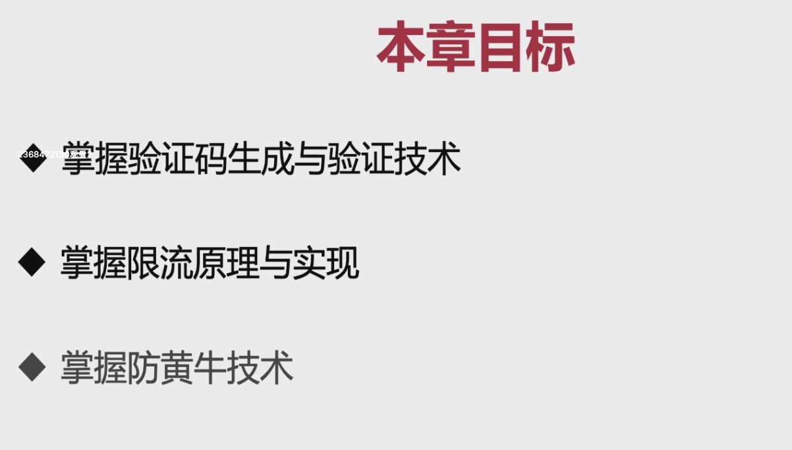
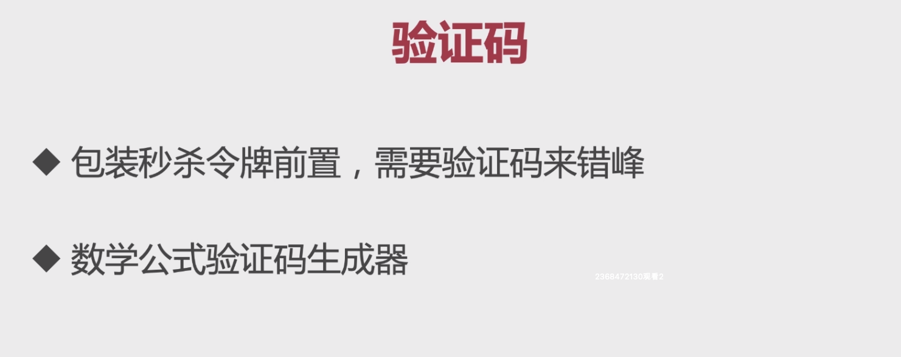
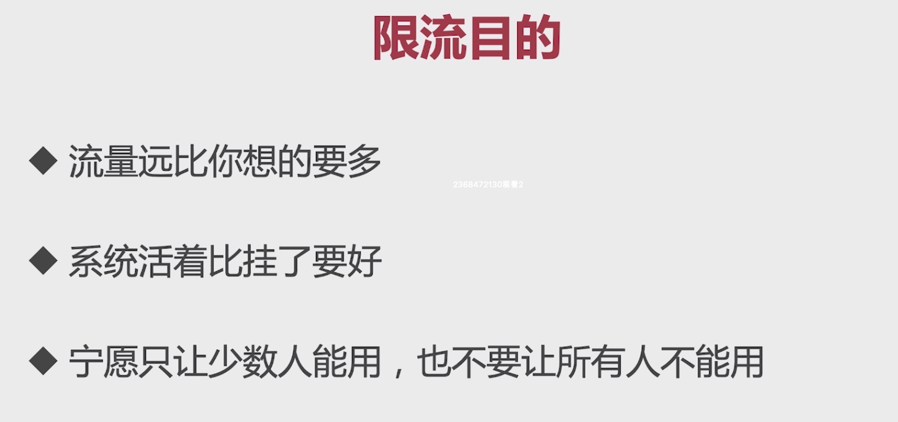
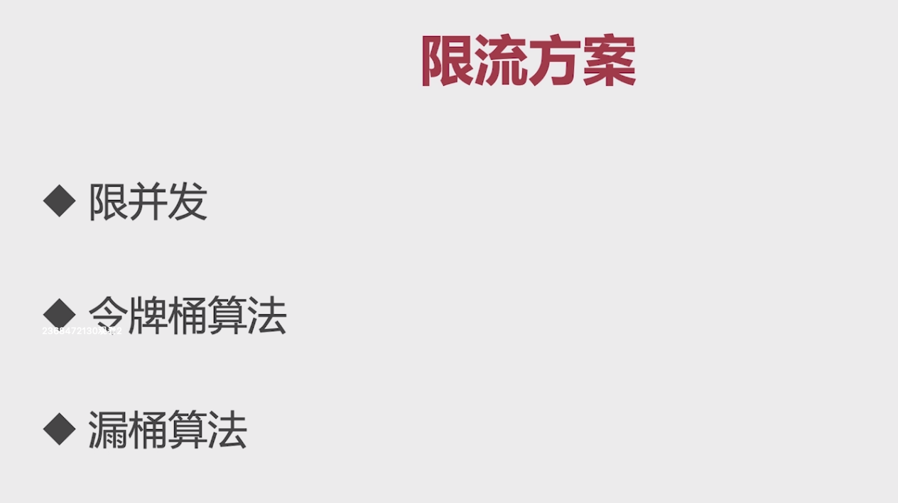
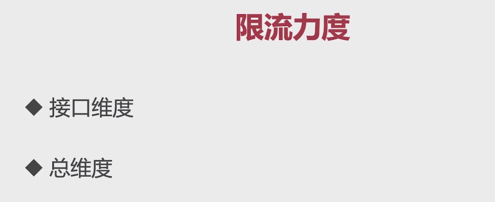
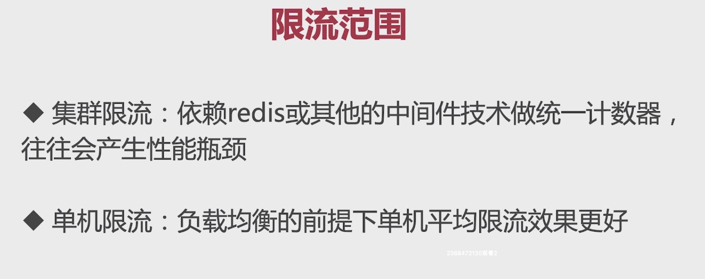
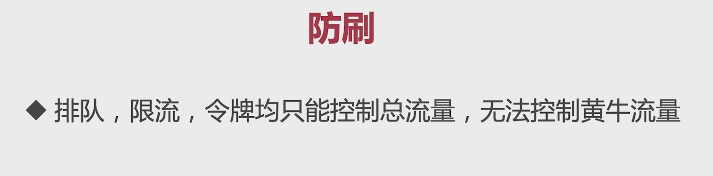
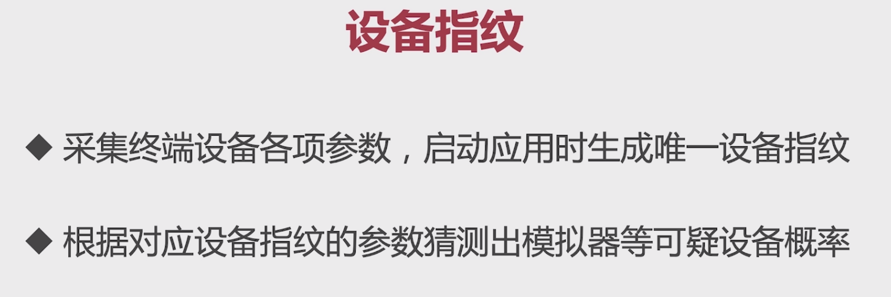
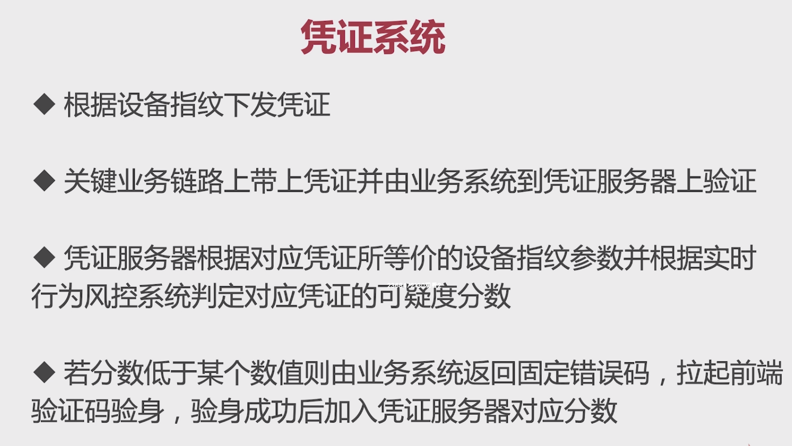

# 10-1 防刷限流技术总章介绍



# 10-2 验证码技术



验证码生成的工具类：com.imooc.miaoshaproject.util.CodeUtil

验证码生成的接口：com.imooc.miaoshaproject.controller.OrderController#generateverifycode

验证码校验的逻辑写到了令牌生成的逻辑里面：

```Java
//通过verifycode验证验证码的有效性
String redisVerifyCode = (String) redisTemplate.opsForValue().get("verify_code_"+userModel.getId());
if(StringUtils.isEmpty(redisVerifyCode)){
    throw new BusinessException(EmBusinessError.PARAMETER_VALIDATION_ERROR,"请求非法");
}
if(!redisVerifyCode.equalsIgnoreCase(verifyCode)){
    throw new BusinessException(EmBusinessError.PARAMETER_VALIDATION_ERROR,"请求非法，验证码错误");
}
```

# 10-4 限流目的介绍

TPS（对数据库能够进行写操作）：每秒能够处理请求的数量。

QPS（对数据库的读请求）：每秒能够处理查询请求的数量。

并发：同一个时刻内一共有多少个请求可以处理。





# 10-5 限流方案



总维度的限流：大概比接口维度限流总和少20%。



# 10-6 限流的代码实现

在com.imooc.miaoshaproject.controller.OrderController#createOrder代码中使用Guava的RateLimiter的实现，大概的思想是：一个线程过来取令牌，先判断当前这一秒是否有剩余令牌，有的话直接返回。如果没有的话，提前将下一秒的令牌预支，然后让当前线程等待到下一秒之后再继续执行。

# 10-7 防刷技术






