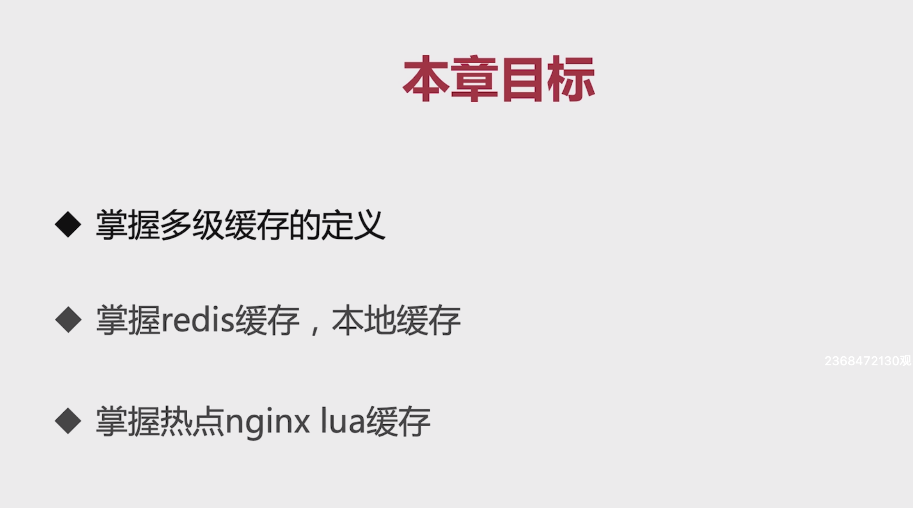
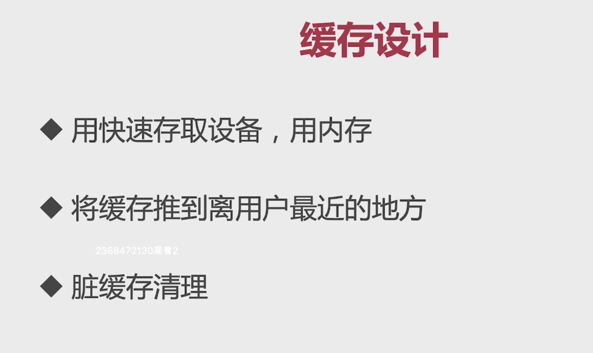
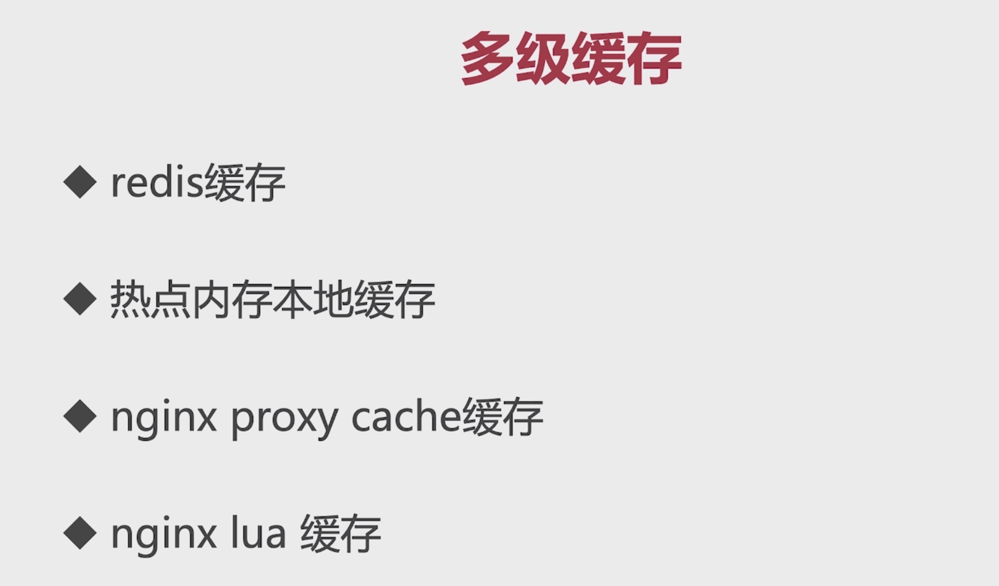
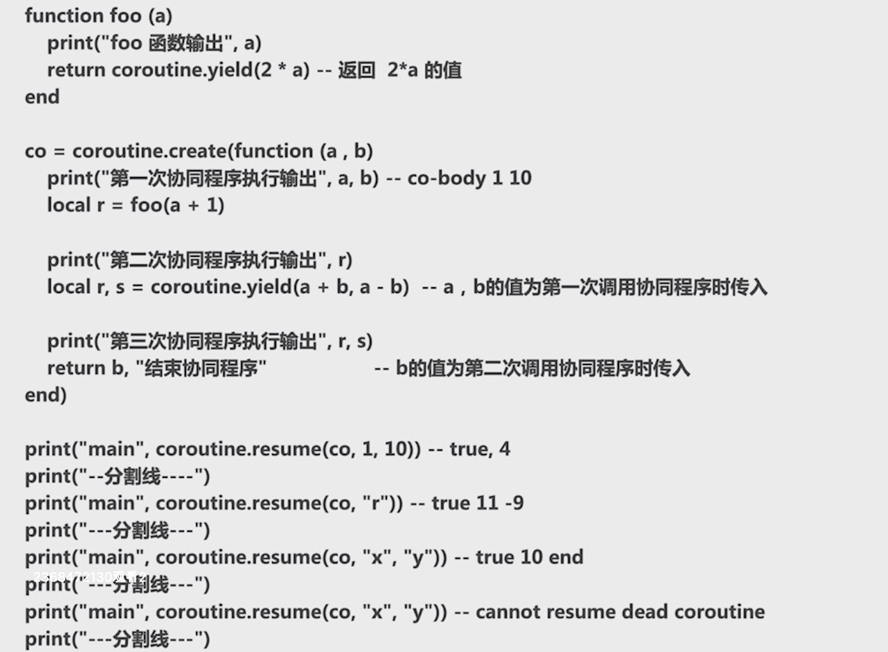
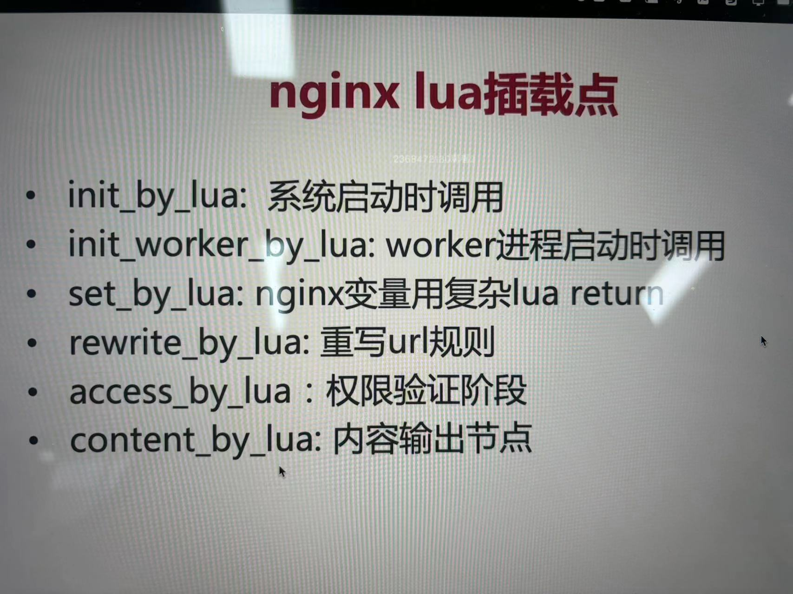

# 5-1 本章学习目标

# 5-2 缓存的设计原则

其中第二点，将缓存推到离用户最近的地方，目前我们系统的涉及的节点有前端页面、Nginx、Tomcat（应用）和MySQL，这些节点中使用缓存的原则就是将缓存放置在离用户最近的地方。

其中Nginx proxy cache是Nginx借助操作系统的文件系统磁盘上实现的缓存。nginx lua缓存是在Nginx上做的内存缓存。

# 5-3 Redis集中式缓存

Redis在我们web项目的开发中是作为一个集中式的缓存来使用的，存储的数据是易失性的。这一节主要介绍了Redis的三种架构模式：

* 单机架构
* 哨兵模式
* 集群模式

# 5-4 Redis集中式缓存商品详情页接入

具体的实现可以看代码，这里不再详细介绍

# 5-7 本地数据热点缓存（上）

* Guava cahce
    * 可控制大小和有效时间
    * 可配置的LRU策略
    * 线程安全

# 5-10 nginx proxy cache缓存实现及压测结果验证 

* Nginx proxy Cache
    * 要求Nginx必须作为服务器后端的前置反向代理
    * 依靠文件系统存储缓存的数据
    * 依靠内存缓存文件的地址，也就是缓存的地址存储在内存

# 5-11 nginx lua原理

* Nginx和Lua结合使用

    * Lua的协程机制和Nginx的协程机制不谋而合
    * Nginx提供了Lua的插载点，方便我们Nginx执行的生命周期执行不同的操作

* 协程机制

    * 协程的优势在于可以在不阻塞主线程的情况下暂停和恢复协程的执行，从而实现高效的并发处理。
    * 协程是依附于线程的内存模型，切换开销小。
    * 协程遇到阻塞就会返回执行权限，代码是同步执行的。
    * 无需加锁。

* 一段演示Lua协程的代码段

    

* Nginx提供的lua脚本的挂载点

    https://openresty-reference.readthedocs.io/en/latest/Directives/

* Nginx中我们可以自定义的lua脚本：

    

# 5-17 OpenResty实战---Shared dic

shared dic：共享内存字典，对所有的worker进程可见，支持LRU淘汰机制。

* 可以实现对热点数据的缓存功能，将请求的负载放到Nginx上去，从而减轻后端服务的负载。

* 性能是远高于nginx proxy cache。

# 5-18 OpenResty实战---Redis支持

在nginx上直接获取redis（Redis Slave）上的商品数据，如果没有获取到再将请求打到后端服务器上去，在后台程序中会将商品数据重新添加到Redis中。

这样做的特点：

* 减轻的服务器端的压力。
* 将系统的负载转移到了Redis上面。

