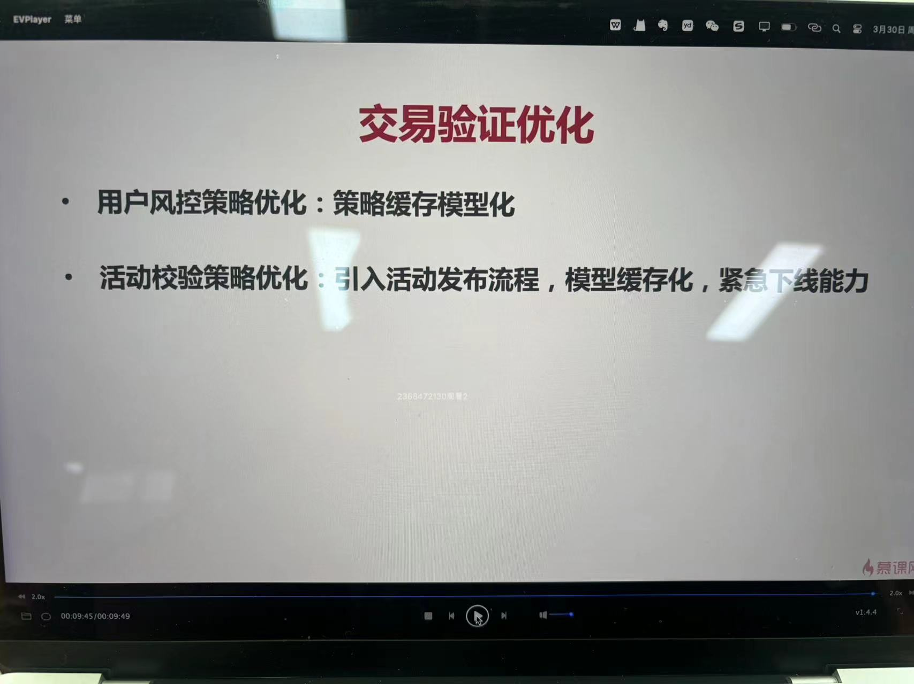
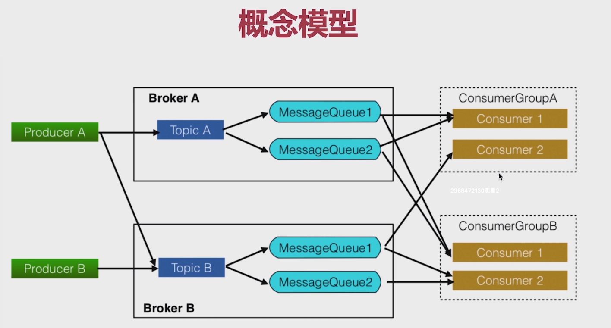
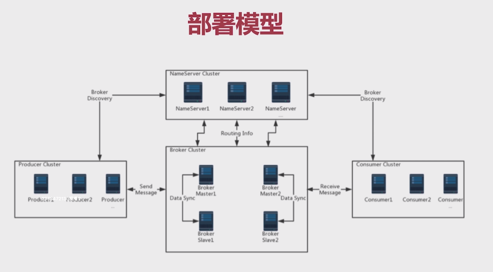
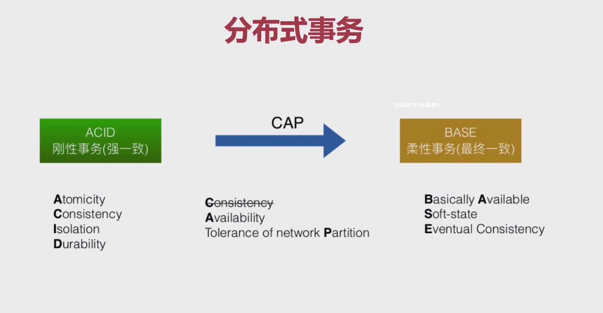

# 7-1 交易性能瓶颈

1. 存在的问题

    * 交易的参数验证完全依赖数据库
    * 库存行锁（热点操作）
    * 还有一些后置的处理逻辑

2. 视频中的ppt

    

# 7-2 交易验证优化

针对下单中用户校验和活动校验两个环节，可以采用缓存的机制，减少对数据库的IO操作。

* 活动校验
    * 在活动开始之前，要求业务提前半个小时进行修改，程序就有半个小时的时间进行缓存的预热。
    * 支持活动的紧急下线，及时清除缓存中的数据。

# 7-4 活动缓存库存方案一：库存扣减行锁优化

方案一：

* 活动发布时同步将库存放入缓存
* 下单交易时直接通过缓存进行扣除
* 问题：数据库的库存和缓存中的库存如何保证一致性

# 7-5 活动缓存库存方案二

方案二：

* 活动发布同步库存到缓存中
* 下单交易减缓库存
* 异步消息扣减数据库内库存

RockMQ概念模型

RockMQ部署模型

分布式事务

存在的问题

1. 异步消息发送失败
2. 扣减操作执行失败
3. 下单失败无法正确回补库存

