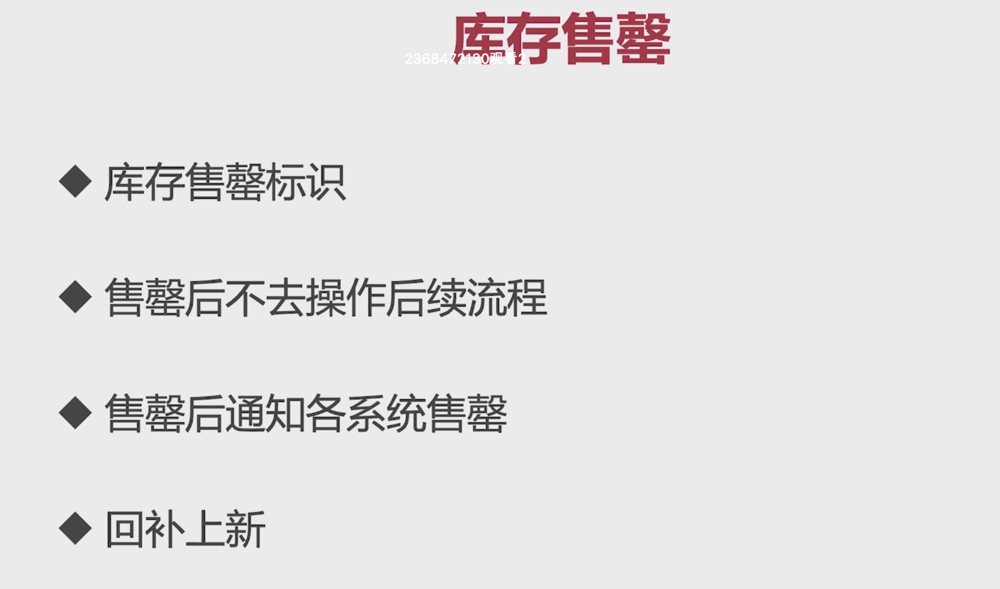

# 8-1 事务型消息

## 问题一：扣减库存成功，但是提交订单入库失败

### 解决方案

这个问题是说按照之前的设计，我们将redis中的缓存库存进行扣减，然后发一条消息到rockmq，在消费者的逻辑中将数据库中的库存进行扣减。这样做乍一看挺完美的，但是有一个问题，我们这边通过消息队列异步将数据库中的库存进行了扣减，那么如果后续订单的入库出现的失败怎么办？这样就会产生很多库存被扣减，但是没有对应的订单数据的情况。针对这种情况我们做出的改动：

1. 在缓存中进行库存扣减时，先不通过消息队列发送消息去扣减数据库的库存。
2. 在订单入库之后再发消息进行数据库库存的扣减。

### 遗留的问题

这里我们在方法上使用的是Spring的`@Transcational`注解进行事务控制。如果我们按照上面的方案执行之后，因为Spring的注解事务是在方法结束之后才会去执行commit，如果此时因网络问题commit失败，但是我的消息已经发了，还是会出现存存扣减了，找不对对应的订单，会出现库存堆积的情况。

这个时候Spring提供了一个API：

```Java
TransactionSynchronizationManager.registerSynchronization(new TransactionSynchronizationAdapter() {
    @Override
    public void afterCommit(){
        //异步更新库存
        boolean mqResult = itemService.asyncDecreaseStock(itemId,amount);
        if(!mqResult){
            itemService.increaseStock(itemId,amount);
            throw new BusinessException(EmBusinessError.MQ_SEND_FAIL);
        }
    }

})
```

这个API会在事务提交执行执行，但是这里又会有一个问题出现，就是如果订单提交成功了，但是我发送消息到消息队列失败了怎么办？

## 问题二：如果在订单入库之后再发送消息到消息队列，发送失败了怎么办

### 解决办法

采用[RockMQ的事务性消息](https://rocketmq.apache.org/zh/docs/featureBehavior/04transactionmessage/)

### 事务消息存在的问题

* 引入事务性消息之后，事务消息的监听器有两个方法，一个方法`executeLocalTransaction`是用来执行本地方法的，这个方法是消息发送方来执行的，执行之后将执行结果同步给rockmq。

* 第二个方法是`checkLocalTransaction`，消息发送方会通过这个方法检查本地事务的执行状态，是回滚还是提交。

    * 如果是提交，服务端（rockmq）将半事务消息标记为可投递，并投递给消费者。

    * 如果是回滚，服务端（rockmq）将回滚事务，不会将半事务消息投递给消费者。

    这里就存在一个问题，我如何判断我的订单已经创建成功了。这里加了一张**订单流水表**来标记订单的创建情况。这里通过查询这个状态来判断上面`executeLocalTransaction`的执行情况是否是正常的。这个方法是rockmq服务端主动过来查询本地事务的状态时来调用的。

    这里分别会返回提交、回滚和未知三个状态。未知状态的话，rockmq还会按照一定的频次过来查询。

### 还有什么问题

* redis不可用时怎么处理

    在主流程中直接扣减redis的库存时，redis挂了怎么办？

* 扣减流水错误如何处理

    就是说在消息消费端去操作数据库扣减库存出现异常怎么办？

* 这两个问题的解决方案

    设计原则：是宁可少卖，不能超卖。还是宁可超卖，不能少卖。

    * 方案：可以接收redis中的库存比数据库中要少。

     * 方案：超时释放。如果服务器调用`checkLocalTransaction`一直是unknow怎能办？进行定时释放。

# 8-7 库存售罄处理方案 



1. 在扣减缓存的库存时，如果库存为0，则设置库存售罄标识
2. 在记录订单流水之前，先校验缓存中的库存标识是否存在，如果存在就抛出异常中止流程。

# 8-8 后置流程总结

* 销量逻辑的异步化

    就是将销量增加的操作放到mq里面去做。

* 交易单逻辑异步化

    意思是说用户抢购之后生成一个交易订单的序列号返回给前端，将订单的创建、库存扣减等操作放到消息队列异步去做。让前端轮训的来查询异步订单的状态

    存在的问题：对于用户来讲看着是下单成功，但是这其实是一个假的提交订单。需要前端不停的过来查询订单创建的状态。这样对于用户的体验是不太好的。所以我们不做交易单的异步化，只做库存扣减的异步化。
