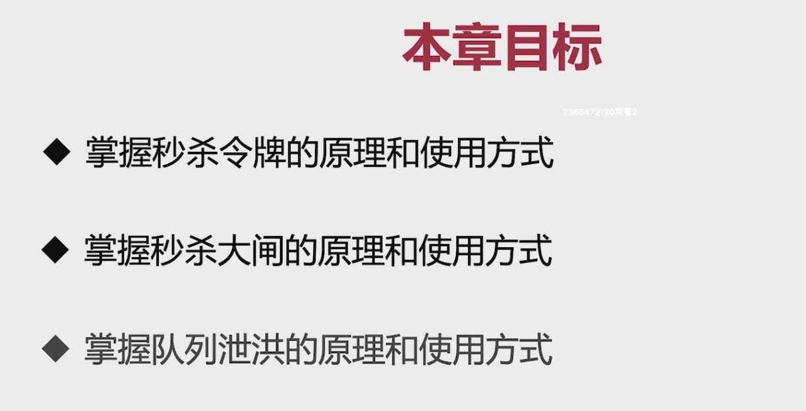
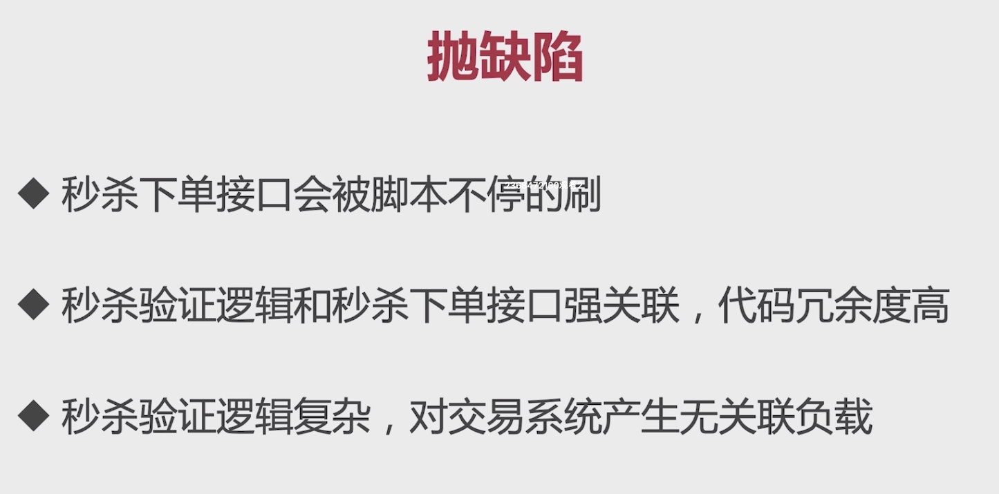
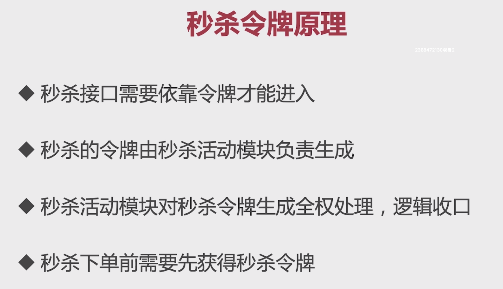
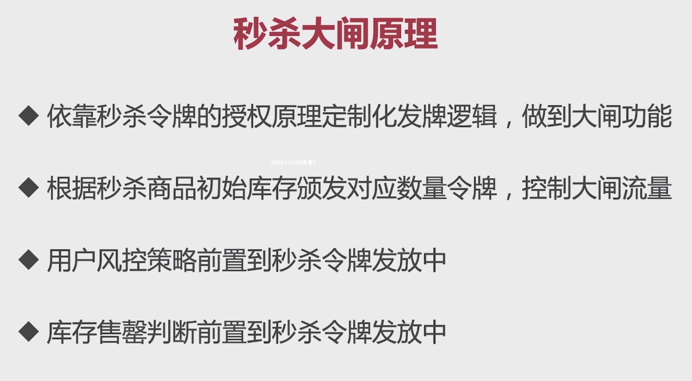
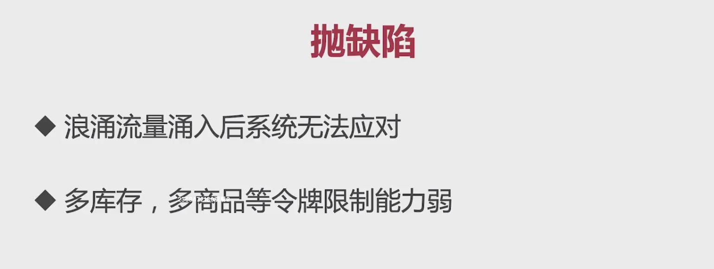
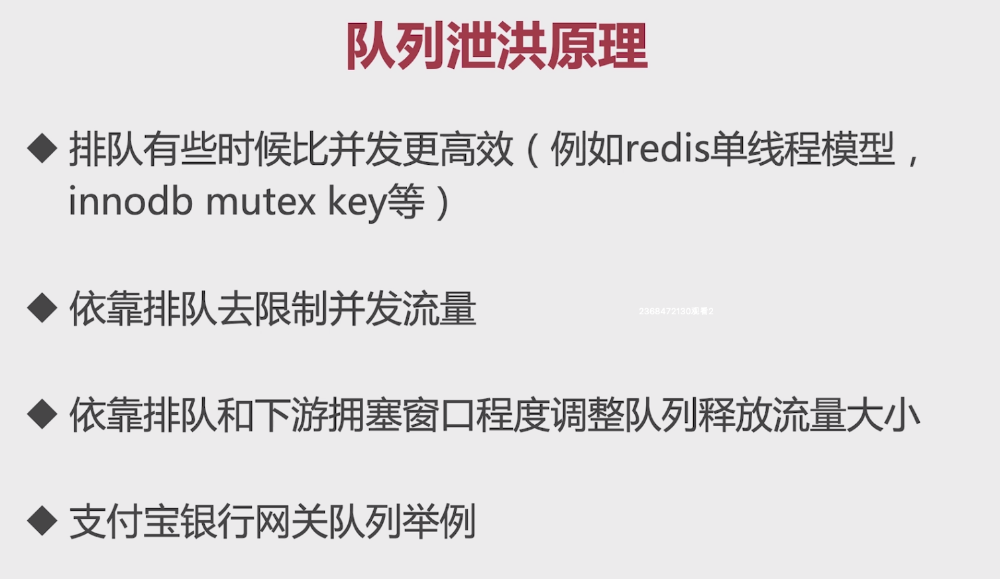
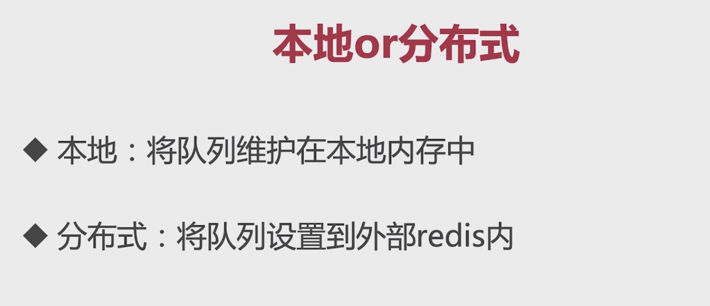

# 9-1 流量削峰技术引入



# 9-2 秒杀令牌实现





具体优化的代码如下：

* 获取秒杀令牌：com.imooc.miaoshaproject.service.impl.PromoServiceImpl#generateSecondKillToken
* 下单接口去除用户风控校验、活动和商品的校验逻辑，添加令牌的校验：com.imooc.miaoshaproject.service.impl.OrderServiceImpl#createOrder

# 9-4 秒杀大闸原理及实现

上面实现存在的问题：秒杀令牌的获取没有做控制，任何人都可以获取秒杀的令牌。这里我们引入了秒杀大闸的概念：



活动发布：com.imooc.miaoshaproject.service.impl.PromoServiceImpl#publishPromo，设置令牌数是库存的5倍。

```Java
//将大闸的限制数字设到redis内
redisTemplate.opsForValue().set("promo_door_count_"+promoId,itemModel.getStock().intValue() * 5);
```

令牌发放：com.imooc.miaoshaproject.service.impl.PromoServiceImpl#generateSecondKillToken

```Java
//获取秒杀大闸的count数量
long result = redisTemplate.opsForValue().increment("promo_door_count_"+promoId,-1);
if(result < 0){
    return null;
}
```

用户分控和售罄判断的代码直接从下单接口拿过来就行。

# 9-5 队列泄洪



1. 浪涌流量涌入后系统无法应对

    假设我有一个商品，将其库存设置为1万，我们发布到缓存中的令牌就有5万个，也就是说活动开始的第一秒也会存在上玩的TPS请求到达系统，系统是无法应对的。

2. 多库存，多商品等令牌限制能力弱



在这里时通过本地的线程池去做的：com.imooc.miaoshaproject.controller.OrderController#createOrder

```Java
//同步调用线程池的submit方法
//拥塞窗口为20的等待队列，用来队列化泄洪
Future<Object> future = executorService.submit(new Callable<Object>() {

    @Override
    public Object call() throws Exception {
        //加入库存流水init状态
        String stockLogId = itemService.initStockLog(itemId,amount);


        //再去完成对应的下单事务型消息机制
        if(!mqProducer.transactionAsyncReduceStock(userModel.getId(),itemId,promoId,amount,stockLogId)){
            throw new BusinessException(EmBusinessError.UNKNOWN_ERROR,"下单失败");
        }
        return null;
    }
});
```

# 9-7 本地或分布式

