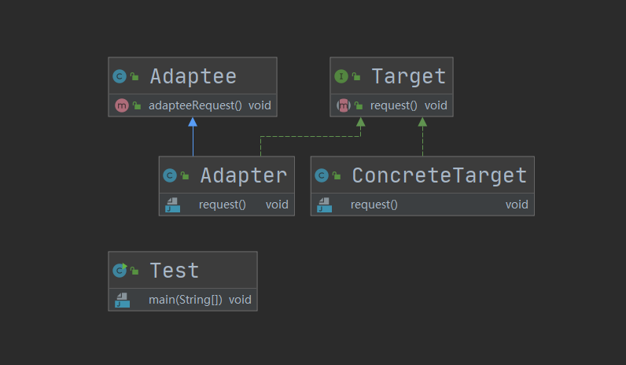
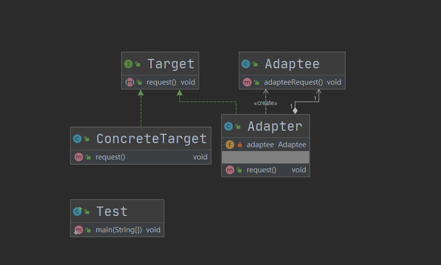

## 第11章 适配器模式

### 1. 适配器模式讲解

* 定义：将一个类的接口转换成客户期望的另一个接口

* 特点：**使原本接口不兼容的类可以一起工作**

* 类型：结构型

* 适用场景

  * 已经存在的类，它的方法和需求不匹配时（方法结果相同或相似）
  * 不是软件设计阶段考虑的设计模式，是随着软件维护，由于不同产品、不同厂家造成功能类似而接口不相同情况下的解决方案

* 优点

  * 能提高类的透明性和复用，现有的类复用但不需要改变
  * 目标类和适配器类解耦，提高程序扩展性
  * 符合开闭原则

* 缺点

  * 适配器编写过程需要全面考虑，可能会增加系统的复杂性
  * 增加系统代码可读的难度

* 扩展

  这两者之间最大的区别在于一个通过组合一个通过继承实现。

  * 对象适配器模式（**优先使用**）

    符合组合复用原则，并且使用委托机制。

  * 类适配器模式

    通过类继承实现的。

* 相关设计模式

  * 适配器模式和外观模式的区别

    * 同：

      1. 都是对现存的类，现有的系统的封装；

    * 异：

      1. 外观定义了新的接口，而适配器则是复用原有的接口；
      2. 适配器是使两个已有的接口协同工作，而外观则是在现有的系统中提供一个更为方便的访问入口；
      3. 如果我们强行把外观模式视为适配器模式的话，这两种模式最大的区别在于**适配的粒度不同**，外观模式是用来适配整个子系统的，也就是说相关的子系统，所以外观所针对的粒度更大；
* 角色

  * **Target（目标抽象类）：**目标抽象类定义客户所需接口，可以是一个抽象类或接口，也可以是具体类。

  *  **Adapter（适配器类）：**适配器可以调用另一个接口，作为一个转换器，对Adaptee和Target进行适配，适配器类是适配器模式的核心，在对象适配器中，**它通过继承Target并关联一个Adaptee对象使二者产生联系**。

  * **Adaptee（适配者类，被适配）：** **适配者即被适配的角色**，它定义了一个已经存在的接口，这个接口需要适配，适配者类一般是一个具体类，包含了客户希望使用的业务方法，在某些情况下可能没有适配者类的源代码。

### 2. 适配器模式coding

1. 类适配器模式

   * 代码：cn.bravedawn.design.pattern.structural.adapter.classadapter

   * 思想：**是通过类继承实现的**。通过实现Target的request方法，继承Adaptee调用父类的adapteeRequest方法，这里Adaptee通过Adapter实现了Target接口，而不是像ConcreteTarget自己直接实现Target接口

   * UML图

     

2. 对象适配器模式

   * 代码：cn.bravedawn.design.pattern.structural.adapter.objectadapter

   * 思想：**符合组合复用原则，并且使用委托机制。**

     1. 通过实现Target的request方法

     2. 通过组合复用原则，实例化被适配者adaptee；并且使用委托机制将request方法的实现委托给adaptee

   * UML图

     

3. 一个手机电源适配器的案例：cn.bravedawn.design.pattern.structural.adapter.rechargecase

    我们要做一个电源适配器，标准电压是220V，但是我们要求我们电源适配器要输出的电压是5V。所以这里的三个角色中**5V的电源适配器是目标抽象类，220V的标准输出电压是被适配者类，适配器类就是将220V电压转换为5V的这个过程**。

### 3. 适配器模式源码解析(jdk+spring+springjpa+springmvc)

#### 1. JDK

1. javax.xml.bind.annotation.adapters.XmlAdapter

  实现Java对象与xml之间的序列化和反序列化。

  * javax.xml.bind.annotation.adapters.XmlJavaTypeAdapter
  * javax.xml.bind.annotation.adapters

#### 2. Spring

1. org.springframework.aop.framework.adapter.AdvisorAdapter

   允许扩展到Spring AOP框架，允许处理新的Advisors和Advice类型。

   * org.springframework.aop.framework.adapter.MethodBeforeAdviceAdapter

#### 3. Spring Data Jpa

1. org.springframework.orm.jpa.JpaVendorAdapter
   * org.springframework.orm.jpa.vendor.AbstractJpaVendorAdapter

#### 4. Spring Mvc

1. org.springframework.web.servlet.HandlerAdapter

   * **Target（目标抽象类）**：org.springframework.web.servlet.HandlerAdapter

   * org.springframework.web.servlet.DispatcherServlet
     * org.springframework.web.servlet.DispatcherServlet#doDispatch
   * **Adaptee（适配者类）**：org.springframework.web.servlet.mvc.Controller
   * **Adapter（适配器类）**org.springframework.web.servlet.mvc.SimpleControllerHandlerAdapter

