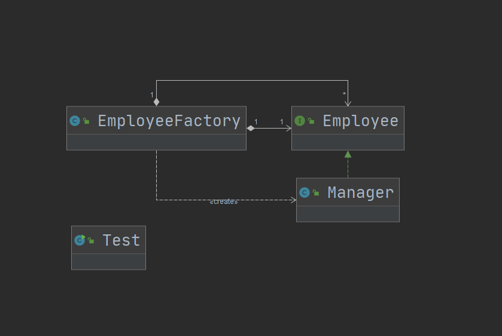

## 第12章 享元模式讲解

### 1. 享元模式讲解

* 定义：提供了减少对象数量从而改善应用所需的对象结构的方法（减少创建对象的数量，从而减少内存的占用，提高性能）

* 特点：运用共享技术有效支持大量细粒度的对象

* 类型：结构型

* 适用场景

  * 常常应用于系统底层的开发，以便解决系统的性能问题
  * 系统有大量相似对象、需要缓冲池的场景

* 优点

  * 减少对象的创建，降低内存总对象的数量，降低系统的内存，提高效率
  * 减少内存之外的其他资源占用（其他资源比如操作系统中的文件句柄，窗口句柄；new关键字所需的时间）

* 缺点

  * 关注内/外部状态、关注线程安全问题
  * 使系统、程序的逻辑复杂化

* 扩展

  * 内部状态

    在享元对象内部并且不用随环境改变而改变的共享部分，称为享元对象的内部状态。

  * 外部状态

    环境改变而改变的、不可以共享的状态就是外部状态。

* 相关设计模式

  * 享元模式和代理模式

    代理模式需要代理一个类，如果生成代理类所需的时间和资源比较多，那么就可以使用享元模式来提高程序的处理速度。

  * 享元模式和单例模式

    容器单例就是享元模式和单例模式的结合， 享元模式就是一种复用对象的思想，至于何时使用，如何使用就要视业务逻辑而定。

### 2. 享元设计模式coding

* 代码：cn.bravedawn.design.pattern.structural.flyweight

* 演示场景：代码演示了各个部门经理作报告的逻辑

* 内部状态和外部状态

  ```java
  /**
  * department和reportContent这两个属性是外部状态
  */
  private String department;
  private String reportContent;
  
  /**
  * title是在内部就已经声明好的，是内部状态
  */
  private String title = "部门经理";
  ```

* UML

  从下图中可以看出`EmployeeFactory`和`Employee`是组合关系。

  

### 3. 享元模式源码解析(jdk+tomcat)

#### 1. JDK

* java.lang.Integer
  * java.lang.Integer#valueOf(int)：该方法中的java.lang.Integer.IntegerCache就是利用了享元模式的思想
* java.lang.Long
  * java.lang.Long#valueOf(long)：与上面同理

#### 2. Tomcat

* org.apache.commons.pool2.impl.GenericKeyedObjectPool

  下面这两个方法都用到了享元模式的思想：

  * org.apache.commons.pool2.impl.GenericKeyedObjectPool#borrowObject(K, long)
  * org.apache.commons.pool2.impl.GenericKeyedObjectPool#returnObject

