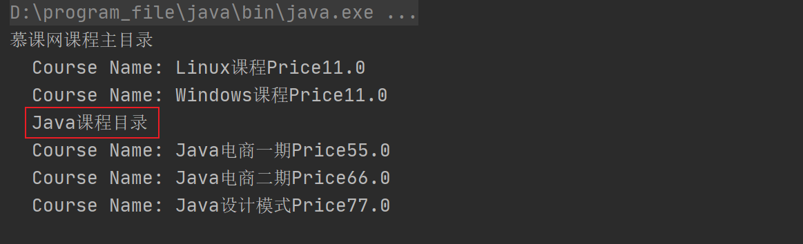
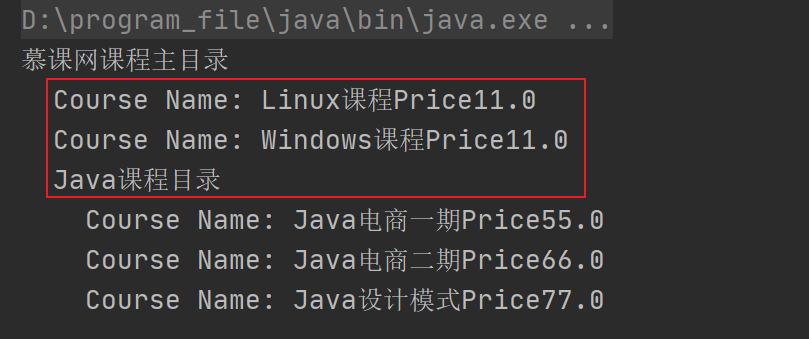

## 第13章 组合模式

### 1.  组合模式讲解

* 定义：将对象组合成树形结构以表示”部分-整体“的层次结构

* 特点：组合模式使客户端对单个对象和组合对象保持一致的方式处理

* 类型：结构型

* 使用场景

  * 希望客户端可以忽略组合对象与单个对象的差异时
  * 处理一个树形结构时

* 优点

  * 清楚的定义分层次的复杂对象，表示对象的全部或部分层次
  * 让客户端忽略了层次的差异，方便对整个层次结构进行控制
  * 简化客户端代码
  * 符合开闭原则

* 缺点

  * 动态限制类型时会较为复杂
  * 使设计变得更加抽象

* 相关设计模式

  * 组合模式和访问者模式

    他们是一种组合应用，我们可以通过访问者模式访问组合模式中的递归结构。
  
* 角色

  * **Component（抽象构件）**：它可以是接口或抽象类，为叶子构件和容器构件对象声明接口，在该角色中可以包所有子类共有行为的声明和实现。在抽象构件中定义了访问及管理它的子构件的方法，如增加子构件、删除子构件、获取子构件等。
  * **Leaf（叶子构件）**：它在组合结构中表示叶子节点对象，叶子节点没有子节点，它实现了在抽象构件中定义的行为。对于那些访问及管理子构件的方法，可以通过异常等方式进行处理。
  * **Composite（容器构件）**：它在组合结构中表示容器节点对象，容器节点包含子节点，其子节点可以是叶子节点，也可以是容器节点，它提供一个集合用于存储子节点，实现了在抽象构件中定义的行为，包括那些访问及管理子构件的方法，在其业务方法中可以递归调用其子节点的业务方法。

* 关键：组合对象和叶子对象都要实现同一接口或是继承同一抽象类，这样组合模式才能将组合对象和叶子对象进行统一的处理。

### 2. 组合模式coding

#### 1. 组合模式的实现

* 模拟场景：模拟慕课网课程体系设置，分为课程和课程目录，通过组合模式消除他们之间的差别
* 存在的问题：我们在打印课程目录的时候发现，课程和课程目录都打印到了同一级上，显然这样做是不合适的，这个问题也就是上面提到的该模式的缺点“**动态限制类型时会较为复杂**”，如下图：
  
* 代码：cn.bravedawn.design.pattern.structural.composite.v1

#### 2. 添加类型限制

* 代码：cn.bravedawn.design.pattern.structural.composite.v2

* 改进：重新cn.bravedawn.design.pattern.structural.composite.v2.CourseCatalog的`print`方法，添加类型限制：

  ```java
  @Override
  public void print() {
      System.out.println(this.name);
      for (CatalogComponent component : items){
          // 这里使用this.level是因为只准对课程目录CourseCatalog做处理，或者使用instanceof做类型判断也可以
          if (this.level != null){
              for (int i = 0; i < this.level; i++){
                  System.out.print("  ");
              }
          }
          component.print();
      }
  }
  ```

* 改进后的打印输出如下图：

  

### 3. 组合模式源码解析(jdk+mybatis)

#### 1. JDK

1. java.awt.Container
   * java.awt.Component，父级抽象类
   * java.awt.Container#add(java.awt.Component)
2. java.util.HashMap
   * java.util.Map，父级接口
   * java.util.HashMap#putAll
3. java.util.ArrayList
   * java.util.List，父级接口
   * java.util.Collection，父级接口
   * java.util.ArrayList#addAll(java.util.Collection<? extends E>)

#### 2.Mybatis

1. org.apache.ibatis.scripting.xmltags.MixedSqlNode
   * org.apache.ibatis.scripting.xmltags.MixedSqlNode，这个类就相当于我们上面coding中的课程目录CourseCatalog
     * org.apache.ibatis.scripting.xmltags.MixedSqlNode#apply，这个方法和课程目录CourseCatalog的`print`方法异曲同工的