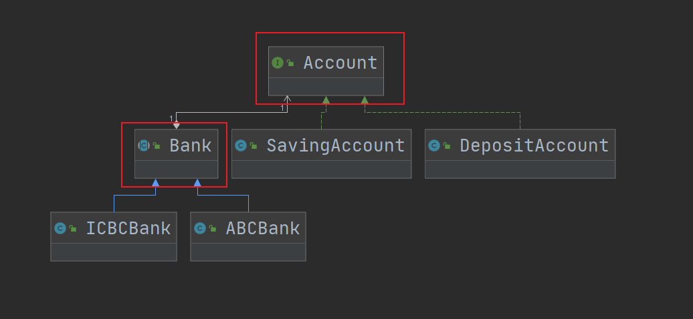
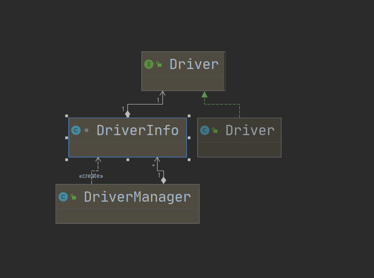

## 第14章 桥接模式

### 1. 桥接模式讲解

* 定义：将抽象部分与它的具体实现部分分离，使它们都可以独立地变化

* 特点：通过组合的方式建立两个类之间的联系，而不是继承

* 类型：结构型

* 适用场景

  * 抽象和具体实现之间增加更多的灵活性
  * 一个类存在两个（或多个）独立变化的维度，且这两个（或多个）维度都需要独立进行扩展
  * 不希望使用继承，或因为多层继承导致系统类的个数剧增

* 优点

  * 分离抽象部分及其具体实现部分
  * 提高系统的可扩展性
  * 符合开闭原则
  * 负责合成复用原则

* 缺点

  * 增加了系统的理解与设计难度
  * 需要正确地识别出系统中两个独立变化的维度

* 角色

  * **Abstraction（抽象类）**：用于定义抽象类的接口，它一般是抽象类而不是接口，其中定义了一个Implementor（实现类接口）类型的对象并可以维护该对象，它与Implementor之间具有关联关系，它既可以包含抽象业务方法，也可以包含具体业务方法。
  * **RefinedAbstraction（扩充抽象类）**：扩充由Abstraction定义的接口，通常情况下它不再是抽象类而是具体类，它实现了在Abstraction中声明的抽象业务方法，在RefinedAbstraction中可以调用在Implementor中定义的业务方法。
  * **Implementor（实现类接口）**：定义实现类的接口，这个接口不一定要与Abstraction的接口完全一致，事实上这两个接口可以完全不同，一般而言，Implementor接口仅提供基本操作，而Abstraction定义的接口可能会做更多更复杂的操作。Implementor接口对这些基本操作进行了声明，而具体实现交给其子类。通过关联关系，在Abstraction中不仅拥有自己的方法，还可以调用到Implementor中定义的方法，使用关联关系来替代继承关系。
  * **ConcreteImplementor（具体实现类）**：具体实现Implementor接口，在不同的ConcreteImplementor中提供基本操作的不同实现，在程序运行时，ConcreteImplementor对象将替换其父类对象，提供给抽象类具体的业务操作方法。

* 相关设计模式

  * 桥接模式和组合模式

    组合模式更强调的是部分和整体间的组合，而桥接模式强调的是平行级别上不同类的组合。

  * 桥接模式和适配器模式

    这两种模式的共同点都是为了让两个东西配合工作，但他们俩的目的又各不一样，适配器模式是改变已有的接口，让他们直接可以相互配合；而桥接模式是分离抽象和具体的实现，他的目的是分离。

    也就是说适配器模式可以把功能相似，接口不同的类适配起来；而桥接模式则是将类的抽象和类的具体实现分离开，然后在此基础上使这些层级结构结合起来。

### 2. 桥接模式coding

* 模式场景：这里模拟了银行开户的场景，其中从银行和账户类型这两个维度进行独立扩展

* 代码：cn.bravedawn.design.pattern.structural.bridge

* UML：

  从下图中可以看到Bank和Account两个维度是组合关系，分别扩展了银行和账户的业务逻辑。

  

  ### 3. 桥接模式源码解析(jdk)

#### 1. JDK

1. java.sql.Driver

   * java.sql.Driver：Implementor（实现类接口）

   * com.mysql.jdbc.Driver：ConcreteImplementor（具体实现类）

   * java.sql.DriverInfo：是对Driver有一层封装

   * java.sql.DriverManager：RefinedAbstraction（扩充抽象类）

   * UML：

     

