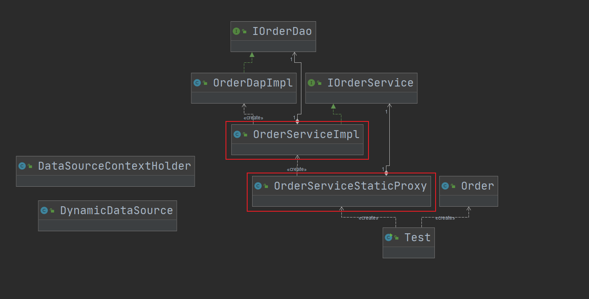

## 第15章 代理模式

### 1. 代理模式讲解

* 定义：为其他对象提供一种代理，以控制对这个对象的访问

* 特点：代理对象在客户端和目标对象之间起到中介作用

* 类型：结构型

* 适用场景

  * 保护目标对象，比如我们租房子，我们甚至连房东面都没见过
  * 增强目标对象，比如Spring AOP中的before和after

* 优点

  * 代理模式能将代理对象与真实被调用的目标对象分离
  * 一定程度上降低了系统的耦合度，扩展性好
  * 保护目标对象
  * 增强目标对象

* 缺点

  * 代理模式会造成系统设计中类的数目增加
  * 在客户端和目标对象增加一个代理对象，会造成请求处理速度变慢
  * 增加系统的复杂度

* 扩展

  * 静态代理

    1. 就是在代码中显示指定的代理。
    2. **所谓静态**就是在程序运行前就已经存在代理类的字节码文件，代理类和委托类的关系在运行前就确定了。

  * 动态代理

    1. JDK只能为实现**接口**的类实现动态代理，并不能针对一个特定的实现类。

    2. JDK中主要也分为静态代理和动态代理。

    3. 动态代理无法代理类，但是可以代理接口。JDK中实现动态代理是用到的代理类是在程序调用到代理类对象时才由JVM真正创建。

    4. **JVM根据传进来的业务实现类对象以及方法名，动态的创建代理类的class文件，并且这个class文件被字节码引擎执行，然后通过该代理类的对象进行方法调用。我们要做的就是把代理类里面的实现给写好，比如before和after方法。**

    5. 如果我们的业务实现类没有实现接口，则就不能使用动态代理了。

    6. 如果我们在业务实现类的实现中实现了a，b，c三个方法，而接口中只定义了a，b方法，则c方法是无法被代理的。

  * CGLib代理

    1. CGLib是可以代理**类**的，他就是针对类实现进行代理；
    2. 实现原理：如果我们代理一个类，CGLib就会为我们生成一个被代理类的子类，通过继承和重写覆盖其中的方法；
    3. 如果类是final的、类的方法是final的则要特别注意；

* 扩展：Spring 代理选择

  * 当bean有实现接口时，Spring就会用JDK的动态代理
  * 当bean没有实现接口时，Spring使用CGLib
  * 可以强制Spring使用CGLib
    * 在Spring配置中加入`<aop:aspectj-autoproxy proxy-target-class="true"/>`

* 相关设计模式

  * 代理模式和装饰者模式

    两者实现上比较相似，但目的不同，装饰者模式是为对象加上行为，而代理模式是控制访问。代理模式侧重通过代理人的方式增强目标对象，增强方式一般是增加目标对象的某些行为去实现的。

  * 代理模式和适配器模式

    适配器模式主要考虑和改变对象的接口，而代理模式不能改变代理类的接口的。

### 2. 代理模式coding-静态代理

* 场景：这个案例模拟了使用Spring模拟订单服务的分库操作

* 分析：这里通过`OrderServiceStaticProxy`与`IOrderService`的组合关系，``OrderServiceStaticProxy`对`IOrderService`的`saveOrder`方法逻辑进行了增强。静态代理的特点就是**依赖手动实现**，手法很像适配器模式。

* 实现步骤：

  1. 将接口实现类作为组合到静态代理类中
  2. 在静态代理类中编写需要增强的方法

* 注意：除了静态代理的实现，本例还对基于Spring进行分库的实现也做了介绍，可以参考`cn.bravedawn.design.pattern.structural.proxy.db`

* 代码：cn.bravedawn.design.pattern.structural.proxy.staticproxy

* UML：

  

### 3. 代理模式coding-动态代理

* 编写动态代理的两步
  * 一个接口和一个实现类
  * 编写动态代理类
    * 注入被代理接口实现类（set注入或是构造器注入）
    * 通过JDK生成代理类
    * 实现`InvocationHandler`接口，增强被代理接口方法
* 代码：cn.bravedawn.design.pattern.structural.proxy.dynamicproxy

### 4. 代理模式源码解析(jdk+spring+mybatis) 

#### 1. Spring

* org.springframework.aop.framework.ProxyFactoryBean
  * org.springframework.aop.framework.ProxyFactoryBean#getObject：核心方法
    * org.springframework.aop.framework.ProxyFactoryBean#getProxy
  * org.springframework.aop.framework.AopProxy#getProxy(java.lang.ClassLoader)：配置的AOP代理的委托接口，允许创建的实际代理对象。
  * org.springframework.aop.framework.CglibAopProxy
  * org.springframework.aop.framework.JdkDynamicAopProxy

#### 4. Mybatis

* org.apache.ibatis.binding.MapperProxyFactory
  * org.apache.ibatis.binding.MapperProxyFactory#newInstance(org.apache.ibatis.binding.MapperProxy<T>)
  * org.apache.ibatis.binding.MapperProxy：代理类，他实现了`InvocationHandler`
    * org.apache.ibatis.binding.MapperProxy#invoke

