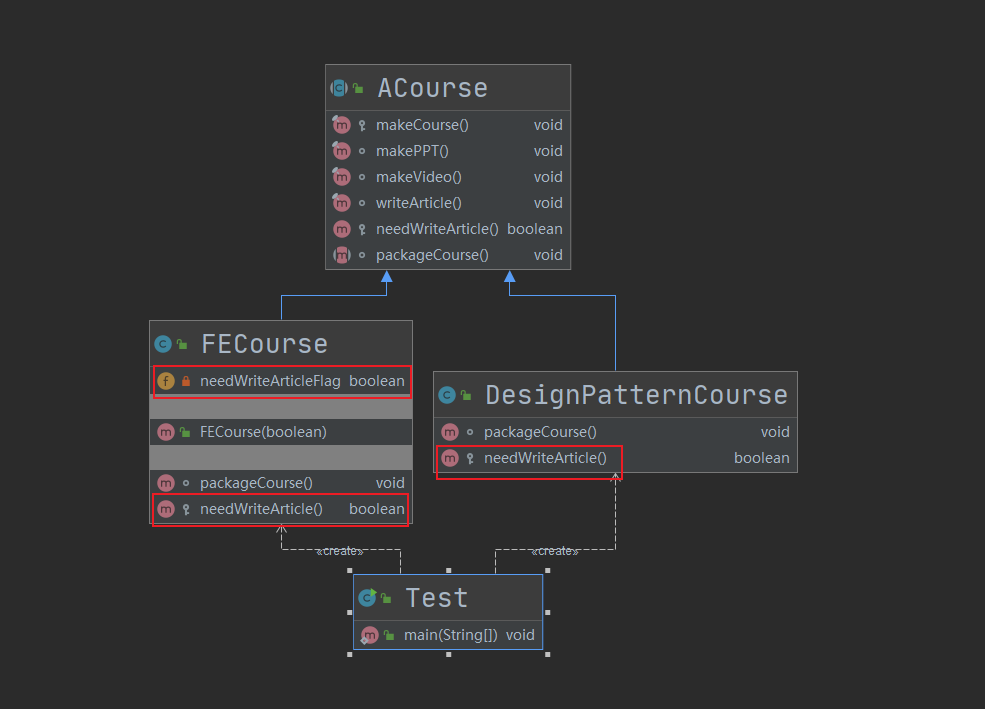

##  第16章 模板方法模式

### 1. 模板方法模式讲解

* 定义：定义了一个算法骨架，并允许子类为一个或多个步骤提供实现

* 特点：模板方法使得子类可以不改变算法结构的情况下，重新定义算法的某些步骤

* 类型：行为型

* 适用场景

  * 一次性实现一个算法的不变部分，并将可变的行为留给子类来实现
  * 各子类中公共的行为被提取出来并集中到一个公共父类中，从而避免代码重复

* 优点

  * 提高复用性
  * 提高扩展性
  * 符合开闭原则

* 缺点

  * 类的数目增加
  * 增加了系统实现的复杂度
  * 继承关系自身的缺点，如果父类添加新的抽象方法，所有子类都要改一遍

* 扩展

  * 钩子方法

    **由抽象类声明并且实现，子类也可以选择加以扩展**。通常抽象类会给出一个空的钩子方法，也就是没有实现的扩展。它和具体方法在代码上没有区别，不过是一种意识的区别；而它和抽象方法有时候也是没有区别的，就是在子类都需要将其实现的时候。而不同的是抽象方法必须实现，而钩子方法可以不实现。也就是说钩子方法为你在实现某一个抽象类的时候提供了可选项，相当于预先提供了一个默认配置。

* 相关设计模式

  * 模板方法模式和工厂方法模式

    模板方法模式是工厂方法模式的一种特殊实现

  * 模板方法模式和策略模式

    两种模式里面都有封装算法；

    策略模式的目的是使不同的算法可以相互替换，并且不影响应用层客户端的使用；而模板方法模式是定义一个方法的流程，而将一些具体的实现流程交给子类实现；

    模板方法模式是不改变算法的流程的，而策略模式是可以改变算法的流程的。

* 角色

  * **AbstractClass（抽象类）：**在抽象类中定义了一系列基本操作(PrimitiveOperations)，这些基本操作可以是具体的，也可以是抽象的，每一个基本操作对应算法的一个步骤，在其子类中可以重定义或实现这些步骤。同时，在抽象类中实现了一个模板方法(Template Method)，用于定义一个算法的框架，模板方法不仅可以调用在抽象类中实现的基本方法，也可以调用在抽象类的子类中实现的基本方法，还可以调用其他对象中的方法。

  * **ConcreteClass（具体子类）：**它是抽象类的子类，用于实现在父类中声明的抽象基本操作以完成子类特定算法的步骤，也可以覆盖在父类中已经实现的具体基本操作。

### 2. 迭代器模式coding

* 场景：模拟课程制作的流程，向子类开放一部分具体的实现逻辑，并使用钩子函数让子类去控制方法的使用。

* 关键点：两个子类对钩子函数的使用很巧妙，一个在子类中直接控制，另一个则是把使用权限开放给应用层去控制。

* UML

  