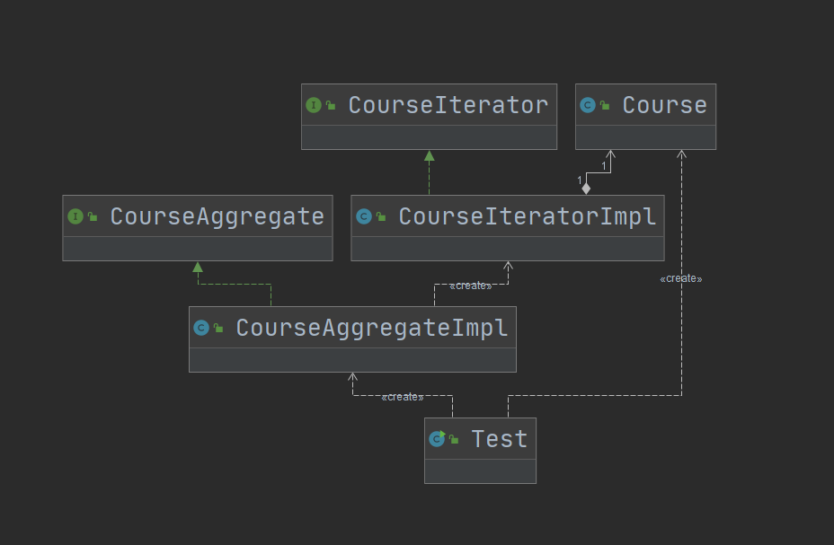

## 第17章 迭代器模式

### 1. 迭代器模式讲解

* 定义：提供一种方法，顺序访问一个集合对象中的各个元素，而又不暴露该对象的内部表示

* 类型：行为型

* 适用场景

  * 访问一个集合对象的内容而无需暴露它的内部表示
  * 为遍历不同的集合结构提供一个统一的接口

* 优点

  * 分离了集合对象的遍历行为

* 缺点

  * 类的个数成对增加

* 相关设计模式

  * 迭代器模式和访问者模式

    这两种模式都是迭代的访问集合对象中的各个元素，不同的是访问者模式扩展开放的部分在作于对象的操作上；而在迭代器模式中扩展开放的部分是在集合对象的种类上。

    这两种的实现方式上也有很大的区别。

### 2. 迭代器模式coding

* 场景：演示了一个课程的添加和移除逻辑

* UML：

  

### 3. 迭代器模式源码解析(jdk mybatis)

#### 1.JDK

1. java.util.Iterator
   * java.util.ArrayList.Itr
   * java.util.ArrayList.ListItr

#### 2. Mybatis

1. org.apache.ibatis.cursor.defaults.DefaultCursor
   * org.apache.ibatis.cursor.defaults.DefaultCursor.CursorIterator：游标迭代器