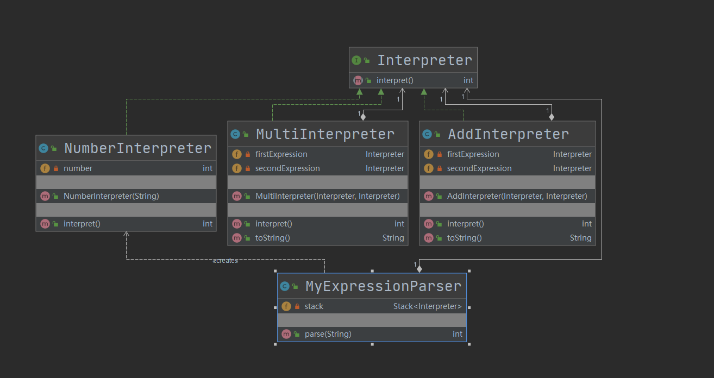

## 第19章 解释器模式

### 1. 解释器模式讲解

* 定义：给定一个语言，定义它的文法（语法）的一种表示，并定义一个解释器，这个解释器使用该表示来解释语言中的句子。

* 特点：为了解释一种语言，而为语言创建的解释器

* 类型：行为型

* 适用场景：某个特定类型问题发生频率总够高

* 优点：语法由很多类表示容易改变及扩展此“语言”

* 缺点：当语法规则数目太多时，增加了系统复杂度

* 角色：

  * **AbstractExpression（抽象表达式）**：在抽象表达式中声明了抽象的解释操作，它是所有终结符表达式和非终结符表达式的公共父类。
  * **TerminalExpression（终结符表达式）**：终结符表达式是抽象表达式的子类，它实现了与文法中的终结符相关联的解释操作，在句子中的每一个终结符都是该类的一个实例。通常在一个解释器模式中只有少数几个终结符表达式类，它们的实例可以通过非终结符表达式组成较为复杂的句子。
  * **NonterminalExpression（非终结符表达式）**：非终结符表达式也是抽象表达式的子类，它实现了文法中非终结符的解释操作，由于在非终结符表达式中可以包含终结符表达式，也可以继续包含非终结符表达式，因此其解释操作一般通过递归的方式来完成。
  * **Context（环境类）**：环境类又称为上下文类，它用于存储解释器之外的一些全局信息，通常它临时存储了需要解释的语句。

* 相关设计模式

  * 解释器模式和适配器模式

    两者有点类似，但是适配器模式不知道预先要适配的规则；而解释器要把规则写好，根据规则去执行解释。

### 2. 解释器模式Coding

* 场景：使用栈模拟了加法和乘法的运算

* UML：

  采用组合关系。

  

### 3. 解释器源码解析-jdk+spring

#### 1. JDK

1. java.util.regex.Pattern

   Java正则表达式

2. org.springframework.expression.spel.standard.SpelExpressionParser

   Spring表达式解析

   1. org.springframework.expression.common.TemplateAwareExpressionParser#parseExpression(java.lang.String)

   2. 测试类：cn.bravedawn.design.pattern.behavioral.interpreter.SpringTest

      