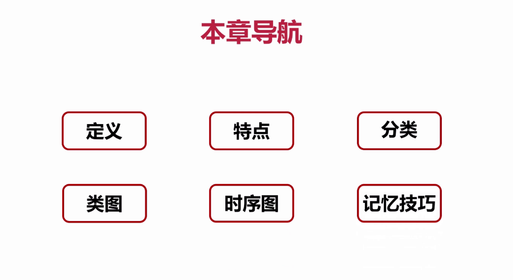
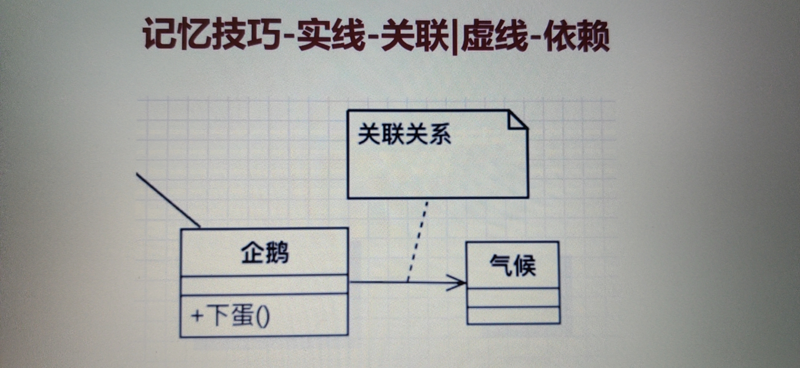
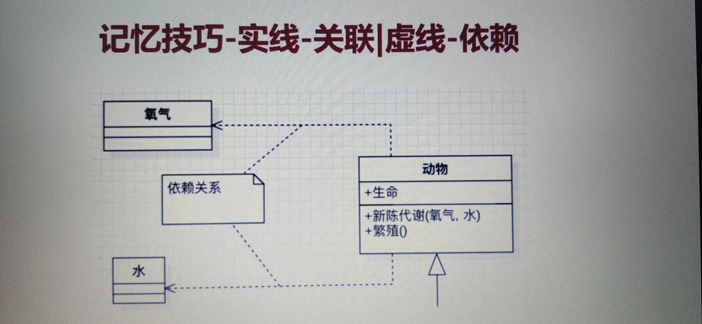
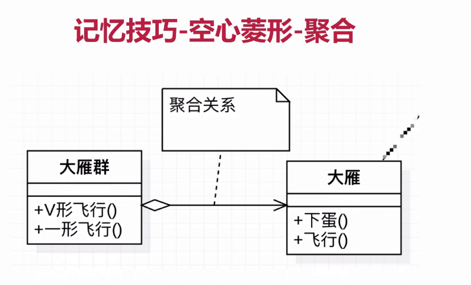
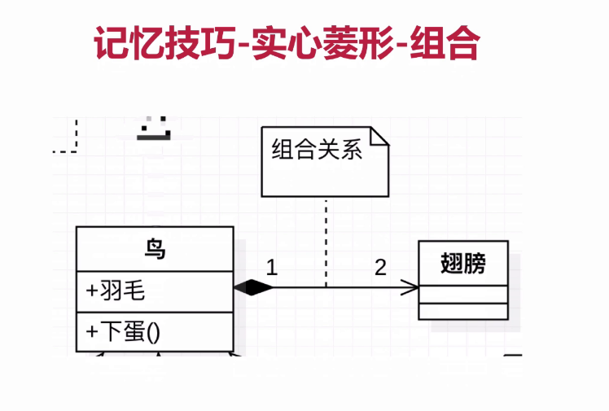
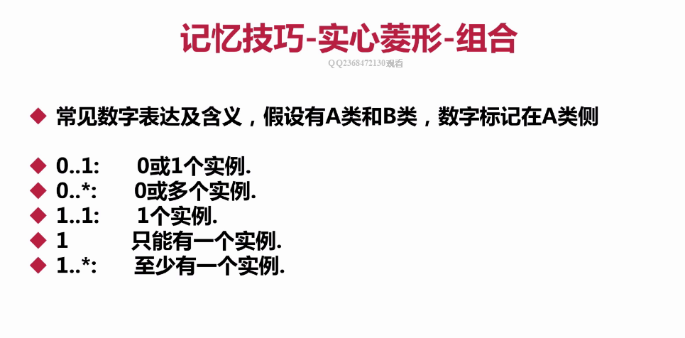
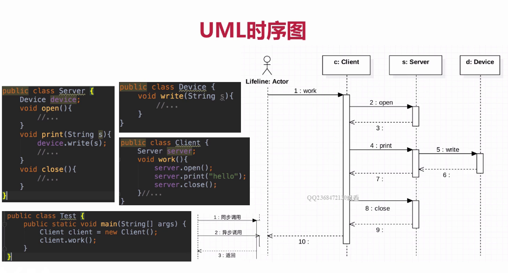
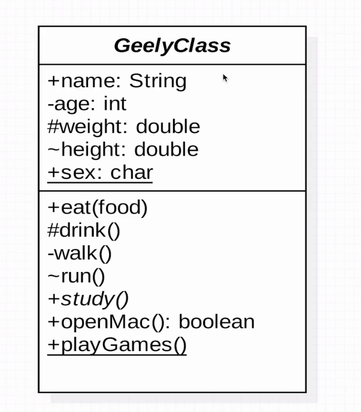
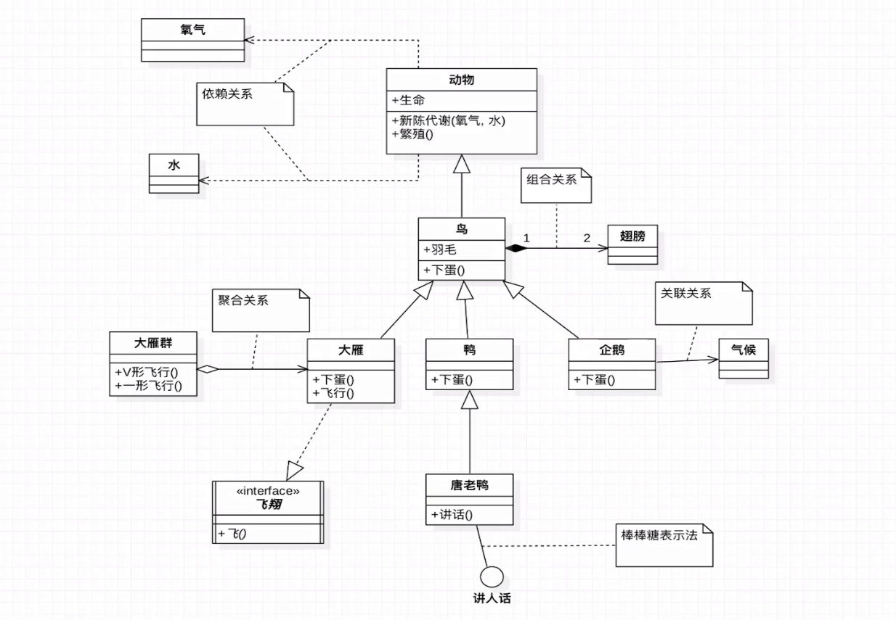
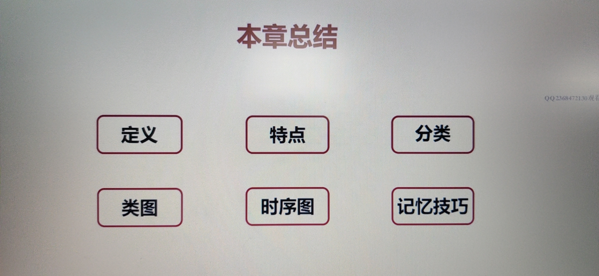

## 第1章 UML入门

### 1、UML简单入门

* UML定义

  * 统一建模语言(Unified Modeling Language，缩写UML)
  * 非专利的第三代建模和规约语言

* UML特点：

  * UML是一种开放的方法
  * 用于说明、可视化、构建和编写一个正在开发的面向对象的、软件密集系统的制品的开放方法。其中制品指的是在软件开发过程中产生的各种各样的产物，如模型、流程图、源代码和测试用例等。
  * UML展现了一系列最佳工程实践，这些最佳实践在对大规模，复杂系统进行建模方面，特别是在软件架构层次已经被验证有效。

* UML2.2分类

  UML2.2中一共定义了14种图示，分类如下：

  * 结构式图形：强调的是系统式的建模
  * 行为式图形：强调系统模型中触发的事件
  * 交互式图形：属于**行为式**图形子集合，强调系统建模中资料流程

* 结构式图形

  * 静态图（类图，对象图，包图）
  * 实现图（组件图，部署图）
  * 剖面图
  * 复合结构图

* 行为式图形

  * 活动图
  * 状态图
  * 用例图

* 交互式图形

  * 通信图
  * 交互概述图（UML2.0）
  * 时序图（UML2.0）
  * 时间图（UML2.0）

* UML类图

  * Class Diagram：用于表示类、接口、实例等之间相互的静态关系
  * 虽然名字叫类图，但类图中不只有类

* 记忆技巧

  * UML件箭头方向：

    * 从子类指向父类；从实现类指向接口。**提示**：可能会认为子类是以父类为基础的，箭头应从父类指向子类
      * 定义子类时需要通过**extends**关键字指定父类
      * 子类一定是知道父类定义的，但父类并不知道子类的定义
      * 只有知道对方信息时才能指向对方
      * 所以箭头方向是从子类指向父类的

  * 实线是继承；虚线是实现。

    * 空心三角箭头：继承或实现

    * **实线-继承**，is a的关系，扩展目的，不虚，很结实

    * **虚线-实现**，虚线代表“虚”，无实体，里面还需要填充很多实现的东西

    * 实线是关联关系，虚线是依赖关系。

      * 实线通常是一个类中有另一个类对象作为属性，其中箭头指向被关联对象。
      * 实现-关联关系：关系稳定，实打实的关系，铁哥们
      * 表示一个类对象和另一个类对象有关联
      * 通常是一个类中有另一个类对象作为属性

      

    * 虚线一般是一个类使用另一个类作为参数使用，或作为返回值，其中箭头指向被依赖的对象。

      * 虚线-依赖关系：临时用一下，若即若离，虚无缥缈，若有若无
      * 表示一种使用关系，一个雷需要借助另一个类来实现功能
      * 一般是一个类使用另一个类作为参数使用，或作为返回值

      

  * 空心菱形表聚合， 实心菱形表组合。

    * 菱形就是个盛东西的器皿（例如盘子）
    * 聚合：代表空器皿里可以放很多相同的东西，聚在一起（箭头方向所指的类），**继承关系**
      * 整体和局部的关系，**两者有着独立的生命周期，是has a的关系**
      * 弱关系
      * 消极的词：弱-空
  
      

    * 组合：代表满器皿里已经有实体结构的存在，生死与共，会有相同的生命周期
      * 整体和局部的关系，和聚合的关系相比，关系更加强烈。**两者有相同的生命周期，contains-a的关系**
      * 强关系
      * 积极的词：强-满
        * 常见数字表达及含义，假设有A类和B类，数字标记在A类侧
        * 0...1：0或1个实例，表示**某一时刻，B的实例可以和0个或1个实例相关**
          * 0..*：0或多个实例
          * 1..1：1个实例
          * 1    ：只能有一个实例
        * 1..*：至少有一个实例
  
      

    实心菱形表组合：

  - 整体和局部的关系，和聚合的关系相比，关系更加强烈。两周有相同的生命周期，contains-a的关系

    - 两者之间是强关系(实心)
    - 其中菱形在数目少的那一边，比如上面的种情况。一只鸟有两只翅膀，菱形就在鸟的那边

    

  空心菱形表聚合：
  
  * 整体和局部的关系，两者有着独立的生命周期，是has a的关系
* 两者之间是弱关系(空心)
  * 其中菱形在数目多的那一边，比如上面的种情况。大雁群和大雁，菱形就在大雁群那边

* UML时序图

  * Sequence Diagam：是显示对象之间交互的图，这些对象是按时间顺序排列的。
  * 时序图中包括的建模元素主要有：对象(Actor)、生命线(Lifeline)、控制焦点(Focus of control)、消息(Meaasge)等

  

### 2、UML类图讲解

上图中有三部分，第一部分是类名，第二部分是类的属性，第三部分是类的方法。

其中就其属性来讲：

* `+`说明是public
* `-`说明是private
* `#`说明是protected
* `~`说明是default，包权限
* `String,char,int,double`这些是类型
* `下划线`说明是个static属性

其中就其方法来说，除了访问限制符：

* `斜体方法`表明是一个抽象方法
* `boolean`表明的是返回值类型

### 3、UML类图讲解-自上而下 

下面主要讲到了几种关系：

* 继承：实线空心箭头；实线：虚线空心箭头
* 依赖关系：虚线箭头；关联关系：实线箭头
* 聚合关系：空心菱形；组合关系：实心菱形

下面我们将对上图进行分析：

* 对于**动物**来说：属性是**生命**，方法是**新陈代谢和繁殖**，**新陈代谢**依赖**氧气、水**。**氧气和水是依赖关系，依赖是虚线，虚线指向被依赖方**
* 对于**鸟**来说：
  * 继承自**动物**，箭头指向**动物**，鸟可以强转为**动物**，但是动物强转为鸟却不一定了（也就是说在Java中子类可以**向上强转**，而父类**不可以先下强转**）。箭头方向为**子类指向父类**（记忆方法可以参考"UML简单入门->记忆技巧->UML件箭头方向"）；
  * 鸟有**羽毛属性**和**下蛋方法**；
  * 鸟和翅膀是**组合关系**，有相同的生命周期，其中1,2表示1只鸟有2个翅膀
  * 鸟作为**动物的子类**，又是**大雁、鸭和企鹅的父类**
* 对于**企鹅**来说：
  * 继承自**鸟**，与**气候**是**关联关系**。关联关系表示两个类的对象之间是由某种关联的，通常是一个类把另一个类作为属性。也就是说我在企鹅里面声明一个气候的**成员变量**。
  * 关联关系使用**实线**，箭头指向**被依赖对象**
* 对于**大雁**来说：
  * 继承自**鸟**，与大雁群是**聚合关系**，大雁群has a 大雁，箭头指向个体；
  * 实现了**飞翔**接口，实线是**虚线空心箭头**，箭头**指向接口**；
* 对于**唐老鸭**来说：
  * 继承自**鸭**
  * 实现了**讲人话**接口（**棒棒糖表示法，接口的另一种表示方法**）

