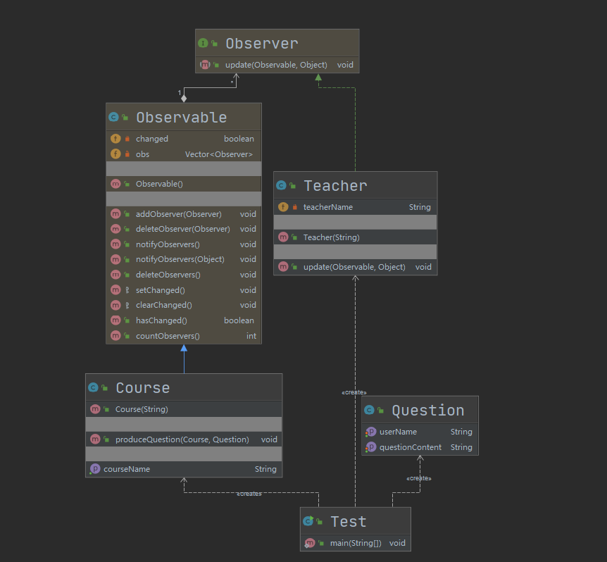

## 第20章 观察者模式

### 1. 观察者模式讲解

* 定义：定义了对象之间的一对多依赖，让多个观察者对象同时监听某一个主题对象，当主题对象发生变化时，它的所有依赖者（观察者）都会收到通知并更新。
* 例子
  * 一条微信朋友圈，你点赞或者评论之后。这条朋友圈就是被观察者（主题对象），而你就是观察者。当这条朋友圈被点赞或是评论的时候，你就会收到通知，而不用你实时去关注它
  * 在京东上我们对一个商品点击关注的时候，对商品价格进行监听，当商品降价是就会通知你
* 类型：行为型
* 适用场景：关联行为场景，建立一套触发机制
* 优点
  * 观察者和被观察者之间建立一个抽象的耦合
  * 观察者模式支持广播通信
* 缺点
  * 观察者之间有过多的细节依赖，会增加时间消耗和程序复杂度
  * 使用要得当，要避免循环调用

### 2. 观察者模式Coding

* 模拟场景：模拟了老师观察课程学生提问的场景，其中课程是被观察者，老师是观察者

* 实现

  * 被观察者要**继承java.util.Observable**
  * 观察者要**实现java.util.Observer**

* 通知一个：cn.bravedawn.design.pattern.behavioral.observer.Test1

* 通知多个：cn.bravedawn.design.pattern.behavioral.observer.Test2

* UML

  