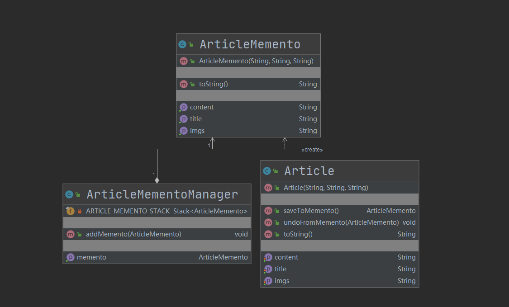

## 第21章 备忘录模式

### 1. 备忘录模式讲解

* 定义：保存一个对象的某个状态，以便在适当的时候恢复对象。

* 特点：“后悔药”，例如游戏的存档、文档编辑的撤销、浏览器中的后退

* 类型：行为型

* 适用场景

  * 保存及恢复数据相关业务场景
  * 后悔的时候，即想恢复到之前的状态

* 优点

  * 为用户提供一种可恢复机制
  * 存档信息的封装

* 缺点

  * 资源占用

* 相关设计模式

  * 备忘录模式和状态模式

    备忘录模式中是用实例表示状态的，也就是说存档是一个对象的实例。但在状态模式中是用类表示一个状态。

### 2. 备忘录模式coding

* 模拟场景：模拟了一个手记编写、修改和回退的过程，演示了备忘录模式的使用

* 代码：cn.bravedawn.design.pattern.behavioral.memento

* UML

  其中`ArticleMemento`和`ArticleMementoManager`是聚合关系

  

### 3. 备忘录模式源码解析-spring

1. Spring

   * 在pom中添加webflow的依赖

     ```xml
     <dependency>
         <groupId>org.springframework.webflow</groupId>
         <artifactId>spring-webflow</artifactId>
         <version>2.4.5.RELEASE</version>
     </dependency>
     ```

   * org.springframework.binding.message.StateManageableMessageContext：备忘录模式的应用

     * org.springframework.binding.message.StateManageableMessageContext#createMessagesMemento
     * org.springframework.binding.message.StateManageableMessageContext#restoreMessages