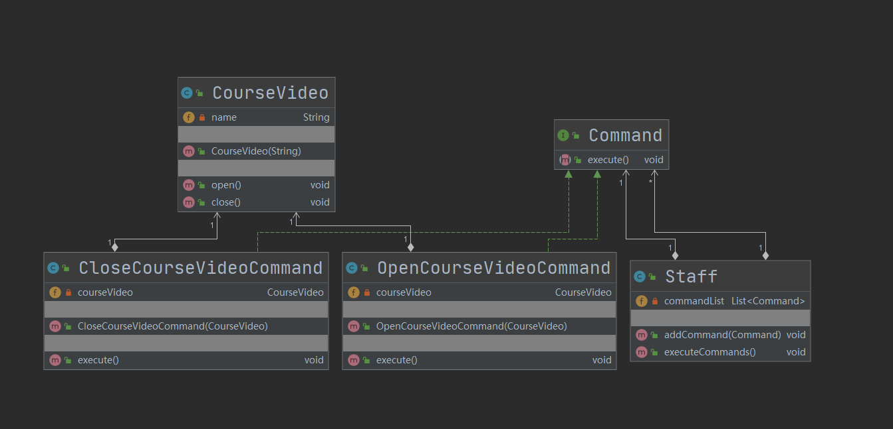

## 第22章 命令模式

### 1.命令模式讲解

* 定义：将“请求”封装成对象，以便使用不同的请求

* 特点：命令模式解决了应用程序中对象和职责以及它们之间的通信方式

* 类型：行为型

* 适用场景：

  * 请求调用者和请求接受者需要解耦，使得调用者和接收者不直接交互
  * 需要抽象出等待执行的行为

* 优点：

  * 降低耦合
  * 容易扩展新命令或者一组命令

* 缺点：

  * 命令的无限扩展会增加类的数量，提高系统实现复杂度

* 相关设计模式

  * 命令模式和备忘录模式

    两者经常结合起来使用，通过备忘录模式保存命令的历史记录，那就可以调用上一个命令、上上一个命令。

* 角色

  * Command（抽象命令类）：抽象命令类一般是一个抽象类或接口，在其中声明了用于执行请求的execute()等方法，通过这些方法可以调用请求接收者的相关操作。
  * ConcreteCommand（具体命令类）：具体命令类是抽象命令类的子类，实现了在抽象命令类中声明的方法，它对应具体的接收者对象，将接收者对象的动作绑定其中。在实现execute()方法时，将调用接收者对象的相关操作(Action)。
  * Invoker（调用者）：调用者即请求发送者，它通过命令对象来执行请求。一个调用者并不需要在设计时确定其接收者，因此它只与抽象命令类之间存在关联关系。在程序运行时可以将一个具体命令对象注入其中，再调用具体命令对象的execute()方法，从而实现间接调用请求接收者的相关操作。
  * Receiver（接收者）：接收者执行与请求相关的操作，它具体实现对请求的业务处理

### 2. 命令模式Coding

* 模拟场景：模拟视频课程的打开和关闭操作

* 代码：cn.bravedawn.design.pattern.behavioral.command

* UML：

  视频课程和命令之间是组合关系，命令和职员之间也是组合关系

  

### 3. 命令模式源码-jdk-junit

#### 1. JDK

* java.lang.Runnable，抽象命令类

#### 2. Junit

* junit.framework.Test，抽象命令类

