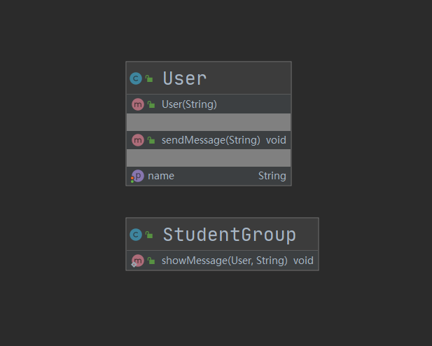

## 第23章 中介者模式

### 1. 中介者模式讲解

* 定义：定义一个封装一组对象如何交互的对象

* 特点：通过使对象明确地相互引用来促进松散耦合，并允许独立地改变他们的交互

* 类型：行为型

* 适用场景：

  * 系统中对象之间存在复杂的引用关系，产生的相互依赖关系结构混乱且难以理解
  * 交互的公共行为，如果需要改变行为则可以增加新的中介者类。例如聊天室，他就是一个中介者，我在聊天室里说一句话，每个人都可以收到，不用一个一个的就说

* 优点：

  * 将一对多转化成了一对一，降低程序复杂度
  * 类之间解耦

* 缺点：中介者过多，导致系统复杂

* 相关设计模式

  * 中介者模式和观察者模式

    两者有时候会结合使用，我们会使用观察者模式来实现中介者模式角色之间的通讯。

### 2. 中介者模式Coding

* 场景：模拟了学习群聊天发消息的场景

* 代码：cn.bravedawn.design.pattern.behavioral.mediaor

* UML

  其中中介者类是`StudentGroup`，从图上可以看到他和`User`是一对一的关系

  

### 3. 中介者源码-jdk

#### 1. JDK

* java.util.Timer

  * java.util.TimerTask

    其中Timer就是一个中介者，他协调了众多TimerTask之间的工作。