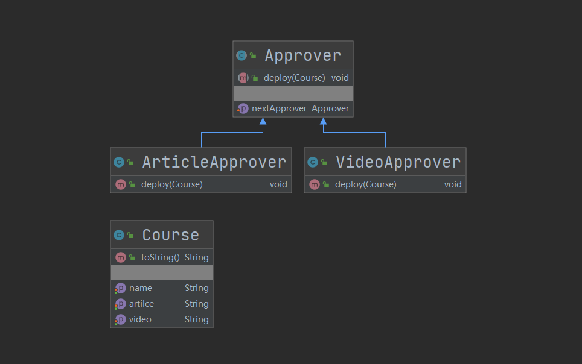

## 第24章 责任链模式（职责链）

### 1. 责任链模式讲解

* 定义：为请求创建一个接收此次请求对象的链

* 类型：行为型

* 适用场景：一个请求的处理需要多个对象当中的一个或多个协作处理

* 优点：

  * 请求的发送者和接收者（请求的处理）解耦
  * 责任链可以动态组合

* 缺点：

  * 责任链太长或者处理时间太长，影响性能
  * 责任链有可能过多

* 角色

  * **Handler（抽象处理者）**：它定义了一个处理请求的接口，一般设计为抽象类，由于不同的具体处理者处理请求的方式不同，因此在其中定义了抽象请求处理方法。因为每一个处理者的下家还是一个处理者，因此在抽象处理者中定义了一个抽象处理者类型的对象（如结构图中的successor），作为其对下家的引用。通过该引用，处理者可以连成一条链。

  * **ConcreteHandler（具体处理者）**：它是抽象处理者的子类，可以处理用户请求，在具体处理者类中实现了抽象处理者中定义的抽象请求处理方法，在处理请求之前需要进行判断，看是否有相应的处理权限，如果可以处理请求就处理它，否则将请求转发给后继者；在具体处理者中可以访问链中下一个对象，以便请求的转发。

    在职责链模式里，很多对象由每一个对象对其下家的引用而连接起来形成一条链。请求在这个链上传递，直到链上的某一个对象决定处理此请求。发出这个请求的客户端并不知道链上的哪一个对象最终处理这个请求，这使得**系统可以在不影响客户端的情况下动态地重新组织链和分配责任**。

* 相关设计模式

  * 责任链模式和状态模式

    在责任链模式中各个对象并不指定下一个处理的对象是谁，只有在客户端中设置链条的顺序和元素，直到被某个责任链处理或者整个链条结束。

    状态模式则是让每个状态对象知道自己下一个处理的对象是谁，也就是说在编译时就设定好了。

    这个是两者之间最大的区别。

### 2. 责任链模式Coding

* 场景：模式一个课程被审批的过程，分别有视频和手记审批

* 代码：cn.bravedawn.design.pattern.behavioral.chainofresponsibility

* 核心：

  ```java
  /**
  * 1.该属性是责任链模式的关键，声明一个自己
  * 2.approver这个属性不一定就是this自己，具体看如何赋值
  * 3.使用protected关键字是为了子类能访问到他
  */
  protected Approver approver;
  ```

* UML：

  

### 3. 责任链模式源码-servlet

#### 1. servlet

1. javax.servlet.Filter

   * javax.servlet.Filter#doFilter

     * javax.servlet.FilterChain

       这个FilterChain就是抽象处理者

   * ch.qos.logback.classic.selector.servlet.LoggerContextFilter

   * org.springframework.mock.web.MockFilterChain