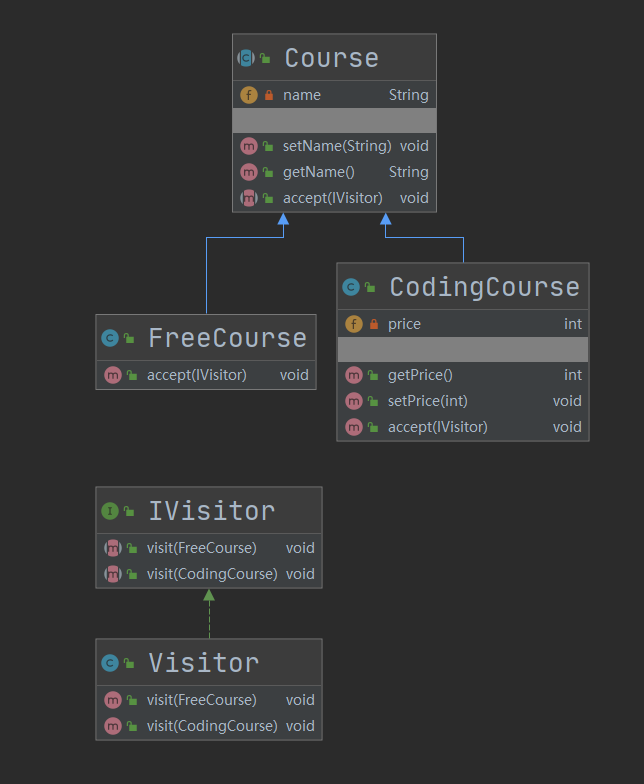

## 第25章 访问者模式

### 1. 访问者模式讲解

* 定义：封装作用于某数据结构（如List/Set/Map等）中各元素的操作

* 特点：可以在不改变各元素的类的前提下，定义作用于这些元素的操作

* 类型：行为型

* 适用场景：

  * 一个数据结构如（List/Set/Map等）包含很多类型对象
  * 数据结构与数据操作分离

* 优点：增加新的操作很容易，即增加一个新的访问者

* 缺点：

  * 增加新的数据结构困难
  * 具体元素变更比较麻烦

* 角色

  * **Vistor（抽象访问者）**：抽象访问者为对象结构中每一个具体元素类ConcreteElement声明一个访问操作，从这个操作的名称或参数类型可以清楚知道需要访问的具体元素的类型，具体访问者需要实现这些操作方法，定义对这些元素的访问操作。
  * **ConcreteVisitor（具体访问者）**：具体访问者实现了每个由抽象访问者声明的操作，每一个操作用于访问对象结构中一种类型的元素。
  * **Element（抽象元素）**：抽象元素一般是抽象类或者接口，它定义一个accept()方法，该方法通常以一个抽象访问者作为参数。
  * **ConcreteElement（具体元素）**：具体元素实现了accept()方法，在accept()方法中调用访问者的访问方法以便完成对一个元素的操作。
  * **ObjectStructure（对象结构）**：对象结构是一个元素的集合，它用于存放元素对象，并且提供了遍历其内部元素的方法。它可以结合组合模式来实现，也可以是一个简单的集合对象，如一个List对象或一个Set对象。

* 相关设计模式

  * 访问者模式和迭代器模式

    共同点：都是在某种数据结构上做处理；

    不同点：访问者模式对保存在数据结构中的元素做**某种特定的处理**，但在迭代器模式中主要是逐个**遍历**保存在数据结构中的元素；

### 2. 访问者模式Coding

* 场景：模拟了对不同课程进行不同的处理

* 代码：cn.bravedawn.design.pattern.behavioral.visitor

* UML：

  

### 3. 访问者模式源码-jdk-spring

#### 1.JDK

1. java.nio.file.FileVisitor：抽象访问者

   * java.nio.file.SimpleFileVisitor：具体访问者

#### 2. Spring

1. org.springframework.beans.factory.config.BeanDefinitionVisitor

   * org.springframework.util.StringValueResolver：抽象访问者

   * org.springframework.beans.factory.config.PropertyPlaceholderConfigurer.PlaceholderResolvingStringValueResolver：具体访问者

     