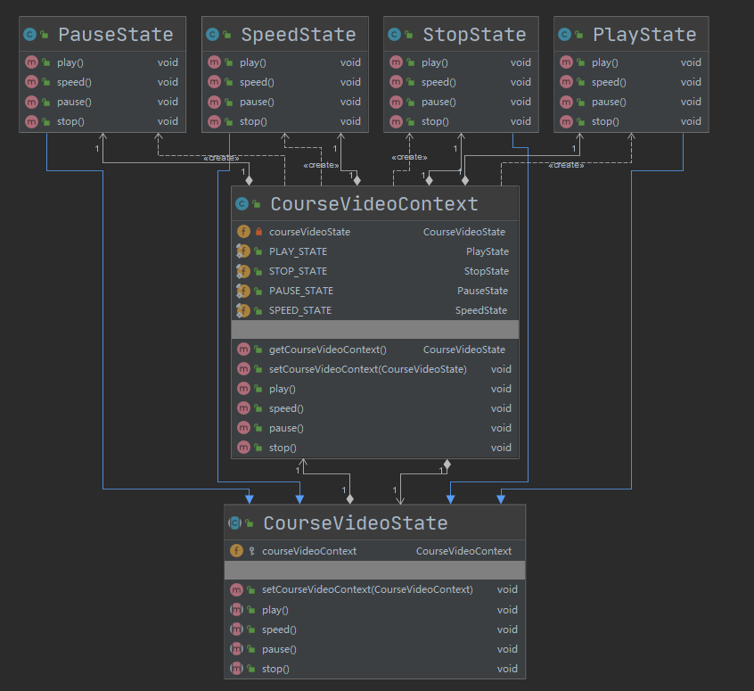

## 第26章 状态模式

### 1. 状态模式讲解

* 定义：允许一个对象在其内部状态改变时，改变它的行为

* 类型：行为型

* 适用场景：一个对象存在多个状态（不同状态下行为不同），且状态可相互转换

* 优点：

  * 将不同的状态隔离
  * 把各种状态的转换逻辑，分布到State的子类中，减少相互间依赖
  * 增加新的状态非常简单

* 缺点：

  * 状态多的业务场景导致类数目增加，系统变复杂

* 角色

  * **Context（环境类）：**环境类又称为上下文类，它是拥有多种状态的对象。由于环境类的状态存在多样性且在不同状态下对象的行为有所不同，因此将状态独立出去形成单独的状态类。在环境类中维护一个抽象状态类State的实例，这个实例定义当前状态，在具体实现时，它是一个State子类的对象。
  * **State（抽象状态类）：**它用于定义一个接口以封装与环境类的一个特定状态相关的行为，在抽象状态类中声明了各种不同状态对应的方法，而在其子类中实现类这些方法，由于不同状态下对象的行为可能不同，因此在不同子类中方法的实现可能存在不同，相同的方法可以写在抽象状态类中。
    
  * **ConcreteState（具体状态类）：**它是抽象状态类的子类，每一个子类实现一个与环境类的一个状态相关的行为，每一个具体状态类对应环境的一个具体状态，不同的具体状态类其行为有所不同。
  
* 相关设计模式

  * 状态模式和享元模式

    两者有时候可以结合使用，在状态模式没有属性的情况下，利用享元模式在多个上下文中共享状态实例

### 2. 状态模式Coding

* 场景：模拟了一个视频的播放、暂停、快进和停止操作

* 代码：cn.bravedawn.design.pattern.behavioral.state

* UML：

  

### 3. 状态模式源码-JSF

#### 1. JSF

在项目pom文件中添加如下依赖：

```xml
<dependency>
    <groupId>com.sun.faces</groupId>
    <artifactId>jsf-api</artifactId>
    <version>1.2</version>
</dependency>
```

* javax.faces.lifecycle.Lifecycle

  * javax.faces.context.FacesContext
  * javax.faces.webapp.FacesServlet
  
  