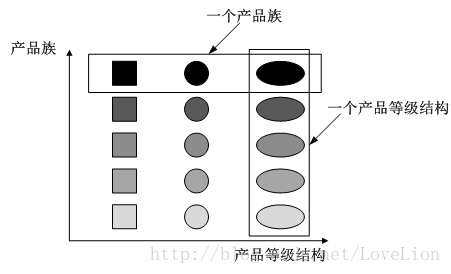
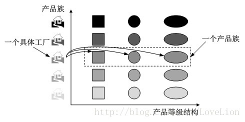

## 第5章 抽象工厂模式

### 1. 抽象工厂讲解

* 定义：抽象工厂模式提供一个创建**一系列相关**或**相互依赖对象**的接口

* 特点：无须指定它们具体的类

* 类型：创建型

* 适用场景

  * 客户端（应用层）不依赖于产品类实例如何被创建、实现等细节
  * 强调一系列相关的产品对象（属于同一产品族）一起使用，创建对象需要大量重复的代码
  * 提供一个产品类的库，所有的产品以同样的接口出现，从而是客户端不依赖于具体实现

* 优点：

  * 具体产品在应用层代码隔离，无须关系创建细节
  * 将一个系列的产品族统一到一起创建

* 缺点：

  * 规定了所有可能被创建的产品集合，产品族中扩展新的产品困难，需要修改抽象工厂的接口
  * 增加了系统的抽象性和理解难度

* 产品族和产品等级

  参考文章：https://blog.csdn.net/lovelion/article/details/9319323

  在工厂方法模式中具体工厂负责生产具体的产品，每一个具体工厂对应一种具体产品，工厂方法具有唯一性，一般情况下，一个具体工厂中只有一个或者一组重载的工厂方法。但是有时候我们希望**一个工厂可以提供多个产品对象，而不是单一的产品对象**，如一个电器工厂，它可以生产电视机、电冰箱、空调等多种电器，而不是只生产某一种电器。

  

  *  **产品等级结构**：**产品等级结构即产品的继承结构**，如一个抽象类是电视机，其子类有海尔电视机、海信电视机、TCL电视机，则抽象电视机与具体品牌的电视机之间构成了一个产品等级结构，抽象电视机是父类，而具体品牌的电视机是其子类。（**工厂方法模式针对的是产品等级结构**）
  *  **产品族**：在抽象工厂模式中，**产品族是指由同一个工厂生产的，位于不同产品等级结构中的一组产品**，如海尔电器工厂生产的海尔电视机、海尔电冰箱，海尔电视机位于电视机产品等级结构中，海尔电冰箱位于电冰箱产品等级结构中，海尔电视机、海尔电冰箱构成了一个产品族。（**抽象工厂模式针对的是产品族**）

  当系统所提供的工厂生产的具体产品并不是一个简单的对象，而是多个位于不同产品等级结构、属于不同类型的具体产品时就可以使用抽象工厂模式。**抽象工厂模式是所有形式的工厂模式中最为抽象和最具一般性的一种形式。**抽象工厂模式与工厂方法模式最大的区别在于，***工厂方法模式针对的是一个产品等级结构，而抽象工厂模式需要面对多个产品等级结构***，一个工厂等级结构可以负责多个不同产品等级结构中的产品对象的创建。**当一个工厂等级结构可以创建出分属于不同产品等级结构的一个产品族中的所有对象时，抽象工厂模式比工厂方法模式更为简单、更有效率。**

  

  在上图中，每一个具体工厂可以生产属于一个产品族的所有产品，例如生产颜色相同的正方形、圆形和椭圆形，所生产的产品又位于不同的产品等级结构中。如果使用工厂方法模式，上图图所示结构需要提供15个具体工厂，而使用抽象工厂模式只需要提供5个具体工厂，极大减少了系统中类的个数。

* 抽象工厂模式角色

  * **AbstractFactory**（抽象工厂）：它声明了一组用于创建**一族产品**的方法，**每一个方法对应一种产品**。

  * **ConcreteFactory**（具体工厂）：它实现了在抽象工厂中声明的创建产品的方法，生成一组具体产品，这些产品构成了一个产品族，每一个产品都位于某个产品等级结构中。

  * **AbstractProduct**（抽象产品）：它为每种产品声明接口，在抽象产品中声明了产品所具有的业务方法。

  * **ConcreteProduct**（具体产品）：它定义具体工厂生产的具体产品对象，实现抽象产品接口中声明的业务方法。

* 优点

  1. 抽象工厂模式隔离了具体类的生成，使得客户并不需要知道什么被创建。由于这种隔离，更换一个具体工厂就变得相对容易，所有的具体工厂都实现了抽象工厂中定义的那些公共接口，因此只需改变具体工厂的实例，就可以在某种程度上改变整个软件系统的行为。

  2. 当一个产品族中的多个对象被设计成一起工作时，它能够保证客户端始终只使用同一个产品族中的对象。

  3. 增加新的产品族很方便，无须修改已有系统，符合“开闭原则”。

* 缺点

  1. 增加新的产品等级结构麻烦，需要对原有系统进行较大的修改，甚至需要修改抽象层代码，这显然会带来较大的不便，违背了“开闭原则”。

* 适用场景

  1. 一个系统不应当依赖于产品类实例如何被创建、组合和表达的细节，这对于所有类型的工厂模式都是很重要的，用户无须关心对象的创建过程，将对象的创建和使用解耦。
  2. 系统中有多于一个的产品族，而每次只使用其中某一产品族。可以通过配置文件等方式来使得用户可以动态改变产品族，也可以很方便地增加新的产品族。

  3. 属于同一个产品族的产品将在一起使用，这一约束必须在系统的设计中体现出来。同一个产品族中的产品可以是没有任何关系的对象，但是它们都具有一些共同的约束，如同一操作系统下的按钮和文本框，按钮与文本框之间没有直接关系，但它们都是属于某一操作系统的，此时具有一个共同的约束条件：操作系统的类型。

  4. 产品等级结构稳定，设计完成之后，不会向系统中增加新的产品等级结构或者删除已有的产品等级结构。

### 2. 抽象工厂coding

* Git commit：https://github.com/depers/design_pattern/commit/4b83c960d1b4f8e75aa19caa09fac4aead0e8487

* UML：

  

### 3. 抽象工厂源码解析

* JDK中
  * java.sql.Connection接口
    * 角色是抽象工厂，mysql和Oracle都可以通过实现该接口编写自己的工厂
    * java.sql.Connection#createStatement()，返回Statement，创建一个语句对象，用于向数据库发送SQL语句
    * java.sql.Connection#prepareStatement(java.lang.String)，返回PreparedStatement，创建用于向数据库发送参数化SQL语句的PreparedStatement对象。
    * 其中Statement和PrepareStatement属于同一产品组
  * java.sql.Statement
    * 角色是抽象产品
  * com.mysql.jdbc.ConnectionImpl
    * 角色是具体工厂
  * com.mysql.jdbc.StatementImpl
    * 角色是具体产品
* MyBatis
  * org.apache.ibatis.session.SqlSessionFactory
    * 角色是抽象工厂
    * 其中Configuration和SqlSession属于同一产品组
  * org.apache.ibatis.session.SqlSession
    * 角色是抽象产品
  * org.apache.ibatis.session.defaults.DefaultSqlSessionFactory
    * 角色是具体工厂
  * org.apache.ibatis.session.defaults.DefaultSqlSession
    * 角色是具体产品

