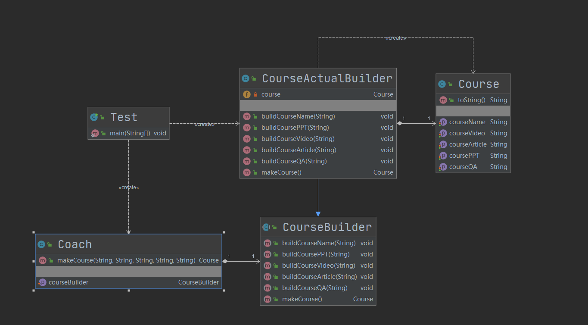

## 第6章 建造者模式

### 1. 建造者模式讲解

参考博文：https://blog.csdn.net/lovelion/article/details/17517213

* 概述：建造者模式是较为复杂的创建型模式，它将客户端与包含多个组成部分（或部件）的复杂对象的创建过程分离，客户端无须知道复杂对象的内部组成部分与装配方式，只需要知道所需建造者的类型即可。它关注如何一步一步创建一个的复杂对象，不同的具体建造者定义了不同的创建过程，且具体建造者相互独立，增加新的建造者非常方便，无须修改已有代码，系统具有较好的扩展性。

* 定义：讲一个复杂对象的构建与他的表示分离，是的同样的构建过程可以创建不同的表示。

* 特点：建造者模式一步一步创建一个复杂的对象，它允许用户只通过指定复杂对象的类型和内容就可以构建它们，用户不需要知道内部的具体构建细节。

* 类型：创建型

* 适用场景
  1. 需要生成的产品对象有复杂的内部结构，这些产品对象通常包含多个成员属性。
  2. 需要生成的产品对象的属性相互依赖，需要指定其生成顺序。
  3. 想把复杂对象的创建和使用分离，对象的创建过程独立于创建该对象的类。在建造者模式中通过引入了指挥者类，将创建过程封装在指挥者类中，而不在建造者类和客户类中。
  
* 优点
  1. 封装性好，创建和使用分离。在建造者模式中，客户端不必知道产品内部组成的细节，将产品本身与产品的创建过程解耦，使得相同的创建过程可以创建不同的产品对象。
  2. 每一个具体建造者都相对独立，而与其他的具体建造者无关。因此可以很方便地替换具体建造者或增加新的具体建造者，用户使用不同的具体建造者即可得到不同的产品对象。由于指挥者类针对抽象建造者编程，增加新的具体建造者无须修改原有类库的代码，系统扩展方便，符合“开闭原则”。
  3. 可以更加精细地控制产品的创建过程。将复杂产品的创建步骤分解在不同的方法中，使得创建过程更加清晰，也更方便使用程序来控制创建过程。
  
* 缺点
  1. 产生多余的Builder对象。建造者模式所创建的产品一般具有较多的共同点，其组成部分相似，如果产品之间的差异性很大，例如很多组成部分都不相同，不适合使用建造者模式，因此其使用范围受到一定的限制。
  2. 产品内部发生变化，建造者都要修改，成本较大。如果产品的内部变化复杂，可能会导致需要定义很多具体建造者类来实现这种变化，导致系统变得很庞大，增加系统的理解难度和运行成本。
  
* 建造者模式和工厂模式的区别
  1. 建造者模式更加**注重**方法的调用顺序，工厂模式注重创建对象（产品）
  2. 创建**对象的粒度**不同，建造者创建复杂的对象，由各种复杂的部件组成，工厂模式创建出的对象都一样。
  3. 关注点不同，工厂模式只需要把对象创建出来就可以，而建造者不仅要创建出这个对象，还要知道这个对象由哪些部件组成。
  4. 建造者模式根据建造过程中的顺序不一样，最终的对象部件组成也不一样。
  
* 建造者模式角色

  * Builder（抽象建造者）：它为创建一个产品Product对象的各个部件指定抽象接口，在该接口中一般声明两类方法，一类方法是**buildPartX()**，它们用于创建复杂对象的各个部件；另一类方法是**getResult()**，它们用于返回复杂对象。Builder既可以是抽象类，也可以是接口。

  * ConcreteBuilder（具体建造者）：它**实现了Builder接口**，实现各个部件的**具体构造和装配方法**，定义并明确它所创建的复杂对象，也可以提供一个方法返回创建好的复杂产品对象。

  * Product（产品角色）：它是被构建的复杂对象，包含多个组成部件，具体建造者创建该产品的内部表示并定义它的装配过程。

  * Director（指挥者）：**指挥者又称为导演类，它负责安排复杂对象的建造次序**，指挥者与抽象建造者之间存在关联关系，可以在其construct()建造方法中调用建造者对象的部件构造与装配方法，完成复杂对象的建造。**客户端一般只需要与指挥者进行交互**，在客户端确定具体建造者的类型，并实例化具体建造者对象（也可以通过配置文件和反射机制），然后通过指挥者类的构造函数或者Setter方法将该对象传入指挥者类中。


### 2. 建造者模式coding

Git commit：https://github.com/depers/design_pattern/commit/5537dab05c06099e24650a7d6d8dc701613b2344

#### 1. v1 构建者模式

* UML

  

#### 2. v2 链式调用的构建者模式

在静态内部类中完成了调用建造者对象的部件构造与装配方法。

其中CourseBuilder充当了具体建造者，Course充当了产品角色。这里没有抽象构造者和指挥者。

* UML

  

### 3. 建造者模式源码解析(jdk+guava+spring+mybatis)

#### 1. JDK

* StringBuilder
  * java.lang.StringBuilder#append(java.lang.CharSequence)，这个常用的方法就用到了链式调用的建造者模式
* StringBuffer
  * java.lang.StringBuffer#append(java.lang.CharSequence)，这个也用到了链式调用的建造者模式，并且是线程安全的

#### 2. Guava

* com.google.common.collect.ImmutableSet

  * 不可变集合

  * com.google.common.collect.ImmutableSet#copyOf(java.util.Collection<? extends E>)，这个也用到了链式调用的建造者模式

  * com.google.common.collect.ImmutableSet#of()

  * com.google.common.collect.ImmutableSet.Builder#add(E)

    * com.google.common.collect.ImmutableSet.Builder是一个静态内部类

      * com.google.common.collect.ImmutableSet.Builder#build，和我们写的build功能一样，使用方法如下：

        ```JAVA
        Set<String> stringSet = ImmutableSet.<String>builder().add("a").add("b").build();
        ```
  
* com.google.common.cache.LoadingCache

  * Guava缓存
  * com.google.common.cache.CacheBuilder#initialCapacity，设置缓存大小，这个也用到了链式调用的建造者模式
  * com.google.common.cache.CacheBuilder#build()，和我们写的build功能一样

#### 3. Spring

* org.springframework.beans.factory.support.BeanDefinitionBuilder

  * org.springframework.beans.factory.support.BeanDefinitionBuilder#setFactoryMethod，这个也用到了链式调用的建造者模式

#### 4. Mybatis

* org.apache.ibatis.session.SqlSessionFactoryBuilder
  * org.apache.ibatis.session.SqlSessionFactoryBuilder#build(org.apache.ibatis.session.Configuration)，这个方法的在org.apache.ibatis.session.SqlSessionFactoryBuilder#build(java.io.Reader, java.lang.String, java.util.Properties)中被调用，这是典型的在建造者模式中使用建造者


