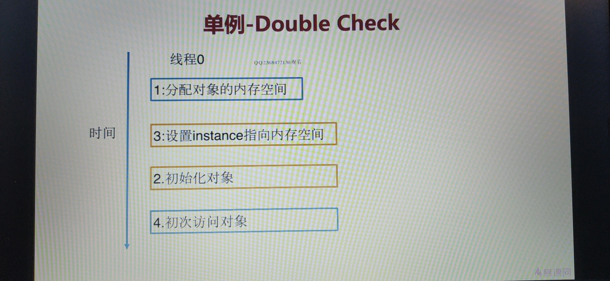

## 第7章 单例模式

### 1. 单例模式讲解

参考博文：https://blog.csdn.net/lovelion/article/details/17517213

* 定义：保证一个类仅有一个实例，并提供一个全局访问点。

* 类型：创建型

* 适用场景：想确保任何情况下都绝对只有一个实例

* 优点：

  1. 在内存中只有一个实例，减少了内存开销
  2. 可以避免对资源的多重占用
  3. 设置全局访问点，严格控制访问

* 缺点：没有接口，扩展困难

* 重点：

  1. 私有构造器

  2. 线程安全

  3. 延迟加载

  4. 序列化和反序列化安全

  5. 反射

  6. Double check

     

     

  7. 静态内部类

     

* 实用技能

  * 反编译
  * 内存原理
  * 多线程debug

* 相关设计模式

  * 单例模式和工厂模式
  * 单例模式和享元模式


### 2. 单例设计模式-懒汉式及多线程Debug实战

#### 1. 普通的懒汉式单例模式

通常发生在多线程环境中，`if (lazySingleton == null)`就会失效，导致可能会有两个线程同时进入，导致重复创建对象的情况。

```java
/**
 * @author : depers
 * @program : design_pattern
 * @description: 懒汉式,线程不安全
 * @date : Created in 2020/9/29 21:29
 */
public class LazySingleton {

    // 1.在类加载时并不自行实例化，这种技术又称为延迟加载(Lazy Load)技术
    // 懒汉式单例在第一次调用getInstance()方法时实例化，在类加载时并不自行实例化，这种技术又称为延迟加载(Lazy Load)技术，即需要的时候再加载实例
    private static LazySingleton lazySingleton = null;

    // 2.禁止外部实例化对象
    private LazySingleton(){

    }

    // 3.提供实例化方法（线程不安全的）
    public static LazySingleton getInstance(){
        if (lazySingleton == null){
            lazySingleton = new LazySingleton(); // 若线程1和线程2都进入到这里，就会存在重复创建对象的情况
        }
        return lazySingleton;
    }
}

```

#### 2.线程安全的懒汉式单例模式

该懒汉式单例类在getInstance()方法前面增加了关键字`synchronized`进行线程锁，以处理多个线程同时访问的问题。但是，上述代码虽然解决了线程安全问题，但是每次调用getInstance()时都需要进行线程锁定判断，**在多线程高并发访问环境中，将会导致系统性能大大降低**。

```java
/**
 * @author : depers
 * @program : design_pattern
 * @description: 懒汉式,线程安全
 * @date : Created in 2020/9/29 21:29
 */
public class LazySingletonSafe {

    // 1.在类加载时并不自行实例化，这种技术又称为延迟加载(Lazy Load)技术
    // 懒汉式单例在第一次调用getInstance()方法时实例化，在类加载时并不自行实例化，这种技术又称为延迟加载(Lazy Load)技术，即需要的时候再加载实例
    private static LazySingletonSafe lazySingleton = null;

    // 2.禁止外部实例化对象
    private LazySingletonSafe(){

    }

    // 3.提供实例化方法（线程安全）
    public synchronized static LazySingletonSafe getInstance(){
        if (lazySingleton == null){
            lazySingleton = new LazySingletonSafe();
        }
        return lazySingleton;
    }

    // 3.提供实例化方法，这个效果与上面相同，都是阻塞整个类
    /*
    public static LazySingletonSafe getInstance(){
        synchronized(LazySingletonSafe.class){
            if (lazySingleton == null){
                lazySingleton = new LazySingletonSafe();
            }
        }
        return lazySingleton;
    }
     */
}
```

#### 3. IDEA多线程Debug

在你需要打断的的地方，设置挂起方式为`Thread`，如下图所示：


* 参考博文：https://blog.csdn.net/lovelion/article/details/7420886

* Git commit：https://github.com/depers/design_pattern/commit/f6fa1a2368b8a577c027fb2667723865894eb439

### 3. 单例设计模式-DoubleCheck双重检查实战及原理解析

* intra-thread semantics 保证重排序不会改变**单线程内**的程序执行结果。

  换句话说，intra-thread semantics 允许那些在单线程内，不会改变单线程程序执行结果的重排序。

* 单线程内重排序不会改变程序的执行结果

  

* 多线程内重排序可能会导致报错

  1. 代码

     ```java
     /**
      * @author : depers
      * @program : design_pattern
      * @description: 懒汉式双重检查单例
      * @date : Created in 2020/10/12 20:29
      */
     public class LazyDoubleCheckSingleton {
     
         // 1.在类加载时并不自行实例化，这种技术又称为延迟加载(Lazy Load)技术
         // 1) 懒汉式单例在第一次调用getInstance()方法时实例化，在类加载时并不自行实例化，这种技术又称为延迟加载(Lazy Load)技术，即需要的时候再加载实例
         private static LazyDoubleCheckSingleton lazyDoubleCheckSingleton = null;
     
         // 2.禁止外部实例化对象
         private LazyDoubleCheckSingleton(){
     
         }
     
         // 3.提供实例化方法（线程不安全的）
         public static LazyDoubleCheckSingleton getInstance(){
             if (lazyDoubleCheckSingleton == null){
                 synchronized (LazyDoubleCheckSingleton.class){
                     if (lazyDoubleCheckSingleton == null){
                         lazyDoubleCheckSingleton = new LazyDoubleCheckSingleton();
                         /**
                          * 上面这句代码实际上进行了三个操作
                          * 1. 分配内存
                          * 2. 初始化对象
                          * 3. 设置lazyDoubleCheckSingleton 指向刚分配的内存地址
                          * 值得注意的是第2步和第3步有可能会发生指令重排，这里在多线程下会导致报错
                          */
                     }
                 }
             }
             return lazyDoubleCheckSingleton;
         }
     }
     ```

  2. 问题

     如下图所示线程0执行到重排序之后的抢先第三步，接着线程1又开始执行首先会判断instance是否为null，然后接着初次访问对象，这个对象是线程0中并未完成初始化的对象。这时就会报错，因为线程0并没有初始化对象，只是设置instance指向了内存空间。

     

  3. 解决方法

     1. **禁止指令重排**。禁止线程0中的第2步和第3步指令进行重排序。

        ```java
        // 1.在类加载时并不自行实例化，这种技术又称为延迟加载(Lazy Load)技术
        // 1) 懒汉式单例在第一次调用getInstance()方法时实例化，在类加载时并不自行实例化，这种技术又称为延迟加载(Lazy Load)技术，即需要的时候再加载实例
        // 2) 使用volatile关键字规避指令重排
        private volatile static LazyDoubleCheckSingleton lazyDoubleCheckSingleton = null;
        ```

     2. **允许指令重排，但是不能允许其他线程看到这个重排序**。也就是允许线程0中的第2步和第3步指令进行重排序，但是不允许线程1看到这个重排序。参见下节的第二点。

### 4. 单例设计模式-静态内部类-基于类初始化的延迟加载解决方案及原理解析

#### 1. 类初始化时机（主动引用）

虚拟机规范中并没有强制约束何时进行加载，但是规范严格规定了有且只有下列五种情况必须对类进行初始化（加载、验证、准备都会随之发生）：

参考博文：[类初始化时机]([https://github.com/CyC2018/CS-Notes/blob/master/notes/Java%20%E8%99%9A%E6%8B%9F%E6%9C%BA.md#%E7%B1%BB%E5%88%9D%E5%A7%8B%E5%8C%96%E6%97%B6%E6%9C%BA](https://github.com/CyC2018/CS-Notes/blob/master/notes/Java 虚拟机.md#类初始化时机))

- 遇到 new、getstatic、putstatic、invokestatic 这四条字节码指令时，如果类没有进行过初始化，则必须先触发其初始化。最常见的生成这 4 条指令的场景是：

  - new：使用 new 关键字实例化对象的时候；
  - getstatic和：读取一个类的静态字段的时候，并且该变量不是常量成员；
  - putstatic：设置一个类的静态字段的时候；
  - invokestatic：调用一个类的静态方法的时候。

#### 2. 静态内部类单例-基于类初始化的延迟加载解决方案

> 解决DoubleCheck双重检查多线程内重排序问题：**允许指令重排，但是不能允许其他线程看到这个重排序**。也就是允许线程0中的第2步和第3步指令进行重排序，但是不允许线程1看到这个重排序。

* 实际步骤

  如下图所示，线程0获得了Class对象的初始化锁，然后去执行类初始化的逻辑（1，3，2），线程1则等待。此时由于对象锁的缘故，线程1是看不到。只有这里巧妙的利用了虚拟机的类初始化机制创建单例。


### 5. 单例设计模式-饿汉式

**当类被加载时，静态变量hungrySingleton会被初始化**，单例类的唯一实例将被创建。如果使用饿汉式单例来实现负载均衡器LoadBalancer类的设计，则不会出现创建多个单例对象的情况，**可确保单例对象的唯一性**。

他与懒汉式最大的区别就是**延时加载**。

```java
/**
 * @author : depers
 * @program : design_pattern
 * @description: 饿汉式单例模式
 * @date : Created in 2020/10/13 21:07
 */
public class HungrySingleton {

    private final static HungrySingleton hungrySingleton;

    static {
        hungrySingleton = new HungrySingleton();
    }

    public static HungrySingleton getInstance(){
        return hungrySingleton;
    }
}
```

### 6. 单例设计模式-序列化破坏单例模式原理解析及解决方案

这里以饿汉模式为例，其他的单例设计类似。

1. 代码

   ```java
   @author : depers
    * @program : design_pattern
    * @description: 应用层
    * @date : Created in 2020/10/13 22:44
    */
   public class Test {
   
   
       public static void main(String[] args) throws IOException, ClassNotFoundException {
           HungrySingleton instance = HungrySingleton.getInstance();
           ObjectOutputStream oos = new ObjectOutputStream(new FileOutputStream("singleton_file"));
           oos.writeObject(instance);
   
           File file = new File("singleton_file");
           ObjectInputStream ois = new ObjectInputStream(new FileInputStream(file));
   
           HungrySingleton newInstance = (HungrySingleton) ois.readObject();
   
           System.out.println(instance);
           System.out.println(newInstance);
           System.out.println(instance == newInstance);
       }
   }
   ```

   运行上面的这段程序，结果如下：

   

   